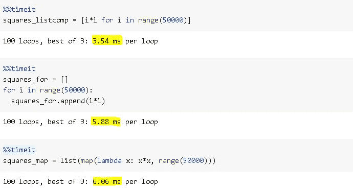

# Python 中的列表理解—解释

> 原文：<https://towardsdatascience.com/list-comprehensions-in-python-explained-294a464b5245?source=collection_archive---------57----------------------->

## 何时使用和不使用列表理解。


希尔特·彼得森在 [Unsplash](https://unsplash.com/s/photos/list?utm_source=unsplash&utm_medium=referral&utm_content=creditCopyText) 上拍摄的照片

**List** 是 Python 中内置的数据结构，方括号中是数据点的集合。Python 中其他内置的数据结构有**集合**、**元组**、**字典**。

```
list_a = [4, 'data', 3.2, True]list_a
[4, 'data', 3.2, True]
```

在这篇文章中，我们将讨论 python 中的列表理解及其优势。尽管列表理解非常实用，但也有列表理解不是最佳选择的情况。我们也将经历不使用列表理解的情况。

列表理解基本上是基于现有列表创建列表。下面是一个列表理解，它根据另一个列表中单词的长度创建一个列表。

```
words = ['data', 'science', 'machine', 'learning']word_length = [len(i) for i in words]word_length
[4, 7, 7, 8]
```

列表理解的基本语法是:


Python 列表理解

在前面的例子中，expression 是 len(i)，item 是由“I”表示的“words”列表中的元素。当然，iterable 是“单词”列表。我们没有条件语句，让我们再做一个有条件的语句。例如，下面的 list comprehension 创建了一个单词长度大于 5 的列表。

```
words = ['data', 'science', 'machine', 'learning']long_words = [i for i in words if len(i) > 5]long_words
['science', 'machine', 'learning']
```

表达式可以是任何返回值的表达式。Iterable 可以是任何可以迭代返回其元素的对象，如列表、集合、生成器。

条件是至关重要的，因为它们允许过滤掉值或者只选择我们需要的。

例如，下面这段代码创建了一个由范围为(20)的偶数平方组成的列表。

```
even_squares = [i*i for i in range(20) if i%2 == 0]even_squares
[0, 4, 16, 36, 64, 100, 144, 196, 256, 324]
```

我们可以创建一个具有矩阵最大行数的列表。

```
#Create a matrix
import numpy as np
A = np.random.randint(10, size=(4,4))
A
array([[1, 7, 4, 4],        
       [5, 0, 0, 6],        
       [7, 5, 8, 4],        
       [1, 3, 2, 2]])#select the max of rows
max_element = [max(i) for i in A]
max_element
[7, 6, 8, 3]
```

我们也可以在表达式中加入一个条件。下面这段代码遍历“单词”列表。如果长度大于 7，它将获取单词。它写的是“短词”而不是长度不大于 7 的元素。

```
words = ['data', 'science', 'artificial', 'intelligence', 'machine', 'learning']long_words = [i if len(i) > 7 else 'short word' for i in words]print(long_words)
['short word', 'short word', 'artificial', 'intelligence', 'short word', 'learning']
```

# **列表理解 vs for 循环 vs 映射**

我们用列表理解所做的也可以用 for 循环或 map 函数来完成。让我们使用 for 循环和 map 函数来做第一个示例:

```
#for loop
word_length = []
for word in words:
   word_length.append(len(word))word_length
[4, 7, 7, 8]#map function
word_length = list(map(lambda x: len(x), words))word_length
[4, 7, 7, 8]
```

使用列表理解的优势:

*   它们比循环相对更快。
*   它们被认为比循环和映射函数更具 pythonic 性。
*   列表理解的语法更容易阅读和理解。

让我们通过创建一个包含前 50000 个整数的平方的列表来做一个比较:



我们可以看到，列表理解是最快的。

**注意**:每一个列表理解都可以用 for 循环来编写，但是并不是每一个 for 循环都可以用列表理解来表示。

# **什么时候不用清单理解**

列表理解将整个输出列表加载到内存中。这对于小型或中型的列表来说是可以接受的，甚至是可取的，因为它使操作更快。然而，当我们处理大型列表(例如 10 亿个元素)时，应该避免理解列表。这可能会导致您的计算机崩溃，由于内存需求的极端数额。

对于这种大型列表，更好的替代方法是使用**生成器**，它实际上不会在内存中创建大型数据结构。生成器在使用项目时创建项目。项目使用后，生成器会将其丢弃。使用生成器，我们可以请求 iterable 中的下一项，直到到达末尾，每次存储一个值。

下面的生成器对前 1000 万个整数的平方求和。

```
sum(i*i for i in range(10000000))333333283333335000000
```

映射功能也不会导致内存问题。

```
sum(map(lambda i: i*i, range(10000000)))333333283333335000000
```

天下没有免费的午餐！生成器或映射函数不会导致内存问题，但是它们比列表理解相对要慢。同样，列表理解的速度来自于内存的过度使用。您可以根据您的应用决定使用哪一种。

感谢您的阅读。如果您有任何反馈，请告诉我。