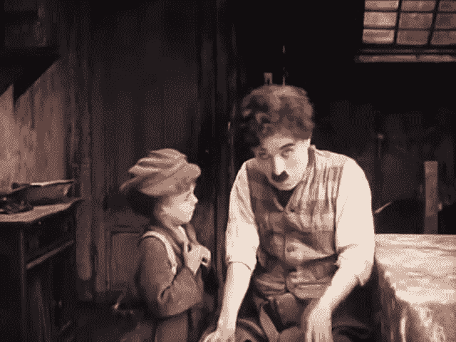
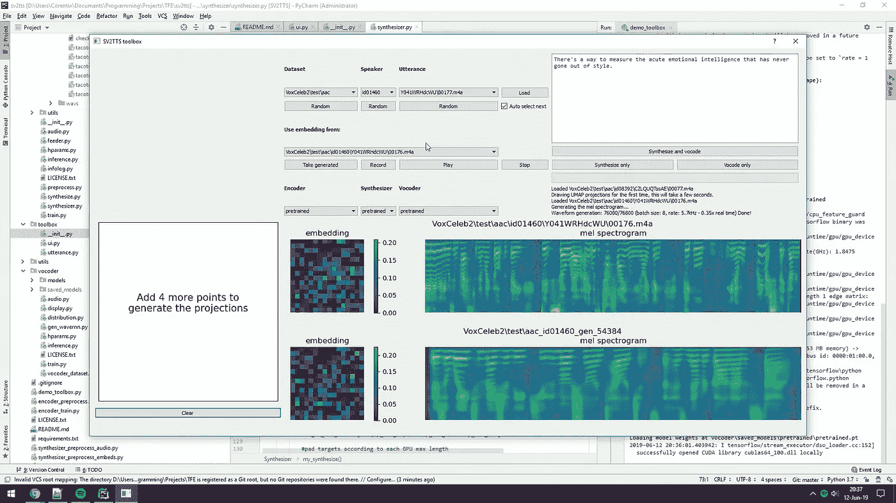
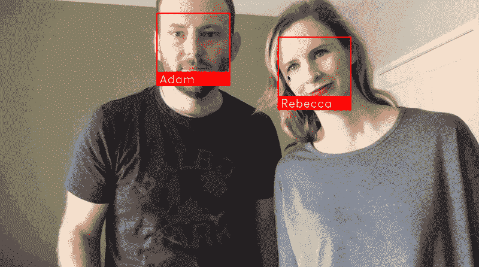
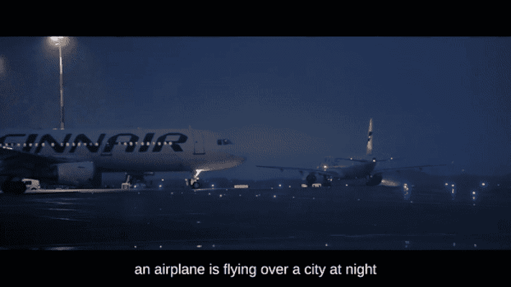
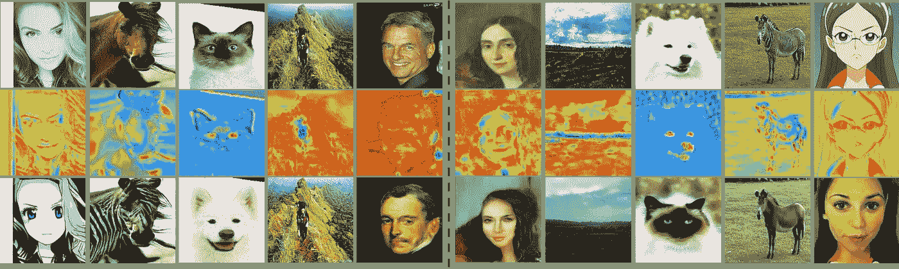
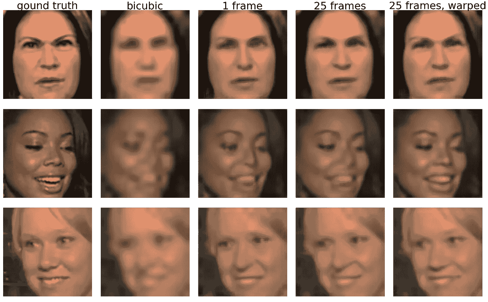
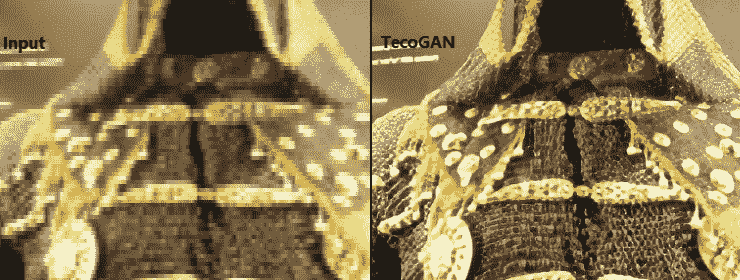

# 令人敬畏的开源机器学习项目 Repos 列表

> 原文：<https://towardsdatascience.com/list-of-awesome-open-source-machine-learning-repos-537fdc08ad4d?source=collection_archive---------23----------------------->

## 试试这个开源项目库列表，让你的机器学习体验棒极了

菠萝供应公司在 Unsplash 上拍摄的照片

在这段隔离时间里，我发现了几个开源的机器学习回复，内容有用且有趣。所以我决定把它列成一个清单，这将有助于新手和专业人士自娱自乐，并在这个过程中学习机器学习。

# 1.去模糊化

这个开源项目包含一个深度学习模型，该模型经过训练，可以为灰度图像添加高质量的彩色化，效果令人惊叹。简单地说，这个项目的目标是着色，恢复，并赋予旧的图像和电影镜头新的生命。

知道了它是什么，你就可以用它来给你童年的旧电影胶片或黑白照片上色。

*   [回购环节](https://github.com/jantic/DeOldify) (10.4K ⭐)

彩色的— **孩子** 1921 年(查理·卓别林电影)

# 2.实时声音克隆

这种深度学习软件可以采集某人 5 秒钟的声音，并能够克隆声音，实时生成任意语音。它仍处于早期阶段，可以工作，但不强调或听起来有点像机器人。

这是一个非常酷和令人毛骨悚然的开源深度学习项目，你可以尝试克隆某人的声音。

*   [回购环节](https://github.com/CorentinJ/Real-Time-Voice-Cloning) (18K ⭐)

[视频演示](https://www.youtube.com/watch?v=-O_hYhToKoA)

# 3.人脸识别

世界上最简单的人脸识别库，其模型在 wild benchmark 中对[标记的人脸的准确率为 99.38%。您可以使用 python 或从命令行使用它来识别和操作人脸。](http://vis-www.cs.umass.edu/lfw/)

通过了解这是如何工作的，您可以进行许多定制来构建您自己的培训模型。我开发了一个[实时面具检测器](/real-time-face-mask-detector-with-tensorflow-keras-and-opencv-38b552660b64)利用这个人脸识别系统的原理。

*   [回购环节](https://github.com/ageitgey/face_recognition) (34.7K ⭐)

面部识别的例子

# 4.NeuralTalk2

NeuralTalk2 用于使用基于 Python+numpy 构建的多模态递归神经网络，用句子描述图像和视频。

尽管我们觉得这不是一个非常有用的项目。它可以用来制作非常搞笑的视频。比如看看创作者的这个[好玩的视频](https://vimeo.com/146492001)。

*   [回购环节](https://github.com/karpathy/neuraltalk2) (4.9K ⭐)

NeuralTalk2 在视频上运行的示例

# 5.乌加特它

你是动漫迷吗？那么 U-GAT-IT(无监督的生成注意网络，具有用于图像到图像翻译的自适应层实例归一化)就是你的完美开源机器学习项目。它拍摄一个人的图像，并翻译成动画中的样子。

他们已经有了两个网页和一个使用这项技术开发的[电报机器人](https://t.me/selfie2animebot)。

*   [回购环节](https://github.com/taki0112/UGATIT) (5.3K ⭐)

U-GAT-IT 示例

# 6.斯雷兹

使用深度学习的图像超分辨率可以将 16x16 的输入图像放大 4 倍，从而得到 64x64 的图像。正如你从下图中看到的，它可以产生一个非常可信的原始人脸重建。

真正酷的事情是，这种升级和重建被政府广泛用于安全目的和电影行业，以使他们的电影更有趣。

*   [回购环节](https://github.com/david-gpu/srez) (5.1K ⭐)

Srez 示例

# 7.特科甘

使用这个机器学习项目库，您可以将代码用于视频超分辨率的时间相干 GAN。这意味着你可以用它来提高你的视频质量。

通过将此项目与 DeOldify 相结合，您可以着色并提高旧电影胶片的质量。

*   [回购环节](https://github.com/thunil/TecoGAN) (2K ⭐)

TecoGAN 示例

# 结论

我希望这个机器学习知识库的列表是有用的，并让您在学习机器学习的同时保持娱乐。如果你有我没有提到的你喜欢的回购，请在下面评论。