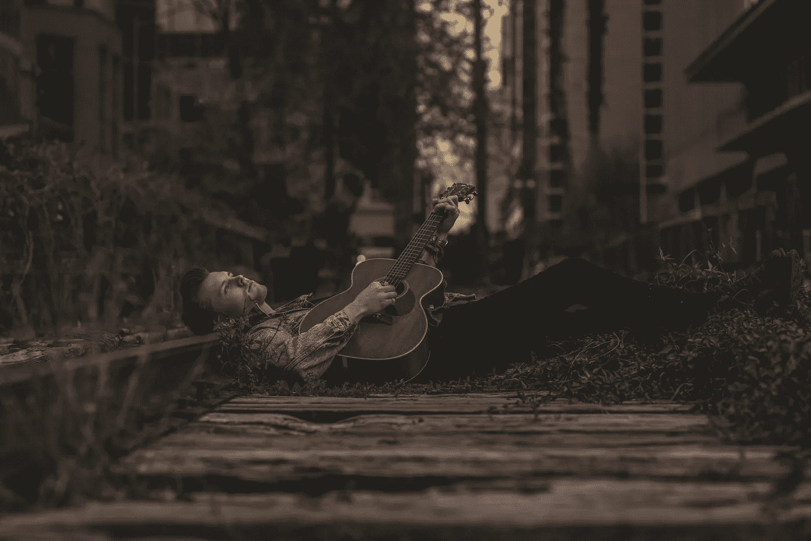
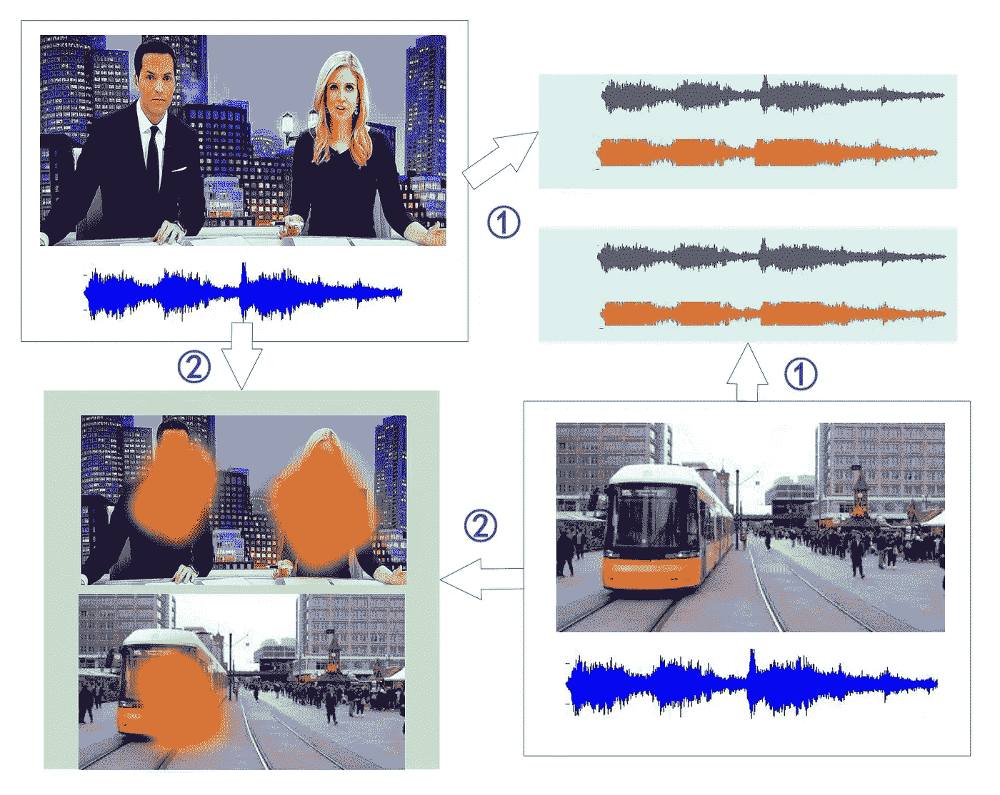
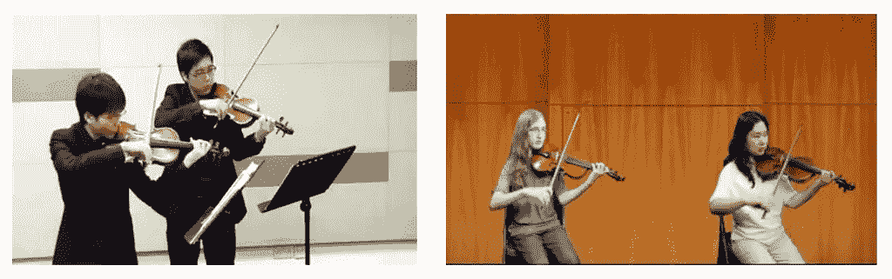
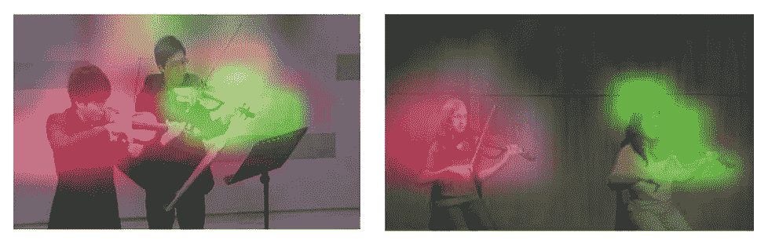
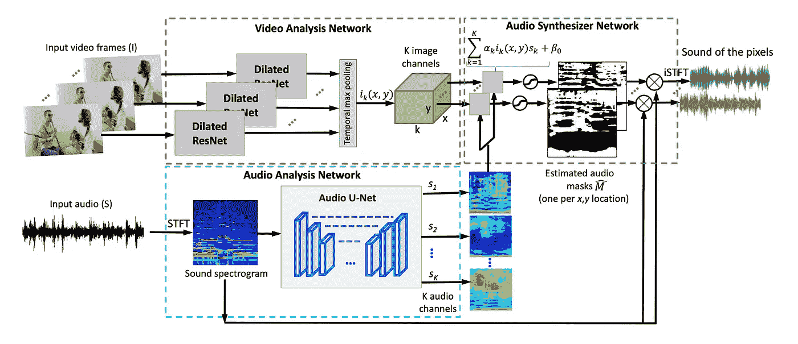
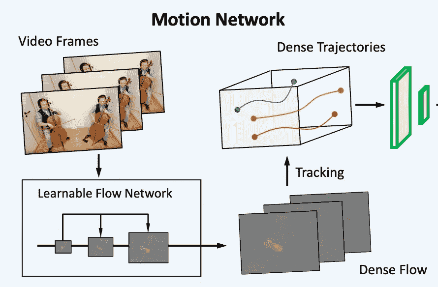
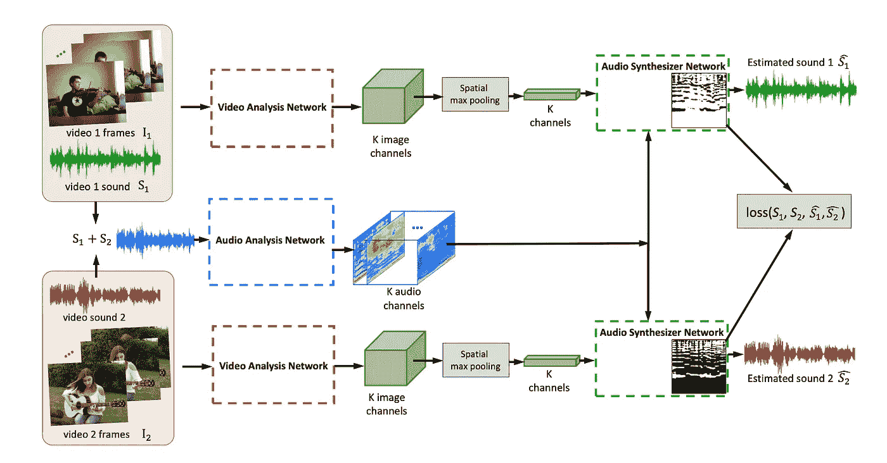
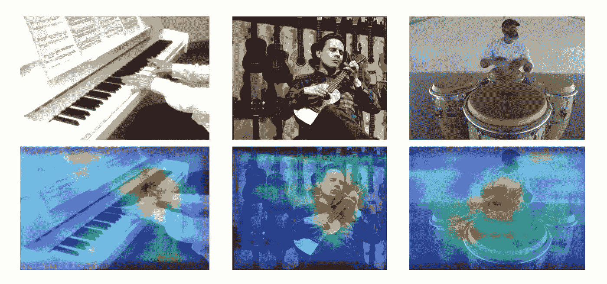

# 倾听像素

> 原文：<https://towardsdatascience.com/listening-to-the-pixels-6d929b76eeb7?source=collection_archive---------44----------------------->

## 内部人工智能

## 用于模拟视听通信的自我监督深度学习

罗伊·雷纳摄于[佩克斯](https://www.pexels.com/photo/man-lying-down-on-ground-while-playing-guitar-1835686/?utm_content=attributionCopyText&utm_medium=referral&utm_source=pexels)

人类的感知是多维的，是听觉、视觉、嗅觉、触觉和味觉的平衡组合。最近，许多研究试图通过从单模态学习过渡到多模态学习来改善机器感知。如果你想知道什么是模态，它是计算机和人类之间感觉输入/输出的单一独立通道的分类(就像视觉是一种模态，音频是另一种)。在这篇博客中，我们将讨论如何使用音频和视觉信息(代表我们日常生活中最重要的两种感知模式)，在不使用任何标记数据的情况下，使我们的机器感知更加智能(自我监督)。

# 我们正在解决的问题是什么？

当你听到一个你认识的人的声音时，你能回忆起他们的脸吗？或者你能在看到一个人的脸时回忆起他的声音吗？这显示了人类如何通过培养一个人的心理图像或听觉记忆来“听到面孔”和“看到声音”。**问题是，你能教一台机器去做吗？**

我们的世界产生了丰富的听觉和视觉信号。视觉信号是光反射的结果，而声音来源于物体的运动和周围空气的振动。在自然发生的事件发生时，这两种形式经常相互关联，共同影响人类的感知。作为对这种感知输入的反应，人类表现出连接和整合来自这两种模式的信号的非凡能力。事实上，感官之间的相互作用是最古老的方案之一，它解释了人类大脑的感官组织如何理解物理维度的复杂相互作用。受我们从物体如何视觉移动来解释声源的能力的启发，我们可以创建学习模型，学习自己执行这种解释。

展示声源分离和定位问题的图解- [声源](https://www.semanticscholar.org/paper/Deep-Audio-Visual-Learning%3A-A-Survey-Zhu-Luo/7cabfa7362ebb57c77380caa57aa17fd7195605c)

虽然听觉场景分析主要在环境声源分离和识别领域进行研究，但是声音和视觉之间的自然同步可以提供丰富的自我监督信号，用于将听觉信号根植到视觉信号中，这正是我们自我监督显示其魔力所需要的。

在这篇博客中，我们将学习如何利用这种跨通道的环境作为自我监督信号，来提取超出单个通道所建立的限制的信息。我们将承认时间特征的重要性，这些特征是基于每种模态的显著变化，并设计一种概率形式，可以识别这些特征之间的时间一致性，以产生视觉定位和跨模态关联。

# 直观的解决方案

我们想到的最直观的解决方案是设计一种概率形式主义，它可以利用来自大量未标记视频的视听信号的内在一致性来学习声音定位和分离。这可以通过制作一个计算模型来完成，该模型可以通过从物体发出的声音中识别物体，以无监督的方式学习视觉和声音之间的关系，在图像中定位它们，并分离来自每个物体的音频成分。有了这样的灵感，许多研究人员开发了可以有效地进行声音定位和声音识别的模型。我们还将努力找到这样一种解决方案，它可以通过区分声音的成分及其与相应对象的关联来进行声源分离及其视觉定位。我们将致力于两方面的解决方案。首先，我们将使用一个简单的架构，该架构将依赖静态视觉信息来学习跨模态上下文。接下来，我们将进一步将视频的运动线索纳入我们的解决方案。运动信号对于学习视听对应是至关重要的。这个事实可以通过两个相似物体发声的简单例子来更清楚地理解。考虑两个艺术家演奏小提琴二重奏的情况。这个案例为人类构建了一个不可能的情境，通过分析单幅画面，将旋律与和声分开。但是，如果我们观察一段时间艺术家的动作，并试图将这些动作线索与音乐节拍相匹配，我们大概可以根据这种动作节拍观察进行推测。这个例子说明了运动的时间重复对于解决声源分离的复杂多模态推理的重要性，甚至对于人类也是如此。我们的目标是在计算上模拟这种能力，以推理音频、视觉和运动信号之间的协同作用。

学习了跨模态上下文的模型的像素级声音嵌入可视化- [源](https://www.semanticscholar.org/paper/The-Sound-of-Motions-Zhao-Gan/c880de441a41c351955ad0bf8f712eeee500ac67)

> 这种关系的计算模型可以用作许多应用的基本单元，例如将视频与自动生成的环境声音相结合，以更好地沉浸在 VR 中，或者通过将声音与视觉障碍人士的视觉信号相联系来实现平等的可访问性。

# 方法

对于我们的初始方法，我们将构建一个三组件网络，如[1]中所建议的那样，分别处理视频帧和音频信号，然后在音频合成器网络中对它们的功能进行组合处理。

[1]中建议的三元件(范，AAN，ASN)网络- [来源](https://www.semanticscholar.org/paper/The-Sound-of-Pixels-Zhao-Gan/fe018f22600d07cbd0452a070e03708886470015)

第一个组件，**视频分析网络(VAN)** 将视频帧作为输入，并提取外观特征。对于特征提取部分，我们将使用扩展的 Resnet-18 模型，其输入大小为**T**x**H**x**W**x**3，**，输出步长为 16，后跟时间最大池层，以输出 **K** 通道特征图。在下面的代码片段中，您可以找到货车的 PyTorch 代码。

第二个组件**音频分析网络(AAN)** 将声音混合作为输入，并应用具有对数频率尺度的短时傅立叶变换(STFT)来获得声音频谱图。然后，将获得的频谱图馈送到 U-Net，该 U-Net 产生代表输入音频混合的不同分量的 **K** 特征图。在下面的代码片段中，您可以找到 AAN 的 PyTorch 代码。

第三个组件，**音频合成器网络(ASN)** 将提取的像素级外观特征和音频特征作为输入，预测基于视觉的声谱图二元掩模。预测的二进制掩码的数量取决于输入混合中要分离的声源的数量。然后，这些二进制掩码与输入声谱图相乘，以分离每个声音分量，随后用输入的相位对预测进行幅度调整，以获得最终波形。然后用逆 STFT 对最终波形进行处理，以检索最终的音频分量。在下面的代码片段中，您可以找到 ASN 的 PyTorch 代码。

正如我之前提到的，这种解决方案可能不足以分离来自视觉上相似的物体的声音，因为外观特征可能会在合成器阶段被愚弄。因此，我们需要另一个网络来分析发声物体的运动。这个附加模块是由赵等人提出的。阿尔[2]。

第四个组件**运动分析网络(MAN)** 以视频帧为输入，分三个主要步骤预测密集轨迹特征图。在第一步中，我们可以使用类似 PWC-Net 的密集光流估计器(轻量设计和快速)来提取输入帧的密集光流向量。下一步，网络将使用提取的密集光流来预测密集轨迹。为了用基本术语理解这一点，让我们假设一个像素的空间位置为 I_t = (x_t，y_t)并且在时间“t”处密集光流为ω_t = (u_t，v_t)。那么对于时间“t+1”，估计位置将是 I_t+1 = (x_t+1，y_t+1) = (x_t，y_t) + ω|(x_t，y_t)。这些估计坐标(I_t，I_t+1，I_t+2…)的连接是一个像素的完整轨迹。在第三步中，估计的密集轨迹被馈送到 CNN 模型，以提取这些轨迹的深层特征。CNN 的选择不是固定的，可以是任意的。赵等人。al []提出使用 I3D 模型，这是众所周知的捕捉时空特征。I3D 有一个紧凑的设计，将 2D CNN 膨胀到 3D，以从预先训练的 2D 过滤器中引导 3D 过滤器。

参考文献[2]中男人的三个步骤的图解--[来源](https://www.semanticscholar.org/paper/The-Sound-of-Motions-Zhao-Gan/c880de441a41c351955ad0bf8f712eeee500ac67)

仍然没有答案的问题是如何将这些轨迹特征整合到我们的初始模型框架中。为此，首先，我们必须将这些特征与作为第一个组件(VAN)的一部分生成的外观特征相融合。进行这种融合的简单方法是从外观特征中提取注意图，将它们卷积到单个通道，并用 sigmoid 函数激活它们的值，以获得空间注意图。然后，该注意力图可以与轨迹特征相乘，以仅聚焦于重要的轨迹，随后是外观和轨迹特征的串联。在这个步骤之后，我们可以直接使用这些特征来代替旧的外观特征，或者我们可以通过对声音特征应用特征线性调制(电影)来及时地进行视觉和声音特征的对准，并且使用融合它们来充当音频网络解码器的输入(如赵等人所建议的。al)。在第二种情况下(使用胶片),我们将不再需要音频合成器网络，我们可以重写 U-Net 解码器来直接预测二进制掩码。

# 自我监督的框架

在这个博客部分，我们将讨论两个主要的训练框架，它们对于训练一个模型以自我监督的方式学习跨模态上下文是必要的。

## 混合和分离框架(MSF)

[1]中建议的混合和分离框架- [来源](https://www.semanticscholar.org/paper/The-Sound-of-Pixels-Zhao-Gan/fe018f22600d07cbd0452a070e03708886470015)

混合和分离训练框架是为训练中的模型人工创建复杂听觉场景的过程。MSF 强制该模型分析一些随机生成的复杂听觉场景，并为其设计一种情况，以分离和抑制混合声音。生成的数据在训练数据中不直接可用，因此 MSF 创建了一个自动数据扩充的情况。MSF 利用了音频信号是相加的这一事实，因此我们可以混合来自不同视频样本的声音来为模型输入生成复杂的听觉信号。另一方面，这个框架也为模型创建了一个自我监督的学习目标。目标是通过使用与声音混合相关联的视觉输入，将声音分离并恢复到其原始波形，该原始波形在添加之前对于每个源是完整的。对于混合和分离框架，我们从训练集中随机采样 N 个视频剪辑，在一个简单的情况下，混合其中任意两个的声音分量，并为模型提供音频混合输入和它们各自的帧。值得注意的是，尽管在训练过程中框架训练目标是清楚的，但是该过程仍然是无人监督的，因为我们不使用任何数据标签和数据采样假设。

## 课程学习

根据定义，课程学习是一种学习类型，其中训练样本从一项任务的简单示例开始，然后逐渐增加任务难度。CL 是一种智能采样技术，可以取代 MSF 的随机采样特性。观察到在单个类别的乐器上训练的模型由于类别不平衡而遭受过度拟合，受此启发，我们可以使用多阶段训练课程，可以从对容易分离的声源进行采样开始。这种课程将有助于用良好的权重初始化来引导模型，以便在困难的任务上更好地收敛。

***注:*** 学习目标(谱图掩模)既可以是二进制，也可以是比值。在二元自然遮罩的情况下，我们将使用每像素 sigmoid 交叉熵损失。否则，在比率自然遮罩的情况下，我们将使用每像素 L1 损失进行训练。此外，由于可能的干扰，基本事实掩码的值不一定保持在范围[0，1]内。

# 引擎盖下的数学

在深度学习应用中，我们往往倾向于依赖网络来学习数学模型，但如果我们在引擎盖下窥视，我们会观察到许多有趣的数学事实。

[来源](https://media.giphy.com/media/fxIk8gAC4fHir5s8Su/giphy.gif)

在跨通道关联的情况下，我们假设每个通道将产生一个重要事件(发作)。如果生成的开始在时间上重复重合(吉他弦的运动发出声音)，那么它们被认为是相关的。在数学术语中，我们可以说，如果重合越多，跨模态对应的可能性也越大。另一方面，如果开始重合度低，则跨模态对应可能性也低。

探测目标定位。叠加热图显示每个像素位置的预测音量- [来源](https://www.semanticscholar.org/paper/The-Sound-of-Motions-Zhao-Gan/c880de441a41c351955ad0bf8f712eeee500ac67)

为了将该过程理解为似然匹配算法，我们必须假设每个模态的所有开始都是独立且互斥的。让我们考虑视频开始是一个二进制数，符号为 **V_on** ，音频开始二进制数为 **A_on** (我使用二进制值，只是为了便于解释)。现在如果我们根据自然的优化函数(似然函数)预先训练我们的网络，

> l =[(a_on)^t✕v_on)-(i^t✕v _ on)]

随着一致性的增加而增加，我们可以更好地解释跨模态关联的似然最大化。假设发作是彼此静态独立并遵循概率定律的随机变量，我们可以说 l = ∏(p^(onset_match)✕(1-p)^(onset_mismatch)或对于一个实例 l(I)= p^(onset_match)✕(1-p)^(onset_mismatch).现在，我们可以将日志重写为:

> Log(L(i)) =开始 _ 匹配✕对数(P) +开始 _ 不匹配✕对数(1-P)

最后，当 V_on 和 A_on 都是{1，1}或{0，0}时，我们也可以声明 onset_match。从而显示出 onset _ match = v _ on✕a _ on+(1-v_on)✕(1-a_on).因此，我们可以最终声明，当我们的网络针对跨模态对应建模进行优化时，它将间接地等同于来自跨模态源的特征的匹配可能性。

**“^”代表幂，“t”代表矩阵转置，“I”代表单位矩阵。**

# 结论

在这篇博客中，我们讨论了如何制作一个系统，该系统可以从未标记的视频中学习，以分离听觉信号，并在视觉输入中定位它们。我们从一个简单的架构开始，展示了如何增强初始系统，以更准确地模拟跨模态环境，即使声源在视觉上相似。最后，我要总结一下，从人类角度理解世界的愿望已经引起了深度学习社区对视听学习主题的关注，这些类型的学习不仅有助于解决许多现有的问题，还将为自我监督学习的未来发展及其在现实世界问题上的应用奠定基础。

我的博客反映了我的工作，并简单地传达了我对这些话题的理解。我对深度学习的解读可以和你不一样，但我的解读只能和我一样无误。

# 参考

[1]赵航、庄干、安德鲁·鲁迪根科、卡尔·冯德里克、乔希·麦克德莫特和安东尼奥·托拉尔巴。像素的声音。欧洲计算机视觉大会(ECCV)，2018 年 9 月。

[2]赵，杭，庄淦，马和 a .托拉尔巴."运动的声音" *2019 IEEE/CVF 国际计算机视觉大会(ICCV)*(2019):1735–1744。

[3] Relja Arandjelovic 和 Andrew Zisserman。看，听，学。2017 年 IEEE 计算机视觉国际会议(ICCV)，第 609–617 页。IEEE，2017。

[4]朱，黄，罗，米，王，郑，张，何(2020).深度视听学习:一项调查。 *ArXiv，abs/2001.04758* 。

[5]如果你想了解更多关于自我监督学习的知识，请深入探究 Neptune.ai 博客上的话题