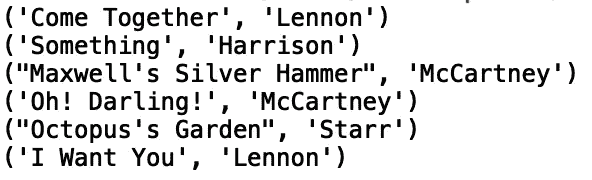
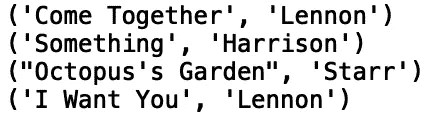
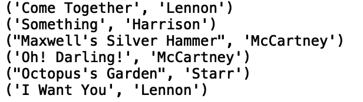
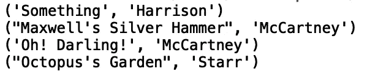
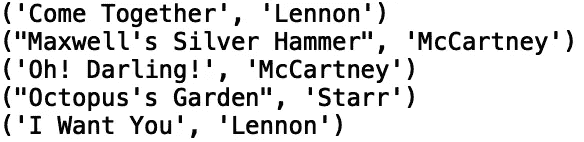
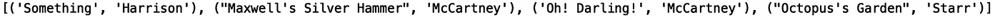

# Python 中的列表

> 原文：<https://towardsdatascience.com/lists-in-python-d1ec8b61ee06?source=collection_archive---------12----------------------->

## 迭代和过滤


[来源](https://www.pexels.com/photo/orange-and-green-pen-on-graphing-notepad-131979/)

在 python 中，列表由字符“[]”分隔。字符'[]'单独表示一个空列表。列表的一个例子是['吉多·范·罗苏姆'，'比雅尼·斯特劳斯特鲁普【T2 '，'詹姆斯·高斯林 **'** ]，这是一个包含三个字符串实例的列表。此外，列表的元素可以是任意对象(不包括任何对象)。例如，您可以有下面的列表:[8200000，' Python '，None]。列表是 python 中最常用的容器之一，是计算机科学中数据结构和算法的核心。

在这篇文章中，我们将讨论如何使用 python 中三种不同的循环结构来遍历和过滤列表。我们将讨论如何使用“while 循环”、“for 循环”和“基于索引的 for 循环”进行列表迭代。我们还将给出一个 python 中列表过滤的列表理解的例子。

# WHILE 循环

While 循环允许我们基于条件的重复测试来重复一个动作。换句话说，任何时候你需要一个程序一直做某件事，直到一个条件被满足，“while loops”是有用的。

对于我们的例子，我们将考虑根据歌曲作者过滤歌曲列表的问题。假设我们有披头士专辑 *Abbey Road* 第一面的歌曲和作者的元组列表:

```
abbey_road = [('Come Together', 'Lennon'), ('Something', 'Harrison'), ('Maxwell's Silver Hammer', 'McCartney'), ('Oh! Darling!','McCartney'), ('Octopus's Garden', 'Starr'), ('I Want You', 'Lennon')]
```

我们可以使用“while 循环”迭代元组列表:

```
j = 0 #initialize the index 
while j < len(abbey_road):
    print(abbey_road[j]) 
    j+=1 #advanced the index 
```



这里,“while 循环”条件是每次迭代后我们前进的索引必须小于列表的长度。

为了根据歌曲作者过滤元组列表，我们可以应用一个附加条件。假设我们想要删除 Paul McCartney 的歌曲。我们可以做到以下几点:

```
j = 0
while j < len(abbey_road): 
    if abbey_road[j][1] != "McCartney":     
        print(abbey_road[j])        
    j+=1
```



我们也可以为其他歌曲作者做同样的事情。我鼓励你尝试一下！现在让我们继续讨论“for 循环”。

# 对于循环

我们将使用“for 循环”来解决列表过滤的同样问题。首先，让我们遍历“abbey_road”列表并打印每个元素:

```
for song, artist in abbey_road:
    print((song, artist))
```



如你所见，这更容易阅读。这个结构允许我们为正在迭代的元素定义名称，这有助于提高代码的可读性。让我们过滤掉列侬的歌曲:

```
for song, artist in abbey_road:
    if artist != "Lennon":
        print((song, artist))
```



尝试修改条件以按歌曲或艺术家的不同字符串值进行过滤。让我们继续讨论“基于索引的 for 循环”。

# 基于索引的 FOR 循环

对于这个例子，我们将使用“基于索引的 For 循环”遍历“abbey_road”列表。

```
for i in range(len(abbey_road)):
    print((abbey_road[i][0], abbey_road[i][1]))
```


这给了我们预期的结果。让我们对哈里森创作的歌曲应用过滤器:

```
for i in range(len(abbey_road)):
    if abbey_road[i][1] != "Harrison":
        print((abbey_road[i][0], abbey_road[i][1]))
```



如您所见，这个 for 循环结构不像前面的结构那样可读。现在我们来看最后一个例子，列表理解。

# 列表理解

对于最后一个例子，我们将使用列表理解来过滤‘abbey _ road’列表。让我们再次过滤掉“列侬”的歌曲:

```
filtered_list = [(song, artist) for song, artist in abbey_road if artist != "Lennon"]print(filtered_list)
```



在我看来，这是用 python 过滤列表的可读性最强、最简洁的方法。

# 结论

总之，在这篇文章中，我们讨论了 python 中的列表对象。我们讨论了在 python 中迭代和过滤列表元素的三种方法。我们还给出了一个使用列表理解进行列表过滤的例子。我鼓励你尝试过滤和遍历列表的方法。例如，您可以定义一个新列表并应用上述方法，或者尝试更改每个示例中的筛选条件。我希望你觉得这篇文章有趣/有用。这篇文章中的代码可以在 [GitHub](https://github.com/spierre91/medium_data_structures_and_algorithms/blob/master/lists_in_python.py) 上找到。感谢您的阅读！