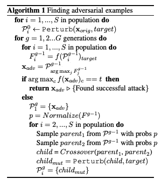
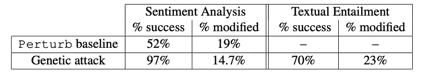
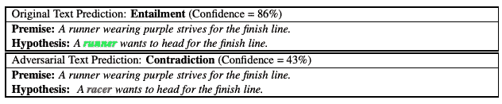

# 文献综述—生成自然语言对立范例

> 原文：<https://towardsdatascience.com/literature-review-generating-natural-language-adversarial-examples-a8727ea6c30e?source=collection_archive---------65----------------------->

## 基于同义词替换的对抗性攻击的遗传算法

艾沙特·纳吉在 [Unsplash](/s/photos/free?utm_source=unsplash&utm_medium=referral&utm_content=creditCopyText) 上的照片

深度学习模型容易受到对立例子的影响:人类察觉不到的输入数据扰动可能导致训练有素的深度神经网络做出错误分类。尽管在计算机视觉领域研究了很多对立的例子，但该领域在自然语言处理(NLP)中仍然相对较新。

研究自然语言处理模型中对立例子的一个关键困难在于文本数据是离散的。对于存在于连续空间中的图像数据，很容易在没有人注意到的情况下干扰像素。然而，很难确定我们是否通过改变一个句子的字符、单词或简单地重写它而对它产生了不明显的干扰。为了保持句子的语义和句法结构，一种可能的尝试是用同义词替换一些单词。例如:

> 一名**赛跑运动员**想要冲向终点线
> 
> 一名赛车手想要冲向终点线。

在这里我希望对 Alzantot 等人的论文 [***生成自然语言对抗性示例***](https://arxiv.org/pdf/1804.07998.pdf) 做一个文献综述，这篇论文对 NLP 中的对抗性攻击方法做出了非常有趣的贡献，发表在 EMNLP 2018 上。

总之，该论文介绍了一种为 NLP 任务生成对抗示例的方法，该方法

*   通过用同义词替换单词并最小化单词修改的数量来扰乱给定的句子，
*   (**黑盒**)只能访问模型的输出
*   使用一个**遗传算法**迭代进化一个句子的候选对立范例群体，使其具有更好的扰动

我们将仔细详细地解释这些突出的概念。

# 背景

## 对抗性攻击—黑盒和白盒

**黑盒攻击**方法在没有目标模型的架构、(超)参数或成本梯度的信息的情况下生成对立的示例**。通过**查询**深度学习模型对输入文本提出的一组扰动的输出，黑盒攻击通常会搜索导致模型错误预测的最佳对抗性例子。因此，NLP 中黑盒攻击的一个流行分支是基于同义词替换。正如这项工作是基于同义词替换，更多关于黑盒攻击方向的工作可以在下面的列表中找到:**

*   [**自然语言分类问题的对立例子**](https://openreview.net/pdf?id=r1QZ3zbAZ) **。**沃洛季米尔·库里肖夫、尚塔努·塔库尔、刘廷凤、斯特凡诺·埃尔蒙【2018】
*   [**通过概率加权的词显著性生成自然语言对抗实例**](https://www.aclweb.org/anthology/P19-1103.pdf) **。**任树怀，邓怡和，，车万祥【ACL，2019】
*   [**词级文本对抗性攻击为组合优化。**](https://arxiv.org/pdf/1910.12196.pdf) 元稹、齐、、、、孙茂松[ACL，2020]

另一方面，白盒攻击可以访问模型的所有细节。因此，白盒攻击通常基于模型的**梯度**，而不是基于查询，与通常基于查询的黑盒攻击相比，白盒攻击的计算效率更高。然而，尽管白盒攻击可以为我们提供关于模型健壮性的有趣视角，但白盒是一种理想的设置，不适用于许多现实世界的情况。此外，由于访问模型的渐变很方便，白盒攻击通常基于单词嵌入空间。在单词级别，白盒攻击通常在嵌入空间中找到一个最佳扰动的例子，而不是查询同义词，类似于计算机视觉中的大多数对抗性攻击。因此，挑战在于保证语义和句法的保留，因为受干扰的单词嵌入通常不会映射到有效的单词标记。一些单词级的白盒攻击可以在这里找到:

*   [**为递归神经网络制作对抗性输入序列**](https://ieeexplore.ieee.org/document/7795300) **。尼古拉斯·帕伯诺特、帕特里克·麦克丹尼尔、阿南瑟拉姆斯瓦米和理查德·哈朗。[MILCOM，2016 年]**
*   ****用渐变的方法对抗文本。**巩，，，宋晓晓，魏。[2018]**
*   **[**Seq2Sick:用对立实例评估序列对序列模型的稳健性**。](https://arxiv.org/abs/1803.01128)程、、李金凤、、、谢卓瑞。[AAAI，2020 年]**

**另一个关注白盒字符级攻击的有趣工作 HotFlip 也显示了如何将他们的方法用于单词级攻击，尽管在单词级上遇到了生成大量对抗性示例的困难:**

*   **[**HotFlip:文本分类的白盒对抗示例**](https://www.aclweb.org/anthology/P18-2006.pdf) 。贾维德易卜拉希米，饶毅，丹尼尔劳德，窦德静。[ACL 2018]**

## **遗传算法**

**遗传算法是一种有趣的优化启发式算法，受进化中自然选择过程的启发，旨在通过多代提出的假设找到优化的解决方案。这些算法通常涉及诸如*变异*、*交叉*和*选择*等算子，与生物过程相似，以构造下一代建议候选解。**

**应用于 NLP 任务的对抗性攻击，本工作中采用的遗传算法通过*将*单词与其同义词突变，在两个(父)对抗性候选之间执行*交叉*，以及*选择*具有最高模型分数的最佳示例来产生对抗性示例。这项工作的算法的更多细节将在后面讨论。**

**有关遗传算法的更多信息，请参见:**

*   **[https://en.wikipedia.org/wiki/Genetic_algorithm](https://en.wikipedia.org/wiki/Genetic_algorithm)**
*   **[https://towards data science . com/introduction-to-genetic-algorithms-including-example-code-e 396 e 98d 8 BF 3](/introduction-to-genetic-algorithms-including-example-code-e396e98d8bf3)**

# **建议的方法——详细说明**

**所提出的攻击方法的目标是为导致目标模型做出错误输出的输入序列产生对抗示例，同时(1)保持来自原始输入的语义相似性和句法一致性，以及(2)最小化对对抗示例做出的修改的数量。在*黑盒设置*下，本文提出了一种*遗传算法*来使用模型的输出并执行无梯度的基于查询的攻击。我们首先对算法进行概述，并对其进行详细解释:**

****

**引入遗传算法来搜索给定输入序列的最佳对立示例(来源:原始论文)**

**该算法调用两个子例程 *Perturb(x，target)* 和 *Crossover(parent1，parent 2)*和一个*适应度分数 f* 来生成下一批对抗性例子，我们也将对此进行详细解释。对于算法的一般第一印象，**

1.  **它首先接受一个原始语句 *X_orig* ，并使用第一代的 *Perturb(X_orig，target)* 对该语句产生 *S* 个独立扰动。**
2.  **然后，它最多迭代 G 代，使得在每代，该算法评估每个扰动实例的适应度分数，以保留使其最大化的那个。**
3.  **如果当前的最佳对抗示例会导致模型做出错误的分类，我们就完了。**
4.  **否则，在下一代中保留当前的最佳范例作为一个个体，并根据当前(父)代生成其他范例。**
5.  **具体来说，为了在下一代中生成一个示例，根据其适应度分数从当前代中采样两个父示例。**
6.  **然后通过*交叉(parent1，parent2)* 生成一个子实例，并通过*扰动(child，target)* 进一步扰动**
7.  **当子代达到 S 个样本的群体时，算法恢复迭代以找到导致目标模型的错误的示例。**

## **子程序—交叉*(父母 1，父母 2)***

***交叉*取两个单词长度相同的父对立候选，从父实例的每个位置随机选择一个单词，生成子实例。**

## **子程序— *扰动(x，目标)***

**给定输入句子 *x* 和目标标签预测分数(**适合度分数** ), *扰动*随机选择一个单词，并试图找到使分数最大化的合适的替换单词，以生成扰动的示例。具体来说，替换单词是通过**

1.  **计算所选单词在嵌入空间中的 N 个最近邻。**
2.  **使用*Google 10 亿单词语言模型*过滤掉损害句子句法结构的替换候选。**
3.  **挑选在替换后最大化*目标*标签预测分数的候选，并返回具有新替换单词的被扰乱的句子。**

**注意，这样的替换单词将最大化目标模型在目标标签(不同于真实标签)上的预测分数，以实现攻击。**

# **实验结果**

**作为前期工作，本文使用*扰动*作为基准来评估其遗传算法的有效性。他们选择 IMDB 电影评论数据集进行情感分析，选择斯坦福自然语言推理(SNLI)语料库进行文本推理。此外，目标模型是 LSTM 模型，在这两个任务上达到接近最先进的性能。**

****

**扰动基线和遗传算法在两个 NLP 任务上攻击成功率和修改率的比较。(来源:原论文)**

**遗传攻击以较低的修改率实现了跨任务的更好的攻击成功率。注意，没有报告 SNLI 上*扰动*的结果，因为当修改数量有限时，*扰动*基线在句子非常短(平均 9 个单词)的 SNLI 数据集上几乎不成功。**

**生成的对手及其攻击结果的更直接的示例如下所示:**

****

**SNLI 文本蕴涵任务的攻击结果实例。(来源:原论文)**

# ****结论****

**介绍了一种基于同义词替换策略的自然语言处理任务的黑盒对抗攻击方法。这种策略既保持了句法的一致性，又保持了对立例子中原句的语义相似性。更重要的是，本文提出了一种新的用于对手生成的遗传算法，并在情感分析和文本蕴涵任务上取得了显著的效果。最后，该论文朝着 NLP 领域中深度学习模型的鲁棒性迈出了有趣的一步。**

**论文:[https://arxiv.org/abs/1804.07998](https://arxiv.org/abs/1804.07998)**

**代码:[https://github.com/nesl/nlp_adversarial_examples](https://github.com/nesl/nlp_adversarial_examples)**

**更有趣的工作是关于**基于 BERT 的**模型的健壮性:**

*   **[**伯特真的健壮吗？自然语言攻击文本分类和蕴涵的强大基线。**](https://arxiv.org/pdf/1907.11932v4.pdf) 【金迪】、金志敬、乔伊·周天翼、彼得·佐洛维茨。[AAAI，2020 年]**
*   **Adv-BERT: BERT 对拼写错误不敏感！基于 BERT 的自然对抗样本生成。、桥本、尹、浅井明里、俞、熊。[2020]**
*   **[**伯特攻击:利用伯特对伯特进行对抗性攻击。**](https://arxiv.org/pdf/2004.09984.pdf) 李、马若天、郭、邱希鹏**