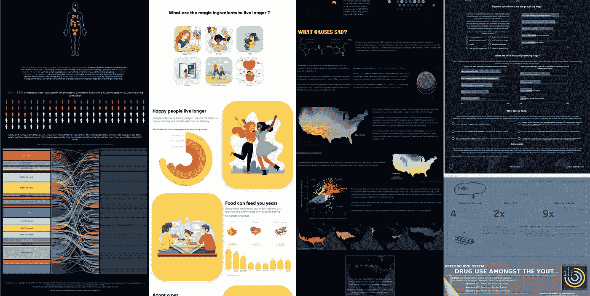
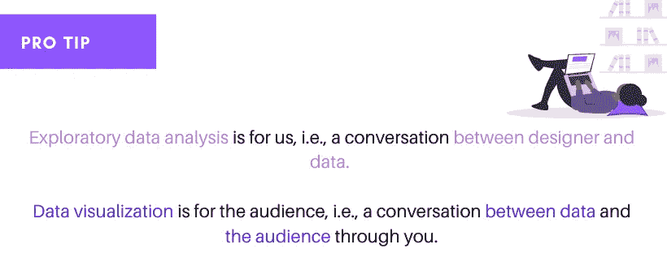
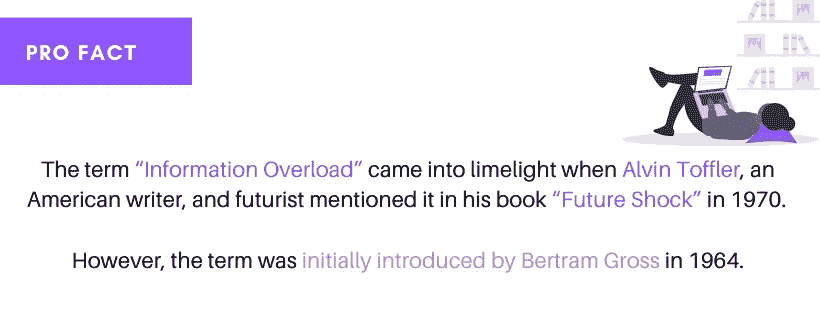
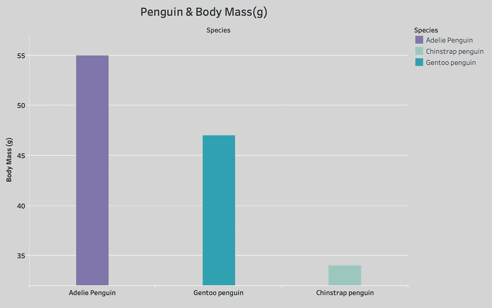
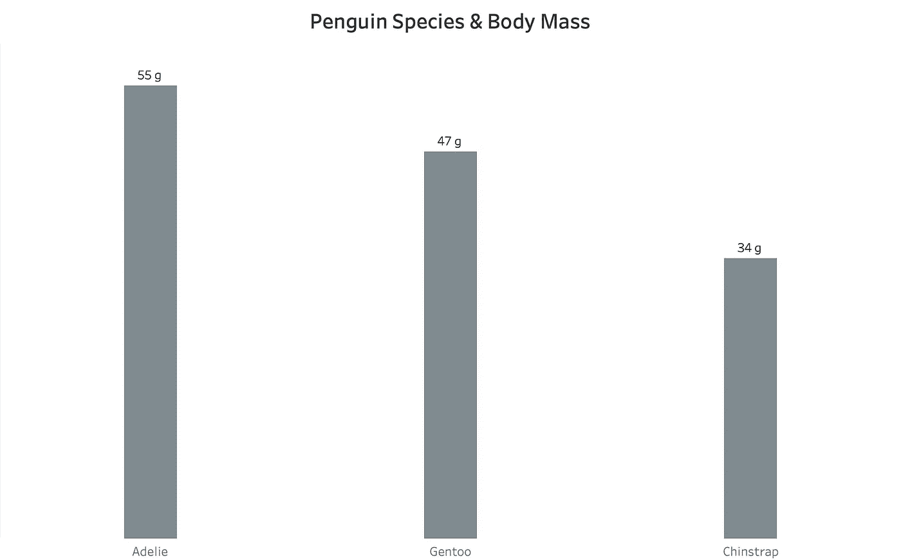
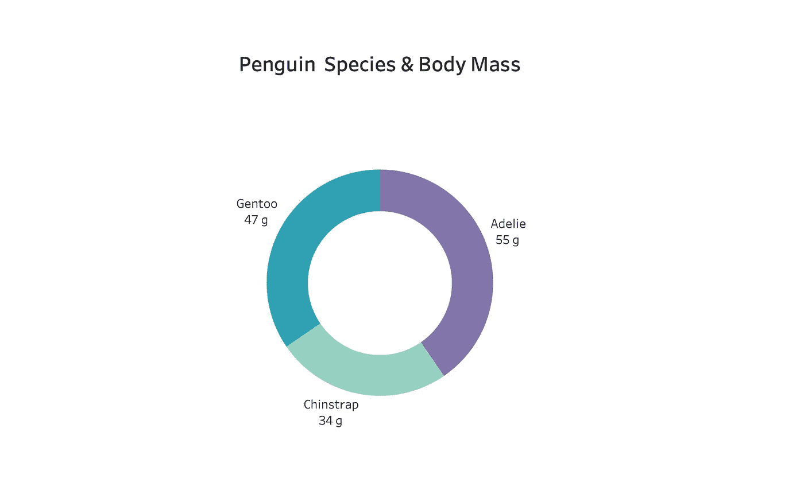
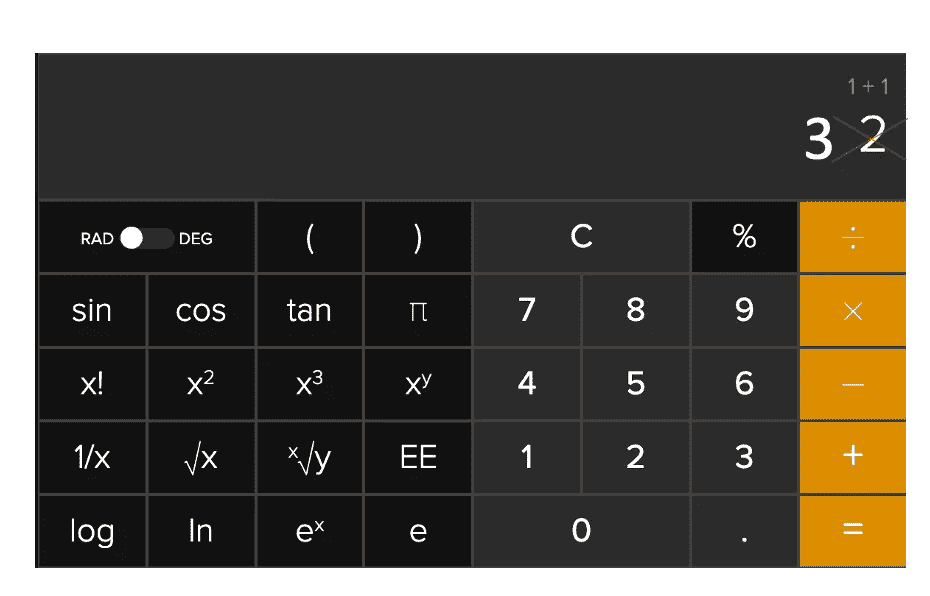
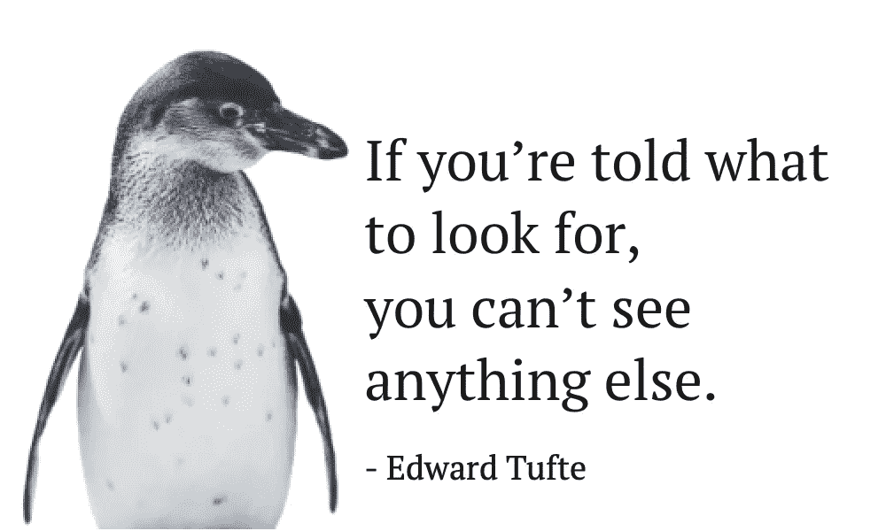
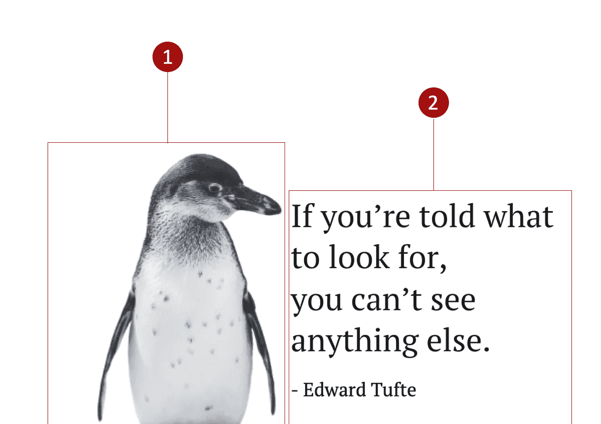
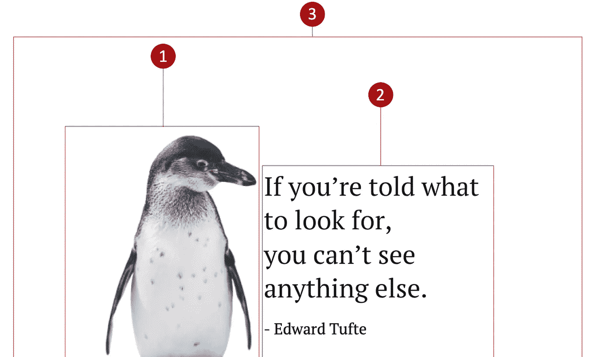

# 鲜为人知的方法，让你的数据可视化真棒

> 原文：<https://towardsdatascience.com/little-known-ways-to-make-your-data-visualization-awesome-890d71b6e365?source=collection_archive---------3----------------------->

## 1 + 1 = 3

## 去除多余的部分

一些 2020 年的精选酒。即由各自的所有者，图片来源于[威尔萨顿](https://wjsutton.github.io/ironviz2020.html)的博客。

答几个月前，当我在 Instagram 上冲浪时，我在一个帖子上看到一条评论，评论说，“你很好地使用了数据-墨水比率。”我立即开始探索术语“数据墨水”，并意识到它是由“爱德华·塔夫特”创造的几个月前，我在人机交互课程的一些研究论文上读到过他的名字。当我确定了作者的名字和术语数据-墨水比率之间的联系时，我开始探索它，并开始在我的数据可视化之旅中实现它。

这个博客是献给那些想深入研究或正在从事迷人的数据可视化领域的人的。

数据可视化是将值映射到视觉效果，或者说，将数字转化为图片和故事，允许我们以不同的方式探索、解释和理解数据，为我们提供抓住隐藏模式和见解的机会。

由作者设计。插图来自 [unDraw](https://undraw.co/) 。

想探索更多关于 EDA 的知识吗？

 [## 初学者的探索性数据分析

### 第一次做 EDA！

medium.com](https://medium.com/analytics-vidhya/exploratory-data-analysis-for-beginner-7488d587f1ec) 

假设你以前有数据可视化的经验，或者是这个领域的新手。在这种情况下，我相信你已经玩过视觉编码或者对它有一个基本的概念。

一般来说，当我们试图创建一个可视化时，我们会附加很多观众需要的信息，所以我们会幻想引入更多的颜色、事实、图像等。它们有时看起来不错，但大多数时候，它会导致视觉混乱:让我们的作品被观众厌恶。

由作者设计。从[展开](https://undraw.co/)的插图。

今天，人们对图像如此熟悉，以至于忽略了伴随照片的文字。这也是 Instagram 在短时间内获得人气的原因:**图片的力量**。由于人们不会通读文本，我们的图表必须是不言自明的，不能公开给别人解释。它们不应该用大量明亮的颜色和粗体字来分散信息，给用户带来很高的认知负荷。因此，对我们的用户来说，裸可视化是一个更好的选择。

**怎样才能让我们的内视，赤裸裸？**

为此，我们可以伴随以下三个概念:

## 数据-油墨比:

> 最重要的是，展示数据。爱德华·r·塔夫特

信息可视化专家 [Edward R. Tufte](https://www.edwardtufte.com/tufte/) 是[耶鲁大学的艺术家和统计学家教授，](https://politicalscience.yale.edu/people/edward-tufte)他撰写、设计并出版了[四本致力于数据可视化知识的书籍](https://www.amazon.com/Edward-Tufte-All-4-Books/dp/B0037A8PTS)。1983 年，塔夫特出版了他的第一本书，名为[定量信息的可视化显示](https://www.amazon.com/Visual-Display-Quantitative-Information/dp/1930824130)，专注于设计数据图形的理论和实践。这可能是关于数据可视化的最重要的书。在这本书里，他介绍了两种有趣的图形启发法，数据-墨水比率和图表垃圾。

他将数据墨水定义为“**图形**的不可擦除核心”，或者换句话说，“数据墨水比率是墨水(即像素)在视图上构成数据信息的部分。”

> Tufte 将数据油墨比定义为数据油墨量除以打印图形所需的总油墨量。

用一个外行人的话来说，Tufte 建议删除那些不会给图形添加新信息的元素，即使用更少的墨水(图表元素)对观众来说更有效、更有吸引力、更有必要。

他提出了以下与数据墨水相关的五个原则:

*   最重要的是，显示数据。
*   最大化数据-油墨比率。
*   擦除非数据墨水。
*   删除多余的数据-墨水。
*   修改和编辑。

**我们以数据-油墨比**为例。

下面的图表显示了企鹅的种类和它们的体重，单位是克。

低数据-油墨比率。图片作者。克里斯汀·戈尔曼博士的数据。

**那么我们如何在这里实现高数据-墨水比率:**

1.  我们可以移除柱线后面的灰色背景，因为它不提供概念上的价值。
2.  去掉图例，因为每个条形可以直接沿 x 轴标记。
3.  y 轴标签的标题被删减了，因为整张图片(见标题)中有大量关于企鹅及其体重的参考资料。
4.  给企鹅的每一条都涂上颜色是不必要的，x 轴的名字就足以显示它们的不同。因此，保持颜色一致。
5.  我们也可以从头到尾去掉**粗体**。
6.  图上有一条网格线，我们不确定它的值，所以我们可以把它去掉。
7.  我们可以去掉 y 轴值，直接标记图形中的每个条形。
8.  为了更好的理解，在标题上增加了“物种”一词。

按照上面提到的这些方法，我们进入下图:

高数据-油墨比率。图片作者。克里斯汀·戈尔曼博士的数据。

我们通过提高数据-墨水比率，使图形更加直观易读，并增加了观众看到的信息量。

> **经验法则**

## 海图垃圾

> 别装腔作势了，说重点吧！爱德华·r·塔夫特

当我们试图进行可视化时，我们总是想到我们将在图表中放入什么，而不是我们将省略什么。这就产生了 chartjunk。

Chartjunk 是下一个启发，Tufte 在他的著作[【量化信息的视觉显示】(1983)](https://www.edwardtufte.com/tufte/books_vdqi) *。*他称 Chartjunk — **在图形中过度和不必要的使用图形效果**。他还呼吁莫尔振动，大规模的网格和自我推销的图表用来展示设计师的图形能力，而不是显示数据。

简单来说，chartjunk 指的是图表视图或 say 不需要的所有视觉元素，当图表或图形有许多多余的标签或装饰，不能传递数据时，这些元素会分散用户的注意力。

**三种图表垃圾:**

1.  **有用的无用信息**
    无用信息包括图形中不传递数据但承载有用或令人兴奋的内容的所有部分。比如注释、信息文本、副标题等。
2.  **无害的垃圾**
    这类垃圾不传达数据，也无助于阐明数据中呈现的概念，而且总体上不会碍事，比如给图表添加边框或添加徽标等等。不管是有意还是无意，大多数作品都属于这些类别。
3.  **有害垃圾**
    我喜欢称之为“危险垃圾”那些直觉上干扰阅读和理解可视化的垃圾。比如从不同的标签(不包括 0 标签)开始绘制条形图，以及使用干扰性的背景图像等。

让我们以图表垃圾为例。

高价垃圾债券。图片由作者提供。克里斯汀·戈尔曼博士的数据。

**那么我们如何在这里删除 chart junk:**

1.  图例是不必要的，因为我们在标签上有企鹅的名字。
2.  添加一个企鹅图像是不必要的，因为我们已经写了单词企鹅。(我们中的一些人可能不同意这一点，但我只是出于理解的目的使用它。)
3.  标题有(g)表示克，但也只是在标签上，所以也是垃圾。
4.  从标签上移除企鹅这个词。
5.  在标题上增加了物种以便更清晰。

移除 chartjunk 后，我们得到了下图。

低价垃圾。图片由作者提供。克里斯汀·戈尔曼博士的数据。

因此，添加额外的“东西”并不总是有益的，因为有时它会增加认知负荷。现在还不能确切知道什么是 chartjunk，什么不是。因此，我们还应该考虑如何澄清信息，我们希望人们如何阅读我们的数据，我们希望他们带走什么，因为有时添加各种设计元素对澄清我们想要讲述的故事很有用。

## 1+1 = 3

> 空白应该被视为主动的元素，而不是被动的背景。

1 + 1 = 3.图片由作者提供。

*有一句话叫“看不见就设计不了”，*那么在下面的设计中，你看到了多少元素？

由作者设计。图片由 Buzzle 提供。

Giphy.com[的 Gif 图](https://giphy.com/)。

你是不是也讲 2！

由作者设计。图片由 Buzzle 提供。

Gif 由[Giphy.com](https://giphy.com/)制作。

哦，对不起，朋友们，还有第三个元素，也叫**空格。**

由作者设计。图片由 Buzzle 提供。

塔夫特在他的下一本名为[的书中写道，大约 1 +1 =3。不要难过，空间或者说负空间是最被忽视的设计元素。它控制着我们视觉中的所有其他设计元素。因此，在数据可视化中，表达式 1 +1 =3 非常受欢迎，因为空白是一种空的设计。](https://www.amazon.com/Envisioning-Information-Edward-R-Tufte/dp/0961392118)

**为什么空白在数据可视化中也很重要？**

*   空白通过确保我们的图形和文本清晰易读来提高可读性。
*   事实证明，有效利用空白可以将内容理解能力提高 20%。
*   空白通过在图形元素之间创造秩序感和流动感来帮助读者更好地理解内容。
*   它是一种创造性的工具，有助于更有效地传达信息。
*   还有更多。

一些最好的负空间使用标志。各自所有者的徽标。由作者策划。

请记住，我们不必成为一名专业的设计师来理解并在我们的下一个数据可视化项目中实现空白设计原则。我们的目标是减少认知负荷，改善读者体验，创造和谐感。

因此，如果你做到了这一步，我们可以看到如何剥离多余的内容并使我们的图表裸露出来，以一种传达我们的想法、引起读者注意的方式帮助呈现潜在的数据，最重要的是，不会让读者在信息过载中流动:所有这一切都是通过在我们的设计中引入**数据-墨水比率、图表垃圾和负空格**。下次你开始设计的时候，想想你能拿走什么，而不是你能放什么。

最后引用安东尼·德圣埃克苏佩里的话:

> 完美不是在没有更多可以添加的时候实现的，而是在没有什么可以拿走的时候实现的。

> 如果你对这篇文章有任何疑问，或者想在你的下一个数据可视化项目中合作，请在 [LinkedIn](https://www.linkedin.com/in/maladeep/) 上联系我。

# **推荐读物**

*   [留白设计:为什么 1+1 = 3——为黑客设计](https://designforhackers.com/blog/whitespace-113/)
*   [爱德华·塔夫特谈数据可视化和艺术](https://insights.dice.com/2016/10/03/edward-tufte-visualizations-data-art/)
*   [图表垃圾:振动、栅格和鸭子](https://www.edwardtufte.com/bboard/q-and-a-fetch-msg?msg_id=00040Z)
*   [移除以改进](https://speakerdeck.com/cherdarchuk/remove-to-improve-the-data-ink-ratio?slide=11)
*   [设计中的负空间:它是什么，为什么重要](https://www.framer.com/dictionary/negative-space/)
*   [空白的力量](https://www.interaction-design.org/literature/article/the-power-of-white-space)