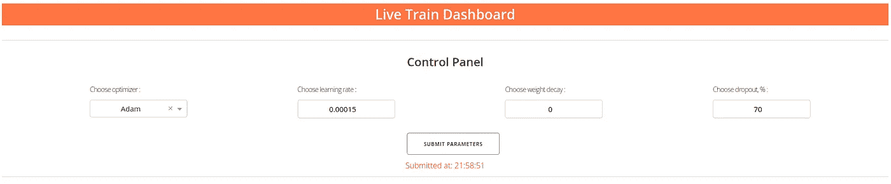

# CNN 实时培训仪表板:超参数调整

> 原文：<https://towardsdatascience.com/live-cnn-training-dashboard-hyperparameters-tuning-6b3382d9e44f?source=collection_archive---------33----------------------->

## [实践教程](https://towardsdatascience.com/tagged/hands-on-tutorials)

# 目录

1.  **为什么我们需要建立一个直播 CNN 培训仪表板？**
2.  **简介**
3.  **先决条件**
4.  **系统描述**
5.  **如何营造环境，开始训练？**
6.  **结论**
7.  **参考文献**

# 为什么我们需要建立一个现场 CNN 培训仪表板？

当我在数学学校学习的时候，我的老师告诉我理解一件事情的最好方法是把它形象化。例如，我们有一块木板、橡皮泥和金属线来可视化立体测量问题。这对开发视觉思维和解决挑战性任务的技能帮助很大。

我真的相信真正的数据科学家应该理解算法，并且知道如果有些东西不太好，应该如何改进它。尤其是在深度学习领域。在我看来，发展这些技能的最佳方式是观察模型是如何被训练的，当你改变超参数时会发生什么。这就是为什么我想分享如何为 CNN 直播培训建立一个简单的仪表板，并有机会在线调整一些超参数。

有一个常识，如果我们选择太大的学习率，就会看到我们的损失函数是如何爆炸的(我们的模型不会收敛)；如果我们选择的学习率太小，训练过程可能会持续太长时间。退学怎么办？有一种观点认为辍学减少了过度适应。即使我相信，我也要亲自检查一切，因为知道和相信是两回事。

下面是我的仪表板的简短演示。损失函数和准确度图上的红点代表训练数据集，蓝点代表测试数据集。


作者图片

# 介绍

仪表板显示以下统计信息:

*   时间损失函数值；
*   时间上的准确性；
*   最后一步的激活映射值的分布；
*   超参数变化历史(表)；

对于这项任务，我使用 AlexNet 架构对 10 类图像进行分类:阿拉斯加雪橇犬、狒狒、针鼹、大熊猫、河马、帝企鹅、骆驼、水獭、小熊猫和袋熊。图像从 ImageNet 下载。我不会在这篇文章中详述，但是你可以浏览文件`**get_dataset.py**`。在训练期间，可以调整以下参数:

*   优化器；
    这个参数决定了我们用来优化模型的算法。我只用亚当和 SGD 与内斯特罗夫的势头。如果你想更多地了解优化技术，我鼓励你观看斯坦福大学的视频[这里](https://www.youtube.com/watch?v=_JB0AO7QxSA)。关于优化有许多奇妙的细节。
*   学习率；
    该参数决定了我们在更新权重时下坡的速度。权重更新的基本梯度下降公式如下:`w := w — lr * dw.`
*   重量衰减；
    对于我们的情况，它只是简单的 L2 正则化:`R(W) = SUM(W * W)`。人们认为，重量衰减在 CNN 的背景下没有太大意义，但你可以亲自看看它是如何工作的。你可以在这里阅读一些关于 L1 和 L2 规则化技术的描述[。](/l1-and-l2-regularization-methods-ce25e7fc831c)
*   辍学；
    神经网络常用正则化策略。这个想法是在每个训练步骤中随机设置一些神经元为零。超参数是丢弃每个神经元的概率。常见值为 0.5 (50%)。我们可以选择 20 到 80 之间的任意整数值。(百分比)更多细节可以在我为 optimizer 分享的同一视频中查看。

可以很容易地更改脚本来添加额外的功能。

# 先决条件

我假设您了解什么是 CNN，并对以下内容有基本的了解:

*   PostgreSQL(存储实时数据)；
*   Dash(建立仪表板，[https://plotly.com/dash/](https://plotly.com/dash/))；
*   PyTorch(建立 CNN 模型)；

# 系统描述

系统主要有四个部分:*数据集、模型、数据库、仪表盘/UI* 。这些部分相互作用以成功地运行系统。首先，我将描述每一个部分，之后，我将简要描述它们如何相互作用。

## 资料组

在这个练习中，我使用了来自 ImageNet 的数据集，该数据集包含以下十个类:*阿拉斯加雪橇犬、狒狒、针鼹、大熊猫、河马、帝企鹅、美洲驼、水獭、小熊猫和袋熊。*要从 ImageNet 下载所有图像，我可以从以下位置运行`python board.py`:`../cnn_live_training.`

首先，我必须找到类 id 并将它们保存到某个变量中:

ImageNet 存储图像的 URL。一些网址/图片可能不再存在。为了根据类 id 获取这些 URL，我使用了以下函数:

为了下载所有的图片，我使用了一个循环来逐个下载图片。以下是通过 URL 下载图像的功能:

完整版本的代码可以在文件`**get_dataset.py**`中看到。您可以轻松地将这些类更改为其他类，甚至可以将 ImageNet 更改为您的自定义数据集。

## 模型

在训练中，我默认使用带有 Adam 的 AlexNet 架构或带有内斯特罗夫动量优化器的 SGD。也可以选择 VGG16。模型可以从文件`**models.py**`或`torchvision.models`导入。第二个选项有机会使用预先训练的重量。数据集准备发生在文件`**data_preparation.py**`中。训练过程发生在`**train.py**`文件中。

我的目标不是在这篇文章中解释如何建立一个训练 CNN 的管道，这就是为什么我不在这一部分详细讨论。但我很高兴推荐斯坦福大学的 CS231n 课程，尤其是 HW2(Q4)，在这里你可以一步一步地学习如何建立这条管道。这个作业可以在[这里](https://cs231n.github.io/assignments2020/assignment2/)找到。

## 数据库ˌ资料库

在运行系统之前，我们必须使用模式 *cnn_live_training* 在 PostgreSQL 中创建 *dl_playground* DB，该模式包含以下三个表:*参数、统计数据、激活数据*。

**参数**
该表仅包含*一行*用于训练 CNN 模型的当前参数。当我们在仪表板(文件`**board.py**`中更改任何参数时，这些数据将在*参数* SQL 表中更新。该表包含以下列:

*   优化器；
    文本数据类型。可以有两个值:“亚当”和“新加坡元+内斯特罗夫”。
*   学习 _ 速率；
    双精度数据类型。值在 0 和 1 之间，步长为 0.00005。
*   重量 _ 衰减；
    双精度数据类型。值在 0 和 1 之间，步长为 0.05。
*   辍学；
    整数数据类型。值介于 20 和 80 之间。(假设这些值以%为单位。)
*   dt _ 更新；
    时间戳数据类型。指示修改数据的日期和时间。
*   stop _ train
    布尔数据类型。表示我们是否必须停止训练。

**统计** 此表包含培训过程的统计。每`--n-print`步更新一次数据。该表包含以下列:

*   dt _ started
    时间戳数据类型。指示当前培训开始的时间。
*   型号名称；
    文本数据类型。在这种情况下，它只能是“MyAlexNet”。
*   纪元；
    整数数据类型。表示训练时期的数量。
*   步；
    整数数据类型。表示训练步骤的数量。
*   优化器；
    文本数据类型。可以有两个值:“亚当”和“新加坡元+内斯特罗夫”。
*   学习 _ 速率；
    双精度数据类型。值在 0 和 1 之间，步长为 0.00005。
*   重量 _ 衰减；
    双精度数据类型。值在 0 和 1 之间，步长为 0.05。
*   辍学；
    整数数据类型。值介于 20 和 80 之间。
*   dt；
    时间戳数据类型。指示修改数据的日期和时间。
*   train _ loss
    双精度数据类型。最后一步中训练数据集的损失函数值。
*   train _ 准确性；
    双精度数据类型。最后一步中训练数据集的精度值。
*   验证 _ 损失；
    双精度数据类型。最后一步中验证数据集的损失函数值。
*   validate _ 准确性；
    双精度数据类型。最后一步中验证数据集的精度值。

**激活**该表包含以下列:

*   nn _ part
    文本数据类型。可以是“特征”或“分类器”。
*   layer _ type
    文本数据类型。可以是“conv”或“fc”。
*   号码；
    整数数据类型。表示“nn”部分的层数。
*   重量；
    Double[]数据类型。表示箱中重量的平均值。
*   数量 _ 重量；
    整数[]数据类型。指示箱中值的数量。

## 仪表板/用户界面

仪表板由三个主要模块组成:*控制面板、损失函数&准确度和激活图(分布)*。这些块是使用 dash 容器构建的。

**控制面板**包含参数过滤器和“提交参数”按钮，可用于将选择的参数发送到上述“参数”表。有四个过滤器:优化器、学习率、权重衰减和退出。



作者图片

下面是脚本，如何创建一个优化器过滤器(其他过滤器类似):

之后，我创建了一个包含所有四个过滤器的容器:

如何创建控制面板的其他部分可以在文件`**board.py**`中找到。

**损失函数&精度**包含一个使用参数历史的表格和两个随时间变化的训练/测试损失函数和精度值的图表。数据每秒自动更新一次(时间间隔可以改变)。


作者图片

下面是关于如何在仪表板中创建一个表格和按钮来停止训练的脚本(为了阅读方便，我用短名称替换了真实样式):

创建绘图模板的脚本如下所示:

使用回调从 PostgreSQL 动态上传值(为了阅读方便，我只提供模板):

这里我需要使用一个回调函数，因为我想每 1 秒钟更新一次图表。所以，我必须用这个变量作为输入。

**激活图(分布)**包含最后一步每层激活图的分布图。数据每秒自动更新一次(时间间隔可以改变)。

前两层的激活看起来类似于平均值为 0 的正态分布。这是因为我们对前两层应用了标准化。为了了解更多，我鼓励你在这里观看斯坦福大学的讲座。


作者图片

下面是创建带有地块的容器的脚本。它类似于前面的容器，具有损失函数和精度图:

激活图的回调类似于“损失功能和准确性”:

## 一切是如何运作的

是时候结束一切了。回想一下，我的目标是训练 CNN 直播，并且能够通过改变超参数来控制这个过程。那么它是如何发生的呢？我有一个仪表板，我们可以看到 CNN 培训的进展，我们可以通过按下按钮“提交参数”来选择和激活一些过滤器。

之后会发生什么？使用文件`**board.py**` 中的回调和函数 *update_params* 将所有这些参数发送到 PostgreSQL 中我的数据库中的表 *parameters* :

同时，脚本`**train.py**`在每个训练步骤结束时连接到一个数据库，如果参数得到更新，则试图更新优化器:

来自训练的每个 *n_step* 步骤数据被保存到 PostgreSQL 数据库中的*统计*和*激活*表中；

而这个数据同时显示在仪表盘上是因为脚本`**board.py**`每隔 1 秒钟显示一次。连接到相同的表:

通过从表中提取以下信息，所有参数都显示在表中:

如果我们想提前停止训练，我们可以按桌子下面的“停止训练”按钮。按下按钮后，回调会将我的数据库中*参数表*中的变量 *stop_train* 从 *False* 变为 *True* :

同时，脚本`**train.py**`在每个训练步骤检查该参数，如果*为真*，训练将被中断。

如果没有关于使用什么参数开始训练的实用建议，这篇文章将是不完整的。如果你想看到一切正常，但没有时间做实验，你可以从以下参数开始:

*   优化器:亚当；
*   学习率:0.0003；
*   重量衰减:0；
*   辍学:50%；

想看模型怎么爆炸，把学习率提高到 0.01 就行了。祝你的实验好运。

# 如何营造环境，开始训练？

## 虚拟环境设置

我将使用虚拟环境( *venv* )对 Ubuntu 做一个简短的描述。

1.  安装 Python 3.8: `sudo apt install python3.8-minimal`
2.  用 Python 3.8 安装虚拟环境:`sudo apt-get install python3.8-venv`
3.  创建虚拟环境:从`cnn_live_training`文件夹运行:`python3.8 -m venv venv`
4.  激活环境:`source venv/bin/activate`
5.  在虚拟环境中安装需要的包:
    `pip install -r requirements.txt`

## 收集数据集

从`../cnn_live_training`命令`python get_dataset.py`运行

## 开始训练

从`../cnn_live_training`文件夹运行以下两个命令

```
python board.py
python train.py
```

# 结论

在这个故事中，我想分享我对如何培养培训 CNN 的感觉的想法。一方面，想法很简单:建立一个培训管道，创建一个仪表板，并使用数据库将它们连接起来。但是有许多恼人的细节不可能放在一个小故事里。所有脚本和附加细节都可以在我的 [git 存储库](https://github.com/atimashov/cnn_live_training)中找到。

如果这个帖子让某人感兴趣，并提供了额外的知识，我会变得稍微开心一些，因为这意味着我达到了我的目标。我将感谢任何评论、建设性的批评或问题，请随时在下面留下您的反馈，或者您可以通过 [LinkedIn](https://www.linkedin.com/in/alexander-timashov/) 联系我。

# 参考

[1] L .、R. Krishna 和 D. Xu， [CS231n:用于视觉识别的卷积神经网络](http://cs231n.stanford.edu/) (2020)，斯坦福大学

[2] A. Krizhevsky，I. Sutskever 和 G. E. Hinton，[使用深度卷积神经网络的 ImageNet 分类](https://papers.nips.cc/paper/2012/file/c399862d3b9d6b76c8436e924a68c45b-Paper.pdf) (2012)，NeurIPS 2012

[3] A .纳帕尔， [L1 和 L2 正则化方法](/l1-and-l2-regularization-methods-ce25e7fc831c) (2017)，走向数据科学