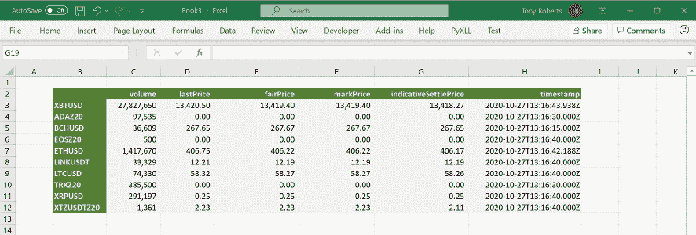
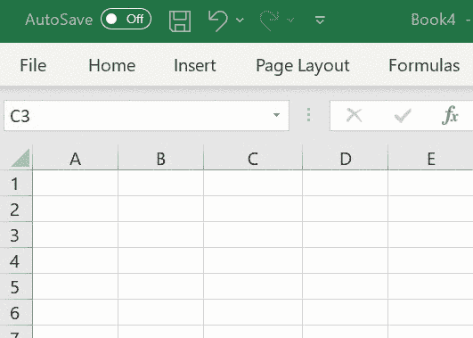

# Excel 中的实时加密价格

> 原文：<https://towardsdatascience.com/live-streaming-crypto-prices-in-excel-aaa41628bc53?source=collection_archive---------6----------------------->

## 了解如何将实时加密价格导入 Microsoft Excel

Excel 中的实时 BitMEX 价格。图片作者。

***注来自《走向数据科学》的编辑:*** *虽然我们允许独立作者根据我们的* [*规则和指导方针*](/questions-96667b06af5) *发表文章，但我们不认可每个作者的贡献。你不应该在没有寻求专业建议的情况下依赖一个作者的作品。详见我们的* [*读者术语*](/readers-terms-b5d780a700a4) *。*

交易加密货币可能是一个非常有趣和有益的活动。有许多不同的交易平台和交易所将提供 API 访问他们的数据，允许精明的交易者围绕自己的策略和交易需求构建自己的工具。

Microsoft Excel 是许多交易者的首选，因为它提供了巨大的潜力来创建定制工具和仪表板，以建立市场洞察力，用数据和想法进行测试和实验，以及监控投资组合表现和跟踪头寸。

更严肃的有技术头脑的交易者也会想用 Python 进行数据分析和回测交易策略，甚至建立系统化或自动化的交易策略。

大多数加密交换提供了一种通过 API 以编程方式从其平台获取数据的方法。这是我们用来将基于 Excel 或 Python 的工具连接到平台以获取数据和管理订单的工具。

*在本文中，我们将使用 BitMEX Python API 将实时价格导入 Microsoft Excel。*

要将实时 BitMEX 价格导入 Excel，您需要:

*   一个来自 www.bitmex.com T21 的 BitMEX 账户。
*   安装在你电脑上的 Python 3 来自 www.python.org 或其他 Python 发行版。
*   PyXLL，Python Excel 插件，来自 www.pyxll.com。这是一个商业产品，但你可以使用 30 天的免费试用。

首先，我们将编写 Python 代码来获取 Python 中的实时价格并进行测试。一旦成功，我们将使用 [PyXLL](https://www.pyxll.com/?utm_souce=medium) 从 Excel 调用 Python 代码。

为了通过 websockets 与 BitMEX API 对话，我们需要 Python " [websockets](https://pypi.org/project/websockets/) "包。打开命令提示符，使用 Python 包管理器“pip”通过运行“pip install websockets”来安装 websockets 包。

以下 Python 代码创建了一个到 BitMEX API 的 websocket 连接，订阅了对“ [XBTUSD](https://gist.github.com/tonyroberts/d5e9cc4bf6f512b2d3e2fd9097c088ac) ”工具的更新，然后等待消息返回并在消息到达时打印它们。有了这段代码，我们现在可以使用 Python 从 BitMEX 实时传输价格了！

您可以通过将此代码保存到名为“bitmex.py”的文件中，然后从命令提示符下运行“python bitmex.py”来运行它。对于开发 Python 代码，您会发现使用诸如 IDLE(安装 Python 时标配)或 PyCharm 之类的 Python IDE 更容易。

上面的代码展示了如何使用 websockets 包连接到 BitMex API，以接收 Python 中的价格更新。在我们可以在 Excel 中使用它之前，我们将对它稍加改进，以便我们可以“订阅”单个更新事件。

下面我们用“subscribe”方法定义一个类“BitMex”。使用它，我们可以订阅个人更新。BitMex 类将处理把它从 websockets API 接收的消息路由到已经订阅的每个符号和字段的相关回调。

在上面的“main”函数中，我们创建了一个“BitMex”类的实例，并订阅了对“XBTUSD”工具上“lastPrice”字段的更新。每当新的“lastPrice”事件发生时，就会调用回调并打印新的价格。

现在我们有了这个 BitMex 类，并且能够订阅特定的字段和符号，接下来我们将使用 PyXLL 将它公开给 Excel。这将使我们能够从 BitMEX 到 Excel 的实时流数据！

要使用上面用 Python 编写的代码，我们需要安装 PyXLL Excel 插件。你可以找到安装说明，并从 https://www.pyxll.com[下载插件。](https://www.pyxll.com?utm_source=medium)

一旦安装了 PyXLL，就可以通过编辑 pyxll.cfg 配置文件向其中添加自己的 Python 模块。我们将编写一个使用 [PyXLL 的实时数据特性](https://www.pyxll.com/docs/userguide/rtd.html?utm_source=medium)的新 Python 模块，你可以在这里阅读更多关于[的内容。](https://www.pyxll.com/docs/userguide/rtd.html?utm_source=medium)

我们用 pyxll 编写了一个 RTD 函数，方法是创建一个从“PyXLL”派生的新类。RTD”类，然后编写一个 Python 函数来返回它。Python 函数是使用 PyXLL 的“@xl_func”装饰器来装饰的，以将其公开为 Excel 函数。RTD 类有两个方法，“connect”和“disconnect ”,我们可以根据需要使用它们来订阅和取消订阅 BitMex 数据。当我们收到新的值时，我们更新 RTD 对象的“值”属性，这导致我们在 Excel 中看到的值更新。

通过将这个新的 Python 模块添加到 pyxll.cfg 配置文件中的“modules”列表，可以将它添加到我们的 PyXLL 外接程序中。包含这个模块的文件夹，以及我们之前写的 bitmex.py 模块，也需要在“pythonpath”上，这样 Python 才能导入它们。pythonpath 也可以在 pyxll.cfg 配置文件中设置。

当我们启动 Excel 或重新加载 PyXLL 插件时，这个新模块将被加载，我们可以从 Excel 调用“bitmex_rtd”函数。如果有任何问题，请检查 PyXLL 日志文件，看看哪里出错了。

现在在 Excel 中，我们可以像调用另一个 Excel 工作表函数一样调用新的“bitmex_rtd”函数。因为它是一个实时数据函数，所以每次通过 BitMEX websockets API 接收到对请求字段的更新时，该值都会继续更新。

=bitmex_rtd("XBTUSD "，" lastPrice ")

从 Excel 调用 bitmex_rtd Python 函数。图片作者。

许多加密平台和交易所以类似于 BitMEX 的方式提供 API 访问。我们可以使用上面显示的相同技术在 Python 中访问这些价格。PyXLL 在用于调用这些 API 的 Python 代码和 Excel 之间提供了一座优雅的桥梁。

我们不仅仅局限于获取如上所示的数据。大多数平台 API 也允许我们通过他们的 API 下订单。我们可以使用它来构建和集成用 Python 编写的定制交易应用程序，但使用 Excel 作为这些工具的接口。

Python 和 Excel 的结合为我们提供了现代和强大的编程语言的优点，并保持 Excel 作为灵活、直观的前端供我们使用。

# 参考

*   [PyXLL，Python Excel 插件](https://www.pyxll.com?utm_source=medium)
*   [BitMEX Websocket API](https://www.bitmex.com/app/wsAPI)
*   [Python Websockets 文档](https://websockets.readthedocs.io/en/stable/)
*   [GitHub 中的 Python 代码和电子表格](https://github.com/pyxll/pyxll-examples/tree/master/bitmex)
*   [Excel 中的实时加密价格(YouTube)](https://www.youtube.com/watch?v=v2ig4w9GVlo)