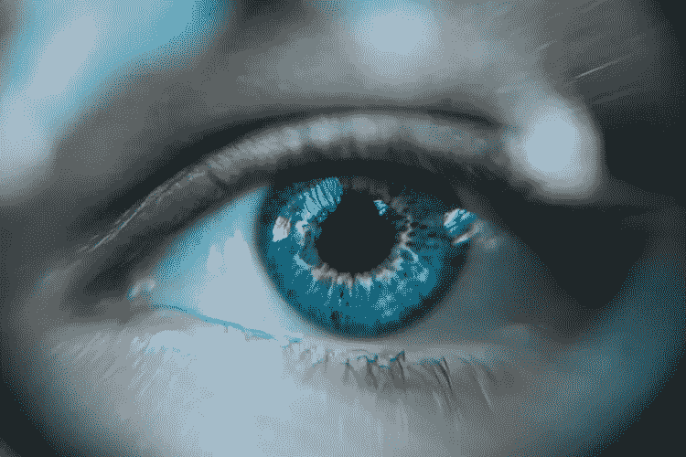
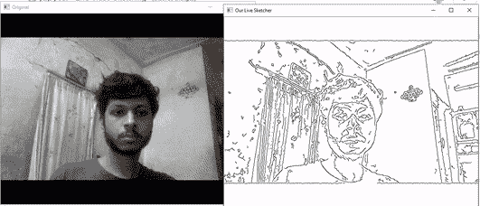

# 使用计算机视觉通过网络摄像头进行实时视频素描

> 原文：<https://towardsdatascience.com/live-video-sketching-through-webcam-using-computer-vision-30beed29f33e?source=collection_archive---------60----------------------->

## 实施计算机视觉模型，创建实时网络摄像头视频的实时视频草图。源代码用 python 编写，模型基于 OpenCV。

[**计算机视觉**](https://en.wikipedia.org/wiki/Computer_vision) 指的是 [**计算机科学**](https://en.wikipedia.org/wiki/Computer_science) 的一个领域，专注于使计算机能够像人脑一样看到、识别和处理图像。它是 [**人工智能**](https://en.wikipedia.org/wiki/Artificial_intelligence) 的一个分支，允许计算机从一组图像中提取有用的特征，对它们执行所需的操作并生成输出。



**图 1:计算机视觉** [**来源**](https://unsplash.com/photos/QRawWgV6gmo)

本文旨在实现一个计算机视觉模型，该模型生成一个网络摄像头的实时镜头的现场视频草图。该项目的完整源代码可在我的 [**Github repo**](https://github.com/kaushikjadhav01/Live-Video-Sketching-through-webcam-using-OpenCv-Python) 上获得。

# 安装所需的软件包

通过在命令提示符下运行以下命令，使用 pip 安装项目所需的所有软件包:

```
pip install opencv-python
pip install keras
pip install numpy
pip install matplotlib
```

# 实施模型

我们将把实现过程分为两部分。

第一部分包括定义一个函数，该函数将视频的单个帧作为输入，并生成一个草图图像帧作为输出。执行此操作的 **Python** 代码如下:

```
**import** **keras**
**import** **cv2**
**import** **numpy** **as** **np**
**import** **matplotlib
import** **cv2**
**import** **numpy** **as** **np**

*# Our sketch generating function*
**def** sketch(image):
    *# Convert image to grayscale*
    img_gray = cv2.cvtColor(image, cv2.COLOR_BGR2GRAY)

    *# Clean up image using Guassian Blur*
    img_gray_blur = cv2.GaussianBlur(img_gray, (5,5), 0)

    *# Extract edges*
    canny_edges = cv2.Canny(img_gray_blur, 30, 60)

    *# Do an invert binarize the image* 
    ret, mask = cv2.threshold(canny_edges, 240, 255, cv2.THRESH_BINARY_INV)

    **return** mask
```

首先，我们将视频的彩色图像帧转换成**灰度**。然后，我们使用 [**OpenCV**](https://opencv.org/) 的 **GaussianBlur()** 函数清理图像。最后，为了生成帧的草图，我们提取了 **canny 边缘**并在边缘上进行**反转二值化**操作。

第二部分包括将上述草图函数递归应用于网络摄像机视频的所有帧。执行此操作的 Python 代码如下:

```
cap = cv2.VideoCapture(0)
cap2 = cv2.VideoCapture(1)

**while** **True**:
    ret, frame = cap.read()
    ret1, frame1 = cap2.read()
    cv2.imshow('Original', (frame))
    cv2.imshow('Our Live Sketcher', sketch(frame))
    **if** cv2.waitKey(1) == 13: *#13 is the Enter Key*
        **break**

*# Release camera and close windows*
cap.release()
cap2.release()
cv2.destroyAllWindows()
```

如上面的代码片段所示，初始化两个 VideoCapture 对象:一个用于显示网络摄像机镜头，另一个用于显示实时视频草图。创建一个循环，当有人按下回车键时循环就会中断。在循环内部，获取两个 VideoCapture 对象的帧。将原始框架传递给草图函数，并显示原始框架和草图框架，直到循环中断。

# 结果和结论



**图 2:最终输出**

上图显示了模型的最终结果。我们可以看到，该模型成功地生成了网络摄像头视频的现场视频草图。

***请注意，视频性能因您的网络摄像头而异。为了提高性能，您可能希望在代码中使用 canny_edges 30、60 和二进制化 240 值。更改它们，使其适合您的网络摄像头。***

此外，我鼓励本文的读者自己尝试代码，以提高模型的精度。

如果你觉得这篇文章有用，请随意与他人分享。非常感谢您的阅读。

请随时在其他平台上与我联系:

github—[https://github.com/kaushikjadhav01](https://github.com/kaushikjadhav01)

LinkedIn—[https://www.linkedin.com/in/kaushikjadhav01/](https://www.linkedin.com/in/kaushikjadhav01/)

# 源代码

整个项目的源代码可以在我的[**Github repo**](https://github.com/kaushikjadhav01/Live-Video-Sketching-through-webcam-using-OpenCv-Python)**上找到。**随意用于教育目的。