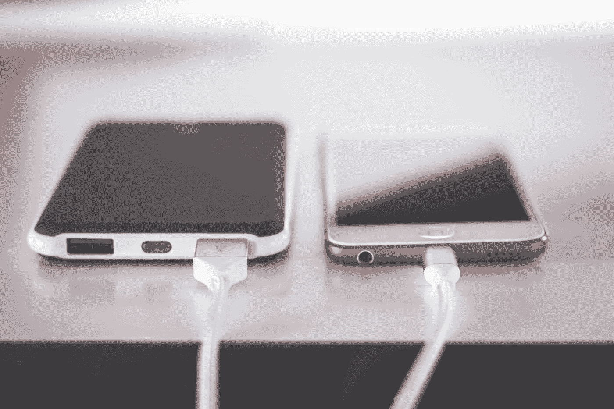

# 使用带有 ImageZMQ 的多部智能手机进行实时视频流传输

> 原文：<https://towardsdatascience.com/live-video-streaming-using-multiple-smartphones-with-imagezmq-e260bd081224?source=collection_archive---------19----------------------->

## 将您的旧智能手机回收到实时视频流网络中！



[斯蒂夫·约翰森](https://unsplash.com/@steve_j?utm_source=medium&utm_medium=referral)在 [Unsplash](https://unsplash.com?utm_source=medium&utm_medium=referral) 上拍照

# 介绍

最近，我一直在钻研计算机视觉。我对活体对象检测和对象跟踪特别感兴趣。然而，我意识到我需要我自己的现场视频流来测试我的项目。

第一个问题是，我没有任何外部网络摄像头可用。我有一台内置网络摄像头的笔记本电脑，但由于其尺寸和功耗的原因，将笔记本电脑设置为仅使用网络摄像头并不太实际。然而，我确实有相当多的备用智能手机，我不再使用了。

第二个问题是，我还需要一些东西，允许我通过网络将帧发送到远程服务器，那里有足够的处理能力来对每个视频流运行机器学习算法。这是一个重要的问题。我的笔记本电脑远远不够强大，无法在多个流上运行 YOLO 和深度排序之类的东西。

> 我可以用我的旧智能手机建立一个简单的相机网络吗？

起初，我使用 IP camera 应用程序和 OpenCV 成功地从一台设备通过网络传输视频。然而，当我尝试从多台设备上流式传输时，事情很快变得一团糟。还有性能问题，因为我没有异步处理帧。

在与 OpenCV 斗争了一段时间后，我偶然发现了一个由[杰夫·巴斯](https://medium.com/u/1fb3f201026a?source=post_page-----e260bd081224--------------------------------)为 Python 开发的惊人的库，名为 [ImageZMQ](https://github.com/jeffbass/imagezmq) 。它允许你用几行代码创建一个视频流网络！它被设计成运行在覆盆子馅饼上，但是我没有任何可用的。相反，我用我的笔记本电脑处理并通过网络发送智能手机上的帧。ImageZMQ 还显著提高了我的流性能。

如果你想开始研究计算机视觉，或者想回收你的旧智能手机来建立一个监控系统，我会说这是一个很好的起点。

## 为什么选择 ImageZMQ？

顾名思义，ImageZMQ 使用名为 **ZeroMQ** 的无代理异步消息传递库。

当涉及到实时视频流时，我们理想地想要尽可能低的延迟。异步处理允许我们实现更好的帧速率和延迟。对于较大的摄像机网络来说尤其如此。

也是无经纪的。这意味着运行的进程更少，并消除了代理瓶颈的可能性。这对于实时视频流尤为重要，因为我们需要高吞吐量和低延迟性能。

## 网络结构

[Adrian Rosebrock](https://medium.com/u/2b8f8f0c68a1?source=post_page-----e260bd081224--------------------------------) 发表了一篇[精彩文章](https://www.pyimagesearch.com/2019/04/15/live-video-streaming-over-network-with-opencv-and-imagezmq/)，深入介绍了如何使用配有 Pi 摄像头模块的 Raspberry Pis 建立一个带运动检测的监控网络。这对我来说是多余的，正如我之前所说的，我没有这些可用的。

相反，我使用了一些旧的智能手机，每部手机上都安装了 IP 摄像头应用程序。我把智能手机传到我的笔记本电脑上，在那里它们通过网络被重定向到一个中央服务器。如果你碰巧有一些覆盆子酱，那么我建议你先看阿德里安指南，而不是我的。

要做到这一点，我们需要设置多个客户机和一个服务器，作为中央处理中心。我们还需要在每部智能手机上安装一个 IP 摄像头应用程序。需要说明的是，我所有的智能手机都使用 Android 操作系统。如果你也在使用 Android，那么 Google Play 商店里有很多 IP 摄像头。就我个人而言，我一直在使用 [**IP 网络摄像头**](https://play.google.com/store/apps/details?id=com.pas.webcam&hl=en_GB) ，它提供了一些有用的视频设置。但我相信其他 IP 摄像头应用程序的工作方式也大致相同。

继续之前，请确保 Python 环境中安装了以下库:

*   `**imutils**` **，**
*   `**opencv-python**` **，**
*   `**socket**`，
*   当然还有`**imagezmq**`。

为了防止这些库出现任何问题，我使用 Python 3.6。我建议使用与我相同或更高版本的 Python。

# 服务器端

设置服务器来接收输入帧非常简单。如果您有使用 OpenCV 的经验，它应该看起来很熟悉。

## 图像中心

首先，我们需要导入 OpenCV 和 ImageZMQ。注意，当我们安装`opencv-python`时，我们将其导入为`cv2`。然后，我们需要使用 ImageZMQ 的`ImageHub`创建一个图像处理中心，它将接收和处理来自每个流的传入帧，这可以在一行中完成。

```
import cv2
import imagezmqimage_hub = imagezmq.ImageHub()
```

`ImageHub()`有两个额外的参数，您可以在其中使用。第一个参数是`open_port`，默认情况下在端口 5555 接受任何传入的 TCP 流量。第二个参数是`REQ_REP`，代表请求-回复，默认为`True`。这是一种 ZeroMQ 模式，在发送下一帧之前，客户端发送的每一帧都必须等待服务器的回复。如果我们将此设置为`False`，那么模式将改为发布-订阅模式。

对于我们的场景，我们希望有一台服务器来处理多个客户端发送给它的视频帧。发布-订阅模式要求每个客户机本身也是一个服务器，主处理中心订阅这些服务器中的每一个。这需要预先知道每个流的地址，所以这不是我们想要做的最实际的事情。因此，我们保留默认值并保持不变。

然而，Jeff 已经很好地解释了使用发布-订阅模式的好处。如果您有兴趣学习更多关于 ZeroMQ 模式的知识，那么我建议您阅读一下。

## 显示帧

下一步是创建一个循环，从每个流中提取每一帧，并相应地显示它们。这可以通过使用 while 循环和 OpenCV 的`imshow()`方法来完成，如下所示。

```
while True:  
    cam_id, frame = image_hub.recv_image()

    cv2.imshow(cam_id, frame)  

    cv2.waitKey(1)

    image_hub.send_reply(b'OK')
```

我们使用`recv_image()`对输入流进行解包，以获得每个视频流的帧以及每个摄像机设备的名称。

为了显示每个摄像机的帧，我们使用`cv2.imshow()`。最好的部分是，这种方法将自动分离和显示每个视频流的帧！然后我们需要`cv2.waitKey(1)`来允许每一帧在 1ms 后刷新。

最后，由于我们使用的是请求-回复模式，我们需要向客户端发送一条 OK 消息，让他们知道服务器已经成功接收并处理了该帧。然后，客户端将知道继续向服务器发送帧。

# 客户端

每个客户端的代码也非常简单。我们需要知道的唯一事情是，要向服务器发送帧，我们需要用正确的流路径和服务器地址配置每个客户端。

## 设置流

对于客户端，我们需要从 imutils 导入 ImageZMQ、socket 和`VideoStream()`方法。然后，我们使用`VideoStream()`从我们的相机捕捉帧。我们*本可以*使用 OpenCV 的`VideoCapture()` 来代替，但是 imutil 的`VideoStream()`将`picamera`模块与 OpenCV 结合起来，万一我们将来决定使用 Raspberry Pis，这是一个很好的选择。

```
from imutils.video import VideoStream
import imagezmq
import socket# change this to your stream address
path = "rtsp://192.168.1.70:8080//h264_ulaw.sdp"cap = VideoStream(path)
```

`path`应该是一个来自你的 IP 摄像头应用程序的链接。你可以通过打开智能手机上的应用程序很容易地找到这一点。

请注意，如果您通过路由器进行流式传输，地址可能会改变。你需要在路由器内给设备一个静态 IP 地址，否则如果你再次运行代码，它会中断你的数据流。

然后，我们需要使用 ImageZMQ 创建一个图像发送器，并为我们的相机命名。我们现在可以开始了。

```
# change this to your server address
sender = imagezmq.ImageSender(connect_to='tcp://localhost:5555') 

cam_id = socket.gethostname()stream = cap.start()
```

`ImageSender()`也有`REQ_REP`参数，但是如前所述，我们将其保留为`True`的默认值。我们只需要指定将帧发送到的服务器地址。在本例中，我在端口 5555 使用了 localhost，因为我是从同一台机器上流式传输的。例如，如果我们将数据流传输到云中的一个服务器，那么我们将用该机器的 IP 地址替换 localhost。这是假设服务器通过打开正确的端口(默认情况下是端口 5555)来允许流量。

我们还使用`socket.gethostname()`来获取我们正在传输的设备的名称。如果我们使用 Raspberry Pis，那么这是一种自动获取每个设备名称的简单方法。如果您只有几个设备，那么您可以手动将`cam_id`更改为简单的数字。

## 发送帧

为了发送帧，我们再次需要一个循环，从视频流中读取帧，然后使用前面的`ImageSender()`发送它们。

```
while True:
    frame = stream.read()
    sender.send_image(cam_id, frame)
```

…我们完成了！现在我们需要做的就是为每个设备创建一个客户端脚本，并确保为每个设备正确配置了`path`和`cam_id`变量。

# 把所有东西放在一起

一旦每个设备都准备好自己的客户端脚本和 IP 摄像机运行，确保流路径和服务器地址是正确的，然后启动服务器。只有服务器启动并运行后，设备才能开始发送帧。运行每个客户端，你应该能够看到每个单独的视频流出现在服务器端！