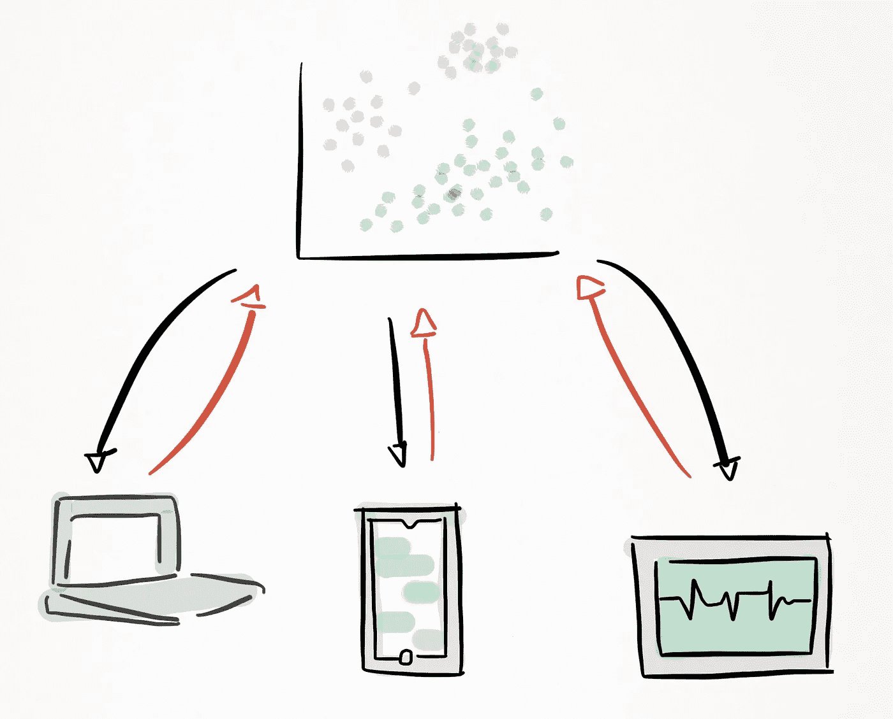
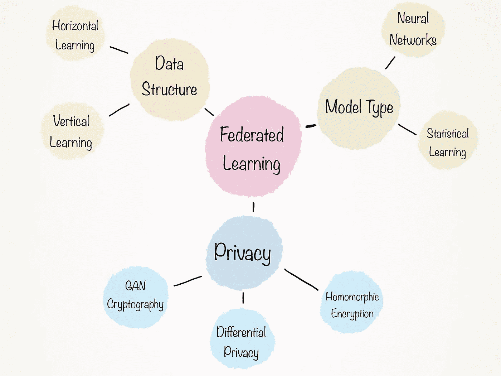
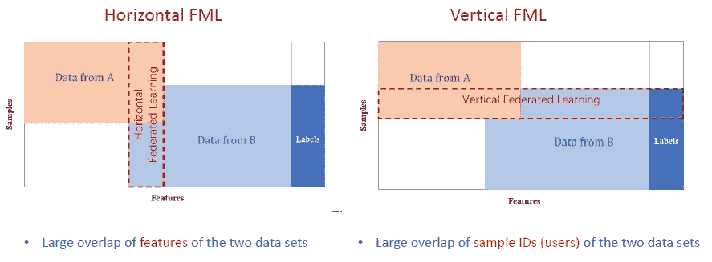

# 边缘生活和计算

> 原文：<https://towardsdatascience.com/living-and-computing-on-the-edge-a-brief-introduction-to-federated-learning-a3c07bda21c0?source=collection_archive---------33----------------------->

## 联邦学习简介

# 保护隐私的需要

对隐私的需求从未像现在这样迫切——在这个时代，数据的价值被比作石油，并被视为个人最重要的资产。个人生成的数据类型从看似无害的细节(如零售偏好)到高度敏感的信息(如医疗记录),甚至是可能并已经影响全国大选的政治观点[1]。

对于这种提高数据安全性的呼吁，一个可能的答案是开发保护隐私的机器学习，也称为联邦学习，这种答案越来越受欢迎。在高层次上，联邦学习是一种机器学习方法，它以协作方式训练模型，旨在通过使用差异隐私和分散数据来防止数据泄漏。因此，联合学习允许个人数据保持匿名，同时帮助建立强大的模型[2]。

最简单地说，联合学习不是将你的数据发送给第三方，而是将模型带到你的数据中，同时加密每一步。

# 机器学习的未来是协作

隐私不是联邦学习用来解决的唯一问题；它还消除了目前阻碍我们建立更精确模型的障碍。其中一个问题是，没有一个中央数据源来提取训练这些模型所需的所有数据。一系列数据类型——通常分布在各个机构——将被要求训练一个描绘整体图景的模型。例如，为了捕捉个人的财务状况并提供洞察力，必须根据在多家银行和信贷服务、在线零售行为和支付习惯中发现的数据来训练模型。更为复杂的是，同一公司不同部门之间的数据传输可能会面临管理或隐私相关的问题。

联合学习为每个人都拥有不同拼图的各方带来了合作训练模型的机会，这些模型比基于单一数据源训练的模型更准确。

# **引擎盖下的联邦学习**

高层次的联合学习可以用三个步骤来描述:

1.  共享的全局机器学习模型根据可用数据进行训练，并部署在分散的平台上。
2.  该模型被下载到边缘设备上，该设备可以是智能手机、笔记本电脑或其他智能设备，然后该设备使用其包含的数据更新该模型。
3.  更新(例如计算出的梯度)被加密并发送回服务器，在服务器中，来自多个设备的更新被平均并用于改进主共享模型。
4.  共享模型然后由边缘设备下载，有益于模型的数据贡献者和管理者。

这些步骤确保每个数据源的偏差都被考虑在内，并准确地说明问题的全貌。例如，根据来自世界各地卫生机构的心脏病数据训练一个联合模型可以消除根据一个国家的国内数据训练的模型中发现的种族和性别偏见[3]。

# **联合学习的组成部分一览**

我创建了一个图表来说明在非常高的层次上组成联合学习的各种元素:

有三点构成了联邦学习的基础:隐私、数据结构和模型类型。随着新的研究不断改变景观，增加复杂性，增加深度，这些点进一步分支。

1.  **隐私** —隐私是联合学习最重要的方面。无论数据的提供者是公司还是个人，隐私保护都会促进协作中的信任，保护敏感数据，并确保个人的合法权利。

    *本文不会深入探讨这些话题，因此我链接了一篇文章来深入探讨每一个话题。* [差分隐私](https://medium.com/@thegeekjournal/what-is-differential-privacy-38cb90aa0824?)[同态加密](https://medium.com/privacy-preserving-natural-language-processing/homomorphic-encryption-for-beginners-a-practical-guide-part-1-b8f26d03a98a)[GAN 密码术](/adversarial-neural-cryptography-can-solve-the-biggest-friction-point-in-modern-ai-cc13b337f969)
2.  **数据结构** —联合学习根据模型训练的数据结构进行分类。有三种类型的数据结构类别:水平联合学习、垂直联合学习和迁移学习(在以后的文章中会有更多介绍)。这些结构描述了数据是如何组织的，特别是数据集是否共享相同的特征空间，或者它们是否共享相同的样本。这两个描述分别指横向和纵向学习。
3.  **模型类型** —简单来说就是被训练的模型是神经网络还是统计学习模型。这将取决于数据类型、数据量和期望的预测结果。

联邦学习数据结构图[4]。

# 未来方向

虽然联合学习可能成为涉及跨多个设备的大量数据的问题的解决方案，但一些障碍仍然存在。

1.  **资源瓶颈—** 这些问题包括连接的物联网设备在一轮培训中电池寿命不同的情况，这可能会导致一些设备退出。通信差异(如设备连接到 wifi、3G 或 4G 网络的能力)会影响网络。最后，网络上不同设备的硬件规格(如内存和 CPU)可能有所不同。
2.  **数据差异—** 每台设备上的数据在质量、数量和一致性方面都会有所不同。例如，如果为面部识别收集图像数据，那么图片中的照明、面部的多样性以及贡献的数据量将影响本地训练的模型。这些局部模型在质量上会有很大差异，最终会影响全局模型的整体质量和准确性。

# 参考

1.  [https://www . nytimes . com/2018/04/04/us/politics/Cambridge-analytic a-smoke-fallout . html](https://www.nytimes.com/2018/04/04/us/politics/cambridge-analytica-scandal-fallout.html)
2.  联合学习:没有集中训练数据的协作机器学习。Google AI 博客，Brendan McMahan 和 Daniel Ramage，2017 年 4 月 6 日。[https://ai . Google blog . com/2017/04/federated-learning-collaborative . html](https://ai.googleblog.com/2017/04/federated-learning-collaborative.html)
3.  Carnethon，M. R .，Pu，j .，Howard，g .，Albert，M. A .，Anderson，C. A. M .，… Yancy，C. W. (2017)。非裔美国人的心血管健康:美国心脏协会的科学声明。循环，136(21)。[https://doi.org/10.1161/cir.0000000000000534](https://doi.org/10.1161/cir.0000000000000534)
4.  杨强，，，陈，童永新。2019.联邦机器学习:概念和应用。ACM Trans 智能。系统。Technol.10，2，第 12 条(2019 年 2 月)，19 页。[https://doi.org/0000001.0000001](https://doi.org/0000001.0000001)