# 在 AWS Lambda 上加载大型空间模型

> 原文：<https://towardsdatascience.com/load-a-large-spacy-model-on-aws-lambda-e1999e5e24b5?source=collection_archive---------18----------------------->

## 使用 spaCy 和 AWS Lambda 的无服务器 NLP


保罗·塞尚/来自[维基媒体](https://commons.wikimedia.org/wiki/File:Paul_Cezanne_Apples_and_Oranges.jpg)的公共领域

spaCy 是一个有用的工具，它允许我们执行许多自然语言处理任务。当将 spaCy 集成到现有的应用程序中时，使用 AWS Lambda 和 API Gateway 将其作为 API 提供会很方便。然而，由于 [Lambda 的限制](https://docs.aws.amazon.com/lambda/latest/dg/gettingstarted-limits.html)，很难部署大型模型。

在本文中，我将向您展示如何使用最近发布的特性[部署 spaCy，以便在 AWS Lambda](https://aws.amazon.com/jp/blogs/aws/new-a-shared-file-system-for-your-lambda-functions/) 上挂载弹性文件系统(EFS)。通过使用这个特性，我们可以将一个大尺寸的模型存储到 EFS，并从 Lambda 函数中加载它。具体来说，可以加载比 Lambda 的`/tmp` (512MB)中可用空间更大的数据。

整体架构如下。Lambda 在 Lambda 层上加载 spaCy 包。EFS 商店的空间模型。Lambda 然后从 EFS 加载模型。为了实现冗余，四个子网位于两个不同的可用性区域。

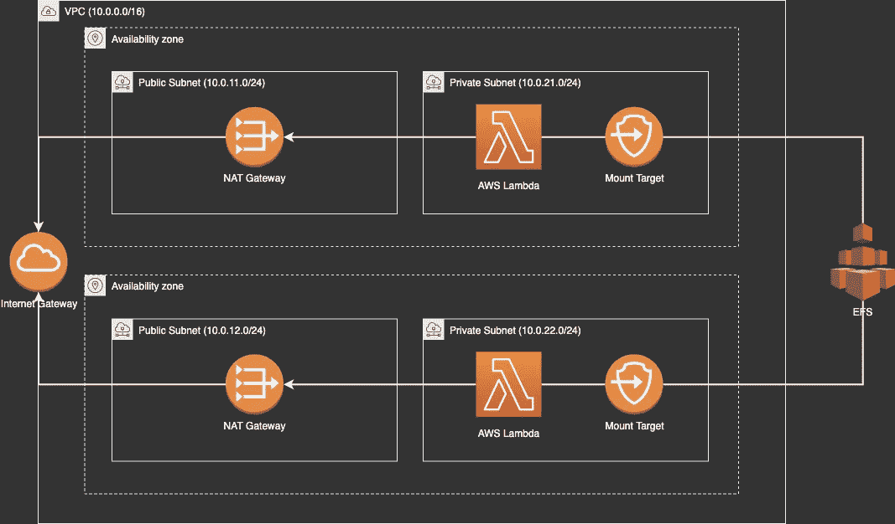

要求:

*   码头工人
*   AWS CLI

# 创建 VPC 和子网

首先，我们必须配置可以到达 EFS 山目标的 VPC。在这里，我们创建了一个 VPC、一个 internet 网关、两个 NAT 网关和四个子网(两个公有，两个私有)。

在 VPC 控制台中，我选择**创建 VPC** 并设置一个**名称标签**和 **IPv4 CIDR 块**，如下所示:

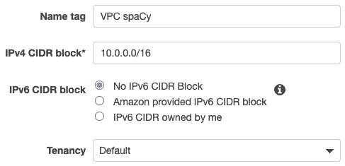

在下一步中，我将创建一个 internet 网关，通过以下设置从 VPC 连接 Internet。之后，我将它附加到创建的 VPC 上。

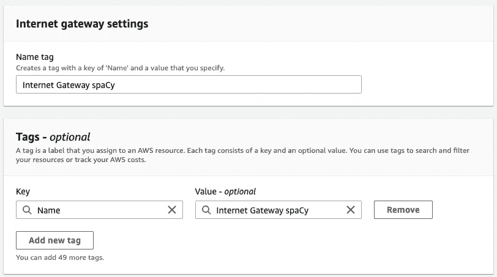

在下一步中，我使用以下设置创建了四个子网( *public-spacy-1、public-spacy-2、private-spacy-1、private-spacy-2* )。注意 *public-spacy-1* 和 *private-spacy-1* 具有相同的可用区域。

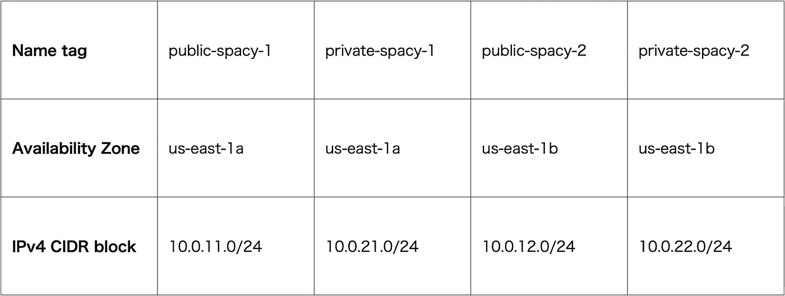

然后，我创建了两个 NAT 网关，并将其连接到公共子网，以便从私有子网中的 lambda 函数访问互联网。我给 NAT 网关起了名字: **NAT 空间 1** 和 **NAT 空间 2** 。

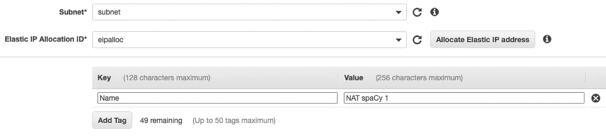

最后，我创建路由表。对于公共子网，我添加一个目的地 **0.0.0.0/0** 和一个目标**互联网网关**来访问互联网。对于私有子网，我为 **private-spacy-1** 添加了目的地 **0.0.0.0/0** 和目标 **NAT spaCy 1** ，为 **private-spacy-2** 添加了 **NAT spaCy 2** 。

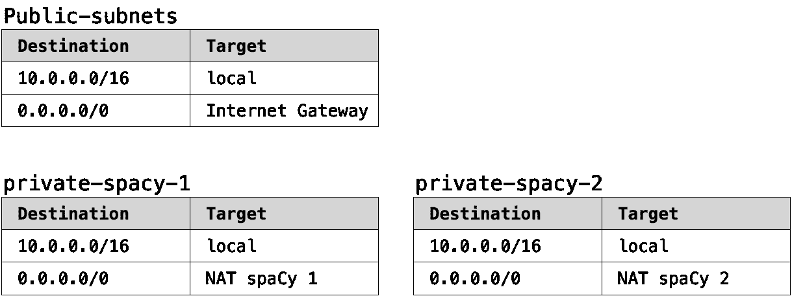

# 创建弹性文件系统

在 EFS 控制台中，我选择**创建文件系统**并确保默认的 VPC 及其子网被选中。对于所有子网，我使用一个安全组，它允许网络访问 VPC 中的其他资源。为了简单起见，我设置了一个允许所有流量的安全组。

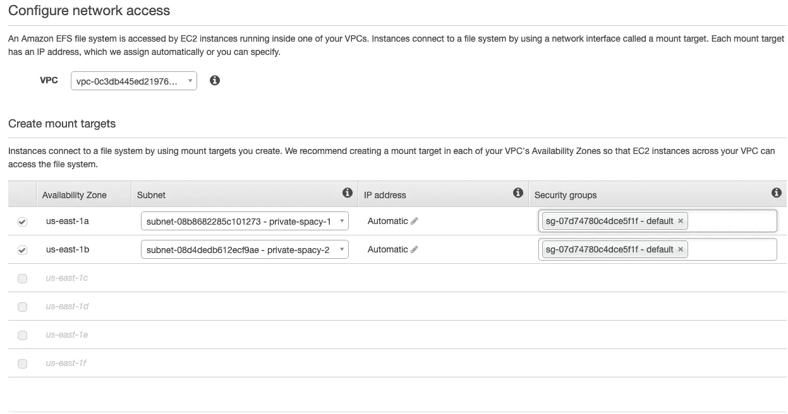

下一步，我给文件系统一个**名称**标签，并选择**下一步**。

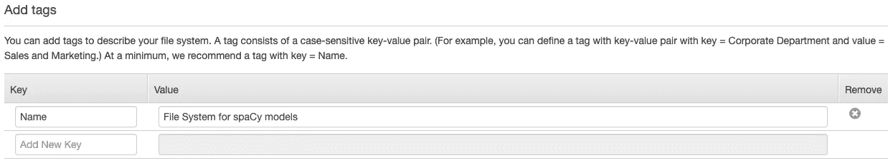

然后，我选择**添加接入点**。我用`1001`表示`User ID, Group ID, Owner User ID and Owner Group ID`，用`750`表示权限。另外，我限制了对`/models`路径的访问。

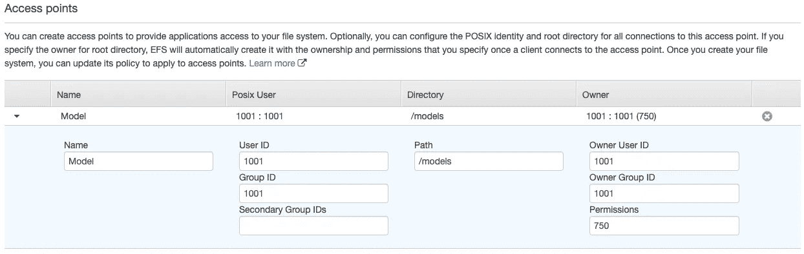

EFS 的创作完成了。让我们进入下一步。

# 将空间发布到 Lambda 图层

下一步，我们将空间发布为 Lambda 图层。我们必须做到以下几点:

*   安装空间
*   将其压缩为 Zip 文件
*   将文件发布到 Lambda 层

为了简单起见，我准备了以下 shell 脚本:

你只需要像`sh publish_spacy_as_lambda_layer.sh`一样执行它。

# 创建 Lambda 函数

接下来，我们创建一个 Lambda 函数。在 Lambda 控制台中，创建一个函数并选择 Python 3.7 作为运行时。对于权限，选择一个附加了策略`AWSLambdaVPCAccessExecutionRole`和`AmazonElasticFileSystemClientReadWriteAccess`的角色。

创建函数后，我们设置 VPC 配置。这里，我们需要指定与我们为 EFS 装载点指定的相同的安全组和 VPC，并选择专用子网。

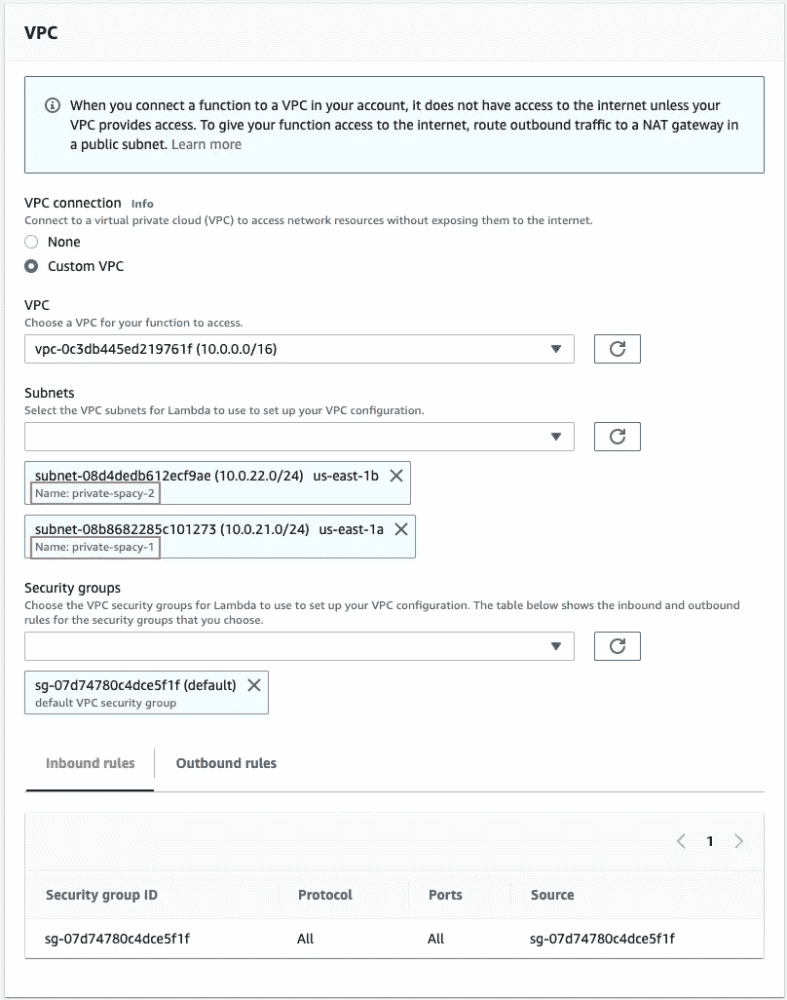

然后，我们选择**添加文件系统。**我们选择之前已经创建的 ESF 和接入点。这里，我们将`/mnt/models`设置为本地挂载点。这是安装接入点的路径，对应于 EFS 中的`/models`目录。

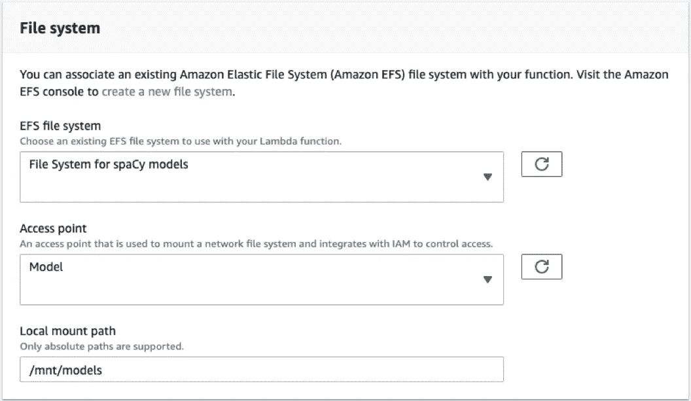

在图层部分，我们选择添加一个图层来添加空间。

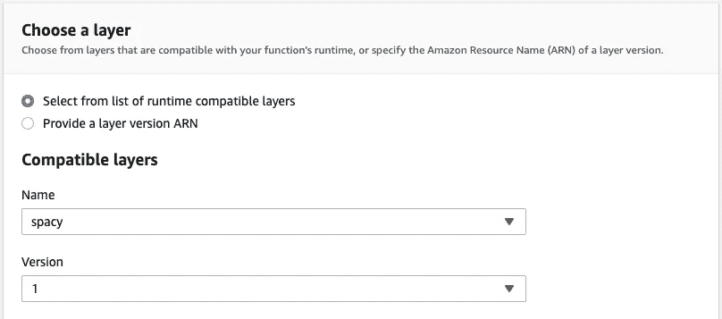

在函数编辑器中，复制并粘贴以下代码。

最后，我们应该增加内存分配和超时值。如果内存分配不够大，将会出现以下错误。

```
{
  "errorType": "Runtime.ExitError",
  "errorMessage": "RequestId: Error: Runtime exited with error: signal: killed"
}
```

作为测试，当我用数据`{"text": "He works at Google."}`测试时，会返回如下响应。

```
[
  {
    "text": "Google",
    "label": "ORG",
    "start": 12,
    "end": 18
  }
]
```

# 参考

*   [新 Lambda 函数的共享文件系统](https://aws.amazon.com/jp/blogs/aws/new-a-shared-file-system-for-your-lambda-functions/)
*   [AWSλ限值](https://docs.aws.amazon.com/lambda/latest/dg/gettingstarted-limits.html)
*   [云中的自然语言处理](https://blog.scottlogic.com/2019/05/11/spacy-ner.html)
*   [使用 Spacy 和 AWS Lambda 创建无服务器 NLP API](http://geoffpg.com/spacy-and-lambda/)