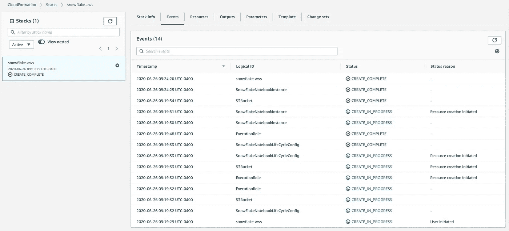

# 使用亚马逊 SageMaker 和雪花构建流失预测模型

> 原文：<https://towardsdatascience.com/load-customer-churn-data-to-snowflake-f271b2124a72?source=collection_archive---------16----------------------->

亨特·哈里特在 [Unsplash](https://unsplash.com?utm_source=medium&utm_medium=referral) 上的照片

## 一个展示如何使用 Sagemaker 从 Snowflake 中的销售和客户数据预测客户流失的设置。

雪花已经成为最受欢迎的数据仓库之一，可以用来构建您的分析堆栈。雪花的一个好处是，您可以轻松地将其与 BI 工具或托管机器学习模型等其他云服务相连接，以从您的数据中获得更好的洞察力。

亚马逊 SageMaker 是一项完全托管的服务，帮助公司在 AWS 上训练和部署机器学习模型。SageMaker 通过发送带有需要预测的数据的 HTTP 请求，使公司很容易根据模型进行预测。

在本文中，我们将展示如何使用存储在雪花中的关于客户和销售的历史数据，通过 SageMaker 来预测哪些客户会流失。通过分析这些预测的结果，你可以找到减少客户流失和预测未来业务表现的方法。

以下是我们的分解方式:

1.  理解数据
2.  设置我们的数据库并将数据加载到雪花中
3.  设置 SageMaker，然后构建、培训和部署我们的 SageMaker 模型
4.  在我们的模型上运行批量预测，并将数据发送回雪花进行分析

# 看一看数据

我们使用的数据集由移动运营商的历史记录信息组成，记录了最终用户和继续使用该服务的用户。这些数据是公开的，可以在加州大学欧文分校的机器学习数据集库中找到。

你可以从[这里](https://s3.console.aws.amazon.com/s3/buckets/snowflake-corp-se-workshop/sagemaker-snowflake-devdays-v1/sourcedata/?region=us-west-1)下载数据集。按照本教程，你应该解压缩下载的 zip 文件夹。

数据片段。最后一栏提到客户是否搅动。

这些数据描述了每个客户白天和晚上的语音邮件、消息、本地和国际电话的服务计划和使用统计。这种数据可能是您的业务在不同系统中孤立的，但是可以使用 ETL 进行集成。最后一栏提到客户是否搅动。稍后，我们将看到以这种方式构造的数据如何有助于训练机器学习模型。

这是一个相对较小的数据集，包含 3，333 条客户记录和描述每个客户资料的 21 个属性。最后一个称为 Churn 的属性是我们的目标属性。我们的目标是训练一个 ML 模型来预测目标属性。目标属性有两个值 True 或 False，因此这是一个二元分类任务。

# 将数据集加载到雪花

首先，登录到您的雪花 UI 并切换到工作表选项卡。

这些是我们准备数据库将采取的步骤。

1.  **为数据库&仓库**创建角色&权限

切换到帐户管理员角色。该角色拥有创建新角色的权限。创建一个名为 sagemaker_role 的角色。我们将使用此角色授予该项目的资源所有权限。我们还允许 sysadmin 角色拥有所有 sagemaker_role 特权。

**2。创建一个仓库，为查询数据库提供计算资源**

仓库被配置为在不使用时自动挂起，这样可以节省成本。我们还将仓库的所有特权授予 sagemaker_role。

**3。创建一个数据库来存储我们的数据集**

我们切换到 sysadmin 角色，因为它拥有创建数据库对象的权限。我们创建数据库，然后将默认公共模式上的所有特权授予 sagemaker_role。

**4。创建客户流失表来加载我们的数据**

我们首先将工作表的上下文设置为 ml_workshop 公共模式，并使用我们的 sagemaker_wh 仓库。我们还将表上的所有特权授予 sagemaker_role。

然后我们用上面定义的数据类型创建我们的表。

**5。为我们的数据集创建一个文件格式**

我们正在处理结构化的、逗号分隔的数据。我们从 S3 下载的文件没有标题。

**6。将数据加载到表格**

要将数据加载到 web UI 上的表中，我们必须使用加载数据向导，因为 web UI 上的工作表不支持某些雪花命令。要加载数据，切换到 databases 选项卡，单击 ml_workshop 数据库，然后单击 customer_churn 表。然后单击 load table 按钮，按照向导进行操作。确保使用正确的仓库和文件格式。

您的数据应该被加载。

现在，您可以在工作表上进行一些快速分析。尝试以下查询，为有语音邮件计划的客户获取各州的平均语音邮件消息。

**7。为外部服务创建一个新用户以连接到雪花**

在这里，我们创建一个名为 sagemaker 的新用户，并提供一个密码。记下密码，因为以后会用到它。Amazon Sagemaker 稍后将使用该用户连接到 Snowflake。我们将 sagemaker_role 及其所有特权授予 sagemaker 用户。

**8。为来自 Amazon Sagemaker** 的预测创建一个结果表

**9。为 Amazon Sagemaker** 的结果文件创建一个内部阶段

内部阶段将用于稍后在实验室中加载 Sagemaker 的预测结果。

第一部分到此结束。在下一部分中，我们将设置 Amazon SageMaker 来构建和部署模型。

# 在 AWS SageMaker 上部署客户流失预测模型

要开始使用 AWS SageMaker，我们需要在 AWS 上设置所有的依赖资源。其中包括 S3 存储桶、角色和权限以及 AWS Sagemaker 笔记本实例。S3 是一个数据湖。S3 存储桶可以被认为是云中的文件系统，允许您存储任何类型的文件。AWS Sagemaker 笔记本可以被视为一个编辑器和环境，允许我们编写代码来分析数据和训练模型。

我们将使用 cloudformation 模板部署我们需要的所有 AWS 资源。这是一个用 json 或 yaml 编写的文件，它包含关于我们想要部署的所有 AWS 资源以及这些资源的配置的信息。

首先，登录你的 AWS 账户，切换到 AWS Cloudformation 服务。然后转到堆栈并创建堆栈。我们将上传一个模板文件。[下载这个模板文件](https://gist.github.com/abizerjafferjee/921ec48fa5f7d23803fd4486ec425264)并从你的电脑上传为 yaml 文件。然后单击下一步，键入堆栈的名称和笔记本实例的名称。笔记本实例类型描述了 AWS 将为您的笔记本部署的服务器的大小。对于本教程，ml.t2.medium 就足够了，不应该花费您超过几美元。然后在向导中单击下一步，直到您可以确认堆栈创建。

我不会在这里详细讨论如何编写 cloudformation 模板。只需知道，您也可以通过在 AWS 控制台中分别访问 S3 和 AWS SageMaker 资源并按照向导进行操作来部署这些资源。

堆栈现在需要一些时间来部署所需的资源。完成后，您应该会在 stack events 选项卡中看到类似这样的内容。

在“输出”选项卡中，您应该会看到您的 S3 存储段名称。把它抄下来，因为我们以后会用到它。

切换到 Amazon SageMaker 服务并转到笔记本实例。您应该看到您的笔记本名称，单击“操作”下的“打开 Jupyter”以打开笔记本环境。点击 new，conda_python3 notebook，用 python3 环境打开一个笔记本。

接下来，我们将编写 python 代码来查询来自雪花数据仓库的数据，为训练和测试做准备，并训练一个分类模型。

1.  **导入所需库**

在 bucket 变量中，将占位符替换为您之前复制的 bucket 的名称。

**2。创建到雪花的连接**

现在，我们使用雪花连接器库创建一个到雪花帐户的连接，这样我们就可以查询所需的数据。为了创建连接

**3。从雪花**中查询数据

**4。准备建模数据**

我们略过了对选择训练属性的解释，因为本文的目的是展示构建模型的更高层次的过程。

我们删除了 phone 列，因为它有太多没有实际用途的独特值。此外，我们将区号转换为字符串，以将其转换为分类属性。接下来，我们看看属性之间的相关性。如果一对属性是高度相关的，我们从对中删除其中一个属性。

最后，我们通过将表转换为虚拟表，将每个属性从分类属性转换为数字属性。

**5。将数据分为训练集、测试集和验证集**

分割数据有助于我们避免过度拟合模型，并允许我们在尚未看到的验证数据上测试模型的准确性。

然后，我们将数据保存在笔记本的本地目录中，然后将数据上传到 S3。稍后，Sagemaker 模型将为数据寻找 S3 路径。

**6。训练模型**

既然我们已经准备好了数据，我们可以选择一个模型。在本教程中，我们将使用像 XGBoost 这样的梯度提升树算法来模拟这个问题。

这就是亚马逊 Sagemaker 的真正价值所在。它为各种模型提供容器，这些模型可用于训练模型，然后将模型作为端点托管，作为进行实时预测的端点。然后，可以通过 HTTP 请求向端点提供数据，以进行预测。

下面是我们为 xgboost 初始化容器的方法

然后，我们通过将 sagemaker 输入对象引用到我们保存培训和验证文件的 S3 位置来准备我们的 csv 数据输入。

接下来，我们准备我们的评估器，它将调用模型容器来适应训练数据。我们指定了一个输出模型的 S3 输出路径。并且，我们给出了模型的超参数。查看[此处](https://xgboost.readthedocs.io/en/latest/parameter.html)了解 xgboost 超参数。

**7。使用我们的模型预测原始数据的变动**

如前所述，Sagemaker 的模型端点通过接收同步 HTTP 请求来工作。但这次我们打算使用 Sagemaker batch transform，这是一种理想的方法，因为它可以从 S3 获取大量数据，而且更具成本效益。

首先，我们准备原始数据，并将其保存到 S3。

然后我们称之为批量转换作业。由于作业异步运行，我们将等待作业完成后再继续。转换作业会将输出保存到 s3uri_batch_output。

然后，我们将从 s3 加载输出数据，并存储在笔记本中，以便我们可以将它发送回雪花。

**8。将结果写入雪花**

现在，我们使用雪花连接器将结果文件从 notebook 实例加载到我们之前在雪花中创建的 ml_results 阶段。

仅此而已。我们和 sagemaker 玩完了。

# 回到雪花

首先，我们将数据从 ml_results 阶段复制到 ml_results 表中。

**让我们对我们的结果做一些分析**

根据 sagemaker 模型的预测，以下查询返回客户流失可能性最高的地理位置。

如果你想清理你的资源以避免成本。运行以下命令:

在 AWS 上，您首先必须删除您的 S3 存储桶。在 S3 控制台上，选择您的存储桶，然后单击删除。然后回到 cloudformation，选择你的栈，点击 delete。

# **就这样……**

客户流失分析和客户流失预测是众所周知的关键技术，有助于企业了解哪些是好的，哪些是不好的。不幸的是，企业并不总是有合适的数据基础设施来做好这种分析。在这里，我们向您展示了一个非常简单的设置，您可以在这里以低成本结合一些强大的云技术，让您的数据发挥作用，推动您的业务向前发展。

通过 [waterfront analytics](http://www.waterfrontanalytics.com) 联系我们，了解我们如何帮助您的企业。