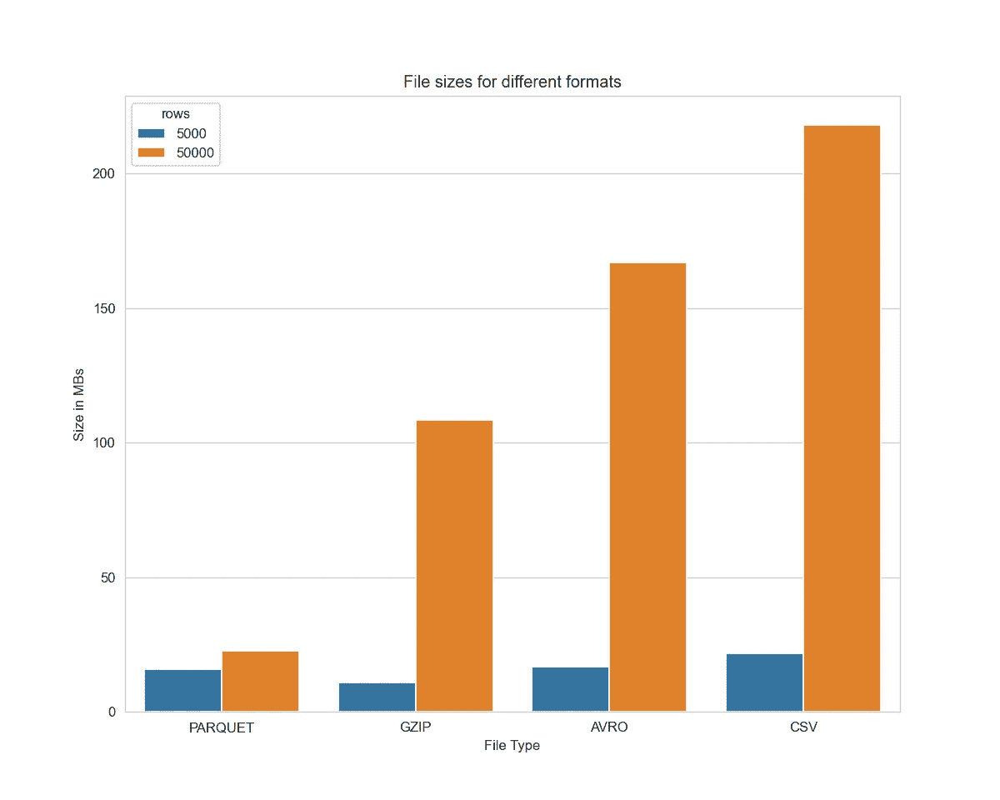
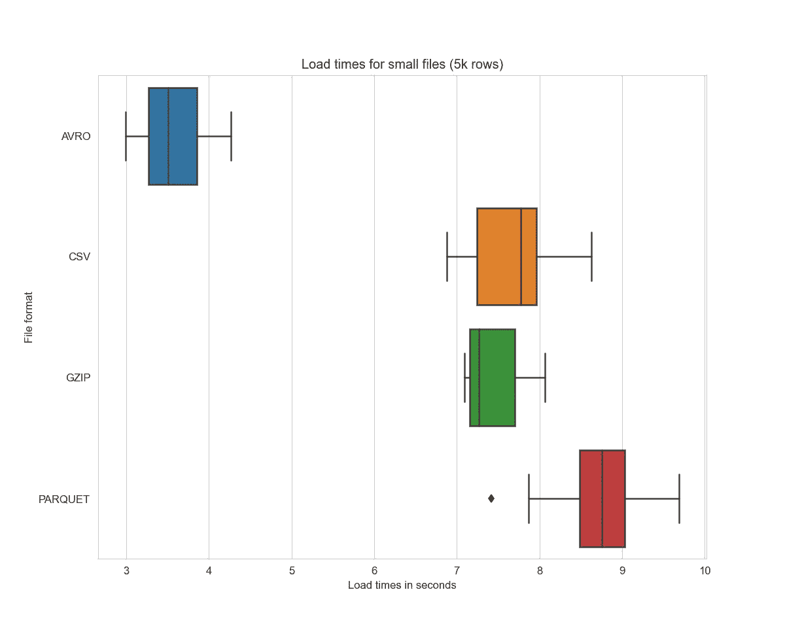
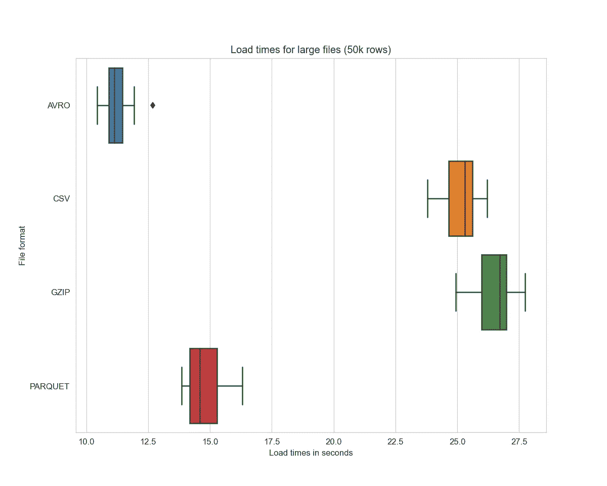
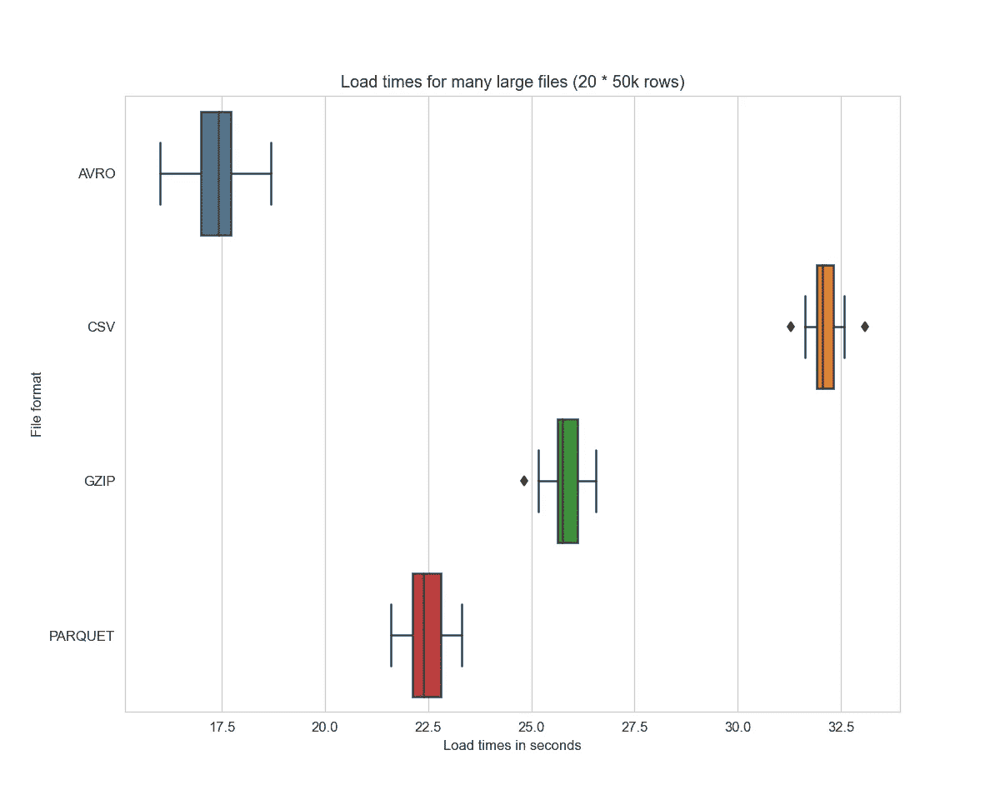
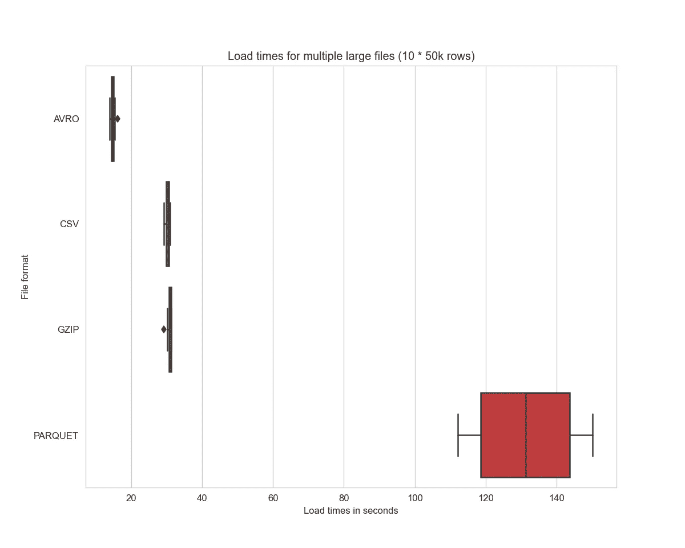

# 将文件更快地加载到 BigQuery 中

> 原文：<https://towardsdatascience.com/load-files-faster-into-bigquery-94355c4c086a?source=collection_archive---------10----------------------->

## 针对摄取的 CSV、GZIP、AVRO 和拼花文件类型进行基准测试

oogle 云平台的 BigQuery 是一个用于分析的托管大规模数据仓库。它支持 JSON、CSV、PARQUET、OCR 和 AVRO 文件格式来导入表格。这些文件类型各有利弊，我已经谈过为什么我更喜欢这里的数据科学工作流的[拼花](/loading-files-into-bigquery-6de1ff63df35)。但是还有一个问题:

*哪个文件扩展名能让我们最快地加载到 BigQuery 中？*

让我们希望我们的文件加载速度会比拍摄这张照片的速度更快……—照片由安德斯·吉尔登在 Unsplash 上拍摄

> 要获得所有媒体文章的完整访问权限，包括我的文章，请考虑在此订阅。

# 实验

> *由于 AVRO 压缩数据的方式，它推荐快速摄取时间，但是现在谁会相信文档呢？我想亲眼看看哪种文件格式会胜出。*

我很少使用 OCR，我在工作中主要使用 Python，这意味着我可以轻松地编写 CSV 和带压缩的拼花文件，所以我决定测试的文件类型列表是:

*   CSV —完全没有压缩的逗号分隔文件
*   CSV。GZIP——同上，但压缩了 GZIP。
*   PARQUET——一种柱状存储格式，压缩速度很快，熊猫本身就支持这种格式。
*   AVRO——GCP 推荐用于快速加载的二进制格式。

对于上述每种格式，我进行了 3 次实验:

*   导入小文件(5k 行)
*   导入大文件(50k 行)
*   导入大量较大的文件(20x50k 行)

为了模拟一个更真实的例子，我为列创建了一些不同的数据类型，以查看 BigQuery 如何处理它们。我使用了浮点数、整数、日期时间、高熵的长字符串和低熵的短字符串(每种数据类型有 50 列)。

# 创建数据

这是我想象中的数据挖掘工作——照片由[张秀坤·万尼](https://unsplash.com/@dominik_photography?utm_source=unsplash&utm_medium=referral&utm_content=creditCopyText)在 [Unsplash](/s/photos/mine?utm_source=unsplash&utm_medium=referral&utm_content=creditCopyText) 上拍摄

我总是更喜欢不需要你从互联网上获取数据的脚本，因为谁知道这些数据什么时候会消失，所以我决定使用`sklearn.datasets`模块来生成许多随机浮动列(250 个)并将它们转换成字符串、时间等。让我们开始吧:

*随意窃取上面的内容，用它来生成其他你喜欢的数据集。*

既然有了一个方便的小函数，那就来做一些文件吧。在撰写本文时，除了 AVRO 之外，我将在所有地方使用`pandas`,在`pandas`没有官方的 AVRO 支持😥。

我在这里通过重复小数据集在技术上作弊，但这就是生活…

现在，如果我的数学是正确的，我们应该有 8 个文件准备好发送到云。

# 比较文件大小

在我们开始将文件上传到 Google 云存储并将它们接收到 BigQuery 之前，让我们快速查看一下它们的大小。这将影响你在 GCS 中的上传时间和存储成本(但不是在 BigQuery 中！).我知道这听起来并不重要，但它确实很重要，所以*我懒得告诉你这些*——是的，我现在读了很多苏斯博士的书😃。

这些是漂亮的酒吧🍫：

这里需要注意一些重要的事情:

*   如果你还在使用拨号调制解调器或者你的宽带速度慢得像蜗牛，不要使用 CSV…
*   当谈到小文件时，看看 GZIP 和所有其他人相比是多么的小。
*   正如在 5k 行文件上看到的，PARQUET 的开销最大，但是当有重复数据时，它会逐列压缩表，因此存储重复值变得非常便宜。对于较大的文件，可以考虑使用拼花地板。

# 准备 GCP 环境

为快速加载做好准备——照片由 [Gabriel Alenius](https://unsplash.com/@gabrielalenius?utm_source=unsplash&utm_medium=referral&utm_content=creditCopyText) 在 [Unsplash](/s/photos/getting-dressed?utm_source=unsplash&utm_medium=referral&utm_content=creditCopyText) 上拍摄

下一步是创建一个存储桶，我们可以上传我们珍贵的小文件。

将 GCS bucket 和 BigQuery 实例设置在同一个区域非常重要——否则，BigQuery 将拒绝加载文件。我还为我的表设置了一个超时，因为我容易忘记事情，也不太热衷于为谷歌保存我的随机值表付费😆。

# 锤击 BigQuery

让我们回顾一下:

*   generated☑随机文件
*   储水桶创造了☑
*   大查询数据集已初始化☑
*   上传到 gcs 的文件

现在，我们只需将文件导入 BigQuery，看看谁会胜出。嗯，差不多了。问题是，由于网络流量和 BigQuery 执行的其他任务，文件摄取时间可能会有微小的变化，所以让我们将每个文件上传几次，看看它们平均起来如何，而不是只比较每个文件的一次摄取。Python 的功能提供了帮助:

在这里，我将文件复制到一个新位置(可选地，复制多次),然后创建`repeat`多个 BigQuery 表。这里需要注意的一个技巧是负载是异步的，所以首先我触发作业，然后用`job.result()`等待结果。

由于所有文件都有不同的格式，我们还需要创建一些不同的`JobConfig`,以便 BigQuery 知道如何处理它们。

让我们开始锤打🔨先处理小文件的 BigQuery:

结果并不令人惊讶。AVRO 名列前茅，而其他人都差不多，我猜是因为开销的原因，镶木地板落后了？

AVRO 速度很快。

我还用大文件重复了这个实验——代码在我的 GitHub 上。以下是大文件(50k 行)的结果:

拼花地板在这里做得更好，但远没有 AVRO 快。

为了让它更有趣，我重复了上面的步骤，但是每种文件类型有 20 个文件来模拟一些更大的工作负载。

从上面可以看出，对于较小的表格，文件格式并不重要。但是随着文件变得越来越大，您应该考虑使用内置压缩的格式。在实际工作负载中加载压缩的 GZIP 文件将比未压缩的 CSV 文件快得多，我假设这主要是由于文件的大小。

AVRO 加载时间确实令人印象深刻，几乎是 CSV 文件速度的两倍。

PARQUET 做得也不差，在大文件方面排在第二位。

# 烦恼😖

在进行这个实验时，我遇到了几件令我烦恼的事情。我在这里抱怨这些。

首先，为什么 BigQuery 和 Storage Python SDKs 不一致？要删除一个数据集，您可以使用`client.delete_dataset`，但是要删除一个存储桶，您必须使用`blob.delete`:

其次，当我为每种格式加载 10x 文件时，PARQUET 比其他任何格式都慢**很多**。奇怪的是，它比 20 倍拼花文件还慢。如果有人知道为什么(或者如果你在我的代码中发现了一个 bug)请在评论中告诉我。

加载 10x 文件产生奇怪的拼花结果

# 结论

AVRO 是最快的！如果需要尽快将文件加载到 BigQuery 中，可以使用 AVRO。但是，如果您在 GCP 之外生成文件(或者如果您需要在 GCS 上保存文件的副本)，请考虑使用 PARQUET，因为它的文件大小要小得多，加载速度也相对较快。

*以上所有代码可在* [*GitHub 这里*](https://github.com/niczky12/medium/blob/master/tech/bigquery/benchmarks/file_loads.py) *获得。*

*关于我写的更多 BigQuery，请查看我的文章《为什么我更喜欢拼花而不是 CSV:*

 [## 将文件加载到 BigQuery

### 使用 Python 将拼花和 CSV 文件导入 GCP BigQuery

towardsdatascience.com](/loading-files-into-bigquery-6de1ff63df35) 

*或者如果你想尝试一下，看看这篇关于如何用 BigQuery 免费计算斐波那契数的文章:*

 [## BigQuery 中的斐波那契数列

### 在 BigQuery 中使用用户定义的 JavaScript 函数来计算 Fibonacci

towardsdatascience.com](/fibonacci-series-with-user-defined-functions-in-bigquery-f72e3e360ce6)