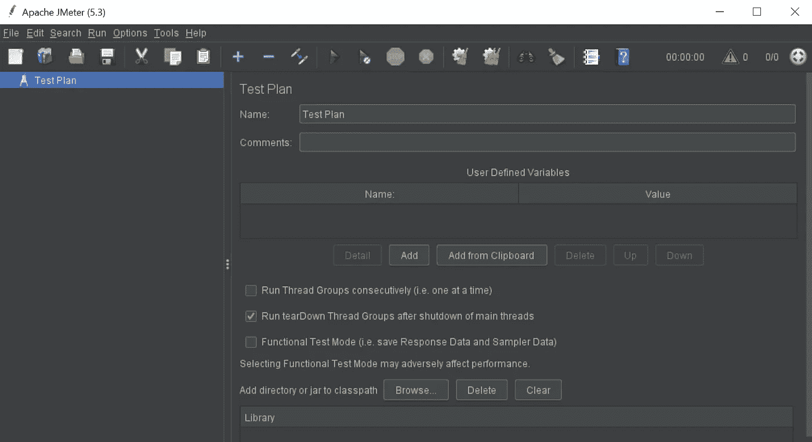
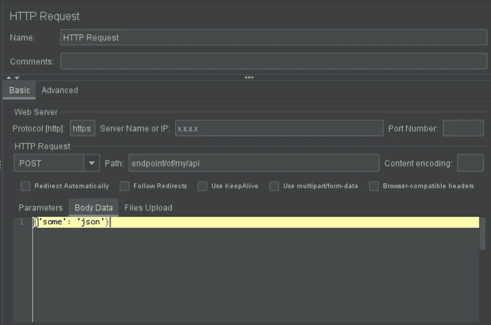
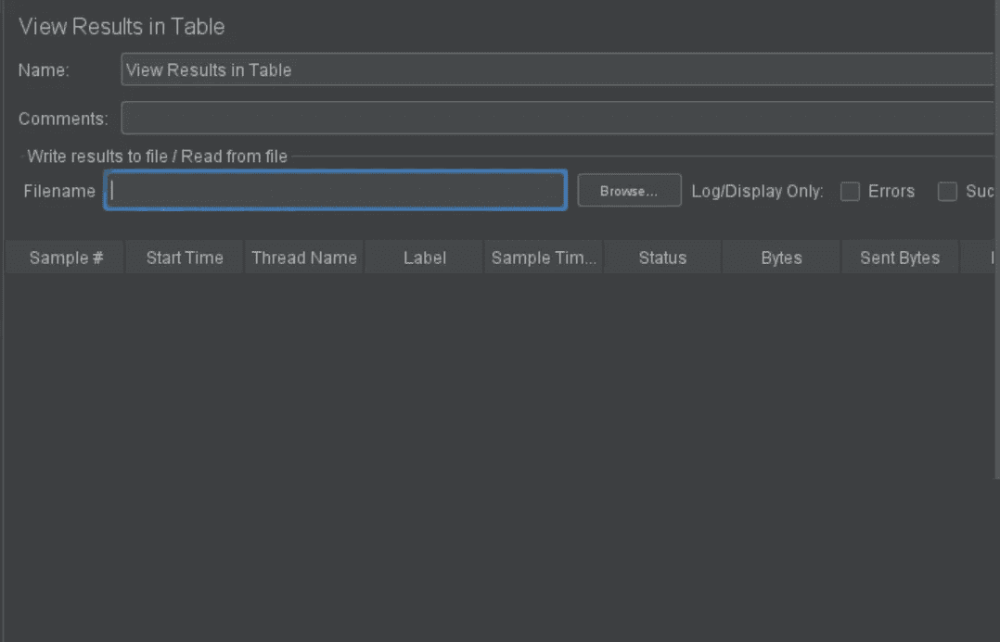
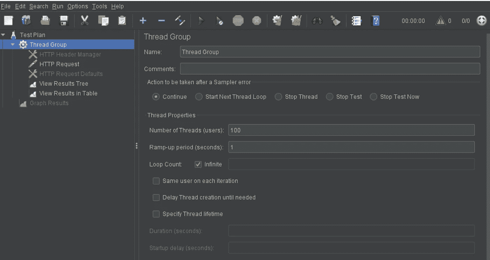

# 如何对实时管道进行负载测试？

> 原文：<https://towardsdatascience.com/load-testing-of-a-real-time-pipeline-d32475163285?source=collection_archive---------30----------------------->

## 借助 JMeter 对基于流水线的实时 AWS kine sis API 进行负载测试

[Icons8 团队](https://unsplash.com/@icons8?utm_source=unsplash&utm_medium=referral&utm_content=creditCopyText)在 [Unsplash](https://unsplash.com/s/photos/real-time-data?utm_source=unsplash&utm_medium=referral&utm_content=creditCopyText) 上的照片

所以，我在做一个实时管道，在设置好之后，我的下一步是它的负载测试，因为我还没有危险到可以马上生产它！

为我们在生产中遇到的问题默哀一分钟。

好了，一分钟结束了。回到用例，我期望我的管道平均每秒 100 条记录。此外，我想找到我的管道的阈值:在断裂之前它可以承受多少负载。

我用于负载测试的工具是，JMeter。我在作为测试人员的实习期间学会了如何使用 JMeter，作为一名大数据工程师，我能够再次应用所学的技能，这真是太神奇了。的确，知识从来不会浪费。

在更高的层次上，我的管道通过 API 接受输入，因此我的负载测试减少到 API 的负载，下面是我在简单步骤中所做的:

## 步骤 1:下载并安装 JMeter

目前我用的是 Windows 机(不要评判好吗？这都是因为这种 COVID 的情况，我无法访问我的笔记本电脑)。那么，下面是如何在我的 Windows 上进行设置的:
-安装& setup Java(如果还没有安装的话)
-从[下载 JMeter 到这里](http://jmeter.apache.org/download_jmeter.cgi)
-解压
-运行解压后的文件夹> bin > jmeter.bat
-瞧，GUI 将被启动。

启动后的 JMeter GUI

## 步骤 2:创建一个测试计划

*   通过点击 File > New 创建一个新的测试计划
*   右键单击测试计划>添加>线程(用户) >线程组

## 步骤 3:添加应用程序接口详细信息

*   右键单击线程组>添加>采样器> HTTP 请求
*   在“HTTP 请求”选项卡中，指定协议、服务器名称、HTTP 请求、端点和请求正文。如果需要，添加任何其他详细信息。它应该看起来像这样:

*   您还可以探索像 HTTP header manager、HTTP Request Defaults 这样的采样器，如果它适合您的用例的话。它们非常简单明了。

## 步骤 4:添加监听器

*   为了查看和记录负载测试的结果，我们需要添加一个侦听器。
*   右键单击线程组>添加>监听器>查看表中的结果

*   如果需要更多详细信息以及进行详细调试，可以类似地添加查看结果树侦听器。与 API 失败的情况一样，详细的响应对于调试非常有用。

## 步骤 5:设置负载测试指标

*   只需点击即可进入线程组选项卡。
*   添加线程属性，因为我希望在无限长的持续时间内(直到我停止测试)有 100/s 的负载，所以我做了这样的事情:

## 步骤 5:运行测试

*   按顶部的播放按钮运行测试。
*   如果设置成功，您将开始在 listeners:View Results Table/View Results Tree 中看到 API 响应。
*   如果没有，您可以通过工具栏中的选项>日志查看器来启用 JMeter 日志。日志显示在右下角。
*   这样，您就可以在系统上生成所需的测试负载。

## 需要注意的事项:

*   在从您的机器开始负载测试之前，请确保您可以访问 API。
*   大多数参数都是不言自明的，请参考文档以了解更多信息或各种用例。
*   尽管它对我的用例来说工作得很好，但是通常不推荐通过 GUI 进行负载测试。因此，如果您正在处理更高的负载，请参考非 GUI 模式下 JMeter 使用的文档。

测试愉快！！
*Ciao。*