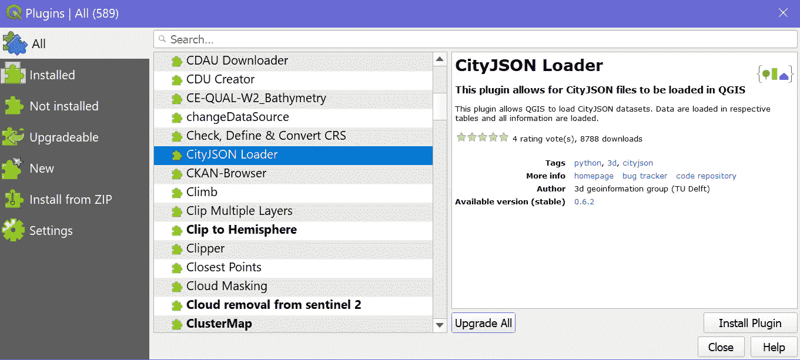
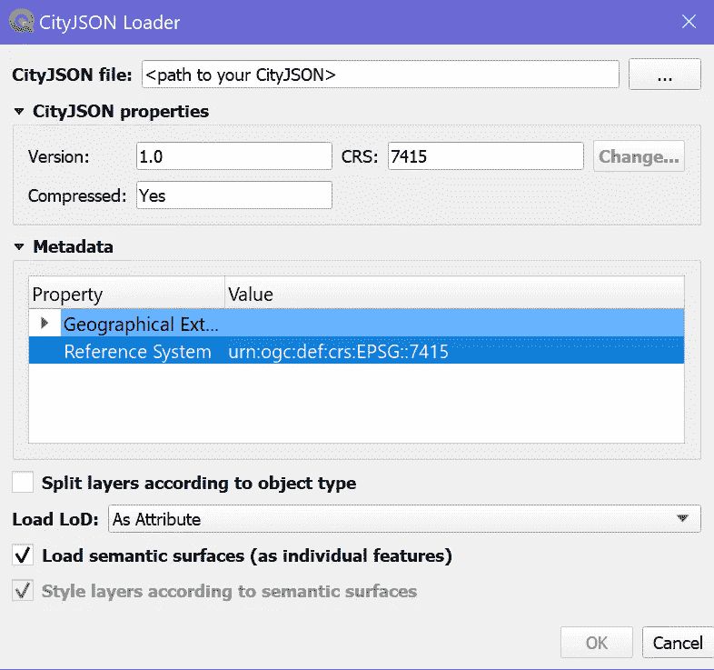
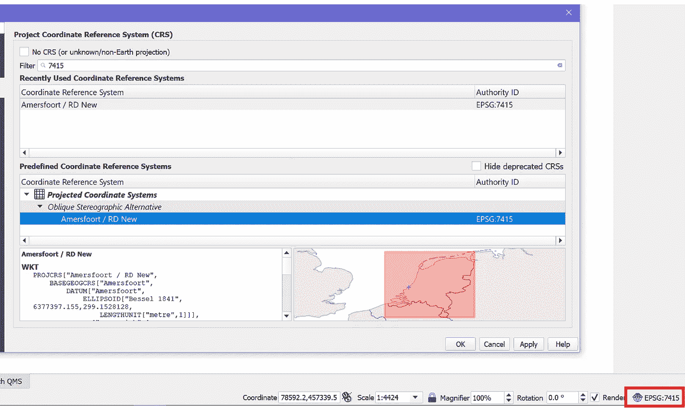
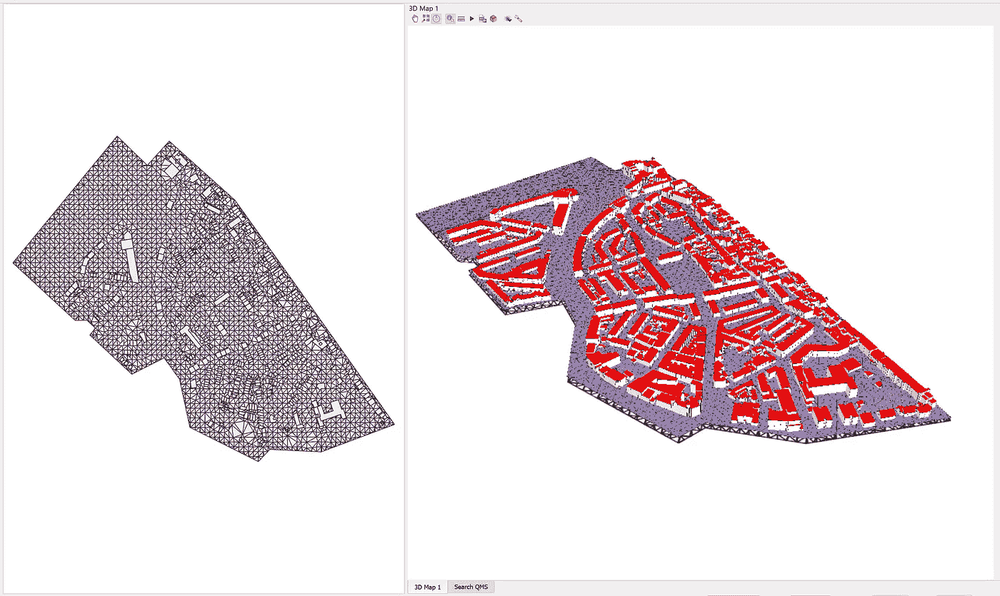

# 在 QGIS 中加载 3D 城市模型

> 原文：<https://towardsdatascience.com/loading-3d-city-models-in-qgis-46347a638760?source=collection_archive---------16----------------------->

## 利用 QGIS 开发 CityJSON 三维城市模型。


德文·艾弗里在 [Unsplash](https://unsplash.com?utm_source=medium&utm_medium=referral) 上的照片

在地理空间数据科学中，三维数据模型最近在研究和可视化项目中发挥了重要作用。QGIS 是每个 GIS 极客都知道的最流行的免费开源跨平台桌面 GIS 应用软件之一。从 QGIS 的 3.0 版本开始，单独的界面负责点云和数字高程模型的 3D 数据可视化。它被称为 3D 地图视图，可从视图快捷菜单中访问。

然而，建筑物或城市模型在 3D GIS 项目中可视化的通常方式是通过挤压建筑物覆盖区。这将导致细节级别为-1。2020 年，用于在 QGIS 中加载 CityJSON 3D 城市模型的 QGIS 插件已经开发完成[1]。因此，可以在更高的细节层次上可视化建筑模型。本文将通过一些例子介绍如何使用这个插件来加载 CityJSON 3D 城市模型。

# CityGML 和 CityJSON

在 3D 数据世界中，3D 城市模型已经用于许多应用领域，例如 3D 地籍、设施管理和应急响应。用于 3D 城市模型的最流行的数据模式之一是 OGC 城市 GML，其是用于描述 3D 地理空间使能的城市模型的全球数据模型；由 OGC(开放地理空间联盟)开发。然而，它是基于 GML 编码的，具有复杂的性质和较差的互操作性。出于这个原因，CityJSON 一直被开发为一种易于使用的 JavaScript 对象表示法(JSON)编码，用于使用 CityGML 2.0 数据模型的 3D 城市模型。

您可以查看[这篇文章](/open-source-3d-semantical-building-models-in-2020-f47c91f6cd97)以了解可用的开源 CityGML 数据集。

## 从 CityGML = >到 CityJSON

任何 CityGML 数据集都可以使用 **citygml 工具转换成 CityJSON 格式。**它是一个命令行实用程序，捆绑了几个处理 CityGML 文件的操作。(检查此[连杆](https://github.com/citygml4j/citygml-tools))

然后，您可以使用以下命令转换您的 CityGML 数据:

```
**$ citygml-tools to-cityjson /path/to/your/CityGML.gml**
```

# 正在 QGIS 中加载 CityJSON

## 安装 QGIS 和 CityJSON 加载器插件。

你可以从[这里](https://qgis.org/en/site/)下载并安装最新版本的 QGIS。然后打开插件窗口( *Plugins = >管理安装插件*)，找到 CityJSON 加载器。



**QGIS 软件中的插件窗口。**(作者)

## 加载并可视化 CityJSON

安装 CityJSON 加载程序后，您可以使用它来加载 CityJSON 文件。可以在矢量菜单*下找到(Vector =>city JSON Loader =>Load city JSON…)。*



**QGIS 软件中的 CityJSON 加载器插件窗口。**(作者)

例如，您可以尝试 CityJSON 格式的海牙 3D 城市模型的这个[数据集](https://3d.bk.tudelft.nl/opendata/cityjson/1.0/DenHaag_01.json)。加载 CityJSON 之前，请检查元数据中的 EPSG 代码，并设置项目坐标参考系统(CRS)以匹配数据集的 EPSG 代码，从而确保正确加载数据集。

您可以从 QGIS 窗口的右下角设置项目 CRS，如下图所示。



**在 QGIS 软件中设置项目 CRS。**(作者)

将 CityJSON 加载到 QGIS 项目后，您可以通过打开新的 3D 地图视图(*View =>New 3D Map View*[Ctrl+Alt+m])以 3D 方式对其进行可视化。下图是海牙 CityJSON [模型](https://3d.bk.tudelft.nl/opendata/cityjson/1.0/DenHaag_01.json)的一个例子。[~2.9 Mb]。



在 QGIS 软件中可视化的海牙城市 JSON 模型。(作者)

## 下一步？

在探索了 3D 城市模型之后，将 3D 城市模型用于现实世界的项目有很多可能性；举个例子，

*   [使用 3D 城市模型构建 3D 网络地图应用](/web-based-3d-data-visualization-with-ciytgml-city-models-f0796b37e9f5)
*   [探索更多开源 3D 城市模型](/open-source-3d-semantical-building-models-in-2020-f47c91f6cd97)。
*   [使用 QGIS & QuickOSM 从 OSM](/beginner-guide-to-download-the-openstreetmap-gis-data-24bbbba22a38) 下载开源数据。
*   或者说，你为什么不试着在 Unity3D 里把它和你的游戏项目融合起来呢？
*   而且，多得多！

# 结论

这篇短文介绍了 CityJSON3D 城市模型的轻量级 3D 城市模型编码，展示了如何在开源 GIS 桌面软件 QGIS 中可视化这些数据模型。我希望你喜欢这篇文章，并发现它对你的日常工作或项目有用。如果您有任何问题或意见，请随时给我留言。

关于我&查看我所有的博客内容:[链接](https://joets.medium.com/about-me-table-of-content-bc775e4f9dde)

安全**健康**和**健康**！💪

**感谢您的阅读。📚**

## 参考

[1] Stelios Vitalis，Ken Arroyo Ohori，Jan tien Stoter:**CityJSON in QGIS:开发一个开源插件**[https://doi.org/10.1111/tgis.12657](https://doi.org/10.1111/tgis.12657)(2020)。