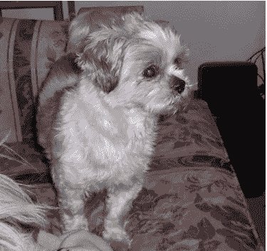
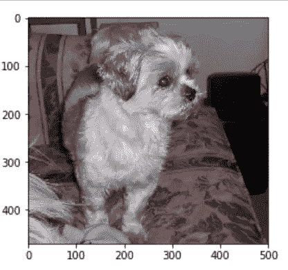

# 在 Python 中加载和保存图像

> 原文：<https://towardsdatascience.com/loading-and-saving-images-in-python-ba5a1f5058fb?source=collection_archive---------7----------------------->

## 使用 PIL、OpenCV 和 Matplotib 加载和保存图像的简单方法

## 先决条件:

安装 PIL、OpenCV 和 matplotlib 库。

## 在新窗口中使用 PIL 加载图像

***Show()在新窗口中加载图像***

```
**from PIL import Image
img_PIL = Image.open(r'\dogs-v-cats\dog.1.jpg')
img_PIL.show()**
```

## 使用 PIL 内嵌加载图像

***display()加载图像内嵌***

```
**from IPython.display import display
from PIL import Image
img_PIL = Image.open(r'\dogs-v-cats\dog.1.jpg')
display(img_PIL)**
```



## 使用 PIL 保存图像

您可以使用 PIL 的***【save()***将 JPEG 图像保存为类似 PNG 的不同格式

```
**img_PIL.save(r'\dogs-v-cats\dog.1.png')**
```

## 使用 OpenCV 加载图像

```
**import cv2
image_cv2= cv2.imread(r'\dogs-v-cats\dog.1.png')
cv2.imshow("Dog Image using OpenCV", image_cv2)
cv2.waitKey(0)
cv2.destroyAllWindows()**
```

***imread()读取图像。***

第一个参数是包含图像的路径。第二个参数是一个标志，它告诉我们应该如何读取图像。标志参数的选项是

*   cv2。IMREAD_COLOR 或 1:这是默认值，将加载彩色图像
*   cv2。im read _ gray 或 0:将加载灰度图像
*   cv2。IMREAD_UNCHANGED 或-1:加载图像，包括 alpha 通道。

***imshow()在窗口中显示图像***

第一个参数是窗口名称，第二个参数是图像。

***waitKey()是一个键盘绑定函数。***

如果您指定一个非 0 的数值，那么它将为任何键盘事件等待指定的毫秒数。如果你按任何键，那么程序将继续。如果将值指定为 0，那么它将无限期等待

***destroyAllWindows()将销毁所有创建的窗口。***

要销毁特定的窗口，可以使用***destroy window()***将窗口名传递给它

```
**import cv2**
**image_cv2= cv2.imread(r'\dogs-v-cats\dog.1.png')
cv2.imshow("Dog Image using OpenCV", image_cv2)**
**cv2.waitKey(6000)
cv2.destroyWindow("Dog Image using OpenCV")**
```

## 使用 OpenCV 保存图像

```
**result=cv2.imwrite(r'\dogs-v-cats\dog.100.png’, image_cv2)
if result==True:
  print(“File saved successfully”)
else:
  print(“Error in saving file”)**
```

***imwrite()将图像文件保存到指定路径*** 。第一个参数是要保存文件的路径，第二个参数是要保存的图像。

## 使用 matplotlib 加载图像

```
**import matplotlib.pyplot as plt
import matplotlib.image as mpimg
%matplotlib inline****image_mp= mpimg.imread(r'\dogs-v-cats\dog.1.jpg')
imgplot=plt.imshow(image_mp)
plt.plot()**
```

***matplotlib 的 imread()将指定路径的图像文件读入数组。*** 第二个参数是可选的，指定文件的格式，如“JPEG”或“PNG”。默认值为“PNG”。'

***matplotlib 的 imshow()将数据数组显示为图像***

您也可以使用 ***plt.show()*** 来显示图像

```
**import matplotlib.pyplot as plt
import matplotlib.image as mpimg
%matplotlib inline
image_mp= mpimg.imread(r'\dogs-v-cats\dog.1.jpg’, “JPG”)
imgplot=plt.imshow(image_mp)
plt.show()**
```



## 使用 matplotlib 保存图像文件

```
**plt.savefig(r'\dogs-v-cats\dog.2.png')**
```

***savefig()将当前图保存到指定文件***

## 结论:

Python 有几个库，如 OpenCV、PIL 和 matplotlib，可以用来加载和保存图像。在下一篇文章中，您将学习不同的图像处理技术，如旋转图像、去除图像噪声、裁剪图像、将 RGB 图像转换为灰度图像、增加图像的清晰度。

## 参考资料:

[](https://opencv-python-tutroals.readthedocs.io/en/latest/py_tutorials/py_gui/py_image_display/py_image_display.html) [## 图像入门— OpenCV-Python 教程 1 文档

### cv2.waitKey()是一个键盘绑定函数。它的参数是以毫秒为单位的时间。该功能等待…

opencv-python-tutro als . readthedocs . io](https://opencv-python-tutroals.readthedocs.io/en/latest/py_tutorials/py_gui/py_image_display/py_image_display.html) [](https://opencv-python-tutroals.readthedocs.io/en/latest/py_tutorials/py_imgproc/py_template_matching/py_template_matching.html) [## 模板匹配— OpenCV-Python 教程 1 文档

### 在这一章中，你将学习使用模板匹配在图像中查找对象，你将看到这些函数…

opencv-python-tutro als . readthedocs . io](https://opencv-python-tutroals.readthedocs.io/en/latest/py_tutorials/py_imgproc/py_template_matching/py_template_matching.html)