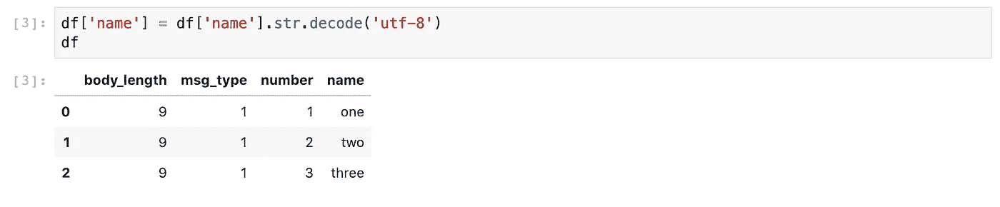

# 将二进制数据加载到 NumPy/Pandas

> 原文：<https://towardsdatascience.com/loading-binary-data-to-numpy-pandas-9caa03eb0672?source=collection_archive---------10----------------------->

## 如何有效地加载您的数据并返回分析！

图片由[皮克斯拜](https://pixabay.com/?utm_source=link-attribution&amp;utm_medium=referral&amp;utm_campaign=image&amp;utm_content=4791836)的 Gerd Altmann 提供

在现实世界中，数据并不总是打包在整洁、易于加载的文件中。有时，您的数据会以晦涩的二进制或不规则结构的文本格式存在，并且在没有任何高效的基于 Python 的加载器的情况下到达您的家门口。对于少量的数据，使用简单的原生 Python 组装一个定制加载器通常很容易。但是对于更大的数据，纯 Python 解决方案可能会变得慢得令人无法接受，此时，是时候投资构建更快的东西了。

在本文中，我将向您展示如何使用内置函数、C-API 和 Cython 的组合来快速、轻松地为 NumPy/Pandas 组装您自己的超快速定制数据加载器。首先，我们将回顾一个常用于存储二进制数据的通用结构，然后编写代码来加载一些样本数据。在这一过程中，我们将简要介绍 C-API 和 Python 缓冲协议，以便您理解所有部分是如何工作的。这里有很多，但是不要担心——这些都非常简单，我们将确保代码中最重要的部分是通用的和可重用的。你也可以带着工作笔记本[来这里](https://github.com/maierman/binbuffer)。当我们完成后，您将能够轻松地将代码调整到您特定的数据格式，并继续进行分析！

## 二进制数据格式

出于我们的目的，二进制数据文件只不过是一个大的字节数组，它编码了一系列数据元素，如整数、浮点数或字符数组。虽然二进制编码有多种格式，但一种常见的格式是由一系列背靠背存储的单个“记录”组成的。在每个记录中，第一个字节通常编码指定记录长度(以字节为单位)的标题，以及允许用户解码数据的其他标识信息。

通常，文件中会有多种记录类型，所有记录类型都有一个通用的标题格式。例如，来自汽车计算机的二进制数据可能有一种记录类型用于驾驶员控制，如制动踏板和方向盘位置，另一种记录类型用于记录发动机统计数据，如油耗和温度。

为了加载二进制数据，您需要参考二进制格式的文档，以准确了解字节如何编码数据。出于演示的目的，我们将使用如下所示的示例数据:

作者图片

在下一节中，我们将看到如何处理数据只包含单一记录类型的简单情况

## 加载具有单一记录类型的二进制数据

假设我们有一些具有上面给出的记录布局的数据，其中所有记录都有一个相同的 9 字节消息体:

*   前 4 个字节编码一个 32 位整数
*   接下来的 5 个字节编码一个字符数组

我们将首先把我们的数据加载到一个 NumPy 数组中，完成后，只需一行代码就可以创建一个 Pandas 数据帧。

这里唯一棘手的部分是 NumPy 数组只能保存单一类型的数据，而我们的数据同时包含整数和字符数组。幸运的是，numpy 允许我们用多个子组件定义结构化类型。所以我们要做的是构造一个 NumPy 数据类型，它与我们的二进制记录具有相同的结构。如果您想读取 NumPy dtype 文档，您可以在这里做[操作](https://numpy.org/devdocs/reference/arrays.dtypes.html)，但是指定 dtype 真的非常简单。下面是一个与我们的示例二进制数据格式相匹配的 dtype:

定义了我们的 dtype 后，我们可以继续用几行代码加载数据:

就是这样！再简单不过了，对吧？需要注意的一点是，我们的数据中的 *name* 列保存的是类型为`bytes`的对象。我们可能更愿意使用字符串，所以让我们使用 Series.str.decode()方法来完成从`bytes`到`str`对象的转换:

在上面的代码片段中，我们首先将二进制文件加载到一个字节数组中，然后用函数`[np.frombuffer](https://numpy.org/doc/stable/reference/generated/numpy.frombuffer.html)`创建了一个 NumPy 数组。或者，您可以通过使用函数`[np.fromfile](https://numpy.org/doc/stable/reference/generated/numpy.fromfile.html)`将这两个步骤结合起来，但是手动挖掘您的二进制数据并四处查看有时会很有用。如果你需要一个关于如何在 Python 中操作和查看字节数据的快速入门或复习，看看这个[笔记本](https://github.com/maierman/binbuffer/blob/master/WorkingWithBytes.ipynb)，我把它作为本文的快速教程参考。

## 多记录类型的二进制数据怎么办？

像上面那样加载数据非常容易，但不幸的是二进制数据通常没有这么好的结构。通常有许多不同的记录类型混合在一个文件中，我们需要一种方法将它们加载到一个或多个数据帧中。

这里的挑战是 NumPy 只知道如何加载以“简单”格式存储的二进制数据，其中数据存在于由背靠背堆叠的相同记录组成的连续内存块中。在上面的例子中，我们的数据只有一个固定长度的记录类型，这使得加载非常容易。

一般来说，为了将二进制数据加载到 NumPy，我们需要将它分成一个或多个同构数组，如下所示:

作者图片

完成上述分割的一种方法是编写一些预处理代码(选择您想要的任何语言)来将二进制数据分割成一个或多个文件。如果你走这条路，那么你可以简单地做你的预处理，然后像我们上面做的那样加载单独的文件。这种方法的缺点是，预处理会在磁盘上创建数据的多个副本，这不是很优雅，而且可能会很麻烦。

因此，我们将展示如何在 Cython 中设置内存数组，每个数组对应我们感兴趣的记录类型，并高效地用二进制记录填充它们，而不是写出单独的文件。然后，我们将通过使用 Python C-API 中的缓冲协议向 NumPy 公开这些数组。我们可以在原生 Python 中完成所有这些工作，但是我们将使用 Cython，因为我们希望我们的解决方案很快(二进制文件有时相当大)。

## Python C-API 和缓冲协议

Python C-API 是 Python 低级实现的入口。它允许程序员用 C/C++编写的代码来扩展 Python，也允许你将 Python 嵌入到其他编程语言中。不过，我们不需要了解太多关于 C-API 的知识。我们所需要的是对缓冲协议的高度理解。

[缓冲协议](https://docs.python.org/3/c-api/buffer.html)在 C-API 级别运行，定义了 Python 对象访问和共享彼此内存的方式。当我们在一个实现缓冲协议的对象上调用`np.frombuffer`时，NumPy 进入 C-API 并向该对象请求其内部内存的视图。如果成功，NumPy 将继续使用共享数据建立一个阵列。请注意，这里没有进行复制！在调用`np.frombuffer`之后，原始的缓冲区对象和 NumPy 数组共享同一个底层内存。该流程的简化版本如下所示:

作者图片

我们不直接使用 C-API，而是通过 Cython 与 C-API 进行交互，因为这比直接用 C/C++编写代码容易得多。正如您将看到的，从 Cython 实现缓冲协议也非常容易。

## 执行缓冲协议

Cython 是 Python 的扩展，是 Python 和 C/C++的结合。从 Cython 编译的代码通常比原生 Python 运行得快得多，并使您能够使用 C/C++库中的函数和类。我们不会在本文中介绍 Cython，但有许多介绍性教程——例如这里的和这里的。

幸运的是，实现 Cython 的缓冲协议非常容易。我们需要做的就是实现两个方法 __getbuffer__ 和 __releasebuffer__。在幕后，Cython 对这些进行了一些特殊的处理，以便它们能够正确地绑定到 C-API 中的对象，但我们不需要担心这一点。我们需要做的就是实现这两个方法，在我们的例子中它们都很简单。他们是这样做的:

**__getbuffer__(self，Py_buffer *，int)** 任何想要查看内存的消费者对象都会调用这个方法。它有两个参数:一个位标志的整数，一个指向 Py_buffer 类型的对象的指针，这是一个简单的 C 结构，包含我们需要填充的字段。这些标志表示消费者期望的数据格式的详细信息。在我们的例子中，我们只支持最简单的类型，即存储在连续内存块中的一维数据。因此，我们在 __getbuffer__ 中所要做的就是检查这些标志是否指示了一个简单的缓冲区，然后在 Py_buffer 结构中填充一些不言自明的字段(参见下面的代码)。

**__releasebuffer__(self，Py_buffer *)**_ _ release buffer _ _ 的作用是允许引用计数，这样我们的代码就知道什么时候可以释放和/或重新分配 Py _ buffer 结构中的内存。然而，NumPy 并不尊重这一点，并期望缓冲区即使在调用 __releasebuffer__ 之后也能保持它们的数据。所以在我们的例子中，我们实际上不需要做任何事情。

在 Jupyter 笔记本上使用 Cython 最简单的方法是首先加载 Cython，如下所示。您可能需要先 pip 安装 Cython。像往常一样，考虑使用虚拟环境。

接下来，在一个单独的单元格中输入 Cython 代码，以 IPython magic `%%cython -cplus.`开始。这里我们定义了一个类`SimplestBuffer`，它实现了缓冲协议，也可以在 Python 中使用。这个类是一个通用的可重用容器，它只保存二进制数据，并允许通过缓冲协议进行访问，以便 NumPy 可以共享数据。

有了我们闪亮的新类`SimplestBuffer`，我们可以像这样重做我们先前的例子:

如果你已经走到这一步，恭喜你！所有艰苦的工作都完成了。我们已经学习了如何将结构化的二进制数据加载到 NumPy 中，还使用 Cython 创建了一个可以通过`np.frombuffer`有效访问的数据容器。

## 加载具有多种记录类型的二进制数据

作为我们的最后一项任务，我们将使用 Cython 构建一个快速的数据解析函数`fan_bytes`,它专用于我们的二进制数据格式。该函数将输入的二进制数据作为一个字节数组和两个额外的`SimplestBuffer`对象。它使用一些简单的 C 指针算法来遍历我们的二进制文件，并根据 msg_type 的值将记录扇出到一个或另一个`SimplestBuffer`对象。如果文件中有任何 msg_type 不等于 1 或 2 的记录，这些记录将被跳过。注意，我们还在这个单元格中重复了 SimplestBuffer 定义，以便 Cython 可以找到它。

对于下一个例子，我已经设置了一些样本二进制数据，其中包含我们之前加载的相同记录，另外还有一些新记录，它们使用相同的头，但是消息体由四个 32 位整数组成。要查看新代码的运行情况，您可以这样做:

所以这就是进步！！！此时，我们已经成功地将包含混合记录类型的二进制文件加载到两个数据帧中，每个数据帧对应一种记录类型。

## 一些小的扩展

上面的代码是一个完整的工作示例，但是有一些改进可能是一个好主意。

首先，我们应该提高 SimplestBuffer 的内存安全性，这样当 NumPy 或 Pandas 共享内存时，底层内存就不会被重新分配。

其次，我们应该允许在缓冲区上预先分配内存，并允许直接从文件中读取字节。但是请注意，C++ vector 在重新分配内存方面已经相当高效了，对于从文件中读取，在处理之前将所有二进制数据读入一个中间缓冲区通常比在文件系统上进行许多小的读取更快。然而，这两个特性都很容易实现，并且可以加速。

最后，从 Cython 生成可加载的模块，而不是将所有的 Cython 放入 Jupyter 笔记本中，这通常是有用的。

为了节省空间，我们不会在这里展示这些改进的代码，但是看看前面提到的[笔记本](https://github.com/maierman/binbuffer/blob/master/SimpleBuffer.ipynb)，上面有所有例子和扩展的完整代码。

## 结束语

我希望你已经发现这个笔记本很有用，它可以帮助你加载二进制数据并返回分析！！！但是在结束之前，我想再补充几句。

**评估速度**:我们在这里没有做任何基准测试，但是在我的测试中，我发现使用上述方法加载二进制数据和从二进制文件中加载等价的数据帧一样快，有时甚至更快！然而，一个不太快的地方是使用`pd.Series.str.decode(‘utf-8’)`将字节数组转换成字符串。根据我的经验，这种转换通常是加载二进制数据最慢的部分。因此，您可能希望将部分或全部字符数据保留为字节数组，而不是转换为原生字符串对象。

**可变记录长度**:在这里的例子中，我们的记录类型都有固定的长度。但是在野外，二进制记录通常具有可变长度，这是因为记录中存在可变长度的字符数组或重复组。为了处理这种类型的记录，您必须将字符数组截断到某个固定长度，并找到一种方法来处理任何重复的组。上面的通用工具是你真正需要的，所以要意识到这是你可能不得不处理的事情，在你的情况下，想出适合你的解决方案是没有问题的。

**不规则结构的文本数据**:在本文中，我们主要关注二进制数据，但是我想指出的是，如果您有大量的不规则结构的文本数据，您可以使用这里演示的相同技术来有效地处理和加载您的数据。同样，只要找出一个作为数据帧的最终结构，然后编写一些 Cython 将文本文件解析到一个或多个缓冲区中，就像我们上面做的那样。

感谢您的阅读，如果您有任何意见或建议，请告诉我。