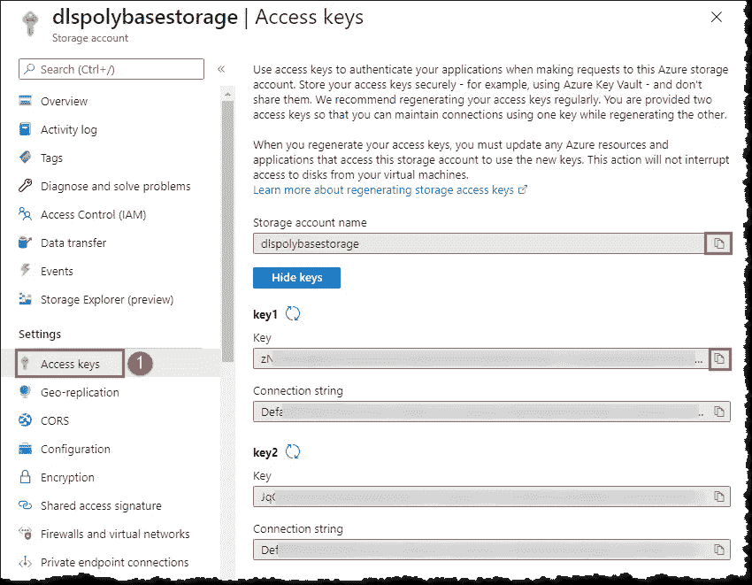
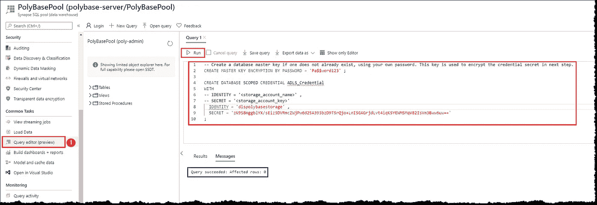
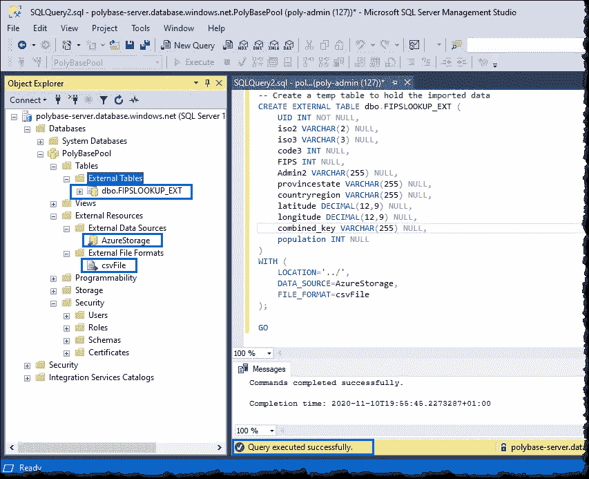
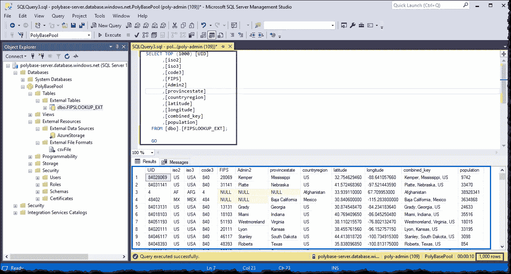
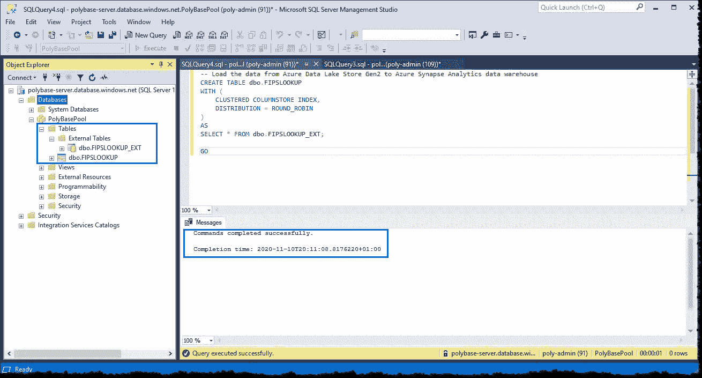
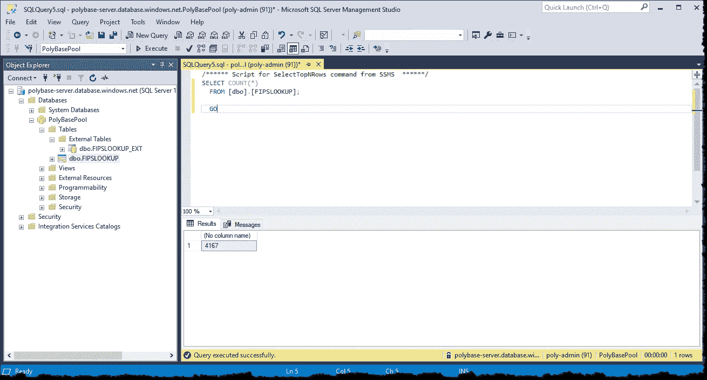

# 使用 PolyBase 将 CSV 数据加载到 Azure Synapse Analytics

> 原文：<https://towardsdatascience.com/loading-csv-data-into-azure-synapse-analytics-by-using-polybase-5ae942ce3059?source=collection_archive---------11----------------------->

## [理解大数据](https://towardsdatascience.com/tagged/making-sense-of-big-data)

## 使用 PolyBase 将 CSV 数据从 ADLS Gen2 导入 Azure Synapse Analytics 的分步指南


由[马库斯·温克勒](https://unsplash.com/@markuswinkler?utm_source=unsplash&utm_medium=referral&utm_content=creditCopyText)在 [Unsplash](https://unsplash.com/photos/tzfD-clzUTU?utm_source=unsplash&utm_medium=referral&utm_content=creditCopyText) 上拍摄

Azure Synapse Analytics SQL pool 支持各种数据加载方法。加载数据的最快和最具伸缩性的方法是通过 PolyBase。PolyBase 是一种数据虚拟化技术，可以通过 T-SQL 语言访问存储在 Hadoop 或 Azure 数据湖存储中的外部数据。

PolyBase 将数据加载范式从 ETL 转移到 ELT。数据首先被加载到临时表中，然后是转换步骤，最后被加载到生产表中。

在本文中，我们使用 PolyBase 将一个 CSV 文件从 Azure Data Lake Storage Gen2 帐户加载到 Azure Synapse Analytics 数据仓库。我们将查看执行加载过程的详细步骤。

**注意:** *Microsoft Azure 是一项付费服务，遵循本文可能会给你或你的组织带来财务责任。*

*在继续阅读本文之前，请阅读我们的使用条款:*[*https://dhyanintech . medium . com/disclaimer-disclosure-disclosure-terms-of-use-fb3 BF BD 1e 0e 5*](https://dhyanintech.medium.com/disclaimer-disclosure-terms-of-use-fb3bfbd1e0e5)

# 先决条件

1.  有效的 Microsoft Azure 订阅
2.  带有 CSV 文件的 Azure 数据湖存储第二代帐户
3.  Azure Synapse 分析数据仓库

要使用 PolyBase，您需要在加载之前在 SQL 池中定义外部表。PolyBase 使用外部表来定义和访问来自 Azure 存储的数据。外部表包含表模式，并指向存储在 SQL 池外部的数据。定义外部表包括指定三个对象:数据源、文本文件的格式和表定义。

> *外部表是不保存在物理磁盘上的内存表。可以像查询任何其他表一样查询外部表。*

# 外部数据源

外部数据源对象提供连接到外部数据源本身所需的连接信息，在我们的例子中，外部数据源是 ADLS 帐户。让我们从收集 URL 和访问密钥开始。登录到 [Azure 门户](https://portal.azure.com/)，并导航到您的存储帐户。点击**访问键**，将**键**和**存储帐户名**复制到记事本。



Azure 存储帐户:访问密钥(图片由作者提供)

## 创建导入数据库

下一步是创建数据库范围的凭据，以保护 ADLS 帐户的凭据。如果数据库主密钥尚不存在，则创建一个数据库主密钥，然后使用该主密钥加密名为 **ADLS 凭证**的数据库范围凭证。

> 数据库主密钥用于加密数据库中存在的证书和密钥的私钥。
> 
> 数据库范围的凭据包含连接到外部资源所需的身份验证信息。

您可以在 SSMS 或您选择的工具或 Azure 门户中 Synapse 实例的**常见任务**部分的**查询编辑器(预览)**中运行以下 T-SQL 语句。相应地替换存储帐户名称、存储帐户密钥和密码。

```
-- Create a database master key if one does not already exist, using your own password. This key will be used to encrypt the credential secret in next step.
CREATE MASTER KEY ENCRYPTION BY PASSWORD = 'Pa$$word123' ;CREATE DATABASE SCOPED CREDENTIAL ADLS_Credential
WITH
-- IDENTITY = '<storage_account_name>' ,
-- SECRET = '<storage_account_key>'IDENTITY = 'dlspolybasestorage' ,
  SECRET = 'zN9S8mggblYX/sEiz5DVRmcZWjPw65A393bzD9T5rQjo+LnI5GAGrjdLvt4iqK5YEWMSMqV82IsVm3Bww6uw=='
;
```

*关注我们的文章，了解如何连接和访问来自 SSMS 的 Azure Synapse Analytics:*

[](https://medium.com/swlh/a-credential-safe-way-to-connect-and-access-azure-synapse-analytics-in-azure-databricks-1b008839590a) [## 在 Azure Databricks 中连接和访问 Azure Synapse Analytics 的凭据安全方式

### 关于如何设置 SQL Server 防火墙和使用 PySpark 中的秘密作用域从数据块连接的指南。

medium.com](https://medium.com/swlh/a-credential-safe-way-to-connect-and-access-azure-synapse-analytics-in-azure-databricks-1b008839590a) 

Azure Synapse 分析:查询编辑器(图片由作者提供)

*进一步阅读数据库主密钥和数据库范围凭证:*

[](https://docs.microsoft.com/en-us/sql/t-sql/statements/create-master-key-transact-sql) [## 创建主密钥(Transact-SQL) - SQL Server

### 适用于:SQL Server(所有支持的版本)Azure SQL 数据库 Azure SQL 托管实例 Azure Synapse Analytics…

docs.microsoft.com](https://docs.microsoft.com/en-us/sql/t-sql/statements/create-master-key-transact-sql) [](https://docs.microsoft.com/en-us/sql/t-sql/statements/create-database-scoped-credential-transact-sql) [## 创建数据库范围的凭据(Transact-SQL) - SQL Server

### 适用于:SQL Server(所有支持的版本)Azure SQL 数据库 Azure SQL 托管实例 Azure Synapse Analytics…

docs.microsoft.com](https://docs.microsoft.com/en-us/sql/t-sql/statements/create-database-scoped-credential-transact-sql) 

## 创建外部数据源连接

使用数据库范围的凭据创建名为 **AzureStorage** 的外部数据源。位置 URL 指向 ADLS Gen2 帐户中名为 **csvstore** 的容器。Hadoop 类型用于基于 Hadoop 和基于 Azure Blob 存储的外部源。修改位置以引用您的存储帐户和容器。

```
-- Note this example uses a ADLS Gen2 secured endpoint (abfss)
CREATE EXTERNAL DATA SOURCE AzureStorage
WITH
  ( LOCATION = 'abfss://[csvstore@dlspolybasestorage.dfs.core.windows.net](mailto:csvstore@dlspolybasestorage.dfs.core.windows.net)' ,
    CREDENTIAL = ADLS_Credential ,
    TYPE = HADOOP
  );
```

*关于创建外部数据源的进一步阅读:*

[](https://docs.microsoft.com/en-us/sql/t-sql/statements/create-external-data-source-transact-sql?view=azure-sqldw-latest&tabs=dedicated) [## 创建外部数据源(Transact-SQL) - SQL Server

### 使用 SQL Server、SQL 数据库、Azure Synapse Analytics 或 Analytics…创建用于查询的外部数据源

docs.microsoft.com](https://docs.microsoft.com/en-us/sql/t-sql/statements/create-external-data-source-transact-sql?view=azure-sqldw-latest&tabs=dedicated) 

# 外部文件格式

外部文件格式对象包含如何构造文件中的数据，并定义如何定义行以及使用什么列分隔符。运行以下查询来定义名为 **csvFile** 的外部文件格式。在这个练习中，我们使用一个可用的 CSV 文件[这里](https://raw.githubusercontent.com/CSSEGISandData/COVID-19/master/csse_covid_19_data/UID_ISO_FIPS_LookUp_Table.csv)。这个文件有 4，167 个数据行和一个标题行。

FORMAT_TYPE 向 PolyBase 表明文本文件的格式是 DelimitedText。FIELD_TERMINATOR 指定列分隔符。STRING_DELIMITER 指定字符串类型数据的字段终止符。FIRST_ROW 指定在 PolyBase 加载期间首先读取的行号。如果该值设置为 2，则在加载数据时会跳过标题行。USE_TYPE_DEFAULT 指定如何处理缺少的值；FALSE 表示将所有缺失值存储为 NULL。编码指定外部文件的编码。

```
-- Create an external file format for DELIMITED (CSV/TSV) files. 
CREATE EXTERNAL FILE FORMAT csvFile
WITH (
    FORMAT_TYPE = DELIMITEDTEXT,
    FORMAT_OPTIONS (
      FIELD_TERMINATOR = ',',
      STRING_DELIMITER = '"',
      FIRST_ROW = 2,
      USE_TYPE_DEFAULT = FALSE,
      ENCODING = 'UTF8' )
);
```

*关于创建外部文件格式的进一步阅读:*

[](https://docs.microsoft.com/en-us/sql/t-sql/statements/create-external-file-format-transact-sql?view=azure-sqldw-latest&tabs=delimited) [## 创建外部文件格式(Transact-SQL) - SQL Server

### 适用于:SQL Server 2016 (13.x)及更高版本 Azure SQL 托管实例 Azure Synapse Analytics 并行数据仓库…

docs.microsoft.com](https://docs.microsoft.com/en-us/sql/t-sql/statements/create-external-file-format-transact-sql?view=azure-sqldw-latest&tabs=delimited) 

# 外部表格

外部表对象使用外部数据源和外部文件格式对象来定义 Azure Synapse Analytics 中的外部表结构。然后，您可以使用外部表作为将数据加载到数据仓库的基础。

创建一个名为 **dbo 的外部表。FIPSLOOKUP_EXT** 带有对应于您的 CSV 文件的列定义。使用 WITH 子句调用我们在前面的步骤中创建的外部数据源定义(AzureStorage)和外部文件格式(csvFile)。该位置表示要加载的文件位于数据源的根文件夹中。

```
-- Create a temp table to hold the imported data
CREATE EXTERNAL TABLE dbo.FIPSLOOKUP_EXT (
   UID INT NOT NULL,
   iso2 VARCHAR(2) NULL,
   iso3 VARCHAR(3) NULL,
   code3 INT NULL,
   FIPS INT NULL,
   Admin2 VARCHAR(255) NULL,
   provincestate VARCHAR(255) NULL,
   countryregion VARCHAR(255) NULL,
   latitude DECIMAL(12,9) NULL,
   longitude DECIMAL(12,9) NULL,
   combined_key VARCHAR(255) NULL,
   population INT NULL
)
WITH (
    LOCATION='../',
    DATA_SOURCE=AzureStorage,
    FILE_FORMAT=csvFile
);
```

运行查询并刷新 SSMS 的**对象浏览器**。此时，我们可以看到我们到目前为止创建的所有三个外部对象。



SSMS:外部物体(作者图片)

让我们运行一个快速选择查询来查看外部表中的数据，并测试我们的外部对象。



SSMS:数据来自外部表格(图片由作者提供)

*关于创建外部表的进一步阅读:*

[](https://docs.microsoft.com/en-us/sql/t-sql/statements/create-external-table-transact-sql?view=azure-sqldw-latest) [## 创建外部表(Transact-SQL) - SQL Server

### 创建一个外部表。这篇文章提供了语法，参数，备注，权限和例子

docs.microsoft.com](https://docs.microsoft.com/en-us/sql/t-sql/statements/create-external-table-transact-sql?view=azure-sqldw-latest) 

# 加载目标表

我们正确地建立了我们的聚合库；然而，数据还没有物理地存储在我们的数据仓库中。数据仍然只存在于 ADLS 的账户中。我们需要将这些数据加载到一个物理表中，以物理方式保存在我们的数据仓库中。

在 Azure Synapse Analytics 中创建物理表。该表将使用循环表结构在所有列上定义聚集列存储索引，因为循环表结构是用于装载数据的最佳表结构。

```
-- Load the data from Azure Data Lake Store Gen2 to Azure Synapse Analytics data warehouse
CREATE TABLE dbo.FIPSLOOKUP
WITH (   
    CLUSTERED COLUMNSTORE INDEX,
    DISTRIBUTION = ROUND_ROBIN
)
AS
SELECT * FROM dbo.FIPSLOOKUP_EXT;
```



SSMS:从外部表创建物理表(图片由作者提供)

让我们快速检查一下装载到物理表中的行数。加载的总行数是 4，167，这意味着在加载过程中没有丢弃任何行。



SSMS:来自物理表的数据(图片由作者提供)

就这些了，伙计们。您已经使用 PolyBase 成功地将 CSV 文件加载到 Azure Synapse Analytics 数据仓库中。如果需要转换或清理刚刚加载的数据，最好的方法是在从外部表到物理表的加载过程中引入清理和转换查询。这就是我们前面讨论的 PolyBase 所实现的 ETL 到 ELT 的范式转换。

# 结论

我们使用 PolyBase 将 CSV 数据加载到我们的 Azure Synapse 分析数据仓库中。我们创建了三个外部对象，并将存储在 ADLS Gen2 帐户中的文件加载到物理数据表中。

## 喜欢这个帖子？与 Dhyan 联系

让我们做朋友吧！你可以在 [LinkedIn](https://www.linkedin.com/in/dhyans/) 上找到我或者在 [Medium](https://dhyanintech.medium.com/membership) 上**加入**我。