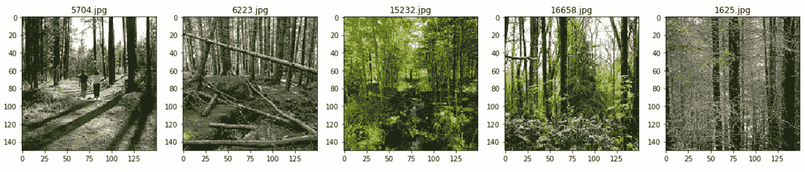

# 为深度学习模型加载自定义图像数据集:第 1 部分

> 原文：<https://towardsdatascience.com/loading-custom-image-dataset-for-deep-learning-models-part-1-d64fa7aaeca6?source=collection_archive---------2----------------------->

## 将自定义图像数据集加载到深度学习模型的不同技术的简单指南。

***在本文中，您将学习如何从自定义数据中加载和创建图像训练和测试数据集，作为深度学习模型的输入。您将学习使用加载数据集。***

*   **开*CV2*开**
*   ***PIL***

这里使用的数据集是来自 Kaggle 的[英特尔图像分类](https://www.kaggle.com/puneet6060/intel-image-classification/version/2)。

英特尔图像分类数据集已经分为训练、测试和 Val，我们将仅使用训练数据集来了解如何使用不同的库加载数据集。

## 为深度学习模型加载自定义数据集的典型步骤

1.  **打开图像文件**。文件的格式可以是 JPEG、PNG、BMP 等。
2.  **调整图像大小以匹配深度学习模型的输入层的输入大小**。
3.  **将图像像素转换为浮点数据类型。**
4.  **将图像**归一化，使像素值从 0 到 255 在 0 和 1 之间缩小。
5.  **深度学习模型的图像数据应该是 numpy 数组或者张量对象。**

## 自定义图像数据的文件夹结构


每个类别都是一个文件夹，包含该特定类别的图像。

## 使用 CV2 加载图像数据

**导入所需的库**

```
**import pandas as pd
import numpy as np
import os
import tensorflow as tf
import cv2
from tensorflow import keras
from tensorflow.keras import layers, Dense, Input, InputLayer, Flatten
from tensorflow.keras.models import Sequential, Model
from  matplotlib import pyplot as plt
import matplotlib.image as mpimg**
**%matplotlib inline**
```

从其中一个文件夹中随机打印五张图像

```
**plt.figure(figsize=(20,20))****test_folder=r'CV\Intel_Images\seg_train\seg_train\forest'
for i in range(5):
    file = random.choice(os.listdir(img_folder))
    image_path= os.path.join(img_folder, file)
    img=mpimg.imread(image_path)
    ax=plt.subplot(1,5,i+1)
    ax.title.set_text(file)
    plt.imshow(img)**
```



**设置加载数据集的图像尺寸和源文件夹**

```
**IMG_WIDTH=200
IMG_HEIGHT=200
img_folder=r'CV\Intel_Images\seg_train\seg_train\'**
```

**从文件夹中的图像创建图像数据和标签**

在下面的函数中

*   源文件夹是包含不同类的图像的输入参数。
*   从文件夹中读取图像文件，并将其转换为正确的颜色格式。
*   根据模型所需的输入尺寸调整图像的大小
*   将图像转换为数据类型为 float32 的 Numpy 数组
*   归一化图像数组，使值在 0 和 1 之间从 0 到 255 缩小，以获得类似的数据分布，这有助于加快收敛。

```
**def create_dataset(img_folder):

    img_data_array=[]
    class_name=[]

    for dir1 in os.listdir(img_folder):
        for file in os.listdir(os.path.join(img_folder, dir1)):

            image_path= os.path.join(img_folder, dir1,  file)
            image= cv2.imread( image_path, cv2.COLOR_BGR2RGB)
            image=cv2.resize(image, (IMG_HEIGHT, IMG_WIDTH),interpolation = cv2.INTER_AREA)
            image=np.array(image)
            image = image.astype('float32')
            image /= 255 
            img_data_array.append(image)
            class_name.append(dir1)
    return img_data_array, class_name**# extract the image array and class name
**img_data, class_name =create_dataset(r'CV\Intel_Images\seg_train\seg_train')**
```

**将文本标签转换成数字代码**

为类的所有唯一值创建一个字典

```
**target_dict={k: v for v, k in enumerate(np.unique(class_name))}
target_dict**
```


根据字典将 class_names 转换成它们各自的数值

```
**target_val=  [target_dict[class_name[i]] for i in range(len(class_name))]**
```

创建一个简单的深度学习模型并编译它

```
**model=tf.keras.Sequential(
        [
            tf.keras.layers.InputLayer(input_shape=(IMG_HEIGHT,IMG_WIDTH, 3)),
            tf.keras.layers.Conv2D(filters=32, kernel_size=3, strides=(2, 2), activation='relu'),
            tf.keras.layers.Conv2D(filters=64, kernel_size=3, strides=(2, 2), activation='relu'),
            tf.keras.layers.Flatten(),
            tf.keras.layers.Dense(6)
        ])****encoder.compile(optimizer='rmsprop', loss='sparse_categorical_crossentropy', metrics=['accuracy'])**
```

我们最终拟合数据集来训练模型。我们可以使用 Numpy 数组作为输入

```
**history = model.fit(x=np.array(img_data, np.float32), y=np.array(list(map(int,target_val)), np.float32), epochs=5)**
```

我们也可以使用 ***tf.cast()*** 将输入数据转换成张量来训练模型

```
**history = model.fit(x=tf.cast(np.array(img_data), tf.float64), y=tf.cast(list(map(int,target_val)),tf.int32), epochs=5)**
```

我们将通过使用不同的库加载图像数据集来使用相同的模型进行进一步的训练

## 使用 PIL 加载图像数据

添加附加库以使用 PIL 加载影像数据集

```
**from PIL import Image**
```

**使用 PIL 从文件夹中的图像创建图像数据和标签**

在下面的函数中

*   源文件夹是包含不同类的图像的输入参数。
*   使用 PIL 打开文件夹中的图像文件。
*   根据模型所需的输入尺寸调整图像的大小
*   将图像转换为数据类型为 float32 的 Numpy 数组
*   归一化图像阵列以加快收敛速度。

```
**def create_dataset_PIL(img_folder):

    img_data_array=[]
    class_name=[]
    for dir1 in os.listdir(img_folder):
        for file in os.listdir(os.path.join(img_folder, dir1)):

            image_path= os.path.join(img_folder, dir1,  file)
            image= np.array(Image.open(image_path))
            image= np.resize(image,(IMG_HEIGHT,IMG_WIDTH,3))
            image = image.astype('float32')
            image /= 255  
            img_data_array.append(image)
            class_name.append(dir1)
    return img_data_array , class_name
PIL_img_data, class_name=create_dataset_PIL(img_folder)**
```

**将文本标签转换成数字代码**

下面是我们用于 CV2 的相同代码

```
**target_dict={k: v for v, k in enumerate(np.unique(class_name))}
target_val=  [target_dict[class_name[i]] for i in range(len(class_name))]**
```

创建和编译一个简单的深度学习模型

```
**model=tf.keras.Sequential(
        [
            tf.keras.layers.InputLayer(input_shape=(IMG_HEIGHT,IMG_WIDTH, 3)),
            tf.keras.layers.Conv2D(filters=32, kernel_size=3, strides=(2, 2), activation='relu'),
            tf.keras.layers.Conv2D(filters=64, kernel_size=3, strides=(2, 2), activation='relu'),
            tf.keras.layers.Flatten(),
            tf.keras.layers.Dense(6)
        ])****encoder.compile(optimizer='rmsprop', loss='sparse_categorical_crossentropy', metrics=['accuracy'])**
```

我们最终拟合数据集来训练模型。我们可以使用 Numpy 数组作为输入

```
**history = model.fit(x=np.array(PIL_img_data, np.float32), y=np.array(list(map(int,target_val)), np.float32), epochs=5)**
```

我们也可以使用 ***tf.cast()*** 将输入数据转换成张量来训练模型

```
**history = model.fit(x=tf.cast(np.array(PIL_img_data), tf.float64), y=tf.cast(list(map(int,target_val)),tf.int32), epochs=5)**
```

除了几个步骤之外，使用 CV2 和 PIL 加载数据集的过程是相同的。

现在，这将帮助您使用 CV2 和 PIL 库加载数据集。

使用 CV2 和 PIL 加载数据集的代码在此[可用](https://github.com/arshren/Load_Dataset)。

在下一篇文章中，我们将使用。

*   ****Tensorflow 核心包括 tf.data****