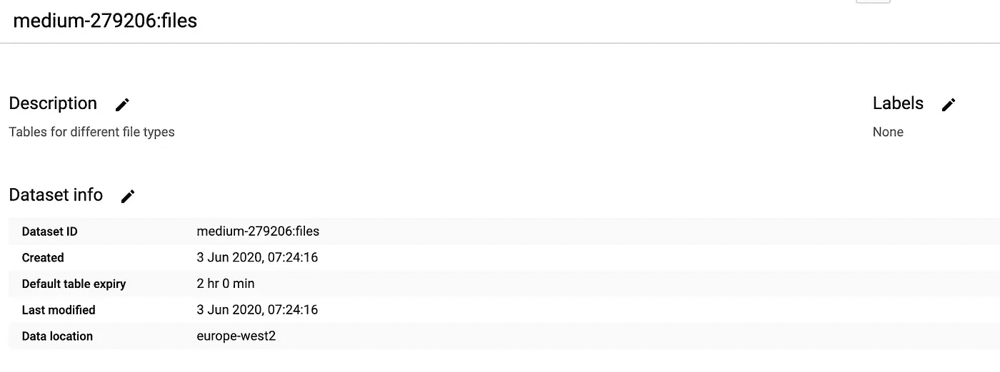
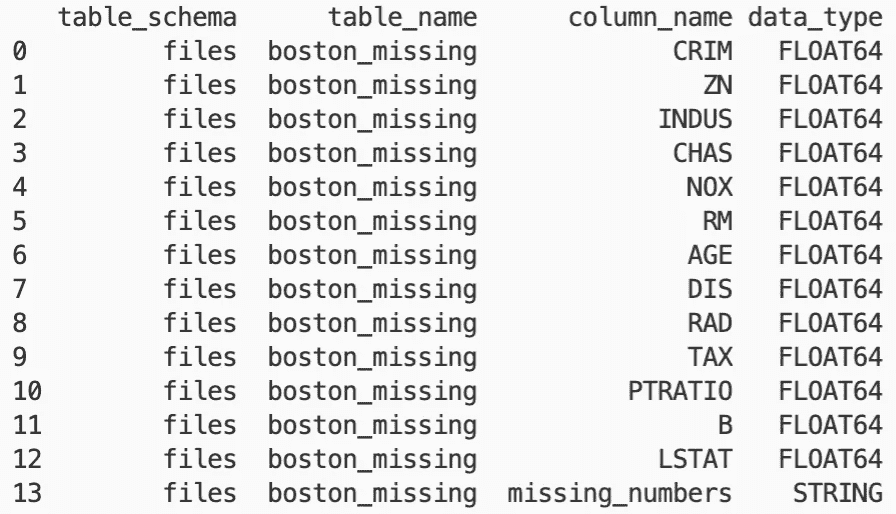
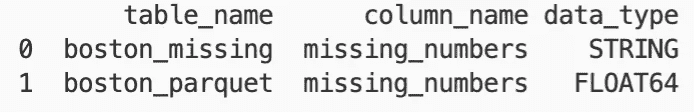

# 将文件加载到 BigQuery

> 原文：<https://towardsdatascience.com/loading-files-into-bigquery-6de1ff63df35?source=collection_archive---------18----------------------->

## 使用 Python 将拼花和 CSV 文件导入 GCP BigQuery

Google 云平台的 BigQuery 能够将多种文件类型摄取到表格中。在本教程中，我将展示它可以处理什么类型的文件，以及为什么您应该尽可能使用 Parquet。

> 要获得所有媒体文章的完整访问权限，包括我的文章，请考虑在此订阅。

# 如何加载文件

肯定比这容易。图片来源: [pxfuel](https://www.pxfuel.com/en/free-photo-emvlj)

首先，我们需要一个包含这些表的数据集:

上面的代码片段将创建一个名为`files`的数据集。以下是对所用参数的解释:

*   `location`设置数据集中表的位置。请注意，不同地点之间可能会收取转让费。最佳实践是尽可能将存储桶和 BigQuery 表放在同一个区域。这里我用`europe-west2`(伦敦)表示地区位置。您也可以使用多区域位置，如`EU`或`US`。点击查看选项[。](https://cloud.google.com/bigquery/docs/locations)
*   `default_table_expiration`设置新创建的表格过期的秒数。如果您只想让表存在一段时间，或者您担心会忘记删除它们，这是非常有用的。我把它设置为 2 小时。
*   `description`是对数据集用途的简短易读的描述。

我将从[云外壳](https://cloud.google.com/shell)运行代码，因为这样最方便——我强烈建议您也从那里尝试一下。

一旦它运行，我们可以从用户界面确认所有设置都设置正确:

新数据集信息面板的屏幕截图

现在我们有一个数据集要填充，让我们使用 Python ( `sklearn`)为我们创建一些数据，并将其保存为一个逗号分隔的文件。

这是一个非常简单的数据集，所以我们实际上可以使用 BigQuery 的`autodetect`特性来计算它的模式。下面是如何使用`bq`从命令行完成这项工作:

如果由于某种原因无法找到`files`数据集，您可以将您的项目名称指定为[表名称](https://cloud.google.com/bigquery/docs/loading-data-local#loading_data_from_a_local_data_source)的一部分，或者您可以将默认项目设置为您之前使用的项目:

`gcloud config set core/project YOUR_PROJECT_NAME`

让我们看看如何通过 Python 的`gcloud` SDK 实现这一点:

注意，在这里，我们将文件直接从本地存储上传到 BigQuery，但是建议首先将您的文件复制到 GCS (Google Cloud Storage ),然后从那里加载文件。查看`[load_table_from_uri](https://googleapis.dev/python/bigquery/latest/generated/google.cloud.bigquery.client.Client.html#google.cloud.bigquery.client.Client.load_table_from_uri)`如何做到这一点。

# 什么样的文件可以加载到 BigQuery 中？

谈到文件格式，我们确实有选择。图片来源: [pxfuel](https://www.pxfuel.com/en/free-photo-ocilb)

谈到文件类型，BigQuery 确实支持一些选项:

*   Avro
*   镶木地板
*   光学字符识别
*   战斗支援车
*   JSON(换行分隔)

但他们并非生而平等…

请注意，在上面的文件中，所有内容都是数字，这使得 BigQuery 很容易检测列类型。但是当你开始加载字符串、日期、时间、浮点数、整数和混合字段时，生活就变得复杂了，BigQuery 的模式`autodetect`特性也就消失了。然后，您需要自己指定模式，这很快就会变得繁琐而混乱，因为 Numpy 数据类型与 BigQuery 之间没有一对一的映射。在这种情况下，Avro 和 Parquet 格式更有用。它们存储关于列的元数据，BigQuery 可以使用这些信息来确定列的类型！

Avro 是 BigQuery 的推荐文件类型，因为它的压缩格式允许快速并行上传，但 Python 中对 Avro 的支持有些有限，所以我更喜欢使用 Parquet。

## 让我们制作一个更大的数据集

为了演示`autodetect`会失败的地方，让我们再添加几行和一个时髦的列，除了最后的 2 个浮点数，它到处都有缺失值。

这里的 upload_csv 是一个封装了我们之前所做的步骤的函数。检查[源代码](https://github.com/niczky12/medium/tree/master/tech/bigquery/file_loads)。

这种工作方式没有错误。但是它做了我们想要它做的吗？让我们检查一下数据类型:

这为我们提供了以下信息:

看看最后一排！😱

我们心爱的花车变成了琴弦！

# 拼花地板拯救世界

CSV 格式比较乱。对于应该如何引用字符串，应该使用什么分隔符，是否有标题，没有明确的指导，我们甚至没有触及跨多个文件的数据集。

另一方面，拼花文件携带关于列的元数据。他们知道每一列应该是什么类型，所以当您将它加载到 BigQuery 时，不再需要猜测。更好的是，parquet 文件通常是按列压缩的，所以你的分类列存储起来会便宜很多！试试吧！

让我们看看如何将相同的`dataframe`作为一个 parquet 文件上传到 BigQuery:

这更简单——注意，我们不再需要跳过标题或猜测模式——最棒的是它带有压缩功能。我们的文件大小从 1.8MB 变成了 59KB(我们必须注意，这主要是因为许多重复的值，但仍然非常令人印象深刻)！

我们的列类型现在是正确的:

彩车回来了！🎉

# 摘要

我们展示了 BigQuery 如何接收 CSV 和 Parquet 文件，以及 CSV 如何导致复杂性。**如果你觉得上面的例子在现实生活中不会发生，那就再想想吧！**当您有数千个列分布在数千个大型文件中时，BigQuery 检测到错误列类型的可能性非常高——同样，当您需要为它编写模式时，数千个列也没有用…

所以下一次当您希望将一个大文件加载到 BigQuery 中时，可以请求 Parquet！

要获得 BigQuery 的更多乐趣，请查看这篇文章，在这篇文章中，我展示了如何使用 UDF 找到斐波那契数列。

上面用到的所有代码都可以在 [GitHub](https://github.com/niczky12/medium/tree/master/tech/bigquery/file_loads) 上找到。