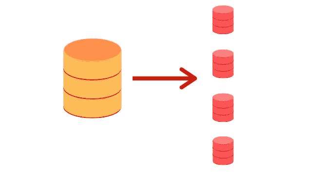
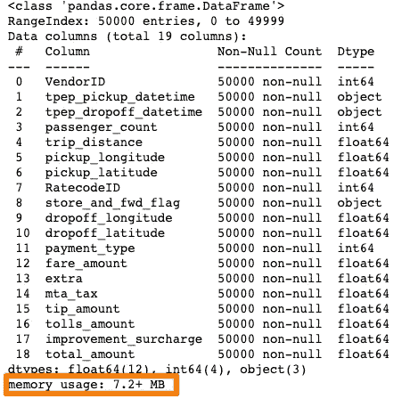
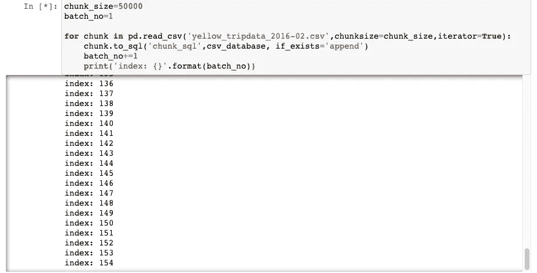

# 在 Pandas 中加载大型数据集

> 原文：<https://towardsdatascience.com/loading-large-datasets-in-pandas-11bdddd36f7b?source=collection_archive---------1----------------------->

## 有效地使用分块和 SQL 来读取 pandas 中的大数据集


[free pik 创建的业务向量](https://www.freepik.com/vectors/business)

[熊猫的](https://pandas.pydata.org/)图书馆是数据科学生态系统的重要成员。然而，它无法分析大于内存的数据集，这使得它对于大数据来说有点棘手。考虑这样一种情况，当我们想只使用熊猫来分析一个大数据集时。我们会遇到什么样的问题？例如，我们来看一个包含 3GB 数据的文件，该文件总结了 2016 年 3 月的[黄色出租车出行数据。为了进行任何种类的分析，我们必须将它输入到内存中。我们很容易使用 pandas 的`read_csv()`函数来执行如下读取操作:](https://www.kaggle.com/bharath150/taxi-data?select=yellow_tripdata_2016-03.csv)

```
import pandas as pd
df = pd.read_csv('yellow_tripdata_2016-03.csv')
```

当我运行单元/文件时，我的系统抛出以下**内存错误。**(内存错误取决于您使用的系统容量)。


作者图片

## 有其他选择吗？

在批评熊猫之前，重要的是要明白熊猫并不总是每项任务的合适工具。熊猫缺乏多处理支持，其他库更擅长处理大数据。一个这样的选择是 Dask，它提供了一个类似熊猫的 API 来处理比内存大的数据集。即使是 [pandas 的文档](https://pandas.pydata.org/pandas-docs/stable/user_guide/scale.html)也明确提到了大数据:

*不用熊猫值得考虑。熊猫并不是所有情况下的合适工具。*

然而，在本文中，我们将研究一种叫做分块的方法，通过这种方法，你可以在 pandas 中加载内存不足的数据集。这种方法有时可以提供一种健康的方式来管理熊猫的内存不足问题，但可能并不总是有效，我们将在本章的后面看到这一点。本质上，我们将研究在 python 中导入大型数据集的两种方法:

*   使用带有 chunksize 的`pd.read_csv()`
*   使用 SQL 和 pandas

# 💡分块:将数据集细分成更小的部分



作者图片

在使用示例之前，让我们试着理解我们所说的工作分块是什么意思。根据[维基百科](https://en.wikipedia.org/wiki/Main_Page)，

[***分块***](https://en.wikipedia.org/wiki/Chunking_(computing)#:~:text=Typical%20modern%20software%20systems%20allocate%20memory%20dynamically%20from%20structures%20known%20as%20heaps.&text=Heap%20management%20involves%20some%20computation,aggregate%20related%20memory%2Dallocation%20requests.) *指的是通过使用特定情况的知识来聚合相关的内存分配请求，从而提高性能的策略。*

换句话说，我们可以分成更小的部分或块，而不是一次读取内存中的所有数据。在 CSV 文件的情况下，这意味着在给定的时间点只将几行加载到内存中。

Pandas 的`read_csv()`函数带有一个**块大小** [**参数**](https://pandas.pydata.org/pandas-docs/stable/reference/api/pandas.read_csv.html#pandas.read_csv) 来控制块的大小。让我们看看它的实际效果。我们将使用本文前面使用的确切数据集，但不是一次性加载所有数据集，而是将它分成几个部分进行加载。

# ✴️使用 pd.read_csv()和 chunksize

为了启用分块，我们将在开始时声明块的大小。然后使用带有 chunksize 参数的`read_csv()`,返回一个我们可以迭代的对象。

```
chunk_size=50000
batch_no=1for chunk in pd.read_csv('yellow_tripdata_2016-02.csv',chunksize=chunk_size):
    chunk.to_csv('chunk'+str(batch_no)+'.csv',index=False)
    batch_no+=1
```

我们选择 50，000 的块大小，这意味着一次只能导入 50，000 行数据。下面是一个视频，展示了主 CSV 文件如何拆分成多个文件。

作者提供的视频

## 将单个块文件导入 pandas 数据帧:

我们现在有多个数据块，每个数据块都可以作为熊猫数据帧轻松加载。

```
df1 = pd.read_csv('chunk1.csv')
df1.head()
```

它就像一个魔咒！。不再有内存错误。让我们快速查看一下这个块的内存使用情况:

```
df1.info()
```



作者图片

## 🔴提醒一句

分块创建数据的各种子集。因此，当您正在执行的[操作不需要或只需要块](https://pandas.pydata.org/pandas-docs/stable/user_guide/scale.html)之间的最小协调时，它会工作得很好。这是一个重要的考虑。使用组块的另一个缺点是[有些操作像](https://pandas.pydata.org/pandas-docs/stable/user_guide/scale.html) `[groupby](https://pandas.pydata.org/pandas-docs/stable/user_guide/scale.html)`做组块要难得多。在这种情况下，最好使用替代库。

# ✴️Using SQL 和熊猫读取大数据文件

(参见参考文献)


作者图片

另一种方法是从块中构建一个 [SQLite 数据库](https://www.sqlite.org/index.html)，然后使用 SQL 查询提取所需的数据。SQLite 是一个基于 SQL 语言的关系数据库管理系统，但是针对小型环境进行了优化。它可以使用名为 [sqlite3](https://docs.python.org/3/library/sqlite3.html) 的 Python 模块与 Python 集成。如果您想了解更多关于在 python 中使用 Sqlite 的信息，可以参考我写的一篇关于这个主题的文章:

[](https://medium.com/analytics-vidhya/programming-with-databases-in-python-using-sqlite-4cecbef51ab9) [## 使用 SQLite 在 Python 中进行数据库编程

### 如果你渴望成为一名数据科学家，你将会处理大量的数据。大部分数据驻留在…

medium.com](https://medium.com/analytics-vidhya/programming-with-databases-in-python-using-sqlite-4cecbef51ab9) 

[SQLAlchemy](https://www.sqlalchemy.org/) 是 Python SQL 工具包和对象关系映射器，为应用程序开发人员提供了 SQL 的全部功能和灵活性。它用于构建一个从原始数据创建数据库的引擎，在我们的例子中，原始数据是一个很大的 CSV 文件。

对于本文，我们将遵循以下步骤:

## 导入必要的库

```
import sqlite3
from sqlalchemy import create_engine
```

## 创建到数据库的连接器

我们将要创建的数据库命名为`csv_database.`

```
csv_database = create_engine('sqlite:///csv_database.db')
```

## 通过分块从 CSV 文件创建数据库

这个过程类似于我们在本文前面看到的。该循环读取由 chunksize 指定的成组数据集。

```
chunk_size=50000
batch_no=1for chunk in pd.read_csv('yellow_tripdata_2016-02.csv',chunksize=chunk_size,iterator=True):
    chunk.to_sql('chunk_sql',csv_database, if_exists='append')
    batch_no+=1
    print('index: {}'.format(batch_no))
```

请注意，我们使用了函数。`chunk.to_sql instead of chunk.to_csv` 因为我们正在将数据写入数据库，也就是说`csv_database.`，`chunk_sql`是给块的任意名称。



## 通过查询 SQL 数据库构建熊猫数据框架

数据库已创建。我们现在可以很容易地查询它，只提取我们需要的那些列；例如，我们可以只提取乘客数量少于`5`并且出行距离大于`10`的那些行。`pandas.read_sql_query`将 SQL 查询读入数据帧。

我们现在有了一个数据框架，它非常适合我们的记忆，可以用于进一步的分析。

# 结论

就数据分析而言，Pandas 是一个方便且功能多样的库。然而，在处理大数据时，它遇到了几个瓶颈。在本文中，我们看到了分块和 SQL 如何为分析大于系统内存的数据集提供一些安慰。然而，这种替代方案不是“一刀切”的解决方案，使用为处理大数据而创建的库将是更好的选择。

# 参考

1.  [如何用 Python 中的 SQL 和 Pandas 读取非常大的文件](https://www.youtube.com/watch?v=xKMyk4wDHnQ)作者
    [Vytautas Bielinskas 博士](https://www.linkedin.com/in/bielinskas/)

[2。扩展到大型数据集](https://pandas.pydata.org/pandas-docs/stable/user_guide/scale.html)