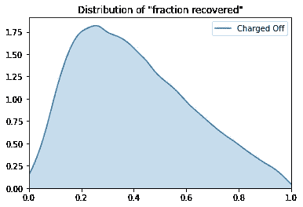
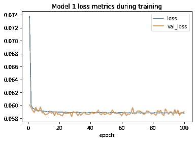

# 建立神经网络预测贷款风险

> 原文：<https://towardsdatascience.com/loan-risk-neural-network-30c8f65f052e?source=collection_archive---------35----------------------->

## [深入分析](https://towardsdatascience.com/in-depth-analysis/home)

## *一步一步的指导(伴随着健康剂量的数据清理)*


照片由 [NeONBRAND](https://unsplash.com/@neonbrand?utm_source=medium&utm_medium=referral) 在 [Unsplash](https://unsplash.com?utm_source=medium&utm_medium=referral) 上拍摄

1.  [**简介**](#835e)
2.  [**数据清理**](#52ce)
3.  [**构建神经网络**](#b158)
4.  [**拯救最终模型**](#d18c)
5.  [**构建 API**](#0892)
6.  [**延伸阅读**](#b3ab)

# 介绍

[LendingClub](https://www.lendingclub.com/) 是全球最大的点对点借贷平台。直到最近(截至 2018 年底)，LendingClub 公布了自 2007 年该公司成立以来发放的所有贷款的公共数据集。我正在通过 Kaggle 访问数据集[。](https://www.kaggle.com/wordsforthewise/lending-club)

```
(2260701, 151)
```

有了 2，260，701 笔贷款和 151 个潜在变量，我的目标是用 TensorFlow 和 Keras 创建一个神经网络模型，来预测预期借款人将偿还的预期贷款回报的一部分。考虑到数据集的状态，这将需要进行大量的数据清理，我将在这里介绍整个过程。在构建和训练网络之后，我将创建一个公共 API 来服务这个模型。

此外，正如你可能已经从前面的代码块中猜到的，这篇文章改编自 Jupyter 笔记本。如果你想在你自己的笔记本上跟随，继续前进并在 [Kaggle](https://www.kaggle.com/tywmick/building-a-neural-network-to-predict-loan-risk) 或 [GitHub](https://github.com/tywmick/loan-risk-neural-network/blob/master/models/loan-risk-neural-network.ipynb) 上分叉我的。

# 数据清理

我将首先查看数据字典(直接从 LendingClub 的网站下载[，以了解如何创建所需的输出变量，以及在贷款申请时还有哪些剩余功能可用(以避免数据泄漏)。](https://resources.lendingclub.com/LCDataDictionary.xlsx)

```
•id: A unique LC assigned ID for the loan listing.
•member_id: A unique LC assigned Id for the borrower member.
•loan_amnt: The listed amount of the loan applied for by the borrower. If at some point in time, the credit department reduces the loan amount, then it will be reflected in this value.
•funded_amnt: The total amount committed to that loan at that point in time.
•funded_amnt_inv: The total amount committed by investors for that loan at that point in time.
•term: The number of payments on the loan. Values are in months and can be either 36 or 60.
•int_rate: Interest Rate on the loan
•installment: The monthly payment owed by the borrower if the loan originates.
•grade: LC assigned loan grade
•sub_grade: LC assigned loan subgrade
•emp_title: The job title supplied by the Borrower when applying for the loan.*
•emp_length: Employment length in years. Possible values are between 0 and 10 where 0 means less than one year and 10 means ten or more years.
•home_ownership: The home ownership status provided by the borrower during registration or obtained from the credit report. Our values are: RENT, OWN, MORTGAGE, OTHER
•annual_inc: The self-reported annual income provided by the borrower during registration.
•verification_status: Indicates if income was verified by LC, not verified, or if the income source was verified
•issue_d: The month which the loan was funded
•loan_status: Current status of the loan
•pymnt_plan: Indicates if a payment plan has been put in place for the loan
•url: URL for the LC page with listing data.
•desc: Loan description provided by the borrower
•purpose: A category provided by the borrower for the loan request.
•title: The loan title provided by the borrower
•zip_code: The first 3 numbers of the zip code provided by the borrower in the loan application.
•addr_state: The state provided by the borrower in the loan application
•dti: A ratio calculated using the borrower’s total monthly debt payments on the total debt obligations, excluding mortgage and the requested LC loan, divided by the borrower’s self-reported monthly income.
•delinq_2yrs: The number of 30+ days past-due incidences of delinquency in the borrower's credit file for the past 2 years
•earliest_cr_line: The month the borrower's earliest reported credit line was opened
•fico_range_low: The lower boundary range the borrower’s FICO at loan origination belongs to.
•fico_range_high: The upper boundary range the borrower’s FICO at loan origination belongs to.
•inq_last_6mths: The number of inquiries in past 6 months (excluding auto and mortgage inquiries)
•mths_since_last_delinq: The number of months since the borrower's last delinquency.
•mths_since_last_record: The number of months since the last public record.
•open_acc: The number of open credit lines in the borrower's credit file.
•pub_rec: Number of derogatory public records
•revol_bal: Total credit revolving balance
•revol_util: Revolving line utilization rate, or the amount of credit the borrower is using relative to all available revolving credit.
•total_acc: The total number of credit lines currently in the borrower's credit file
•initial_list_status: The initial listing status of the loan. Possible values are – W, F
•out_prncp: Remaining outstanding principal for total amount funded
•out_prncp_inv: Remaining outstanding principal for portion of total amount funded by investors
•total_pymnt: Payments received to date for total amount funded
•total_pymnt_inv: Payments received to date for portion of total amount funded by investors
•total_rec_prncp: Principal received to date
•total_rec_int: Interest received to date
•total_rec_late_fee: Late fees received to date
•recoveries: post charge off gross recovery
•collection_recovery_fee: post charge off collection fee
•last_pymnt_d: Last month payment was received
•last_pymnt_amnt: Last total payment amount received
•next_pymnt_d: Next scheduled payment date
•last_credit_pull_d: The most recent month LC pulled credit for this loan
•last_fico_range_high: The upper boundary range the borrower’s last FICO pulled belongs to.
•last_fico_range_low: The lower boundary range the borrower’s last FICO pulled belongs to.
•collections_12_mths_ex_med: Number of collections in 12 months excluding medical collections
•mths_since_last_major_derog: Months since most recent 90-day or worse rating
•policy_code: publicly available policy_code=1
new products not publicly available policy_code=2
•application_type: Indicates whether the loan is an individual application or a joint application with two co-borrowers
•annual_inc_joint: The combined self-reported annual income provided by the co-borrowers during registration
•dti_joint: A ratio calculated using the co-borrowers' total monthly payments on the total debt obligations, excluding mortgages and the requested LC loan, divided by the co-borrowers' combined self-reported monthly income
•verification_status_joint: Indicates if the co-borrowers' joint income was verified by LC, not verified, or if the income source was verified
•acc_now_delinq: The number of accounts on which the borrower is now delinquent.
•tot_coll_amt: Total collection amounts ever owed
•tot_cur_bal: Total current balance of all accounts
•open_acc_6m: Number of open trades in last 6 months
•open_act_il: Number of currently active installment trades
•open_il_12m: Number of installment accounts opened in past 12 months
•open_il_24m: Number of installment accounts opened in past 24 months
•mths_since_rcnt_il: Months since most recent installment accounts opened
•total_bal_il: Total current balance of all installment accounts
•il_util: Ratio of total current balance to high credit/credit limit on all install acct
•open_rv_12m: Number of revolving trades opened in past 12 months
•open_rv_24m: Number of revolving trades opened in past 24 months
•max_bal_bc: Maximum current balance owed on all revolving accounts
•all_util: Balance to credit limit on all trades
•total_rev_hi_lim: Total revolving high credit/credit limit
•inq_fi: Number of personal finance inquiries
•total_cu_tl: Number of finance trades
•inq_last_12m: Number of credit inquiries in past 12 months
•acc_open_past_24mths: Number of trades opened in past 24 months.
•avg_cur_bal: Average current balance of all accounts
•bc_open_to_buy: Total open to buy on revolving bankcards.
•bc_util: Ratio of total current balance to high credit/credit limit for all bankcard accounts.
•chargeoff_within_12_mths: Number of charge-offs within 12 months
•delinq_amnt: The past-due amount owed for the accounts on which the borrower is now delinquent.
•mo_sin_old_il_acct: Months since oldest bank installment account opened
•mo_sin_old_rev_tl_op: Months since oldest revolving account opened
•mo_sin_rcnt_rev_tl_op: Months since most recent revolving account opened
•mo_sin_rcnt_tl: Months since most recent account opened
•mort_acc: Number of mortgage accounts.
•mths_since_recent_bc: Months since most recent bankcard account opened.
•mths_since_recent_bc_dlq: Months since most recent bankcard delinquency
•mths_since_recent_inq: Months since most recent inquiry.
•mths_since_recent_revol_delinq: Months since most recent revolving delinquency.
•num_accts_ever_120_pd: Number of accounts ever 120 or more days past due
•num_actv_bc_tl: Number of currently active bankcard accounts
•num_actv_rev_tl: Number of currently active revolving trades
•num_bc_sats: Number of satisfactory bankcard accounts
•num_bc_tl: Number of bankcard accounts
•num_il_tl: Number of installment accounts
•num_op_rev_tl: Number of open revolving accounts
•num_rev_accts: Number of revolving accounts
•num_rev_tl_bal_gt_0: Number of revolving trades with balance >0
•num_sats: Number of satisfactory accounts
•num_tl_120dpd_2m: Number of accounts currently 120 days past due (updated in past 2 months)
•num_tl_30dpd: Number of accounts currently 30 days past due (updated in past 2 months)
•num_tl_90g_dpd_24m: Number of accounts 90 or more days past due in last 24 months
•num_tl_op_past_12m: Number of accounts opened in past 12 months
•pct_tl_nvr_dlq: Percent of trades never delinquent
•percent_bc_gt_75: Percentage of all bankcard accounts > 75% of limit.
•pub_rec_bankruptcies: Number of public record bankruptcies
•tax_liens: Number of tax liens
•tot_hi_cred_lim: Total high credit/credit limit
•total_bal_ex_mort: Total credit balance excluding mortgage
•total_bc_limit: Total bankcard high credit/credit limit
•total_il_high_credit_limit: Total installment high credit/credit limit
•revol_bal_joint: Sum of revolving credit balance of the co-borrowers, net of duplicate balances
•sec_app_fico_range_low: FICO range (high) for the secondary applicant
•sec_app_fico_range_high: FICO range (low) for the secondary applicant
•sec_app_earliest_cr_line: Earliest credit line at time of application for the secondary applicant
•sec_app_inq_last_6mths: Credit inquiries in the last 6 months at time of application for the secondary applicant
•sec_app_mort_acc: Number of mortgage accounts at time of application for the secondary applicant
•sec_app_open_acc: Number of open trades at time of application for the secondary applicant
•sec_app_revol_util: Ratio of total current balance to high credit/credit limit for all revolving accounts
•sec_app_open_act_il: Number of currently active installment trades at time of application for the secondary applicant
•sec_app_num_rev_accts: Number of revolving accounts at time of application for the secondary applicant
•sec_app_chargeoff_within_12_mths: Number of charge-offs within last 12 months at time of application for the secondary applicant
•sec_app_collections_12_mths_ex_med: Number of collections within last 12 months excluding medical collections at time of application for the secondary applicant
•sec_app_mths_since_last_major_derog: Months since most recent 90-day or worse rating at time of application for the secondary applicant
•hardship_flag: Flags whether or not the borrower is on a hardship plan
•hardship_type: Describes the hardship plan offering
•hardship_reason: Describes the reason the hardship plan was offered
•hardship_status: Describes if the hardship plan is active, pending, canceled, completed, or broken
•deferral_term: Amount of months that the borrower is expected to pay less than the contractual monthly payment amount due to a hardship plan
•hardship_amount: The interest payment that the borrower has committed to make each month while they are on a hardship plan
•hardship_start_date: The start date of the hardship plan period
•hardship_end_date: The end date of the hardship plan period
•payment_plan_start_date: The day the first hardship plan payment is due. For example, if a borrower has a hardship plan period of 3 months, the start date is the start of the three-month period in which the borrower is allowed to make interest-only payments.
•hardship_length: The number of months the borrower will make smaller payments than normally obligated due to a hardship plan
•hardship_dpd: Account days past due as of the hardship plan start date
•hardship_loan_status: Loan Status as of the hardship plan start date
•orig_projected_additional_accrued_interest: The original projected additional interest amount that will accrue for the given hardship payment plan as of the Hardship Start Date. This field will be null if the borrower has broken their hardship payment plan.
•hardship_payoff_balance_amount: The payoff balance amount as of the hardship plan start date
•hardship_last_payment_amount: The last payment amount as of the hardship plan start date
•disbursement_method: The method by which the borrower receives their loan. Possible values are: CASH, DIRECT_PAY
•debt_settlement_flag: Flags whether or not the borrower, who has charged-off, is working with a debt-settlement company.
•debt_settlement_flag_date: The most recent date that the Debt_Settlement_Flag has been set
•settlement_status: The status of the borrower’s settlement plan. Possible values are: COMPLETE, ACTIVE, BROKEN, CANCELLED, DENIED, DRAFT
•settlement_date: The date that the borrower agrees to the settlement plan
•settlement_amount: The loan amount that the borrower has agreed to settle for
•settlement_percentage: The settlement amount as a percentage of the payoff balance amount on the loan
•settlement_term: The number of months that the borrower will be on the settlement plan
```

对于输出变量(预期回报中被收回的部分)，我将通过将每月付款金额(`installment`)乘以贷款的付款次数(`term`)来计算*预期回报*，并且通过将收到的本金、利息、滞纳金和收费后总收回金额(`total_rec_prncp`、`total_rec_int`、`total_rec_late_fee`、`recoveries`)相加并减去任何收款费用(`collection_recovery_fee`)来计算*实际收到的金额*。

其他几列包含不相关的人口统计数据或直到接受贷款后才创建的数据，因此需要删除这些数据。不过，现在我将保留`issue_d`(贷款被资助的月份和年份)，以防我想比较贷款日期的变量。

`emp_title`(申请人的职位)*在贷款的上下文中是否相关，但它可能有太多有用的唯一值。*

```
*512694*
```

*确实有太多独特的价值观。在该模型的未来版本中，我可能会尝试通过将职称聚合到类别中来从该列生成一个特性，但是这种努力的投资回报可能很低，因为已经有了年收入和就业时间的列。*

*我还将删除的另外两个有趣的列是`title`和`desc`(“描述”)，这两个列都是借款人编写的自由格式文本条目。这些可能是自然语言处理的迷人主题，但这超出了当前项目的范围。也许在将来，我可以使用语法复杂性、字数或关键字包含等方法从这些字段中生成额外的特征。(在后来的一篇文章中，我最终使用文档向量探索了这一思路。)*

*然而，在创建输出变量之前，我必须仔细查看一下`loan_status`，看看数据集中是否还有贷款未结。*

```
*loan_status
Charged Off                                             268559
Current                                                 878317
Default                                                     40
Does not meet the credit policy. Status:Charged Off        761
Does not meet the credit policy. Status:Fully Paid        1988
Fully Paid                                             1076751
In Grace Period                                           8436
Late (16-30 days)                                         4349
Late (31-120 days)                                       21467
Name: loan_status, dtype: int64*
```

*出于实用目的，我会将状态不包含“已全部付清”或“已冲销”的贷款视为未结贷款，因此我会将它们从数据集中移除。我还会将“credit policy”列与其匹配的状态合并。*

```
*loan_status
Charged Off     269320
Fully Paid     1078739
Name: loan_status, dtype: int64*
```

*现在创建输出变量。我将从检查相关变量的空计数开始。*

```
*<class 'pandas.core.frame.DataFrame'>
Int64Index: 1348059 entries, 0 to 2260697
Data columns (total 7 columns):
 #   Column                   Non-Null Count    Dtype
---  ------                   --------------    -----
 0   term                     1348059 non-null  object
 1   installment              1348059 non-null  float64
 2   total_rec_prncp          1348059 non-null  float64
 3   total_rec_int            1348059 non-null  float64
 4   total_rec_late_fee       1348059 non-null  float64
 5   recoveries               1348059 non-null  float64
 6   collection_recovery_fee  1348059 non-null  float64
dtypes: float64(6), object(1)
memory usage: 82.3+ MB*
```

*剩下的每一行都有这七个变量，但是`term`的数据类型是`object`，所以需要首先修复。*

```
*term
 36 months    1023181
 60 months     324878
Name: term, dtype: int64*
```

*啊，所以`term`是一个有两个选项的分类特征。当我将它用作模型的输入时，我会这样对待它，但是为了计算输出变量，我将从它创建一个数字列。*

*此外，我需要从这些值的开头开始修剪空白——这不好。*

*现在我可以创建输出变量了。*

*在这两个类别中，至少有一个古怪的异常值。但是，许多“全额支付”的贷款并没有达到 1。一个可能的解释是，当最后一笔付款到来时，系统只是将`loan_status`翻转为“完全支付”,而没有将付款金额添加到系统本身，或者可能只是将`installation`乘以`term`数字，在实际总数中留下几分钱。如果我是在为 Lending Club 自己做这个分析，我会问他们，但这只是一个个人项目。我会认为每一笔标有“全部付清”的贷款都已经完全收回了预期回报。*

*就此而言，我也将冲销贷款的`fraction_recovered`值限制在 1.0，因为出于某种原因，至少有一个值高于这个值。*

*出于好奇，我将绘制已冲销贷款的回收率分布图。*

**

*现在输出已经格式化了，是时候清理输入了。我将检查每个变量的空计数。*

```
*<class 'pandas.core.frame.DataFrame'>
Int64Index: 1348059 entries, 0 to 2260697
Data columns (total 97 columns):
 #   Column                               Non-Null Count    Dtype
---  ------                               --------------    -----
 0   loan_amnt                            1348059 non-null  float64
 1   term                                 1348059 non-null  object
 2   emp_length                           1269514 non-null  object
 3   home_ownership                       1348059 non-null  object
 4   annual_inc                           1348055 non-null  float64
 5   verification_status                  1348059 non-null  object
 6   issue_d                              1348059 non-null  object
 7   loan_status                          1348059 non-null  object
 8   purpose                              1348059 non-null  object
 9   dti                                  1347685 non-null  float64
 10  delinq_2yrs                          1348030 non-null  float64
 11  earliest_cr_line                     1348030 non-null  object
 12  fico_range_low                       1348059 non-null  float64
 13  fico_range_high                      1348059 non-null  float64
 14  inq_last_6mths                       1348029 non-null  float64
 15  mths_since_last_delinq               668117 non-null   float64
 16  mths_since_last_record               229415 non-null   float64
 17  open_acc                             1348030 non-null  float64
 18  pub_rec                              1348030 non-null  float64
 19  revol_bal                            1348059 non-null  float64
 20  revol_util                           1347162 non-null  float64
 21  total_acc                            1348030 non-null  float64
 22  collections_12_mths_ex_med           1347914 non-null  float64
 23  mths_since_last_major_derog          353750 non-null   float64
 24  application_type                     1348059 non-null  object
 25  annual_inc_joint                     25800 non-null    float64
 26  dti_joint                            25797 non-null    float64
 27  verification_status_joint            25595 non-null    object
 28  acc_now_delinq                       1348030 non-null  float64
 29  tot_coll_amt                         1277783 non-null  float64
 30  tot_cur_bal                          1277783 non-null  float64
 31  open_acc_6m                          537597 non-null   float64
 32  open_act_il                          537598 non-null   float64
 33  open_il_12m                          537598 non-null   float64
 34  open_il_24m                          537598 non-null   float64
 35  mths_since_rcnt_il                   523382 non-null   float64
 36  total_bal_il                         537598 non-null   float64
 37  il_util                              465016 non-null   float64
 38  open_rv_12m                          537598 non-null   float64
 39  open_rv_24m                          537598 non-null   float64
 40  max_bal_bc                           537598 non-null   float64
 41  all_util                             537545 non-null   float64
 42  total_rev_hi_lim                     1277783 non-null  float64
 43  inq_fi                               537598 non-null   float64
 44  total_cu_tl                          537597 non-null   float64
 45  inq_last_12m                         537597 non-null   float64
 46  acc_open_past_24mths                 1298029 non-null  float64
 47  avg_cur_bal                          1277761 non-null  float64
 48  bc_open_to_buy                       1284167 non-null  float64
 49  bc_util                              1283398 non-null  float64
 50  chargeoff_within_12_mths             1347914 non-null  float64
 51  delinq_amnt                          1348030 non-null  float64
 52  mo_sin_old_il_acct                   1239735 non-null  float64
 53  mo_sin_old_rev_tl_op                 1277782 non-null  float64
 54  mo_sin_rcnt_rev_tl_op                1277782 non-null  float64
 55  mo_sin_rcnt_tl                       1277783 non-null  float64
 56  mort_acc                             1298029 non-null  float64
 57  mths_since_recent_bc                 1285089 non-null  float64
 58  mths_since_recent_bc_dlq             319020 non-null   float64
 59  mths_since_recent_inq                1171239 non-null  float64
 60  mths_since_recent_revol_delinq       449962 non-null   float64
 61  num_accts_ever_120_pd                1277783 non-null  float64
 62  num_actv_bc_tl                       1277783 non-null  float64
 63  num_actv_rev_tl                      1277783 non-null  float64
 64  num_bc_sats                          1289469 non-null  float64
 65  num_bc_tl                            1277783 non-null  float64
 66  num_il_tl                            1277783 non-null  float64
 67  num_op_rev_tl                        1277783 non-null  float64
 68  num_rev_accts                        1277782 non-null  float64
 69  num_rev_tl_bal_gt_0                  1277783 non-null  float64
 70  num_sats                             1289469 non-null  float64
 71  num_tl_120dpd_2m                     1227909 non-null  float64
 72  num_tl_30dpd                         1277783 non-null  float64
 73  num_tl_90g_dpd_24m                   1277783 non-null  float64
 74  num_tl_op_past_12m                   1277783 non-null  float64
 75  pct_tl_nvr_dlq                       1277629 non-null  float64
 76  percent_bc_gt_75                     1283755 non-null  float64
 77  pub_rec_bankruptcies                 1346694 non-null  float64
 78  tax_liens                            1347954 non-null  float64
 79  tot_hi_cred_lim                      1277783 non-null  float64
 80  total_bal_ex_mort                    1298029 non-null  float64
 81  total_bc_limit                       1298029 non-null  float64
 82  total_il_high_credit_limit           1277783 non-null  float64
 83  revol_bal_joint                      18629 non-null    float64
 84  sec_app_fico_range_low               18630 non-null    float64
 85  sec_app_fico_range_high              18630 non-null    float64
 86  sec_app_earliest_cr_line             18630 non-null    object
 87  sec_app_inq_last_6mths               18630 non-null    float64
 88  sec_app_mort_acc                     18630 non-null    float64
 89  sec_app_open_acc                     18630 non-null    float64
 90  sec_app_revol_util                   18302 non-null    float64
 91  sec_app_open_act_il                  18630 non-null    float64
 92  sec_app_num_rev_accts                18630 non-null    float64
 93  sec_app_chargeoff_within_12_mths     18630 non-null    float64
 94  sec_app_collections_12_mths_ex_med   18630 non-null    float64
 95  sec_app_mths_since_last_major_derog  6645 non-null     float64
 96  fraction_recovered                   1348059 non-null  float64
dtypes: float64(86), object(11)
memory usage: 1007.9+ MB*
```

*剩余的包含大量空值的列似乎分为三类:*

1.  ***贬损/拖欠指标**(其中 null 表示借款人没有任何此类标记)。我还将把`mths_since_recent_inq`添加到这个列表中，因为它的非空计数低于完整数据的阈值，大约为 1，277，783。我假设这里的空值意味着最近没有查询。*
2.  ***仅适用于联合应用的指标**(其中 null 表示是单个应用)。*
3.  ***一系列令人费解的 14 个信用历史相关的栏目**只有大约 537，000 个条目。这些是新的指标吗？*

*我将首先查看那些更容易混淆的列，以确定它们是否是一组新的指标。这需要首先将`issue_d`转换成日期格式。*

```
*count                 464325
min      2015-12-01 00:00:00
max      2018-12-01 00:00:00
Name: issue_d, dtype: object* 
```

```
*count                 557708
min      2015-12-01 00:00:00
max      2018-12-01 00:00:00
Name: issue_d, dtype: object*
```

*看起来这些确实是较新的指标，它们的使用从 2015 年 12 月才开始，但即使在那之后，使用情况也是参差不齐的。不过，我很想知道这些额外的指标是否会使模型更加准确，所以一旦我清理完数据，我会将带有这些新指标的行复制到一个新的数据集中，并使用新的指标创建另一个模型。*

*至于贬损/拖欠指标，根据 Michael Wurm 的提示[，我将对所有“最近/最近以来的月数”字段取反，这将把每个字段转换为事件频率的代理，并让我将所有空值(当事件从未发生时)设置为 0。对于“自最早以来的月数”字段，我只将空值设置为 0，其余的保持不变。](/intelligent-loan-selection-for-peer-to-peer-lending-575dfa2573cb)*

*现在来看看联合贷款。*

```
*application_type
Individual    1322259
Joint App       25800
Name: application_type, dtype: int64* 
```

```
*<class 'pandas.core.frame.DataFrame'>
Int64Index: 25800 entries, 2 to 2260663
Data columns (total 16 columns):
 #   Column                                   Non-Null Count  Dtype
---  ------                                   --------------  -----
 0   annual_inc_joint                         25800 non-null  float64
 1   dti_joint                                25797 non-null  float64
 2   verification_status_joint                25595 non-null  object
 3   revol_bal_joint                          18629 non-null  float64
 4   sec_app_fico_range_low                   18630 non-null  float64
 5   sec_app_fico_range_high                  18630 non-null  float64
 6   sec_app_earliest_cr_line                 18630 non-null  object
 7   sec_app_inq_last_6mths                   18630 non-null  float64
 8   sec_app_mort_acc                         18630 non-null  float64
 9   sec_app_open_acc                         18630 non-null  float64
 10  sec_app_revol_util                       18302 non-null  float64
 11  sec_app_open_act_il                      18630 non-null  float64
 12  sec_app_num_rev_accts                    18630 non-null  float64
 13  sec_app_chargeoff_within_12_mths         18630 non-null  float64
 14  sec_app_collections_12_mths_ex_med       18630 non-null  float64
 15  sec_app_inv_mths_since_last_major_derog  25800 non-null  float64
dtypes: float64(14), object(2)
memory usage: 3.3+ MB*
```

*联合应用似乎也有新的衡量标准。我会调查的。*

```
*count                  18301
min      2017-03-01 00:00:00
max      2018-12-01 00:00:00
Name: issue_d, dtype: object* 
```

```
*count                  18629
min      2017-03-01 00:00:00
max      2018-12-01 00:00:00
Name: issue_d, dtype: object*
```

*甚至比之前的一组新指标还要新，这些指标直到 2017 年 3 月才开始使用。现在我想知道联合贷款是什么时候首次推出的。*

```
*count                  25800
min      2015-10-01 00:00:00
max      2018-12-01 00:00:00
Name: issue_d, dtype: object*
```

*2015.我想我可能会为第三个模型保存新的联合指标，但我相信我可以在主模型中包括`annual_inc_joint`、`dti_joint`和`verification_status_joint`——我只会对`application_type`进行二进制编码，对于单个应用程序，我会将`annual_inc_joint`、`dti_joint`和`verification_status_joint`设置为与它们的非联合对应项相等。*

```
*<class 'pandas.core.frame.DataFrame'>
Int64Index: 1348059 entries, 0 to 2260697
Data columns (total 97 columns):
 #   Column                                   Non-Null Count    Dtype
---  ------                                   --------------    -----
 0   loan_amnt                                1348059 non-null  float64
 1   term                                     1348059 non-null  object
 2   emp_length                               1269514 non-null  object
 3   home_ownership                           1348059 non-null  object
 4   annual_inc                               1348055 non-null  float64
 5   verification_status                      1348059 non-null  object
 6   issue_d                                  1348059 non-null  datetime64[ns]
 7   loan_status                              1348059 non-null  object
 8   purpose                                  1348059 non-null  object
 9   dti                                      1347685 non-null  float64
 10  delinq_2yrs                              1348030 non-null  float64
 11  earliest_cr_line                         1348030 non-null  object
 12  fico_range_low                           1348059 non-null  float64
 13  fico_range_high                          1348059 non-null  float64
 14  inq_last_6mths                           1348029 non-null  float64
 15  inv_mths_since_last_delinq               1348059 non-null  float64
 16  inv_mths_since_last_record               1348059 non-null  float64
 17  open_acc                                 1348030 non-null  float64
 18  pub_rec                                  1348030 non-null  float64
 19  revol_bal                                1348059 non-null  float64
 20  revol_util                               1347162 non-null  float64
 21  total_acc                                1348030 non-null  float64
 22  collections_12_mths_ex_med               1347914 non-null  float64
 23  inv_mths_since_last_major_derog          1348059 non-null  float64
 24  application_type                         1348059 non-null  object
 25  annual_inc_joint                         1348055 non-null  float64
 26  dti_joint                                1348056 non-null  float64
 27  verification_status_joint                1347854 non-null  object
 28  acc_now_delinq                           1348030 non-null  float64
 29  tot_coll_amt                             1277783 non-null  float64
 30  tot_cur_bal                              1277783 non-null  float64
 31  open_acc_6m                              537597 non-null   float64
 32  open_act_il                              537598 non-null   float64
 33  open_il_12m                              537598 non-null   float64
 34  open_il_24m                              537598 non-null   float64
 35  inv_mths_since_rcnt_il                   1348059 non-null  float64
 36  total_bal_il                             537598 non-null   float64
 37  il_util                                  465016 non-null   float64
 38  open_rv_12m                              537598 non-null   float64
 39  open_rv_24m                              537598 non-null   float64
 40  max_bal_bc                               537598 non-null   float64
 41  all_util                                 537545 non-null   float64
 42  total_rev_hi_lim                         1277783 non-null  float64
 43  inq_fi                                   537598 non-null   float64
 44  total_cu_tl                              537597 non-null   float64
 45  inq_last_12m                             537597 non-null   float64
 46  acc_open_past_24mths                     1298029 non-null  float64
 47  avg_cur_bal                              1277761 non-null  float64
 48  bc_open_to_buy                           1284167 non-null  float64
 49  bc_util                                  1283398 non-null  float64
 50  chargeoff_within_12_mths                 1347914 non-null  float64
 51  delinq_amnt                              1348030 non-null  float64
 52  mo_sin_old_il_acct                       1239735 non-null  float64
 53  mo_sin_old_rev_tl_op                     1277782 non-null  float64
 54  inv_mo_sin_rcnt_rev_tl_op                1348059 non-null  float64
 55  inv_mo_sin_rcnt_tl                       1348059 non-null  float64
 56  mort_acc                                 1298029 non-null  float64
 57  inv_mths_since_recent_bc                 1348059 non-null  float64
 58  inv_mths_since_recent_bc_dlq             1348059 non-null  float64
 59  inv_mths_since_recent_inq                1348059 non-null  float64
 60  inv_mths_since_recent_revol_delinq       1348059 non-null  float64
 61  num_accts_ever_120_pd                    1277783 non-null  float64
 62  num_actv_bc_tl                           1277783 non-null  float64
 63  num_actv_rev_tl                          1277783 non-null  float64
 64  num_bc_sats                              1289469 non-null  float64
 65  num_bc_tl                                1277783 non-null  float64
 66  num_il_tl                                1277783 non-null  float64
 67  num_op_rev_tl                            1277783 non-null  float64
 68  num_rev_accts                            1277782 non-null  float64
 69  num_rev_tl_bal_gt_0                      1277783 non-null  float64
 70  num_sats                                 1289469 non-null  float64
 71  num_tl_120dpd_2m                         1227909 non-null  float64
 72  num_tl_30dpd                             1277783 non-null  float64
 73  num_tl_90g_dpd_24m                       1277783 non-null  float64
 74  num_tl_op_past_12m                       1277783 non-null  float64
 75  pct_tl_nvr_dlq                           1277629 non-null  float64
 76  percent_bc_gt_75                         1283755 non-null  float64
 77  pub_rec_bankruptcies                     1346694 non-null  float64
 78  tax_liens                                1347954 non-null  float64
 79  tot_hi_cred_lim                          1277783 non-null  float64
 80  total_bal_ex_mort                        1298029 non-null  float64
 81  total_bc_limit                           1298029 non-null  float64
 82  total_il_high_credit_limit               1277783 non-null  float64
 83  revol_bal_joint                          18629 non-null    float64
 84  sec_app_fico_range_low                   18630 non-null    float64
 85  sec_app_fico_range_high                  18630 non-null    float64
 86  sec_app_earliest_cr_line                 18630 non-null    object
 87  sec_app_inq_last_6mths                   18630 non-null    float64
 88  sec_app_mort_acc                         18630 non-null    float64
 89  sec_app_open_acc                         18630 non-null    float64
 90  sec_app_revol_util                       18302 non-null    float64
 91  sec_app_open_act_il                      18630 non-null    float64
 92  sec_app_num_rev_accts                    18630 non-null    float64
 93  sec_app_chargeoff_within_12_mths         18630 non-null    float64
 94  sec_app_collections_12_mths_ex_med       18630 non-null    float64
 95  sec_app_inv_mths_since_last_major_derog  1348059 non-null  float64
 96  fraction_recovered                       1348059 non-null  float64
dtypes: datetime64[ns](1), float64(86), object(10)
memory usage: 1007.9+ MB*
```

*现在剩下的唯一步骤应该是删除具有空值的行(在不是新指标的列中)并对分类特征进行编码。*

*我正在*删除那些列中具有空值的*行，因为这应该仍然保持绝大多数行不变，超过一百万，这仍然是大量的数据。但是我想我应该在覆盖之前确认一下。*

```
*(1110171, 97)*
```

*对，还是 1110171。那就行了。*

*实际上，在查看分类特征之前，我将首先处理`earliest_cr_line`和它的联合对应项。*

```
*1110171 rows × 2 columns*
```

*我应该将其转换为申请时(或者更准确地说，贷款发放时)的信用额度年龄。*

```
*0          148
1          192
2          184
4          210
5          338
          ...
2260688    147
2260690    175
2260691     64
2260692    230
2260697    207
Length: 1110171, dtype: int64* 
```

**现在*来看看这些分类特征。*

```
*term
36 months    831601
60 months    278570
Name: term, dtype: int64emp_length
1 year        76868
10+ years    392883
2 years      106124
3 years       93784
4 years       69031
5 years       72421
6 years       54240
7 years       52229
8 years       53826
9 years       45210
< 1 year      93555
Name: emp_length, dtype: int64home_ownership
ANY            250
MORTGAGE    559035
NONE            39
OTHER           40
OWN         114577
RENT        436230
Name: home_ownership, dtype: int64verification_status
Not Verified       335350
Source Verified    463153
Verified           311668
Name: verification_status, dtype: int64purpose
car                    10754
credit_card           245942
debt_consolidation    653222
educational                1
home_improvement       71089
house                   5720
major_purchase         22901
medical                12302
moving                  7464
other                  60986
renewable_energy         691
small_business         11137
vacation                7169
wedding                  793
Name: purpose, dtype: int64verification_status_joint
Not Verified       341073
Source Verified    461941
Verified           307157
Name: verification_status_joint, dtype: int64*
```

*首先，在研究收入验证时，我了解到 LendingClub 只试图根据申请的内容对贷款申请的子集进行收入验证，所以这个特性是目标泄漏的一个来源。我将删除这两个有问题的列(还有几个我不再需要的)。*

*一旦我创建了我的管道，我将二进制编码`term`，一键编码`home_ownership`和`purpose`，由于`emp_length`是一个顺序变量，我将把它转换成整数 0-10。*

*这应该包括对第一个模型数据的所有必要清理。我将把第一个模型中使用的列保存到一个新的数据帧中，同时，我将开始为另外两个模型格式化数据帧，添加两组新的度量。*

```
*<class 'pandas.core.frame.DataFrame'>
Int64Index: 1110171 entries, 0 to 2260697
Data columns (total 80 columns):
 #   Column                              Non-Null Count    Dtype
---  ------                              --------------    -----
 0   loan_amnt                           1110171 non-null  float64
 1   term                                1110171 non-null  object
 2   emp_length                          1110171 non-null  object
 3   home_ownership                      1110171 non-null  object
 4   annual_inc                          1110171 non-null  float64
 5   purpose                             1110171 non-null  object
 6   dti                                 1110171 non-null  float64
 7   delinq_2yrs                         1110171 non-null  float64
 8   cr_hist_age_mths                    1110171 non-null  int64
 9   fico_range_low                      1110171 non-null  float64
 10  fico_range_high                     1110171 non-null  float64
 11  inq_last_6mths                      1110171 non-null  float64
 12  inv_mths_since_last_delinq          1110171 non-null  float64
 13  inv_mths_since_last_record          1110171 non-null  float64
 14  open_acc                            1110171 non-null  float64
 15  pub_rec                             1110171 non-null  float64
 16  revol_bal                           1110171 non-null  float64
 17  revol_util                          1110171 non-null  float64
 18  total_acc                           1110171 non-null  float64
 19  collections_12_mths_ex_med          1110171 non-null  float64
 20  inv_mths_since_last_major_derog     1110171 non-null  float64
 21  application_type                    1110171 non-null  object
 22  annual_inc_joint                    1110171 non-null  float64
 23  dti_joint                           1110171 non-null  float64
 24  acc_now_delinq                      1110171 non-null  float64
 25  tot_coll_amt                        1110171 non-null  float64
 26  tot_cur_bal                         1110171 non-null  float64
 27  open_acc_6m                         459541 non-null   float64
 28  open_act_il                         459541 non-null   float64
 29  open_il_12m                         459541 non-null   float64
 30  open_il_24m                         459541 non-null   float64
 31  inv_mths_since_rcnt_il              1110171 non-null  float64
 32  total_bal_il                        459541 non-null   float64
 33  il_util                             408722 non-null   float64
 34  open_rv_12m                         459541 non-null   float64
 35  open_rv_24m                         459541 non-null   float64
 36  max_bal_bc                          459541 non-null   float64
 37  all_util                            459541 non-null   float64
 38  total_rev_hi_lim                    1110171 non-null  float64
 39  inq_fi                              459541 non-null   float64
 40  total_cu_tl                         459541 non-null   float64
 41  inq_last_12m                        459541 non-null   float64
 42  acc_open_past_24mths                1110171 non-null  float64
 43  avg_cur_bal                         1110171 non-null  float64
 44  bc_open_to_buy                      1110171 non-null  float64
 45  bc_util                             1110171 non-null  float64
 46  chargeoff_within_12_mths            1110171 non-null  float64
 47  delinq_amnt                         1110171 non-null  float64
 48  mo_sin_old_il_acct                  1110171 non-null  float64
 49  mo_sin_old_rev_tl_op                1110171 non-null  float64
 50  inv_mo_sin_rcnt_rev_tl_op           1110171 non-null  float64
 51  inv_mo_sin_rcnt_tl                  1110171 non-null  float64
 52  mort_acc                            1110171 non-null  float64
 53  inv_mths_since_recent_bc            1110171 non-null  float64
 54  inv_mths_since_recent_bc_dlq        1110171 non-null  float64
 55  inv_mths_since_recent_inq           1110171 non-null  float64
 56  inv_mths_since_recent_revol_delinq  1110171 non-null  float64
 57  num_accts_ever_120_pd               1110171 non-null  float64
 58  num_actv_bc_tl                      1110171 non-null  float64
 59  num_actv_rev_tl                     1110171 non-null  float64
 60  num_bc_sats                         1110171 non-null  float64
 61  num_bc_tl                           1110171 non-null  float64
 62  num_il_tl                           1110171 non-null  float64
 63  num_op_rev_tl                       1110171 non-null  float64
 64  num_rev_accts                       1110171 non-null  float64
 65  num_rev_tl_bal_gt_0                 1110171 non-null  float64
 66  num_sats                            1110171 non-null  float64
 67  num_tl_120dpd_2m                    1110171 non-null  float64
 68  num_tl_30dpd                        1110171 non-null  float64
 69  num_tl_90g_dpd_24m                  1110171 non-null  float64
 70  num_tl_op_past_12m                  1110171 non-null  float64
 71  pct_tl_nvr_dlq                      1110171 non-null  float64
 72  percent_bc_gt_75                    1110171 non-null  float64
 73  pub_rec_bankruptcies                1110171 non-null  float64
 74  tax_liens                           1110171 non-null  float64
 75  tot_hi_cred_lim                     1110171 non-null  float64
 76  total_bal_ex_mort                   1110171 non-null  float64
 77  total_bc_limit                      1110171 non-null  float64
 78  total_il_high_credit_limit          1110171 non-null  float64
 79  fraction_recovered                  1110171 non-null  float64
dtypes: float64(74), int64(1), object(5)
memory usage: 686.1+ MB*
```

*在我从`loans_2`中删除一些包含空值的行之前，我担心`il_util`，因为它比其他新度量列多丢失了大约 50，000 行的值。为什么会这样？*

```
*count    408722.000000
mean         71.832894
std          22.311439
min           0.000000
25%          59.000000
50%          75.000000
75%          87.000000
max         464.000000
Name: il_util, dtype: float64*
```

*回顾数据字典，`il_util`是“当前总余额与所有安装账户的高信用/信用限额的比率”。相关的余额(`total_bal_il`)和信用额度(`total_il_high_credit_limit`)指标似乎已经存在于数据中，所以这个利用率指标可能不包含任何新的信息。我将比较`il_util`(如果存在的话)和其他两个变量的比率。*

```
*408722 rows × 2 columns*
```

```
*count     408722
unique         2
top         True
freq      307589
dtype: object*
```

```
*count    101133.000000
mean         14.638684
std          16.409913
min           1.000000
25%           3.000000
50%          10.000000
75%          21.000000
max        1108.000000
Name: compute_diff, dtype: float64*
```

*太奇怪了。`il_util`等于计算出的比率的四分之三的时间，但是当它关闭时，中值差是 10 分。也许有时那里毕竟有新的信息。也许无论哪个信用机构报告的使用率都使用了不同的公式，而不仅仅是简单的比率？同样，如果我是在为客户进行这种分析，我会问一些问题，但事实并非如此。我假设这个变量仍然是有价值的，当`il_util`为空时，我将估算这个值，使它等于`total_bal_il`与`total_il_high_credit_limit`的比值(如果极限为 0，则为 0)。我将再添加一个布尔字段来标记估算条目。*

*此外，1，108 是一个异常值，但我想我会让它保持原样，因为如果神经网络架构足够深入，异常值似乎不是太大的问题。*

```
*<class 'pandas.core.frame.DataFrame'>
Int64Index: 1110171 entries, 0 to 2260697
Data columns (total 81 columns):
 #   Column                              Non-Null Count    Dtype
---  ------                              --------------    -----
 0   loan_amnt                           1110171 non-null  float64
 1   term                                1110171 non-null  object
 2   emp_length                          1110171 non-null  object
 3   home_ownership                      1110171 non-null  object
 4   annual_inc                          1110171 non-null  float64
 5   purpose                             1110171 non-null  object
 6   dti                                 1110171 non-null  float64
 7   delinq_2yrs                         1110171 non-null  float64
 8   cr_hist_age_mths                    1110171 non-null  int64
 9   fico_range_low                      1110171 non-null  float64
 10  fico_range_high                     1110171 non-null  float64
 11  inq_last_6mths                      1110171 non-null  float64
 12  inv_mths_since_last_delinq          1110171 non-null  float64
 13  inv_mths_since_last_record          1110171 non-null  float64
 14  open_acc                            1110171 non-null  float64
 15  pub_rec                             1110171 non-null  float64
 16  revol_bal                           1110171 non-null  float64
 17  revol_util                          1110171 non-null  float64
 18  total_acc                           1110171 non-null  float64
 19  collections_12_mths_ex_med          1110171 non-null  float64
 20  inv_mths_since_last_major_derog     1110171 non-null  float64
 21  application_type                    1110171 non-null  object
 22  annual_inc_joint                    1110171 non-null  float64
 23  dti_joint                           1110171 non-null  float64
 24  acc_now_delinq                      1110171 non-null  float64
 25  tot_coll_amt                        1110171 non-null  float64
 26  tot_cur_bal                         1110171 non-null  float64
 27  open_acc_6m                         459541 non-null   float64
 28  open_act_il                         459541 non-null   float64
 29  open_il_12m                         459541 non-null   float64
 30  open_il_24m                         459541 non-null   float64
 31  inv_mths_since_rcnt_il              1110171 non-null  float64
 32  total_bal_il                        459541 non-null   float64
 33  il_util                             459541 non-null   float64
 34  open_rv_12m                         459541 non-null   float64
 35  open_rv_24m                         459541 non-null   float64
 36  max_bal_bc                          459541 non-null   float64
 37  all_util                            459541 non-null   float64
 38  total_rev_hi_lim                    1110171 non-null  float64
 39  inq_fi                              459541 non-null   float64
 40  total_cu_tl                         459541 non-null   float64
 41  inq_last_12m                        459541 non-null   float64
 42  acc_open_past_24mths                1110171 non-null  float64
 43  avg_cur_bal                         1110171 non-null  float64
 44  bc_open_to_buy                      1110171 non-null  float64
 45  bc_util                             1110171 non-null  float64
 46  chargeoff_within_12_mths            1110171 non-null  float64
 47  delinq_amnt                         1110171 non-null  float64
 48  mo_sin_old_il_acct                  1110171 non-null  float64
 49  mo_sin_old_rev_tl_op                1110171 non-null  float64
 50  inv_mo_sin_rcnt_rev_tl_op           1110171 non-null  float64
 51  inv_mo_sin_rcnt_tl                  1110171 non-null  float64
 52  mort_acc                            1110171 non-null  float64
 53  inv_mths_since_recent_bc            1110171 non-null  float64
 54  inv_mths_since_recent_bc_dlq        1110171 non-null  float64
 55  inv_mths_since_recent_inq           1110171 non-null  float64
 56  inv_mths_since_recent_revol_delinq  1110171 non-null  float64
 57  num_accts_ever_120_pd               1110171 non-null  float64
 58  num_actv_bc_tl                      1110171 non-null  float64
 59  num_actv_rev_tl                     1110171 non-null  float64
 60  num_bc_sats                         1110171 non-null  float64
 61  num_bc_tl                           1110171 non-null  float64
 62  num_il_tl                           1110171 non-null  float64
 63  num_op_rev_tl                       1110171 non-null  float64
 64  num_rev_accts                       1110171 non-null  float64
 65  num_rev_tl_bal_gt_0                 1110171 non-null  float64
 66  num_sats                            1110171 non-null  float64
 67  num_tl_120dpd_2m                    1110171 non-null  float64
 68  num_tl_30dpd                        1110171 non-null  float64
 69  num_tl_90g_dpd_24m                  1110171 non-null  float64
 70  num_tl_op_past_12m                  1110171 non-null  float64
 71  pct_tl_nvr_dlq                      1110171 non-null  float64
 72  percent_bc_gt_75                    1110171 non-null  float64
 73  pub_rec_bankruptcies                1110171 non-null  float64
 74  tax_liens                           1110171 non-null  float64
 75  tot_hi_cred_lim                     1110171 non-null  float64
 76  total_bal_ex_mort                   1110171 non-null  float64
 77  total_bc_limit                      1110171 non-null  float64
 78  total_il_high_credit_limit          1110171 non-null  float64
 79  fraction_recovered                  1110171 non-null  float64
 80  il_util_imputed                     1110171 non-null  bool
dtypes: bool(1), float64(74), int64(1), object(5)
memory usage: 687.1+ MB*
```

*很好。准备删除`loans_2`中带有空值的行，并转移到为联合应用程序添加新指标的模型的数据框架。*

```
*<class 'pandas.core.frame.DataFrame'>
Int64Index: 14453 entries, 421222 to 2157147
Data columns (total 94 columns):
 #   Column                                   Non-Null Count  Dtype
---  ------                                   --------------  -----
 0   loan_amnt                                14453 non-null  float64
 1   term                                     14453 non-null  object
 2   emp_length                               14453 non-null  object
 3   home_ownership                           14453 non-null  object
 4   annual_inc                               14453 non-null  float64
 5   purpose                                  14453 non-null  object
 6   dti                                      14453 non-null  float64
 7   delinq_2yrs                              14453 non-null  float64
 8   cr_hist_age_mths                         14453 non-null  int64
 9   fico_range_low                           14453 non-null  float64
 10  fico_range_high                          14453 non-null  float64
 11  inq_last_6mths                           14453 non-null  float64
 12  inv_mths_since_last_delinq               14453 non-null  float64
 13  inv_mths_since_last_record               14453 non-null  float64
 14  open_acc                                 14453 non-null  float64
 15  pub_rec                                  14453 non-null  float64
 16  revol_bal                                14453 non-null  float64
 17  revol_util                               14453 non-null  float64
 18  total_acc                                14453 non-null  float64
 19  collections_12_mths_ex_med               14453 non-null  float64
 20  inv_mths_since_last_major_derog          14453 non-null  float64
 21  application_type                         14453 non-null  object
 22  annual_inc_joint                         14453 non-null  float64
 23  dti_joint                                14453 non-null  float64
 24  acc_now_delinq                           14453 non-null  float64
 25  tot_coll_amt                             14453 non-null  float64
 26  tot_cur_bal                              14453 non-null  float64
 27  open_acc_6m                              14453 non-null  float64
 28  open_act_il                              14453 non-null  float64
 29  open_il_12m                              14453 non-null  float64
 30  open_il_24m                              14453 non-null  float64
 31  inv_mths_since_rcnt_il                   14453 non-null  float64
 32  total_bal_il                             14453 non-null  float64
 33  il_util                                  14453 non-null  float64
 34  open_rv_12m                              14453 non-null  float64
 35  open_rv_24m                              14453 non-null  float64
 36  max_bal_bc                               14453 non-null  float64
 37  all_util                                 14453 non-null  float64
 38  total_rev_hi_lim                         14453 non-null  float64
 39  inq_fi                                   14453 non-null  float64
 40  total_cu_tl                              14453 non-null  float64
 41  inq_last_12m                             14453 non-null  float64
 42  acc_open_past_24mths                     14453 non-null  float64
 43  avg_cur_bal                              14453 non-null  float64
 44  bc_open_to_buy                           14453 non-null  float64
 45  bc_util                                  14453 non-null  float64
 46  chargeoff_within_12_mths                 14453 non-null  float64
 47  delinq_amnt                              14453 non-null  float64
 48  mo_sin_old_il_acct                       14453 non-null  float64
 49  mo_sin_old_rev_tl_op                     14453 non-null  float64
 50  inv_mo_sin_rcnt_rev_tl_op                14453 non-null  float64
 51  inv_mo_sin_rcnt_tl                       14453 non-null  float64
 52  mort_acc                                 14453 non-null  float64
 53  inv_mths_since_recent_bc                 14453 non-null  float64
 54  inv_mths_since_recent_bc_dlq             14453 non-null  float64
 55  inv_mths_since_recent_inq                14453 non-null  float64
 56  inv_mths_since_recent_revol_delinq       14453 non-null  float64
 57  num_accts_ever_120_pd                    14453 non-null  float64
 58  num_actv_bc_tl                           14453 non-null  float64
 59  num_actv_rev_tl                          14453 non-null  float64
 60  num_bc_sats                              14453 non-null  float64
 61  num_bc_tl                                14453 non-null  float64
 62  num_il_tl                                14453 non-null  float64
 63  num_op_rev_tl                            14453 non-null  float64
 64  num_rev_accts                            14453 non-null  float64
 65  num_rev_tl_bal_gt_0                      14453 non-null  float64
 66  num_sats                                 14453 non-null  float64
 67  num_tl_120dpd_2m                         14453 non-null  float64
 68  num_tl_30dpd                             14453 non-null  float64
 69  num_tl_90g_dpd_24m                       14453 non-null  float64
 70  num_tl_op_past_12m                       14453 non-null  float64
 71  pct_tl_nvr_dlq                           14453 non-null  float64
 72  percent_bc_gt_75                         14453 non-null  float64
 73  pub_rec_bankruptcies                     14453 non-null  float64
 74  tax_liens                                14453 non-null  float64
 75  tot_hi_cred_lim                          14453 non-null  float64
 76  total_bal_ex_mort                        14453 non-null  float64
 77  total_bc_limit                           14453 non-null  float64
 78  total_il_high_credit_limit               14453 non-null  float64
 79  revol_bal_joint                          14453 non-null  float64
 80  sec_app_fico_range_low                   14453 non-null  float64
 81  sec_app_fico_range_high                  14453 non-null  float64
 82  sec_app_cr_hist_age_mths                 14453 non-null  Int64
 83  sec_app_inq_last_6mths                   14453 non-null  float64
 84  sec_app_mort_acc                         14453 non-null  float64
 85  sec_app_open_acc                         14453 non-null  float64
 86  sec_app_revol_util                       14453 non-null  float64
 87  sec_app_open_act_il                      14453 non-null  float64
 88  sec_app_num_rev_accts                    14453 non-null  float64
 89  sec_app_chargeoff_within_12_mths         14453 non-null  float64
 90  sec_app_collections_12_mths_ex_med       14453 non-null  float64
 91  sec_app_inv_mths_since_last_major_derog  14453 non-null  float64
 92  fraction_recovered                       14453 non-null  float64
 93  il_util_imputed                          14453 non-null  bool
dtypes: Int64(1), bool(1), float64(86), int64(1), object(5)
memory usage: 10.4+ MB*
```

*唷，数据现在都干净了！有趣的部分到了。*

# *构建神经网络*

*经过大量的试验和错误，我发现一个具有三个隐藏层的网络架构是我所能找到的最好的，每个隐藏层后面都有一个速率为 0.3 的丢弃层。我在这些隐藏层中使用了 ReLU 激活，以及 adam 优化和模型整体的均方误差损失度量。我还选定了均方对数误差损失函数，因为它的性能优于平均绝对误差、均方误差和平均绝对百分比误差。*

*数据集如此之大，我在增加前几个模型的批量时取得了很好的效果。*

```
*Model 1:
Epoch 1/100
6939/6939 - 15s - loss: 0.0267 - val_loss: 0.0233
Epoch 2/100
6939/6939 - 15s - loss: 0.0235 - val_loss: 0.0232
Epoch 3/100
6939/6939 - 15s - loss: 0.0234 - val_loss: 0.0233
Epoch 4/100
6939/6939 - 15s - loss: 0.0233 - val_loss: 0.0234
Epoch 5/100
6939/6939 - 15s - loss: 0.0233 - val_loss: 0.0233
Epoch 6/100
6939/6939 - 15s - loss: 0.0233 - val_loss: 0.0233
Epoch 7/100
6939/6939 - 15s - loss: 0.0232 - val_loss: 0.0232
Epoch 8/100
6939/6939 - 15s - loss: 0.0232 - val_loss: 0.0230
Epoch 9/100
6939/6939 - 15s - loss: 0.0232 - val_loss: 0.0230
Epoch 10/100
6939/6939 - 15s - loss: 0.0232 - val_loss: 0.0231
Epoch 11/100
6939/6939 - 16s - loss: 0.0232 - val_loss: 0.0232
Epoch 12/100
6939/6939 - 15s - loss: 0.0232 - val_loss: 0.0232
Epoch 13/100
6939/6939 - 15s - loss: 0.0232 - val_loss: 0.0232
Epoch 14/100
6939/6939 - 16s - loss: 0.0232 - val_loss: 0.0230
Epoch 15/100
6939/6939 - 18s - loss: 0.0232 - val_loss: 0.0231
Epoch 16/100
6939/6939 - 15s - loss: 0.0232 - val_loss: 0.0232
Epoch 17/100
6939/6939 - 15s - loss: 0.0232 - val_loss: 0.0231
Epoch 18/100
6939/6939 - 15s - loss: 0.0231 - val_loss: 0.0231
Epoch 19/100
6939/6939 - 15s - loss: 0.0231 - val_loss: 0.0231
Epoch 20/100
6939/6939 - 15s - loss: 0.0231 - val_loss: 0.0230
Epoch 21/100
6939/6939 - 15s - loss: 0.0231 - val_loss: 0.0232
Epoch 22/100
6939/6939 - 16s - loss: 0.0231 - val_loss: 0.0233
Epoch 23/100
6939/6939 - 15s - loss: 0.0231 - val_loss: 0.0230
Epoch 24/100
6939/6939 - 15s - loss: 0.0231 - val_loss: 0.0233
Epoch 25/100
6939/6939 - 15s - loss: 0.0231 - val_loss: 0.0231
Epoch 26/100
6939/6939 - 15s - loss: 0.0231 - val_loss: 0.0233
Epoch 27/100
6939/6939 - 15s - loss: 0.0231 - val_loss: 0.0231
Epoch 28/100
6939/6939 - 15s - loss: 0.0231 - val_loss: 0.0232
Epoch 29/100
6939/6939 - 15s - loss: 0.0231 - val_loss: 0.0230
Epoch 30/100
6939/6939 - 15s - loss: 0.0231 - val_loss: 0.0232
Epoch 31/100
6939/6939 - 16s - loss: 0.0231 - val_loss: 0.0232
Epoch 32/100
6939/6939 - 15s - loss: 0.0231 - val_loss: 0.0231
Epoch 33/100
6939/6939 - 15s - loss: 0.0231 - val_loss: 0.0230
Epoch 34/100
6939/6939 - 15s - loss: 0.0231 - val_loss: 0.0233
Epoch 35/100
6939/6939 - 15s - loss: 0.0231 - val_loss: 0.0230
Epoch 36/100
6939/6939 - 18s - loss: 0.0231 - val_loss: 0.0231
Epoch 37/100
6939/6939 - 16s - loss: 0.0231 - val_loss: 0.0232
Epoch 38/100
6939/6939 - 16s - loss: 0.0231 - val_loss: 0.0234
Epoch 39/100
6939/6939 - 16s - loss: 0.0231 - val_loss: 0.0232
Epoch 40/100
6939/6939 - 15s - loss: 0.0231 - val_loss: 0.0231
Epoch 41/100
6939/6939 - 16s - loss: 0.0231 - val_loss: 0.0232
Epoch 42/100
6939/6939 - 15s - loss: 0.0231 - val_loss: 0.0230
Epoch 43/100
6939/6939 - 15s - loss: 0.0231 - val_loss: 0.0229
Epoch 44/100
6939/6939 - 15s - loss: 0.0231 - val_loss: 0.0230
Epoch 45/100
6939/6939 - 16s - loss: 0.0231 - val_loss: 0.0231
Epoch 46/100
6939/6939 - 15s - loss: 0.0231 - val_loss: 0.0232
Epoch 47/100
6939/6939 - 16s - loss: 0.0231 - val_loss: 0.0231
Epoch 48/100
6939/6939 - 16s - loss: 0.0231 - val_loss: 0.0232
Epoch 49/100
6939/6939 - 16s - loss: 0.0231 - val_loss: 0.0232
Epoch 50/100
6939/6939 - 15s - loss: 0.0231 - val_loss: 0.0233
Epoch 51/100
6939/6939 - 17s - loss: 0.0231 - val_loss: 0.0230
Epoch 52/100
6939/6939 - 15s - loss: 0.0231 - val_loss: 0.0231
Epoch 53/100
6939/6939 - 16s - loss: 0.0231 - val_loss: 0.0232
Epoch 54/100
6939/6939 - 15s - loss: 0.0231 - val_loss: 0.0232
Epoch 55/100
6939/6939 - 15s - loss: 0.0231 - val_loss: 0.0230
Epoch 56/100
6939/6939 - 15s - loss: 0.0231 - val_loss: 0.0231
Epoch 57/100
6939/6939 - 16s - loss: 0.0231 - val_loss: 0.0230
Epoch 58/100
6939/6939 - 15s - loss: 0.0231 - val_loss: 0.0231
Epoch 59/100
6939/6939 - 15s - loss: 0.0231 - val_loss: 0.0231
Epoch 60/100
6939/6939 - 15s - loss: 0.0231 - val_loss: 0.0231
Epoch 61/100
6939/6939 - 15s - loss: 0.0231 - val_loss: 0.0232
Epoch 62/100
6939/6939 - 15s - loss: 0.0231 - val_loss: 0.0231
Epoch 63/100
6939/6939 - 15s - loss: 0.0231 - val_loss: 0.0231
Epoch 64/100
6939/6939 - 15s - loss: 0.0231 - val_loss: 0.0230
Epoch 65/100
6939/6939 - 15s - loss: 0.0231 - val_loss: 0.0231
Epoch 66/100
6939/6939 - 15s - loss: 0.0231 - val_loss: 0.0230
Epoch 67/100
6939/6939 - 15s - loss: 0.0231 - val_loss: 0.0232
Epoch 68/100
6939/6939 - 15s - loss: 0.0231 - val_loss: 0.0232
Epoch 69/100
6939/6939 - 15s - loss: 0.0231 - val_loss: 0.0233
Epoch 70/100
6939/6939 - 15s - loss: 0.0231 - val_loss: 0.0232
Epoch 71/100
6939/6939 - 16s - loss: 0.0231 - val_loss: 0.0231
Epoch 72/100
6939/6939 - 15s - loss: 0.0231 - val_loss: 0.0234
Epoch 73/100
6939/6939 - 15s - loss: 0.0231 - val_loss: 0.0231
Epoch 74/100
6939/6939 - 15s - loss: 0.0231 - val_loss: 0.0231
Epoch 75/100
6939/6939 - 15s - loss: 0.0231 - val_loss: 0.0231
Epoch 76/100
6939/6939 - 15s - loss: 0.0231 - val_loss: 0.0231
Epoch 77/100
6939/6939 - 16s - loss: 0.0231 - val_loss: 0.0230
Epoch 78/100
6939/6939 - 15s - loss: 0.0231 - val_loss: 0.0232
Epoch 79/100
6939/6939 - 15s - loss: 0.0231 - val_loss: 0.0232
Epoch 80/100
6939/6939 - 15s - loss: 0.0231 - val_loss: 0.0232
Epoch 81/100
6939/6939 - 15s - loss: 0.0231 - val_loss: 0.0230
Epoch 82/100
6939/6939 - 15s - loss: 0.0231 - val_loss: 0.0231
Epoch 83/100
6939/6939 - 15s - loss: 0.0231 - val_loss: 0.0233
Epoch 84/100
6939/6939 - 15s - loss: 0.0231 - val_loss: 0.0231
Epoch 85/100
6939/6939 - 15s - loss: 0.0231 - val_loss: 0.0232
Epoch 86/100
6939/6939 - 15s - loss: 0.0231 - val_loss: 0.0230
Epoch 87/100
6939/6939 - 15s - loss: 0.0231 - val_loss: 0.0233
Epoch 88/100
6939/6939 - 15s - loss: 0.0231 - val_loss: 0.0231
Epoch 89/100
6939/6939 - 15s - loss: 0.0231 - val_loss: 0.0231
Epoch 90/100
6939/6939 - 15s - loss: 0.0231 - val_loss: 0.0231
Epoch 91/100
6939/6939 - 15s - loss: 0.0231 - val_loss: 0.0232
Epoch 92/100
6939/6939 - 16s - loss: 0.0231 - val_loss: 0.0232
Epoch 93/100
6939/6939 - 15s - loss: 0.0231 - val_loss: 0.0230
Epoch 94/100
6939/6939 - 16s - loss: 0.0231 - val_loss: 0.0230
Epoch 95/100
6939/6939 - 16s - loss: 0.0231 - val_loss: 0.0232
Epoch 96/100
6939/6939 - 16s - loss: 0.0231 - val_loss: 0.0231
Epoch 97/100
6939/6939 - 16s - loss: 0.0231 - val_loss: 0.0231
Epoch 98/100
6939/6939 - 20s - loss: 0.0231 - val_loss: 0.0232
Epoch 99/100
6939/6939 - 16s - loss: 0.0231 - val_loss: 0.0231
Epoch 100/100
6939/6939 - 15s - loss: 0.0231 - val_loss: 0.0232Model 2:
Epoch 1/100
5745/5745 - 11s - loss: 0.0361 - val_loss: 0.0298
Epoch 2/100
5745/5745 - 11s - loss: 0.0302 - val_loss: 0.0295
Epoch 3/100
5745/5745 - 11s - loss: 0.0299 - val_loss: 0.0295
Epoch 4/100
5745/5745 - 11s - loss: 0.0298 - val_loss: 0.0296
Epoch 5/100
5745/5745 - 11s - loss: 0.0298 - val_loss: 0.0293
Epoch 6/100
5745/5745 - 11s - loss: 0.0297 - val_loss: 0.0292
Epoch 7/100
5745/5745 - 11s - loss: 0.0297 - val_loss: 0.0293
Epoch 8/100
5745/5745 - 11s - loss: 0.0296 - val_loss: 0.0292
Epoch 9/100
5745/5745 - 11s - loss: 0.0296 - val_loss: 0.0293
Epoch 10/100
5745/5745 - 11s - loss: 0.0296 - val_loss: 0.0292
Epoch 11/100
5745/5745 - 12s - loss: 0.0296 - val_loss: 0.0292
Epoch 12/100
5745/5745 - 11s - loss: 0.0296 - val_loss: 0.0292
Epoch 13/100
5745/5745 - 11s - loss: 0.0295 - val_loss: 0.0292
Epoch 14/100
5745/5745 - 11s - loss: 0.0295 - val_loss: 0.0292
Epoch 15/100
5745/5745 - 13s - loss: 0.0295 - val_loss: 0.0293
Epoch 16/100
5745/5745 - 12s - loss: 0.0295 - val_loss: 0.0291
Epoch 17/100
5745/5745 - 12s - loss: 0.0295 - val_loss: 0.0291
Epoch 18/100
5745/5745 - 11s - loss: 0.0295 - val_loss: 0.0290
Epoch 19/100
5745/5745 - 11s - loss: 0.0295 - val_loss: 0.0293
Epoch 20/100
5745/5745 - 11s - loss: 0.0295 - val_loss: 0.0292
Epoch 21/100
5745/5745 - 11s - loss: 0.0294 - val_loss: 0.0291
Epoch 22/100
5745/5745 - 12s - loss: 0.0294 - val_loss: 0.0291
Epoch 23/100
5745/5745 - 11s - loss: 0.0294 - val_loss: 0.0293
Epoch 24/100
5745/5745 - 13s - loss: 0.0294 - val_loss: 0.0293
Epoch 25/100
5745/5745 - 14s - loss: 0.0294 - val_loss: 0.0291
Epoch 26/100
5745/5745 - 11s - loss: 0.0294 - val_loss: 0.0292
Epoch 27/100
5745/5745 - 11s - loss: 0.0294 - val_loss: 0.0291
Epoch 28/100
5745/5745 - 11s - loss: 0.0294 - val_loss: 0.0292
Epoch 29/100
5745/5745 - 11s - loss: 0.0294 - val_loss: 0.0292
Epoch 30/100
5745/5745 - 11s - loss: 0.0293 - val_loss: 0.0291
Epoch 31/100
5745/5745 - 11s - loss: 0.0293 - val_loss: 0.0291
Epoch 32/100
5745/5745 - 11s - loss: 0.0293 - val_loss: 0.0292
Epoch 33/100
5745/5745 - 11s - loss: 0.0293 - val_loss: 0.0291
Epoch 34/100
5745/5745 - 11s - loss: 0.0294 - val_loss: 0.0291
Epoch 35/100
5745/5745 - 11s - loss: 0.0293 - val_loss: 0.0291
Epoch 36/100
5745/5745 - 11s - loss: 0.0293 - val_loss: 0.0291
Epoch 37/100
5745/5745 - 11s - loss: 0.0293 - val_loss: 0.0292
Epoch 38/100
5745/5745 - 11s - loss: 0.0293 - val_loss: 0.0291
Epoch 39/100
5745/5745 - 12s - loss: 0.0293 - val_loss: 0.0291
Epoch 40/100
5745/5745 - 11s - loss: 0.0293 - val_loss: 0.0291
Epoch 41/100
5745/5745 - 12s - loss: 0.0294 - val_loss: 0.0292
Epoch 42/100
5745/5745 - 13s - loss: 0.0293 - val_loss: 0.0293
Epoch 43/100
5745/5745 - 13s - loss: 0.0293 - val_loss: 0.0291
Epoch 44/100
5745/5745 - 12s - loss: 0.0293 - val_loss: 0.0291
Epoch 45/100
5745/5745 - 11s - loss: 0.0293 - val_loss: 0.0292
Epoch 46/100
5745/5745 - 12s - loss: 0.0293 - val_loss: 0.0290
Epoch 47/100
5745/5745 - 12s - loss: 0.0293 - val_loss: 0.0291
Epoch 48/100
5745/5745 - 11s - loss: 0.0293 - val_loss: 0.0292
Epoch 49/100
5745/5745 - 11s - loss: 0.0293 - val_loss: 0.0291
Epoch 50/100
5745/5745 - 11s - loss: 0.0292 - val_loss: 0.0294
Epoch 51/100
5745/5745 - 11s - loss: 0.0293 - val_loss: 0.0292
Epoch 52/100
5745/5745 - 14s - loss: 0.0293 - val_loss: 0.0291
Epoch 53/100
5745/5745 - 11s - loss: 0.0293 - val_loss: 0.0290
Epoch 54/100
5745/5745 - 11s - loss: 0.0293 - val_loss: 0.0291
Epoch 55/100
5745/5745 - 11s - loss: 0.0293 - val_loss: 0.0291
Epoch 56/100
5745/5745 - 11s - loss: 0.0293 - val_loss: 0.0293
Epoch 57/100
5745/5745 - 11s - loss: 0.0293 - val_loss: 0.0291
Epoch 58/100
5745/5745 - 11s - loss: 0.0292 - val_loss: 0.0293
Epoch 59/100
5745/5745 - 11s - loss: 0.0293 - val_loss: 0.0292
Epoch 60/100
5745/5745 - 11s - loss: 0.0292 - val_loss: 0.0291
Epoch 61/100
5745/5745 - 11s - loss: 0.0293 - val_loss: 0.0290
Epoch 62/100
5745/5745 - 11s - loss: 0.0292 - val_loss: 0.0292
Epoch 63/100
5745/5745 - 11s - loss: 0.0292 - val_loss: 0.0291
Epoch 64/100
5745/5745 - 11s - loss: 0.0292 - val_loss: 0.0291
Epoch 65/100
5745/5745 - 11s - loss: 0.0292 - val_loss: 0.0294
Epoch 66/100
5745/5745 - 11s - loss: 0.0292 - val_loss: 0.0292
Epoch 67/100
5745/5745 - 11s - loss: 0.0292 - val_loss: 0.0292
Epoch 68/100
5745/5745 - 12s - loss: 0.0292 - val_loss: 0.0292
Epoch 69/100
5745/5745 - 11s - loss: 0.0292 - val_loss: 0.0293
Epoch 70/100
5745/5745 - 11s - loss: 0.0292 - val_loss: 0.0292
Epoch 71/100
5745/5745 - 11s - loss: 0.0292 - val_loss: 0.0291
Epoch 72/100
5745/5745 - 11s - loss: 0.0292 - val_loss: 0.0291
Epoch 73/100
5745/5745 - 11s - loss: 0.0292 - val_loss: 0.0291
Epoch 74/100
5745/5745 - 11s - loss: 0.0292 - val_loss: 0.0291
Epoch 75/100
5745/5745 - 11s - loss: 0.0292 - val_loss: 0.0293
Epoch 76/100
5745/5745 - 11s - loss: 0.0292 - val_loss: 0.0294
Epoch 77/100
5745/5745 - 11s - loss: 0.0292 - val_loss: 0.0291
Epoch 78/100
5745/5745 - 11s - loss: 0.0292 - val_loss: 0.0292
Epoch 79/100
5745/5745 - 11s - loss: 0.0292 - val_loss: 0.0292
Epoch 80/100
5745/5745 - 13s - loss: 0.0292 - val_loss: 0.0295
Epoch 81/100
5745/5745 - 11s - loss: 0.0292 - val_loss: 0.0290
Epoch 82/100
5745/5745 - 11s - loss: 0.0292 - val_loss: 0.0291
Epoch 83/100
5745/5745 - 11s - loss: 0.0292 - val_loss: 0.0291
Epoch 84/100
5745/5745 - 11s - loss: 0.0292 - val_loss: 0.0293
Epoch 85/100
5745/5745 - 11s - loss: 0.0292 - val_loss: 0.0292
Epoch 86/100
5745/5745 - 11s - loss: 0.0292 - val_loss: 0.0292
Epoch 87/100
5745/5745 - 11s - loss: 0.0292 - val_loss: 0.0293
Epoch 88/100
5745/5745 - 11s - loss: 0.0292 - val_loss: 0.0292
Epoch 89/100
5745/5745 - 12s - loss: 0.0292 - val_loss: 0.0291
Epoch 90/100
5745/5745 - 12s - loss: 0.0292 - val_loss: 0.0293
Epoch 91/100
5745/5745 - 11s - loss: 0.0292 - val_loss: 0.0292
Epoch 92/100
5745/5745 - 11s - loss: 0.0292 - val_loss: 0.0291
Epoch 93/100
5745/5745 - 11s - loss: 0.0291 - val_loss: 0.0291
Epoch 94/100
5745/5745 - 12s - loss: 0.0292 - val_loss: 0.0291
Epoch 95/100
5745/5745 - 12s - loss: 0.0292 - val_loss: 0.0293
Epoch 96/100
5745/5745 - 12s - loss: 0.0292 - val_loss: 0.0292
Epoch 97/100
5745/5745 - 13s - loss: 0.0291 - val_loss: 0.0295
Epoch 98/100
5745/5745 - 11s - loss: 0.0291 - val_loss: 0.0291
Epoch 99/100
5745/5745 - 12s - loss: 0.0291 - val_loss: 0.0292
Epoch 100/100
5745/5745 - 12s - loss: 0.0292 - val_loss: 0.0292Model 3:
Epoch 1/100
362/362 - 1s - loss: 0.1141 - val_loss: 0.0628
Epoch 2/100
362/362 - 1s - loss: 0.0575 - val_loss: 0.0527
Epoch 3/100
362/362 - 1s - loss: 0.0506 - val_loss: 0.0502
Epoch 4/100
362/362 - 1s - loss: 0.0486 - val_loss: 0.0486
Epoch 5/100
362/362 - 1s - loss: 0.0468 - val_loss: 0.0477
Epoch 6/100
362/362 - 1s - loss: 0.0463 - val_loss: 0.0474
Epoch 7/100
362/362 - 1s - loss: 0.0455 - val_loss: 0.0471
Epoch 8/100
362/362 - 1s - loss: 0.0445 - val_loss: 0.0466
Epoch 9/100
362/362 - 1s - loss: 0.0439 - val_loss: 0.0465
Epoch 10/100
362/362 - 1s - loss: 0.0438 - val_loss: 0.0465
Epoch 11/100
362/362 - 1s - loss: 0.0433 - val_loss: 0.0463
Epoch 12/100
362/362 - 1s - loss: 0.0430 - val_loss: 0.0462
Epoch 13/100
362/362 - 1s - loss: 0.0428 - val_loss: 0.0463
Epoch 14/100
362/362 - 1s - loss: 0.0427 - val_loss: 0.0460
Epoch 15/100
362/362 - 1s - loss: 0.0425 - val_loss: 0.0462
Epoch 16/100
362/362 - 1s - loss: 0.0422 - val_loss: 0.0461
Epoch 17/100
362/362 - 1s - loss: 0.0416 - val_loss: 0.0459
Epoch 18/100
362/362 - 1s - loss: 0.0416 - val_loss: 0.0460
Epoch 19/100
362/362 - 1s - loss: 0.0412 - val_loss: 0.0460
Epoch 20/100
362/362 - 1s - loss: 0.0414 - val_loss: 0.0461
Epoch 21/100
362/362 - 1s - loss: 0.0410 - val_loss: 0.0459
Epoch 22/100
362/362 - 1s - loss: 0.0409 - val_loss: 0.0459
Epoch 23/100
362/362 - 1s - loss: 0.0401 - val_loss: 0.0456
Epoch 24/100
362/362 - 1s - loss: 0.0400 - val_loss: 0.0460
Epoch 25/100
362/362 - 1s - loss: 0.0399 - val_loss: 0.0462
Epoch 26/100
362/362 - 1s - loss: 0.0394 - val_loss: 0.0461
Epoch 27/100
362/362 - 1s - loss: 0.0396 - val_loss: 0.0466
Epoch 28/100
362/362 - 1s - loss: 0.0394 - val_loss: 0.0462
Epoch 29/100
362/362 - 1s - loss: 0.0388 - val_loss: 0.0468
Epoch 30/100
362/362 - 1s - loss: 0.0384 - val_loss: 0.0465
Epoch 31/100
362/362 - 1s - loss: 0.0386 - val_loss: 0.0462
Epoch 32/100
362/362 - 1s - loss: 0.0379 - val_loss: 0.0467
Epoch 33/100
362/362 - 1s - loss: 0.0375 - val_loss: 0.0469
Epoch 34/100
362/362 - 1s - loss: 0.0382 - val_loss: 0.0468
Epoch 35/100
362/362 - 1s - loss: 0.0375 - val_loss: 0.0475
Epoch 36/100
362/362 - 1s - loss: 0.0374 - val_loss: 0.0468
Epoch 37/100
362/362 - 1s - loss: 0.0371 - val_loss: 0.0471
Epoch 38/100
362/362 - 1s - loss: 0.0370 - val_loss: 0.0474
Epoch 39/100
362/362 - 1s - loss: 0.0363 - val_loss: 0.0472
Epoch 40/100
362/362 - 1s - loss: 0.0366 - val_loss: 0.0477
Epoch 41/100
362/362 - 1s - loss: 0.0359 - val_loss: 0.0488
Epoch 42/100
362/362 - 1s - loss: 0.0356 - val_loss: 0.0476
Epoch 43/100
362/362 - 1s - loss: 0.0361 - val_loss: 0.0474
Epoch 44/100
362/362 - 1s - loss: 0.0357 - val_loss: 0.0476
Epoch 45/100
362/362 - 1s - loss: 0.0360 - val_loss: 0.0480
Epoch 46/100
362/362 - 1s - loss: 0.0351 - val_loss: 0.0476
Epoch 47/100
362/362 - 1s - loss: 0.0354 - val_loss: 0.0475
Epoch 48/100
362/362 - 1s - loss: 0.0348 - val_loss: 0.0487
Epoch 49/100
362/362 - 1s - loss: 0.0348 - val_loss: 0.0475
Epoch 50/100
362/362 - 1s - loss: 0.0351 - val_loss: 0.0477
Epoch 51/100
362/362 - 1s - loss: 0.0344 - val_loss: 0.0481
Epoch 52/100
362/362 - 1s - loss: 0.0348 - val_loss: 0.0482
Epoch 53/100
362/362 - 1s - loss: 0.0346 - val_loss: 0.0480
Epoch 54/100
362/362 - 1s - loss: 0.0344 - val_loss: 0.0487
Epoch 55/100
362/362 - 1s - loss: 0.0331 - val_loss: 0.0490
Epoch 56/100
362/362 - 1s - loss: 0.0339 - val_loss: 0.0488
Epoch 57/100
362/362 - 1s - loss: 0.0334 - val_loss: 0.0486
Epoch 58/100
362/362 - 1s - loss: 0.0336 - val_loss: 0.0497
Epoch 59/100
362/362 - 1s - loss: 0.0335 - val_loss: 0.0488
Epoch 60/100
362/362 - 1s - loss: 0.0336 - val_loss: 0.0485
Epoch 61/100
362/362 - 1s - loss: 0.0336 - val_loss: 0.0490
Epoch 62/100
362/362 - 1s - loss: 0.0327 - val_loss: 0.0493
Epoch 63/100
362/362 - 1s - loss: 0.0327 - val_loss: 0.0488
Epoch 64/100
362/362 - 1s - loss: 0.0331 - val_loss: 0.0489
Epoch 65/100
362/362 - 1s - loss: 0.0327 - val_loss: 0.0486
Epoch 66/100
362/362 - 1s - loss: 0.0324 - val_loss: 0.0500
Epoch 67/100
362/362 - 1s - loss: 0.0326 - val_loss: 0.0493
Epoch 68/100
362/362 - 1s - loss: 0.0320 - val_loss: 0.0499
Epoch 69/100
362/362 - 1s - loss: 0.0323 - val_loss: 0.0497
Epoch 70/100
362/362 - 1s - loss: 0.0321 - val_loss: 0.0495
Epoch 71/100
362/362 - 1s - loss: 0.0323 - val_loss: 0.0492
Epoch 72/100
362/362 - 1s - loss: 0.0321 - val_loss: 0.0487
Epoch 73/100
362/362 - 1s - loss: 0.0324 - val_loss: 0.0491
Epoch 74/100
362/362 - 1s - loss: 0.0325 - val_loss: 0.0487
Epoch 75/100
362/362 - 1s - loss: 0.0315 - val_loss: 0.0496
Epoch 76/100
362/362 - 1s - loss: 0.0317 - val_loss: 0.0503
Epoch 77/100
362/362 - 1s - loss: 0.0318 - val_loss: 0.0486
Epoch 78/100
362/362 - 1s - loss: 0.0312 - val_loss: 0.0504
Epoch 79/100
362/362 - 1s - loss: 0.0312 - val_loss: 0.0493
Epoch 80/100
362/362 - 1s - loss: 0.0315 - val_loss: 0.0490
Epoch 81/100
362/362 - 1s - loss: 0.0307 - val_loss: 0.0502
Epoch 82/100
362/362 - 1s - loss: 0.0310 - val_loss: 0.0499
Epoch 83/100
362/362 - 1s - loss: 0.0312 - val_loss: 0.0499
Epoch 84/100
362/362 - 1s - loss: 0.0306 - val_loss: 0.0507
Epoch 85/100
362/362 - 1s - loss: 0.0311 - val_loss: 0.0506
Epoch 86/100
362/362 - 1s - loss: 0.0305 - val_loss: 0.0506
Epoch 87/100
362/362 - 1s - loss: 0.0309 - val_loss: 0.0503
Epoch 88/100
362/362 - 1s - loss: 0.0314 - val_loss: 0.0504
Epoch 89/100
362/362 - 1s - loss: 0.0308 - val_loss: 0.0508
Epoch 90/100
362/362 - 1s - loss: 0.0304 - val_loss: 0.0500
Epoch 91/100
362/362 - 1s - loss: 0.0306 - val_loss: 0.0497
Epoch 92/100
362/362 - 1s - loss: 0.0305 - val_loss: 0.0510
Epoch 93/100
362/362 - 1s - loss: 0.0308 - val_loss: 0.0502
Epoch 94/100
362/362 - 1s - loss: 0.0300 - val_loss: 0.0504
Epoch 95/100
362/362 - 1s - loss: 0.0310 - val_loss: 0.0509
Epoch 96/100
362/362 - 1s - loss: 0.0306 - val_loss: 0.0509
Epoch 97/100
362/362 - 1s - loss: 0.0298 - val_loss: 0.0509
Epoch 98/100
362/362 - 1s - loss: 0.0303 - val_loss: 0.0503
Epoch 99/100
362/362 - 1s - loss: 0.0296 - val_loss: 0.0509
Epoch 100/100
362/362 - 1s - loss: 0.0301 - val_loss: 0.0509*
```

*第一个模型表现最好，设定在 0.0231 的均方对数误差附近(尽管似乎即使在将`random_state`设置在`train_test_split`内并将`seed`设置在漏失层内之后，在模型的训练中仍然会留下一点熵，所以如果你自己运行这个笔记本，你的训练过程可能会看起来有点不同)。显然，第一个数据集中的附加*记录*比后续数据集中的附加*指标*更有助于训练。无论如何，脱落层并没有阻止第三个模型过度拟合。*

**

# *保存最终模型*

*首先，我需要*创建*最终模型，在完整数据集上训练`model_1`的架构。然后，我将使用其`save`函数将模型保存到磁盘，并使用 [joblib](https://joblib.readthedocs.io) 保存数据转换器，这样我就可以在 API 中使用它。*

```
*Epoch 1/100
8674/8674 - 17s - loss: 0.0268
Epoch 2/100
8674/8674 - 17s - loss: 0.0234
Epoch 3/100
8674/8674 - 17s - loss: 0.0233
Epoch 4/100
8674/8674 - 17s - loss: 0.0233
Epoch 5/100
8674/8674 - 17s - loss: 0.0232
Epoch 6/100
8674/8674 - 17s - loss: 0.0232
Epoch 7/100
8674/8674 - 17s - loss: 0.0232
Epoch 8/100
8674/8674 - 17s - loss: 0.0232
Epoch 9/100
8674/8674 - 17s - loss: 0.0232
Epoch 10/100
8674/8674 - 22s - loss: 0.0231
Epoch 11/100
8674/8674 - 17s - loss: 0.0232
Epoch 12/100
8674/8674 - 17s - loss: 0.0231
Epoch 13/100
8674/8674 - 17s - loss: 0.0231
Epoch 14/100
8674/8674 - 17s - loss: 0.0231
Epoch 15/100
8674/8674 - 17s - loss: 0.0231
Epoch 16/100
8674/8674 - 17s - loss: 0.0231
Epoch 17/100
8674/8674 - 17s - loss: 0.0232
Epoch 18/100
8674/8674 - 19s - loss: 0.0231
Epoch 19/100
8674/8674 - 18s - loss: 0.0231
Epoch 20/100
8674/8674 - 17s - loss: 0.0231
Epoch 21/100
8674/8674 - 16s - loss: 0.0231
Epoch 22/100
8674/8674 - 17s - loss: 0.0231
Epoch 23/100
8674/8674 - 17s - loss: 0.0231
Epoch 24/100
8674/8674 - 17s - loss: 0.0231
Epoch 25/100
8674/8674 - 16s - loss: 0.0231
Epoch 26/100
8674/8674 - 17s - loss: 0.0231
Epoch 27/100
8674/8674 - 18s - loss: 0.0231
Epoch 28/100
8674/8674 - 18s - loss: 0.0231
Epoch 29/100
8674/8674 - 18s - loss: 0.0231
Epoch 30/100
8674/8674 - 17s - loss: 0.0231
Epoch 31/100
8674/8674 - 17s - loss: 0.0231
Epoch 32/100
8674/8674 - 17s - loss: 0.0231
Epoch 33/100
8674/8674 - 17s - loss: 0.0231
Epoch 34/100
8674/8674 - 17s - loss: 0.0231
Epoch 35/100
8674/8674 - 17s - loss: 0.0231
Epoch 36/100
8674/8674 - 17s - loss: 0.0231
Epoch 37/100
8674/8674 - 19s - loss: 0.0231
Epoch 38/100
8674/8674 - 17s - loss: 0.0231
Epoch 39/100
8674/8674 - 17s - loss: 0.0231
Epoch 40/100
8674/8674 - 17s - loss: 0.0231
Epoch 41/100
8674/8674 - 17s - loss: 0.0231
Epoch 42/100
8674/8674 - 17s - loss: 0.0231
Epoch 43/100
8674/8674 - 17s - loss: 0.0231
Epoch 44/100
8674/8674 - 18s - loss: 0.0231
Epoch 45/100
8674/8674 - 18s - loss: 0.0231
Epoch 46/100
8674/8674 - 17s - loss: 0.0231
Epoch 47/100
8674/8674 - 18s - loss: 0.0231
Epoch 48/100
8674/8674 - 17s - loss: 0.0231
Epoch 49/100
8674/8674 - 17s - loss: 0.0231
Epoch 50/100
8674/8674 - 17s - loss: 0.0231
Epoch 51/100
8674/8674 - 17s - loss: 0.0231
Epoch 52/100
8674/8674 - 16s - loss: 0.0231
Epoch 53/100
8674/8674 - 17s - loss: 0.0231
Epoch 54/100
8674/8674 - 17s - loss: 0.0231
Epoch 55/100
8674/8674 - 18s - loss: 0.0231
Epoch 56/100
8674/8674 - 16s - loss: 0.0231
Epoch 57/100
8674/8674 - 17s - loss: 0.0231
Epoch 58/100
8674/8674 - 17s - loss: 0.0231
Epoch 59/100
8674/8674 - 16s - loss: 0.0231
Epoch 60/100
8674/8674 - 16s - loss: 0.0230
Epoch 61/100
8674/8674 - 17s - loss: 0.0231
Epoch 62/100
8674/8674 - 17s - loss: 0.0231
Epoch 63/100
8674/8674 - 18s - loss: 0.0231
Epoch 64/100
8674/8674 - 18s - loss: 0.0231
Epoch 65/100
8674/8674 - 17s - loss: 0.0231
Epoch 66/100
8674/8674 - 17s - loss: 0.0231
Epoch 67/100
8674/8674 - 17s - loss: 0.0231
Epoch 68/100
8674/8674 - 17s - loss: 0.0231
Epoch 69/100
8674/8674 - 17s - loss: 0.0231
Epoch 70/100
8674/8674 - 16s - loss: 0.0231
Epoch 71/100
8674/8674 - 17s - loss: 0.0231
Epoch 72/100
8674/8674 - 17s - loss: 0.0231
Epoch 73/100
8674/8674 - 19s - loss: 0.0231
Epoch 74/100
8674/8674 - 19s - loss: 0.0231
Epoch 75/100
8674/8674 - 17s - loss: 0.0231
Epoch 76/100
8674/8674 - 17s - loss: 0.0231
Epoch 77/100
8674/8674 - 17s - loss: 0.0231
Epoch 78/100
8674/8674 - 17s - loss: 0.0231
Epoch 79/100
8674/8674 - 17s - loss: 0.0231
Epoch 80/100
8674/8674 - 17s - loss: 0.0231
Epoch 81/100
8674/8674 - 18s - loss: 0.0230
Epoch 82/100
8674/8674 - 17s - loss: 0.0230
Epoch 83/100
8674/8674 - 17s - loss: 0.0230
Epoch 84/100
8674/8674 - 17s - loss: 0.0231
Epoch 85/100
8674/8674 - 17s - loss: 0.0231
Epoch 86/100
8674/8674 - 17s - loss: 0.0231
Epoch 87/100
8674/8674 - 17s - loss: 0.0230
Epoch 88/100
8674/8674 - 16s - loss: 0.0231
Epoch 89/100
8674/8674 - 17s - loss: 0.0231
Epoch 90/100
8674/8674 - 17s - loss: 0.0230
Epoch 91/100
8674/8674 - 17s - loss: 0.0230
Epoch 92/100
8674/8674 - 19s - loss: 0.0231
Epoch 93/100
8674/8674 - 19s - loss: 0.0231
Epoch 94/100
8674/8674 - 17s - loss: 0.0231
Epoch 95/100
8674/8674 - 17s - loss: 0.0230
Epoch 96/100
8674/8674 - 18s - loss: 0.0231
Epoch 97/100
8674/8674 - 17s - loss: 0.0231
Epoch 98/100
8674/8674 - 17s - loss: 0.0231
Epoch 99/100
8674/8674 - 19s - loss: 0.0231
Epoch 100/100
8674/8674 - 17s - loss: 0.0231['data_transformer.joblib']*
```

# *构建 API*

*我第一次尝试在 [Glitch](https://glitch.com/) 上构建这个 API 和它的演示前端，官方上，它只支持 Node.js 后端，但非官方上，你可以在那里运行一个 Python 服务器(我在之前用 [Flask](https://flask.palletsprojects.com/) 做过这个[)。然而，当我几乎完成时，我尝试导入 TensorFlow 来加载我的模型，就在那时，我发现与 Node.js 依赖项不同，Python 依赖项在 Glitch 上安装到您项目的磁盘空间中，甚至他们的 pro 计划也没有提供足够的空间来包含整个 TensorFlow 库。这完全说得通——我肯定没有按计划使用这个平台。](https://ty-metricimpconverter-python.glitch.me/)*

*然后我发现了 [PythonAnywhere](https://www.pythonanywhere.com/) ！他们已经安装了大量现成的通用 Python 库，包括 TensorFlow，所以我在那里一切都运行良好。*

*所以[如果你想去看看的话，就去](https://tywmick.pythonanywhere.com/)那边；前端包括一个表单，您可以在其中填写 API 请求的所有参数，还有几个按钮，您可以使用数据集中的典型示例填写表单(因为有许多字段需要填写)。或者，如果您真的想在查询字符串中包含每个参数，您可以向`https://tywmick.pythonanywhere.com/api/predict`发送 GET 请求。不管是哪种情况，我们都非常欢迎你在 GitHub 上看看它的源代码[。](https://github.com/tywmick/loan-risk-neural-network)*

# *进一步阅读*

*   *[我能比 LendingClub 更好地对贷款进行评级吗？](/loan-grading-showdown-ba64110c99f2)*
*   *[贷款风险的自然语言处理](/loan-risk-nlp-d98021613ff3)*

```
*['ordinal_cols.joblib']*
```

*关于机器学习的最好/最坏的事情之一就是你的模型*总是*有改进的空间。我在上面提到了几个关于我如何在未来改进模型的想法，但是你首先会调整什么呢？请回复——我很想听！*