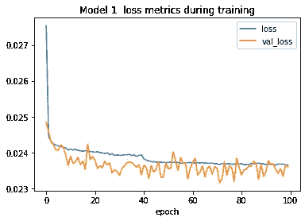
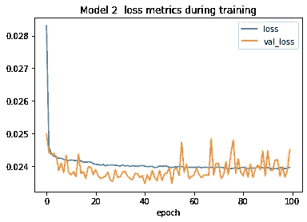

# 贷款风险的自然语言处理

> 原文：<https://towardsdatascience.com/loan-risk-nlp-d98021613ff3?source=collection_archive---------22----------------------->

## 向 Keras 模型添加空间单词向量


照片由[亚伦·伯顿](https://unsplash.com/@aaronburden)在 [Unsplash](https://unsplash.com/) 上拍摄

1.  [**故事至此**](#bae0)
2.  [**探索性数据分析**](#6f29)
3.  [**输入缺失值**](#f826)
4.  [**优化数据类型**](#d61a)
5.  [**创建文档向量**](#5c1c)
6.  [**建筑管道**](#bb56)
7.  [**评估模型**](#83b3)
8.  [**下一步**](#149e)

# 故事到此为止

几个月前，我[建立了一个神经网络回归模型](/loan-risk-neural-network-30c8f65f052e)来预测贷款风险，用来自 [LendingClub](https://www.lendingclub.com/) 的[公共数据集](https://www.kaggle.com/wordsforthewise/lending-club)对其进行训练。然后我用 [Flask](https://flask.palletsprojects.com/en/1.1.x/) 构建了一个[公共 API](https://tywmick.pythonanywhere.com/) 来服务模型的预测。

然后上个月，我决定测试我的模型，发现我的模型可以比 LendingClub 更好地挑选 A 级贷款！

但我还没说完。既然我已经学习了自然语言处理的基础知识(我强烈推荐 [Kaggle 关于这个主题的课程](https://www.kaggle.com/learn/natural-language-processing)，我将看看我是否可以使用数据集中的两个自由形式的文本字段:`title`和`desc`(描述)来增加一点预测能力。

```
This dataset includes 1,110,171 loans.
```

```
5 rows × 69 columns
```

这篇文章和之前的文章一样，改编自一个 Jupyter 笔记本，所以如果你想继续的话，可以随意把我的笔记本放到 [Kaggle](https://www.kaggle.com/tywmick/natural-language-processing-for-loan-risk) 或 [GitHub](https://github.com/tywmick/loan-risk-neural-network/blob/master/models/loan-risk-nlp.ipynb) 上。

# 探索性数据分析

在我的第一篇帖子中彻底清理了数据后，没有太多的探索性数据分析要做，但是在我继续之前，我确实有几个关于字段的问题要回答。

*   每个字段使用多少贷款？
*   贷款申请中是否一直包含这些字段？
*   每个字段的典型长度是多少(字数)？

如果最常见的`desc`值是空的(或者可能只是空白)，也许我需要在继续之前将所有空的或者只有空白的值转换成`NaN`。

谢天谢地，这并没有减少太多的价值，但这个“借款人在[日期]添加”的交易现在让我担心。我过会儿会处理那个。

```
`title` is used in 98% of loans in the dataset.
`desc` is used in 6% of loans in the dataset.
The title "Debt consolidation" is used in 51% of loans.
```

这些字段可能没有我之前想的那么有用。尽管整个数据集中使用了 35，860 种独特的图书，但其中 51%只使用了“债务合并”。可能另外 49%里标题更有描述性？

而`desc`字段仅用于 6%的贷款。

现在检查并查看这些字段是何时引入的。

```
Total date range:
min   2012-08-01
max   2018-12-01
Name: issue_d, dtype: datetime64[ns]`title` date range:
min   2012-08-01
max   2018-12-01
Name: issue_d, dtype: datetime64[ns]`desc` date range:
min   2012-08-01
max   2016-07-01
Name: issue_d, dtype: datetime64[ns]
```

这两个字段都不是最近才引入的，但是它们可能在数据库的最后两年已经停止使用`desc`字段了。

现在，我将进一步了解这些字段中的值。

```
Debt consolidation                       573992
Credit card refinancing                  214423
Home improvement                          64028
Other                                     56166
Major purchase                            20734
Medical expenses                          11454
Debt Consolidation                        10638
Business                                  10142
Car financing                              9660
Moving and relocation                      6806
Vacation                                   6707
Home buying                                5097
Consolidation                              4069
debt consolidation                         3310
Credit Card Consolidation                  1607
consolidation                              1538
Debt Consolidation Loan                    1265
Consolidation Loan                         1260
Personal Loan                              1040
Credit Card Refinance                      1020
Home Improvement                           1016
Credit Card Payoff                          991
Consolidate                                 947
Green loan                                  626
Loan                                        621
                                          ...
House Buying Consolidation                    1
Credit Card Deby                              1
Crdit cards                                   1
"CCC"                                         1
Loan to Moving & Relocation Expense           1
BILL PAYMENT                                  1
creit card pay off                            1
Auto Repair & Debt Consolidation              1
BMW 2004                                      1
Moving Expenses - STL to PHX                  1
 Pay off Bills                                1
Room addition                                 1
Optimistic                                    1
Consolid_loan2                                1
ASSISTANCE NEEDED                             1
My bail out                                   1
myfirstloan                                    1
second home                                   1
Just consolidating credit cards               1
Financially Sound Loan                        1
refinance loans and home improvements          1
credit cart refincition                        1
Managable Repayment Plan                      1
ccdebit                                       1
Project Pay Off Debt                          1
Name: title, Length: 35863, dtype: int64
```

有意思。在另外 49%的地区，似乎有很多不同的贷款名称。它们中的许多似乎直接对应于`purpose`分类字段，但我认为没有多到使这个字段无用。

附注:在阅读本专栏时，我发现有人输入了 [Konami 代码](https://en.wikipedia.org/wiki/Konami_Code)作为他们贷款申请的标题，他们被包含在这个数据集中意味着代码显然为他们工作——他们得到了贷款。

```
Borrower added on 03/17/14 > Debt consolidation<br>                                                                                                                                                                                                                                        9
  Borrower added on 01/15/14 > Debt consolidation<br>                                                                                                                                                                                                                                        7
  Borrower added on 02/19/14 > Debt consolidation<br>                                                                                                                                                                                                                                        7
  Borrower added on 03/10/14 > Debt consolidation<br>                                                                                                                                                                                                                                        7
  Borrower added on 01/29/14 > Debt consolidation<br>                                                                                                                                                                                                                                        7
                                                                                                                                                                                                                                                                                            ..
  Borrower added on 01/14/13 > Credit Card consolidation<br>                                                                                                                                                                                                                                 1
  Borrower added on 03/14/14 > Debts consolidation and cash for minor improvements on condominium<br>                                                                                                                                                                                        1
  Borrower added on 03/02/14 > I lost a house and need to pay taxes nd have credit card debt thatI already pay $350 a month on and it goes nowhere.<br>                                                                                                                                      1
  Borrower added on 04/09/13 > I want to put in a conscious effort in eliminating my debt by converting high interest cards to a fixed payment that can be effectively managed by me.<br>                                                                                                    1
  Borrower added on 09/18/12 > Want to become debt free, because of several circumstances and going back to school I got into debt. I want to pay for what I have purchased without it having an effect on my credit. That is why I want to consolidate my debt and become debt free!<br>    1
Name: desc, Length: 70925, dtype: int64
```

所有这些描述都是以“借款人于[日期]添加”开头吗？

```
71,858 loan descriptions begin with that pattern. (85 do not.)
```

现在我需要检查其他 85 个。

```
Debt Consolidation                                                                                                                                                                                                                                                                                                                                                                                                                                                                                                                                                                                                                                                                                                                                                                                                                                                                                                                                                                                                                                                                                                                                                                                                 2
I would like to pay off 3 different credit cards, at 12%, 17% and 22% (after initial 0% period is up).  It would be great to have everything under one loan, making it easier to pay off.  Also, once I've paid off or down the loan, I can start looking into buying a house.                                                                                                                                                                                                                                                                                                                                                                                                                                                                                                                                                                                                                                                                                                                                                                                                                                                                                                                                     1
loan will be used for paying off credit card.                                                                                                                                                                                                                                                                                                                                                                                                                                                                                                                                                                                                                                                                                                                                                                                                                                                                                                                                                                                                                                                                                                                                                                      1
This loan will be used to consolidate high interest credit card debt.    Over the course of this past year my wife and I had our first child, purchase a home and received a large bonus from work.  With the new home and the child on the way I chose to spread my tax withholdings on the bonus to all checks received in 2008 this caused my monthly income to fall by $1500\.  This in combination with an unexpected additional down payment for our home of $17,000 with only a weeks notice we were force to dip into our Credit Cards for the past several months.    Starting January 1, 2009 I will be able to readjust my tax withholding and start to pay off the Credit Card debt we have racked up.  This loan will help lower the interest rate during the repayment period and give one central place for payment.  My wife and I have not missed a payment or been late for the past 5 years.  My fico score is 670 mainly due to several low limit credit cards near their max.  I manage the international devision of a software company and my wife is a kindergarten teacher, combined we make 140K a year.    Thank you for your consideration and I look forward to working with you.      1
to pay off different credit cards to consolidate my debt, so I can have just one monthly payment.                                                                                                                                                                                                                                                                                                                                                                                                                                                                                                                                                                                                                                                                                                                                                                                                                                                                                                                                                                                                                                                                                                                  1
                                                                                                                                                                                                                                                                                                                                                                                                                                                                                                                                                                                                                                                                                                                                                                                                                                                                                                                                                                                                                                                                                                                                                                                                                  ..
Hello, I would like to consolidate my debt into a lower more convenient payment. I have a very stable career of more than 20 years with the same company. My community is in a part of the country that made it through the last few years basically unscathed and has a very promising future.<br>Thank You<br>                                                                                                                                                                                                                                                                                                                                                                                                                                                                                                                                                                                                                                                                                                                                                                                                                                                                                                   1
consolidate my debt                                                                                                                                                                                                                                                                                                                                                                                                                                                                                                                                                                                                                                                                                                                                                                                                                                                                                                                                                                                                                                                                                                                                                                                                1
I am looking to pay off my credit card debts.                                                                                                                                                                                                                                                                                                                                                                                                                                                                                                                                                                                                                                                                                                                                                                                                                                                                                                                                                                                                                                                                                                                                                                      1
This loan is to help me payoff my credit card debt. I've done what I can to negotiate lower rates, but the interest is killing me and my monthly payments are basically just taking care of interest. Paying them off will give me the fresh start I need on my way to financial independence. Thank you.                                                                                                                                                                                                                                                                                                                                                                                                                                                                                                                                                                                                                                                                                                                                                                                                                                                                                                          1
I have been in business for a year and want to eliminate some personal debt and use the remainder of the loan to take care of business expenses. Also lessening the number of trade lines I have open puts me in a better position to pursue business loans since it will  be based on my personal credit. A detailed report can be created to show where exactly the funds will go and this can be provided at any time during the course of the loan.                                                                                                                                                                                                                                                                                                                                                                                                                                                                                                                                                                                                                                                                                                                                                            1
Name: desc, Length: 84, dtype: int64
```

看起来借款人可以在不同的时间点向描述中添加信息。我应该检查一下，看看这些日期是否在贷款的实际发放日期之后。

```
2014-01-01 00:00:00 –   Borrower added on 01/08/14 > I am tired of making monthly payments and getting nowhere.  With your help, except for my mortgage, I intend to be completely debt free by 12/31/2016.<br>
2014-01-01 00:00:00 –   Borrower added on 01/08/14 > We have been engaged for  2 1/2yrs and wanted to bring out blended family together as one. We are set to get married on 03/22/14 and we are paying for it on our own. We saved the majority of the budget unfortunately there were a few unexpected cost that we still need help with.<br>
2014-01-01 00:00:00 –   Borrower added on 01/06/14 > I am getting married 04/05/2014 and I want to have a cushion for expenses just in case.<br>
2014-01-01 00:00:00 – BR called in to push payment date to 09/19/14 because of not having the exact amount of funds in their bank account.  Payment was processing. Was able to cancel. It is within grace period.
2014-01-01 00:00:00 –   Borrower added on 01/01/14 > This loan is to consolidate my credit cards debt. I made one year this past  11/28/2013 at my current job. I considered to have job security because I'm a good employee. I make all may credit cards payments on time.<br>
2013-05-01 00:00:00 –   Borrower added on 04/27/13 > My father passed away 05/12/2012 and I had to pay for the funeral.  My mother could not afford it.  He was not ill so I could not have planned it.  I paid with what I had in my savings and the rest I had to pay with my credit cards.  I would like to pay off the CC &amp; pay one monthly payment.<br><br>  Borrower added on 04/27/13 > My paerents own the house so I do not pay rent.    The utilities, insurance and taxes, etc my mother pays.  She can afford that.  I help when needed.<br>
2013-02-01 00:00:00 –   Borrower added on 02/10/13 > I am getting married in a week (02/17/2013) and have made some large purchases across my credit cards.  I would like to consolidate all of my debt with this low rate loan.<br><br> Borrower added on 02/10/13 > I will be getting married in a week (02/17/13) and have had to make some large purchases on my CC. I am financially sound otherwise with low debt obligations.<br>
2012-12-01 00:00:00 –   Borrower added on 12/10/12 > Approximately 1 year ago I had a highefficency furnace /AC installed.  The installing Co. used GECRB to get me a loan.  If I payoff the loan within one year, I pay no interest.  The interest rate if not payed by 12/23/2012 is 26.99%.  A 6.62% rate sounds a lot better.<br>
2012-11-01 00:00:00 –   Borrower added on 11/19/12 > Looking to finish off consolidating the rest of my bills and lower my payments on my exsisting loan. Thanks!!!<br><br>  Borrower added on 11/20/12 > Thanks again for everyone who has invested thus far. With this loan it will give me the ability to have only one payment monthly besides utilities and I will be almost debt free by my wedding date of 12/13/14!! Thanks again everyone!<br>
2012-10-01 00:00:00 –   Borrower added on 10/22/12 > Need money by 10/26/2012 to purchase property on discounted APR.<br>
```

很好，所有在贷款发放月之后的日期都出现了，因为借款人在谈论未来的事件。

现在，为了清理这些`desc`值，我将删除`Borrower added on [date] >`和`<br>`，因为它们不会给描述内容增加价值。

# 输入缺失值

由于这一组中只有 2%的贷款缺少一个标题，并且由于大多数标题只是简单地复制了贷款的`purpose`，我将根据贷款的目的来估算缺少的标题。

由于只有 6%的贷款使用了描述，我将用一个空字符串来估算缺失的描述。不过，我打算等一会儿再把它作为管道步骤包括进来。

# 优化数据类型

我真的很想直接进入有趣的部分，将这些文本字段转换成文档向量，但是我头几次尝试这样做时遇到了一个问题。向这个 1，110，171 行的数据帧中手动添加两组 300 维的向量导致其在内存中的大小飙升，耗尽了 Kaggle 给我的 16GB。

我第一次尝试解决这个问题是优化我的数据类型，这本身仍然不能解决问题，但不管怎样，这是值得采取的一步。

删除不再需要的`issue_d`列后，数据集包含五种类型的数据:浮点型、整数型、序数型、(无序)分类型和文本型。

```
Reduced DataFrame size in memory by 69%.
```

# 创建文档向量

*现在*有趣的部分。将我的 [spaCy](https://spacy.io/) 文档向量函数包装在 scikit-learn `[FunctionTransformer](https://scikit-learn.org/stable/modules/generated/sklearn.preprocessing.FunctionTransformer.html)`中被证明是将这个过程保持在内存限制内的秘密。Scikit-learn 必须比我使用的任何手动过程都更好地优化(如图)。

# 建设管道

首先，变压器。我将使用 scikit-learn 的`[ColumnTransformer](https://scikit-learn.org/stable/modules/generated/sklearn.compose.ColumnTransformer.html)`对不同类型的数据应用不同的转换。

这个模型本身将与我之前的[模型](https://www.kaggle.com/tywmick/building-a-neural-network-to-predict-loan-risk#Building-the-neural-networks)相同，但是我将使用 Keras 回调和一个 [tqdm](https://github.com/tqdm/tqdm) 进度条来使训练日志更加简洁。

# 评估模型

```
/opt/conda/lib/python3.7/site-packages/pandas/core/strings.py:2001: UserWarning: This pattern has match groups. To actually get the groups, use str.extract.
  return func(self, *args, **kwargs) [Pipeline] ....... (step 1 of 3) Processing nlp_imputer, total=   0.4s
[Pipeline] .... (step 2 of 3) Processing nlp_vectorizer, total= 1.2min
[Pipeline] ........ (step 3 of 3) Processing nlp_scaler, total=   8.6s
[ColumnTransformer] ...... (1 of 7) Processing nlp_cols, total= 1.3min
[ColumnTransformer] .... (2 of 7) Processing emp_length, total=   0.2s
[ColumnTransformer] .......... (3 of 7) Processing term, total=   0.3s
[ColumnTransformer]  (4 of 7) Processing home_ownership, total=   0.3s
[ColumnTransformer] ....... (5 of 7) Processing purpose, total=   0.3s
[ColumnTransformer]  (6 of 7) Processing application_type, total=   0.3s
[ColumnTransformer] ..... (7 of 7) Processing remainder, total=   1.3s Training model: 100%|██████████| 100/100 [23:41<00:00, 14.22s/epoch] Final metrics: loss: 0.02365 - val_loss: 0.02360
```



嗯，它没有过度拟合，但这个模型的表现有点*差*比我原来的，它已经解决了大约 0.0231 的损失。我敢打赌,`desc`特性正在碍事——在 94%的行上跨越 300 列输入数据的零可能会使模型非常混乱。我将会看到，如果我重复这个过程，同时去掉`desc`(使`title`向量成为这个模型与我原来的模型相比唯一的新特征)，会发生什么。

```
/opt/conda/lib/python3.7/site-packages/pandas/core/strings.py:2001: UserWarning: This pattern has match groups. To actually get the groups, use str.extract.
  return func(self, *args, **kwargs) [Pipeline] ....... (step 1 of 3) Processing nlp_imputer, total=   0.1s
[Pipeline] .... (step 2 of 3) Processing nlp_vectorizer, total=  41.3s
[Pipeline] ........ (step 3 of 3) Processing nlp_scaler, total=   4.6s
[ColumnTransformer] ...... (1 of 7) Processing nlp_cols, total=  45.9s
[ColumnTransformer] .... (2 of 7) Processing emp_length, total=   0.2s
[ColumnTransformer] .......... (3 of 7) Processing term, total=   0.3s
[ColumnTransformer]  (4 of 7) Processing home_ownership, total=   0.3s
[ColumnTransformer] ....... (5 of 7) Processing purpose, total=   0.3s
[ColumnTransformer]  (6 of 7) Processing application_type, total=   0.3s
[ColumnTransformer] ..... (7 of 7) Processing remainder, total=   1.1s Training model: 100%|██████████| 100/100 [22:26<00:00, 13.46s/epoch] Final metrics: loss: 0.02396 - val_loss: 0.02451
```



哇，还是不够好，打不过我原来的模型。为了好玩，我还尝试了额外的跑步，我训练了 1000 个周期，其他的我把前两个密集层的节点数增加到 128 和 64。我试着把批量减少到 64。但是，这些都没有打败我原来的模型。我认为这些文本特征在贷款结果方面没有预测性。有意思。

# 后续步骤

如果增加这两个特征降低了预测能力，那么也许我已经使用的一些其他变量也在做同样的事情。我应该尝试使用 scikit-learn 的一些[特征选择方法](https://scikit-learn.org/stable/modules/feature_selection.html)来减少输入数据的维数。

一种更有效的超参数优化方法也会非常有用。我应该给 AutoKeras 一个机会。

嗯，那很有趣！对如何更好地将语言数据集成到模型中有什么想法吗？请回复——我很想听听他们的意见！