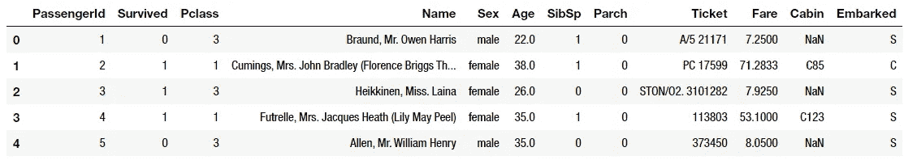
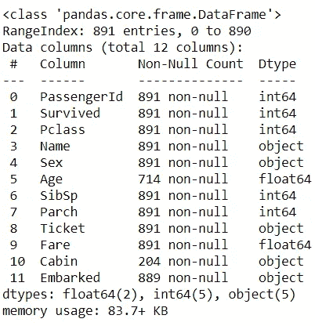
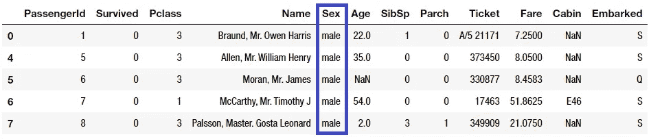
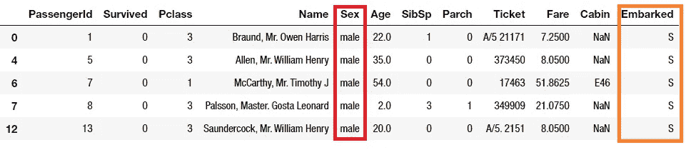
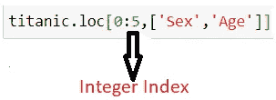
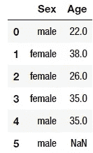
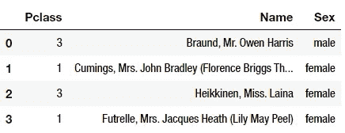

# 熊猫的 Loc 和 iLoc 功能

> 原文：<https://towardsdatascience.com/loc-and-iloc-functions-in-pandas-aea7f775de2a?source=collection_archive---------16----------------------->

## 如何在 Pandas 中访问数据帧的一部分？


克里斯·里德在 Unsplash 拍摄的照片

Pandas 中的 Loc 和 iLoc 函数用于对数据集进行切片。为了应用这些函数，我使用了可用的泰坦尼克号数据集[这里](https://www.kaggle.com/c/titanic/data)。这是来自 Kaggle 的泰坦尼克 ML completion，它主要用于初学者创建一个模型，预测哪些乘客在泰坦尼克号沉船事件中幸存。首先，让我们简单地看一下数据集，看看它有多少观察值和列。

# 数据

```
titanic.head()
titanic.info()
```



# 。锁定功能

这个函数主要是基于标签的，但是当我们创建语句时，它也和一个布尔数组一起使用。如果我们想在这里只查看男性客户的行，我可以使用熊猫。DataFrame.loc 用于用标签定位。

```
titanic.loc[titanic[‘Sex’]==’male’]
```



它给了我一份所有男性乘客的名单。我们可以对每一位顾客进行同样的操作。

熊猫。DataFrame.loc 用于访问多个列。例如，如果我想定位登船的所有男性乘客和“S”(“Southampton”)，我可以创建两个条件来给我一部分数据帧。

```
titanic.loc[(titanic['Sex']=='male') & (titanic['Embarked']=='S')].head()
```



使用很重要。当我们使用列时，用标签锁定函数。如果它们是整数索引也是可以使用的。



# 。iloc 功能

的。iloc 函数基于整数位置，但也可以用于布尔数组。如果我想定位数据集的某个单元格，我可以写下:

```
titanic.iloc[0,0]
```

这个命令给出行=0，列= 0 的元素。我也可以提取数据集的一部分。

```
titanic.iloc[0:4,2:5]
```



在本例中，它为我们提供了 0 到 3 行和 2 到 4 列。

# 结论

使用的主要目的。loc 和 iloc 正在对熊猫的数据帧进行切片。功能。loc 主要用于标签索引和。iloc 函数主要用于整数索引。

我还谈到了熊猫的另一个内置功能。有兴趣的话在[这里](https://medium.com/@s.sadathosseini/pandas-merge-df-1-df-2-aec22f879fea)合并()。

本文使用的所有代码都可以从我的 [**GitHub**](https://github.com/shosseini811/Titanic/blob/master/Titanic%20TWS.ipynb) 中访问。我期待听到反馈或问题。