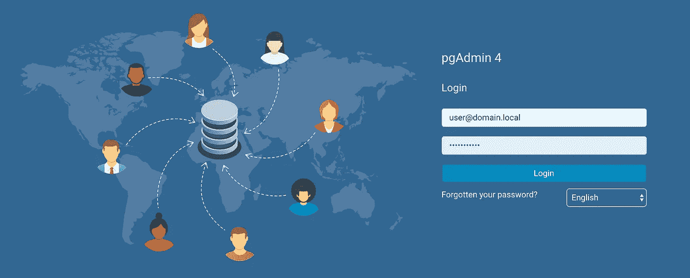
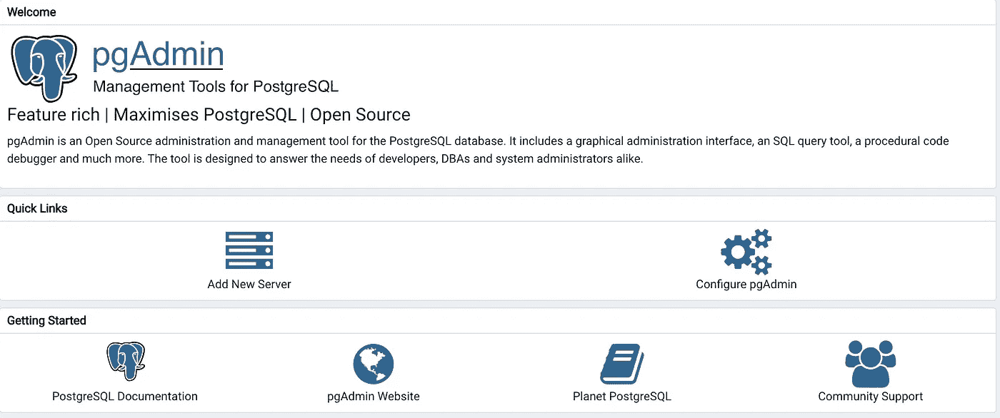
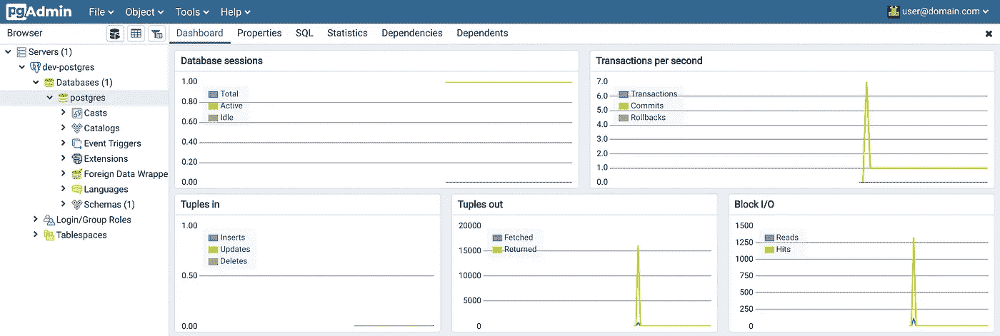

# 用 Docker 进行 PostgreSQL 的本地开发设置

> 原文：<https://towardsdatascience.com/local-development-set-up-of-postgresql-with-docker-c022632f13ea?source=collection_archive---------0----------------------->

## 用 Docker 容器设置开发 SQL 的本地环境的简单方法


阿姆斯特丹的地方设置，来源:由 [Unsplash](https://unsplash.com/s/photos/amsterdam?utm_source=unsplash&utm_medium=referral&utm_content=creditCopyText) 上的 [Ehud Neuhaus](https://unsplash.com/@paramir?utm_source=unsplash&utm_medium=referral&utm_content=creditCopyText) 拍摄的照片

# 介绍

当您面临一个必须使用 SQL 的项目或技术任务时，您要么需要访问数据库，要么需要将它安装在本地。这两种情况都很烦人，所以我将解释当我面临这种情况时我通常会做什么，同时等待提供完整的基础设施和访问。

在这篇短文中，我将指导您运行一个 PostgreSQL 容器和一个 pgAdmin 容器。之后，我将向您展示如何使用 pgAdmin 门户连接到数据库实例来运行您的查询。您可以将此作为开发 SQL 的简单设置，作为应用程序的一部分，或者只是为了练习您的 SQL 技能。

我将使用 [Docker(版本 19.03.8)](https://docs.docker.com/docker-for-mac/install/) ，所以确保你已经在你的机器上安装了它。

# 正在启动 PostgreSQL 实例

这里我们要做的是首先下载 PostgreSQL 映像，检查映像是否准备好，最后用特定的参数运行映像。

您可以通过在命令行中运行以下命令，从 docker hub 存储库中下载 Postgres 的 Docker 官方映像。

```
$ docker pull postgres
```

你可以在这里找到镜像的文档: [PostgreSQL 镜像文档](https://github.com/docker-library/docs/blob/master/postgres/README.md)。

下载图像后，您可以检查是否可以使用:

```
$ docker images
>>>
REPOSITORY    TAG       IMAGE ID        CREATED        SIZE
postgres      latest    9907cacf0c01    2 weeks ago    314MB
```

我们将创建一个本地文件夹，并将其挂载为运行容器的数据卷，以便将所有数据库文件存储在一个已知的位置。在“run”命令中，我们还将把端口从主机映射到正在运行的容器以及 Postgres 默认用户的密码。

```
## 1\. Create a folder in a known location for you
$ mkdir ${HOME}/postgres-data/## 2\. run the postgres image
$ docker run -d \
	--name dev-postgres \
	-e POSTGRES_PASSWORD=Pass2020! \
	-v ${HOME}/postgres-data/:/var/lib/postgresql/data \
        -p 5432:5432
        postgres## 3\. check that the container is running
$ docker ps
>>>
CONTAINER ID        IMAGE               COMMAND                  CREATED             STATUS              PORTS                    NAMES
dfa570d6e843        postgres            "docker-entrypoint.s…"   27 hours ago        Up 3 seconds        0.0.0.0:5432->5432/tcp   postgres-test
```

很好，您有一个正在运行的 **PostgreSQL** 实例，您应该能够从命令行进入容器并测试数据库实例:

```
$ docker exec -it dev-postgres bash
>>> Now you are in the container's bash console. Connect to the database
root@dfa570d6e843:/# psql -h localhost -U postgres
>>>
psql (12.2 (Debian 12.2-2.pgdg100+1))Type "help" for help.postgres-# \lList of databases
Name       |  Owner   | Encoding |  Collate   |   Ctype    |   ...
-----------+----------+----------+------------+------------+------postgres   | postgres |   UTF8   | en_US.utf8 | en_US.utf8 |   ...
```

您应该会看到 Postgres 数据库和与上面类似的输出。

数据库服务到此结束，现在让我们设置数据库管理工具。

# 启动 pgAdmin 实例

pgAdmin 是 PostgreSQL 最流行、功能最丰富的开源管理和开发平台。您将使用它来管理 DB 实例，以及对它的表运行查询。

您将使用这个 [docker 映像](https://hub.docker.com/r/dpage/pgadmin4/)将其部署到一个容器中。使用以下命令获取映像并运行映像的实例:

```
$ docker pull dpage/pgadmin4
$ docker run \ 
    -p 80:80 \
    -e 'PGADMIN_DEFAULT_EMAIL=user@domain.local' \
    -e 'PGADMIN_DEFAULT_PASSWORD=SuperSecret' \
    --name dev-pgadmin \ 
    -d dpage/pgadmin4
```

我们传递给 docker run 命令的参数是:

*   `-p 80:80`:该参数告诉 docker 将容器中的端口 80 映射到你的计算机(Docker 主机)中的端口 80
*   `-e 'PGADMIN_DEFAULT_EMAIL`:默认用户电子邮件的环境变量，以后您将使用它登录门户
*   `-e 'PGADMIN_DEFAULT_PASSWORD'`:默认用户密码的环境变量
*   `-d`:该参数告诉 docker 以分离模式启动容器
*   `dpage/pgadmin4`:这个参数告诉 docker 使用我们之前下载的图像

让我们检查一下容器是否已经启动并正在运行，您还应该看到前一个容器正在运行:

```
$ docker ps
>>>
CONTAINER ID        IMAGE               COMMAND                  CREATED             STATUS              PORTS                         NAMES
7b15fe4c1cbd        dpage/pgadmin4      "/entrypoint.sh"         43 hours ago        Up 5 seconds        0.0.0.0:80->80/tcp, 443/tcp   dev-pgadmin
```

这就是你所有的服务启动和运行。下一步是从 pgAdmin 控制台连接到 PostgreSQL 实例。

# 从 pgAdmin 工具访问 PostgreSQL

我们没有为这些容器定义任何网络，所以它们应该运行在默认的网络上，如果您试图通过它们的端口访问数据库或 web 门户，通过“localhost”或“127.0.0.1”连接就可以了；但是如果您尝试从一个容器连接到另一个容器，您可能会遇到一些连接问题。

我们需要在我们的主机上查找 PostgreSQL 容器的 IP 地址，您可以为它运行以下命令:

```
$ docker inspect dev-postgres -f "{{json .NetworkSettings.Networks }}"
```

`docker inspect`返回 Docker 对象的底层信息，在本例中是' **dev-postgres** '实例的 IP 地址。在给定 Go 模板的情况下，`-f`参数将输出格式化为 JSON。输出应该如下所示:

```
{"bridge":{"IPAMConfig":null,"Links":null,"Aliases":null,"NetworkID":"60c21f5cfcaaff424a0e4a22463dc8f9a285993de04e7ac19ce5fd96bba56a47","EndpointID":"be6e45b659c30bd12aa766d7003a2887607053684b68574e426f8823104b18a2","Gateway":"172.17.0.1",**"IPAddress":"172.17.0.2"**,"IPPrefixLen":16,"IPv6Gateway":"","GlobalIPv6Address":"","GlobalIPv6PrefixLen":0,"MacAddress":"02:42:ac:11:00:02","DriverOpts":null}}
```

将 IPAddress 值复制到剪贴板，在我的例子中是 172.17.0.2，您需要在 pgAdmin 工具中定义连接。

下一步是转到您的 web 浏览器，键入 [http://localhost:80](http://localhost:80) 。



pgAdmin 登录门户， [http://localhost:80。来源:当地](http://localhost:80.)

您应该键入运行容器时写下的用户电子邮件和密码。

进入门户后，您需要添加一个新服务器，方法是单击“**添加新服务器**”，并在弹出窗口中添加正确的信息，确保您在连接选项卡下的*主机名/地址*中添加了之前复制的 IP 地址。



来自 pgAdmin 工具的欢迎页面。来源:当地

创建连接后，您应该会在屏幕右侧看到服务器。此时，您已经准备好开始构建您的数据库和表格，上传数据并查询您的分析或应用程序。



pgAdmin 工具上的服务器仪表板。来源:当地

# 包扎

让我们回顾一下到目前为止我们所做的工作:

1.  用 Docker 独立运行 PostgreSQL 实例
2.  用 Docker 独立运行一个 pgAdmin 服务器
3.  设置 pgAdmin 和 PostgreSQL 之间的连接

您应该准备好直接在 PostgreSQL 上开发数据库、表和查询。您可以使用 UI 将文件直接导入到表中。

您还可以从本地的 python 应用程序连接到这个数据库，然后将结果加载到这个 Postgres 数据库，并使用 Python 或 pgAdmin 工具查询这些表。这取决于你如何使用这个堆栈，好的方面是你不需要等待一个基础设施的家伙给你一个数据库的访问权来开始你的主要目标，这是你的分析，应用程序，功能或简单的 SQL 培训(即使是你的下一个技术面试任务)。

您还可以使用 Docker-compose 文件来完成所有这些设置，您可以在该文件中定义 PostgreSQL 服务和 pgAdmin 服务以及环境变量、卷和端口映射，并运行 docker-compose up。结果应该是一样的。

我希望这篇文章为您提供了足够的信息，告诉您如何在您的计算机上用 Docker 设置一个 SQL 实例来直接处理数据库、表和查询。如果您有任何问题或建议，请告诉我，我很乐意与您跟进。