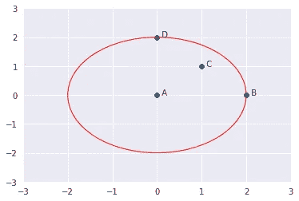
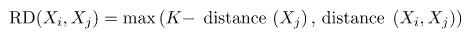
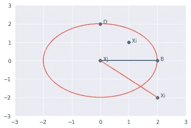
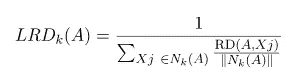
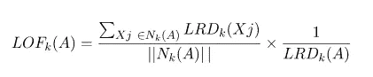
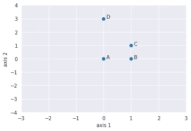
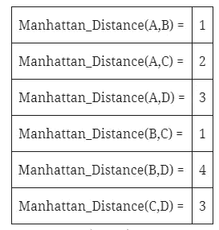
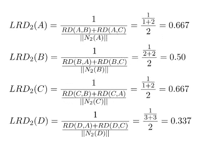
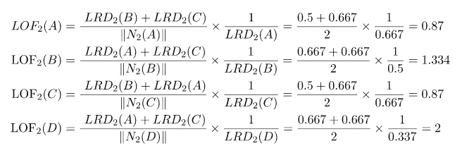

# 局部异常因子(LOF)——异常识别算法

> 原文：<https://towardsdatascience.com/local-outlier-factor-lof-algorithm-for-outlier-identification-8efb887d9843?source=collection_archive---------2----------------------->

## 使用 LOF 值检测异常

图片由 Pexels 的 Markus Spiske 提供

# 目录:

1.  介绍
2.  K-距离和 K-邻居
3.  可达性距离
4.  本地可达性距离(LRD)
5.  本地异常因素(LOF)
6.  例子
7.  LOF 的优势
8.  LOF 的缺点
9.  结论
10.  参考

## 1.介绍

离群值是不同于或远离其余数据点的数据点。这里出现的问题是，我们能识别数据中的异常值吗？

图片来自 Pexels 的[皮克斯拜](https://www.pexels.com/photo/board-game-box-business-card-262028/)

局部异常值因子(LOF)是一种识别数据集中异常值的算法。但是**本地异常值**意味着什么呢？

当一个点被认为是基于其局部邻域的异常值时，它是一个**局部异常值**。考虑到邻域的密度，LOF 将识别异常值。当整个数据集中的数据密度不同时，LOF 表现良好。

要理解 LOF，我们必须依次学习几个概念:

*   K-距离和 K-邻居
*   可达性距离
*   本地可达性密度(LRD)
*   本地异常因素(LOF)

## 2.K-距离和 K-邻居

**K-distance** 是该点与它的 Kᵗʰ最近邻之间的距离。**k-邻居**由 Nₖ(A 表示)包括位于半径为 k-距离的圆内或圆上的一组点。K-neighbors 可以大于或等于 k 的值。这怎么可能呢？

我们会看到一个例子。假设我们有四个点 A、B、C 和 D(如下所示)。

K=2 时 A 的距离

如果 K=2，a 的 k 个邻居将是 c、b 和 d。这里，k 的值=2，但||N₂(A)|| = 3。因此，||Nₖ(point)||将永远大于或等于 k

## 3.可达性密度

它被定义为 Xj 的 K-距离和 Xi 与 Xj 之间的距离的最大值。距离度量是特定于问题的(欧几里德、曼哈顿等)。)

K=2 时可达性距离的图示

通俗地说，如果一个点 Xi 位于 Xj 的 K 个邻居内，则可达性距离将是 Xj 的 K 个距离(蓝线)，否则可达性距离将是 Xi 和 Xj 之间的距离(橙线)。

## 4.本地可达性密度(LRD)

LRD 是 A 到其邻居的平均可达距离的倒数。直观地根据 LRD 公式，平均可达性距离越大(即邻居离该点越远)，特定点周围存在的点密度越小。这表示一个点离最近的点簇有多远。LRD 的低值意味着最近的聚类远离该点。

## 5.本地异常因素(LOF)

每个点的 LRD 用于与其 K 个邻居的平均 LRD 进行比较。LOF 是 A 的 K 个邻居的平均 LRD 与 A 的 LRD 之比

直观上，如果该点不是离群点(内点)，则邻居的平均 LRD 之比大约等于该点的 LRD(因为该点与其邻居的密度大致相等)。在这种情况下，LOF 几乎等于 1。另一方面，如果该点是异常值，则该点的 LRD 小于相邻点的平均 LRD。那么 LOF 的价值就会很高。

一般来说，如果 LOF 大于 1，它被认为是一个异常值，但并不总是如此。假设我们知道数据中只有一个异常值，那么我们取所有 LOF 值中最大的 LOF 值，对应最大 LOF 值的点将被视为异常值。

## 6.例子

4 点:A(0，0)，B(1，0)，C(1，1)和 D(0，3)，K=2。我们将使用 LOF 来检测这 4 个点中的一个异常值。

A(0，0)，B(1，0)，C(1，1)和 D(0，3)

按照上面讨论的程序:

首先，计算 K=2 的所有点的**K-距离**、**每对**、**点之间的距离以及**K-邻域**。我们将使用**曼哈顿距离**来测量距离。**

k-distance(a)–>因为 c 是 a 的 2ᴺᴰ最近邻–> distance(a，c)= 2
k-distance(B)–>因为 a，c 是 b 的 2ᴺᴰ最近邻–>distance(b，c)或 distance(b，a)= 1
k-distance(c)–>因为 a 是 c 的 2ᴺᴰ最近邻–>distance(c，a)= 2
k-distance(d)–>因为

K-邻域(A) = {B，C}，| | N2(A)| | = 2
K-邻域(B) = {A，C}，| | N2(B)| | = 2
K-邻域(C)= {B，A}，| | N2(C)| | = 2
K-邻域(D) = {A，C}，| | N2(D)| = 2

K-distance(每对点之间的距离)和 K-neighborhood 将用于计算 LRD。

A、B、C 和 D 各点的 LRD

本地可达性密度(LRD)将用于计算本地异常因子(LOF)。

A、B、C 和 D 各点的 LOF

四个点中 LOF 最高的是 LOF。因此，D 是一个异常值。

## 7.LOF 的优势

如果一个点距离极其密集的聚类很近，则该点将被视为异常值。全局方法可能不会将该点视为异常值。但是 LOF 可以有效地识别局部异常值。

## 8.LOF 的缺点

因为 LOF 是一个比率，所以很难解释。没有特定的阈值，高于该阈值的点被定义为异常值。异常值的识别取决于问题和用户。

## 9.结论

局部异常值因子(LOF)值基于局部邻域识别异常值。它给出了比发现异常值的全局方法更好的结果。由于没有 LOF 阈值，因此选择一个点作为异常值取决于用户。

## 10.参考

Breunig，M. M .，Kriegel，H. P .，Ng，R. T .，和 Sander，J. (2000 年)。LOF:识别基于密度的局部异常值。在 *ACM sigmod 记录*(第 29 卷第 2 页第 93–104 页)中。ACM。