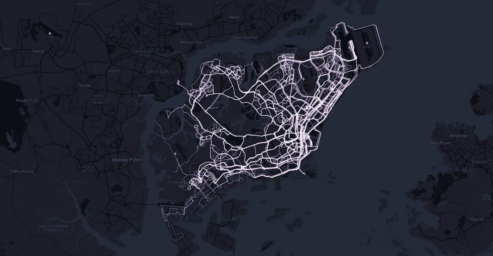
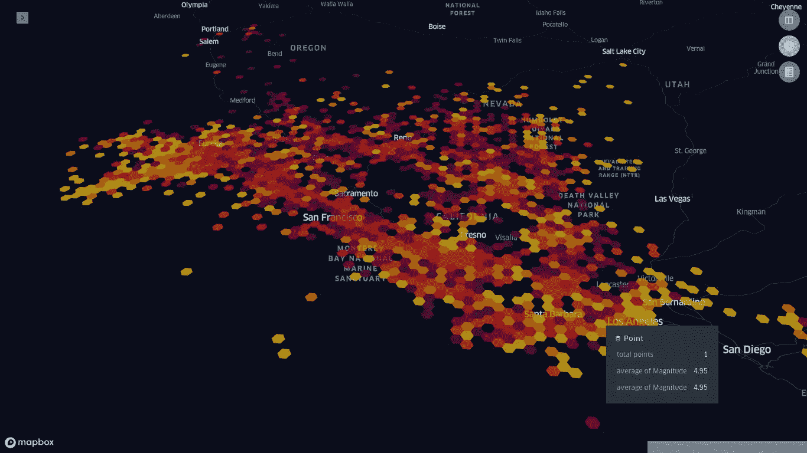
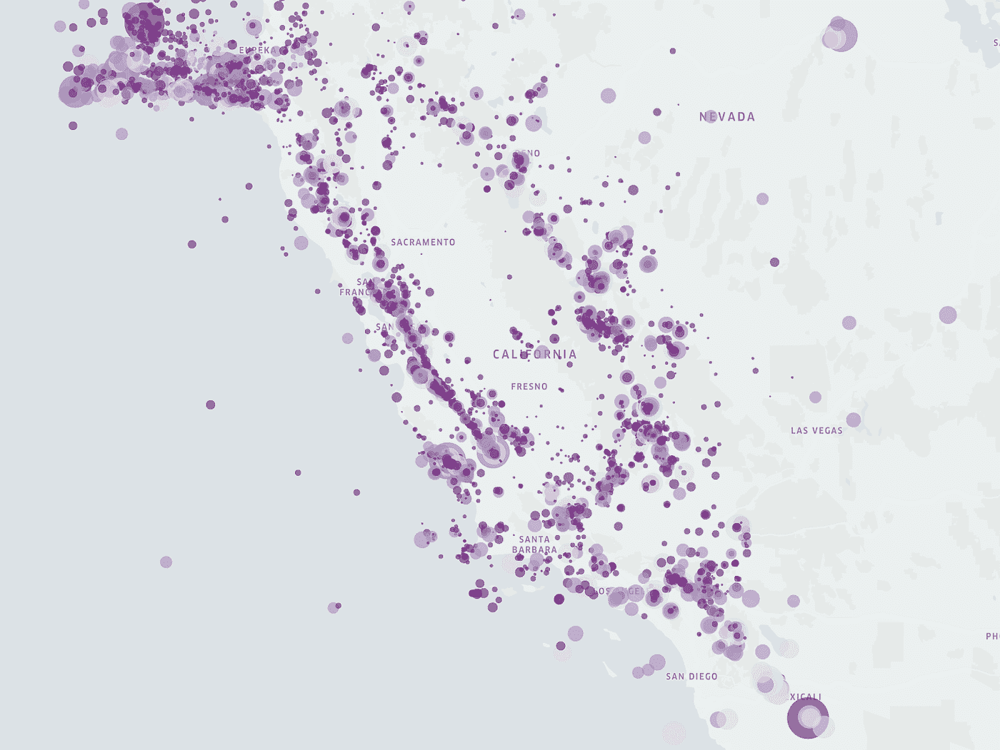
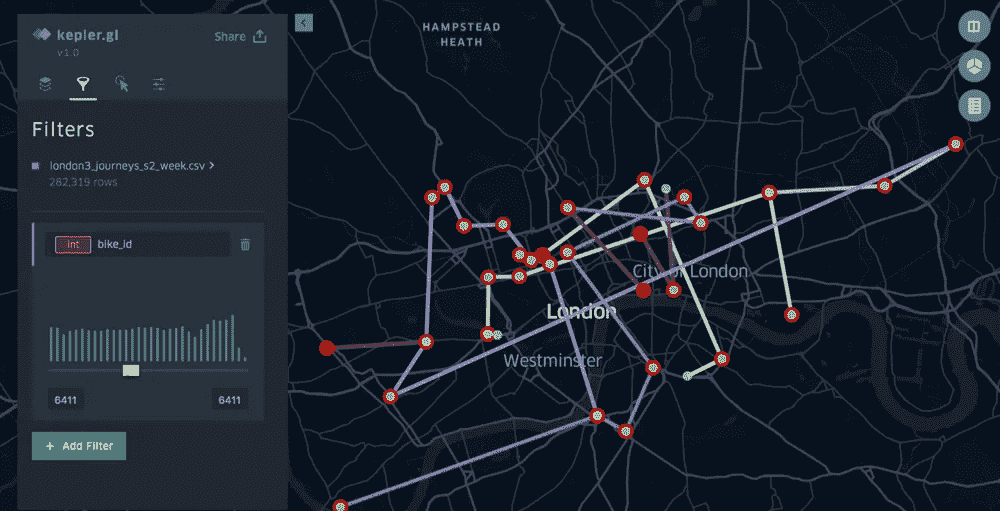

# 面向有地面业务的运输和移动公司的位置分析

> 原文：<https://towardsdatascience.com/location-analytics-for-delivery-mobility-companies-with-ground-operations-464527d80efd?source=collection_archive---------35----------------------->

## 地理空间洞察和分析

## 为了实现单位经济盈利，提高资产利用率和用户转化率

来源:Kepler.gl

# 1:供需分析:分析需求和供给之间的差距

对于按需公司(又名“X 的优步”)，这主要是一个三方市场，匹配需求和供应是业务的核心，也是极具挑战性的。此外，现实世界引入了比模型中更多的变异，导致了更为严酷的结果。

当供需缺口存在时，我们要么失去订单，要么我们的骑手闲置——这两者都会导致亏损。正常情况下，每个微移动公司都有匹配算法。但是，该算法在一天中的不同时间、一周中的不同日子、不同地点的表现如何呢？他们有模式吗？你是如何分析的？

供求分析。开普勒

> 供求分析帮助你解码供求之间的差距出现在哪里，什么时候，为什么会出现。每有一个单位的需求没有得到满足，你就失去了一个订单。对于每一个闲置的供应单位，你都在你的车辆上赔钱。

*分析供应和需求之间的差距有助于您优化利用率和未服务订单数量等指标。*

## 使用此分析可以做出的决策

根据一天中的时间、一周中的日期和位置，您可以决定:

*   **骑手激励:**需要给予骑手的激励，以使他们移动到更高需求的特定区域
*   **激增和折扣:**我们可以给用户的激增和折扣，以激励他们在高供应地区使用你的服务？

## 做出这些决定所需的洞察力

您可以从不同地点的需求和供应方面分析以下指标:

*   **订单丢失数量与订单频率:**您收到了多少订单，丢失的百分比是多少？
*   **闲置供应与总可用供应:**您有多少总供应，其中闲置的百分比是多少？
*   **丢失订单与可用供应的距离:**您丢失的订单与最近的闲置供应的距离是多少？

点击此处了解有关这些指标的更多信息:

 [## 在地理空间上弥合最后一英里递送公司的供需差距

### 当供需缺口存在时，我们要么失去订单，要么我们的骑手闲置-这两者都导致…

blog.locale.ai](https://blog.locale.ai/bridging-supply-demand-gaps-in-last-mile-delivery-companies-geospatially/) 

# 2:生命周期分析:D **脱落&跨旅程花费的时间**

就像 web 中有一个漏斗(访客->产品页面->定价页面->购买)，地面上也有一个漏斗(输入目的地->搜索车辆->预订车辆->开始行程)。生命周期分析本质上帮助您分析事件的空间和时间分布以及事件之间的分布。

人们在何时何地搜索最多？从选择交通工具到开始旅行，他们要走多远？

用户流失分析。来源:Kepler.gl

> 生命周期分析有助于您了解不同事件发生的时间和地点，以及这些影响的转换率、事件之间的时间间隔和距离。

减少递送过程中的落客点、耗时和距离，有助于提高效率和盈利能力。

## 使用此分析可以做出的决策

根据一天中的时间和一周中的日期，您可以决定:

*   **供应供应/扩展:**根据用户下车地点提供供应
*   **送货费:**根据送货人花费时间最多的地区来改变送货费

## 做出这些决定所需的洞察力

您可以跨不同位置分析以下指标:

*   **转化率:**订购漏斗每一步下降的用户数量
*   **花费的时间:**骑手在旅程的不同事件中花费的时间
*   **行驶距离:**您的车辆在旅程的不同事件中行驶的距离

# 3:行程分析:订单盈利能力和流动性模式

为了理解一次旅行中两个事件之间的度量*，运动分析非常有用。旅行中的地理空间分析涉及以下问题:*

长途旅行从哪里出发？有哪些常见的路径？工作日和周末所花费的时间如何变化？重复旅行的百分比？获得的收入？盈利能力？不安全的路线？

城市在一天的不同时间是如何运动的？顶级始发地-目的地配对？旅途中的闲置景点？目的地需求？超级用户的行为是什么样的&他们如何移动？

流动性分析。来源:Kepler.gl

> 出行分析有助于您分析用户的移动模式-他们从哪里来，去哪里。了解盈利路线的特点也是很有用的，这样你就可以最大化的利用它们。

*通过了解用户在城市中的出行方式，您可以提高用户获取、转化等关键绩效指标。*

## 使用此分析可以做出的决策

根据一天中的时间和一周中的日期，您可以决定:

*   **用户获取:**根据超级用户来自哪里，去哪里，我们可以重点在那些地区获取相似用户。
*   **营销与推广:**如果我们知道用户经常选择的路线，我们可以补贴他们提高使用率。

## 做出这些决定所需的洞察力

您可以跨不同地点分析以下指标:

*   **转化率:**订购漏斗每一步的用户数下降
*   **花费时间:**骑车人在旅程的不同项目中所花费的时间
*   **行驶距离:**您的车辆在不同行程中所行驶的距离

在这里阅读更多关于旅行的信息:

 [## 使用地理空间数据了解微移动模式

### 我的用户在这个城市是如何移动的？他们去哪里？这个城市的“流动”是什么样子的？这种情况会如何变化……

blog.locale.ai](https://blog.locale.ai/understanding-micro-mobility-patterns-using-geospatial-data/) 

# 4.静态位置分析:提高站点性能

对于一家公司来说，静态地点是他们的业务实体，不会转移到久而久之。例如，对于像伯德或莱姆这样的微型移动公司来说，静态位置就是一个站点。对于 Instacart 或 Doordash 这样的送餐公司来说，它应该是一家餐馆。对于一家食品配送公司来说，它应该是一个仓库。对于酒店和连锁餐厅来说，他们所有的业务都是关于静态位置的。

静态位置是一个足够大的实体，可以影响供给或需求的行为。因此，当务之急是分析这些地点在用户、合作伙伴或交通工具的环境中的表现和行为。有时，静态位置是为业务定义的(如上所述)，有时我们可以创建它们。

静态位置分析。资料来源:开普勒. gl

> 车站是您的业务范围，具有固定的位置和时间。您可以通过分析预订或取消的数量或交付过程中花费的时间来衡量车站的表现。

*优化车站性能可以提高您的旅行效率，同时减少您资产的闲置时间。*

## 使用此分析可以做出的决定

*   **车站关闭:**哪些车站应该通过离线营销来关闭或提高转化率？
*   **调试:**为什么这些餐馆的点菜要花很多时间？

## 做出这些决定所需的洞察力

您可以跨不同地点分析以下指标:

*   **事件:**预订、行程、取消总数、行程开始与结束比率等
*   **花费时间:**空闲时间、预订周转时间等
*   **x 公里内需求:**站内 3 公里搜索

您可以在这里阅读更多信息:

 [## 地理空间静态定位性能的优化

### 对于一家公司来说，静态地点是他们的业务实体，不会转移到久而久之。例如，对于…

blog.locale.ai](https://blog.locale.ai/optimizing-the-performance-of-static-locations-geospatially/) 

# 5.监测:积极主动地关注当地发生的事件

监测有助于了解现场目前正在发生的情况，并对此采取积极主动的态度。现实世界是非常变化无常和混乱的，你的模型总是不能适应这些突然的变化。

例如，当需求高峰或低谷超过平均值时(可能是下雨、交通、抗议、当地事件等。)监控有助于了解哪里需求异常高，你能做什么。

监控。来源:Kepler.gl

> 监测有助于了解现场目前正在发生的情况，并对此采取积极主动的态度。现实世界是非常变化无常和混乱的，你的模型总是不能适应这些突然的变化。

当需求高峰或低谷超过平均值时(可能是下雨、交通、抗议、当地事件等。)监控有助于了解哪里的需求异常高，以及你能做些什么。

## 使用此分析可以做出的决策

*   **异常行为:**如果业务的某个方面表现异常，在那一刻采取正确的干预措施。
*   **用户安全:**对于在地面上移动资产的公司来说，用户安全至关重要。
*   **故意破坏和滥用:**故意破坏和滥用车辆的情况在微移动公司中很常见。

您可以在此阅读更多信息:

 [## 微移动公司如何在地理空间上提高资产利用率

### 这里有一个很好的问题，可以写在便利贴上，放在你的办公桌上:“我们现在有什么资产是不…

blog.locale.ai](https://blog.locale.ai/how-micro-mobility-companies-can-increase-asset-utilization-geospatially/) 

*在现场，我们正在构建一个“* ***运营*** *”分析平台，为按需公司的供应和运营团队使用位置数据。*

*如果你想进一步钻研，可以查看我们的* [*网站*](http://locale.ai/) *出来或者在*[*LinkedIn*](https://www.linkedin.com/in/aditi-sinha-6b774ba9/)*或者*[*Twitter*](https://twitter.com/aditi1002)*上与我取得联系。*

*原贴* [*此处*](https://blog.locale.ai/location-analytics-for-delivery-mobility-companies-with-ground-operations-2/) *。*