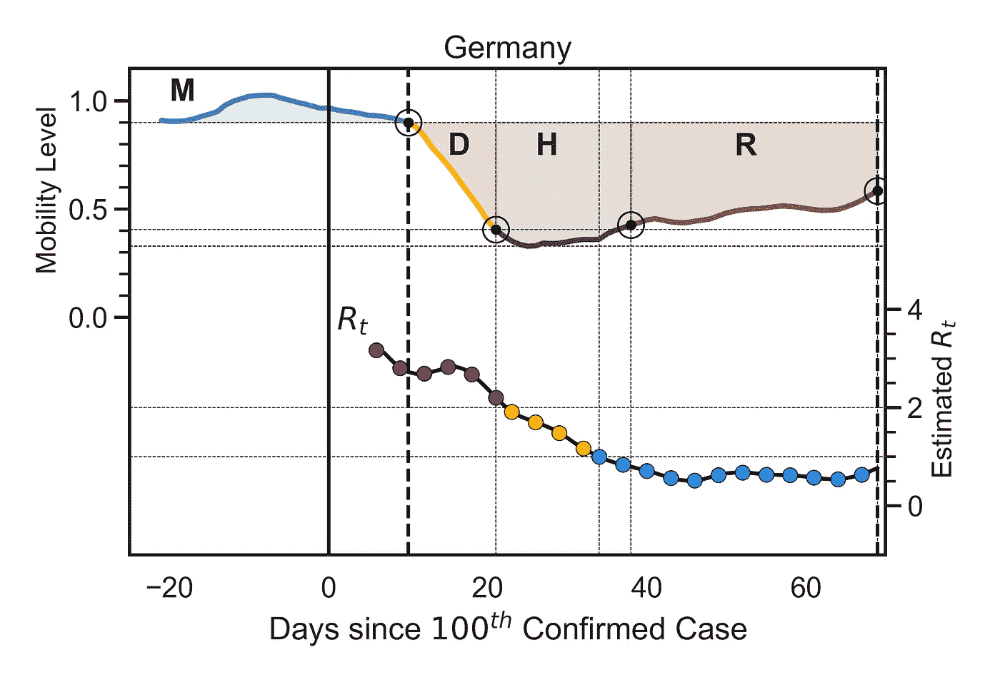
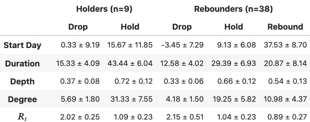
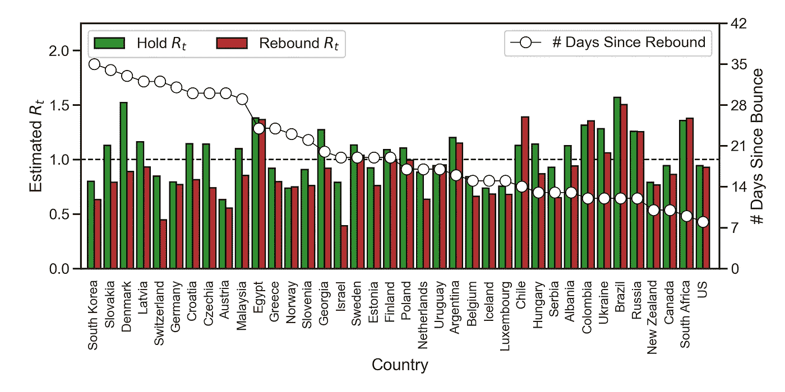
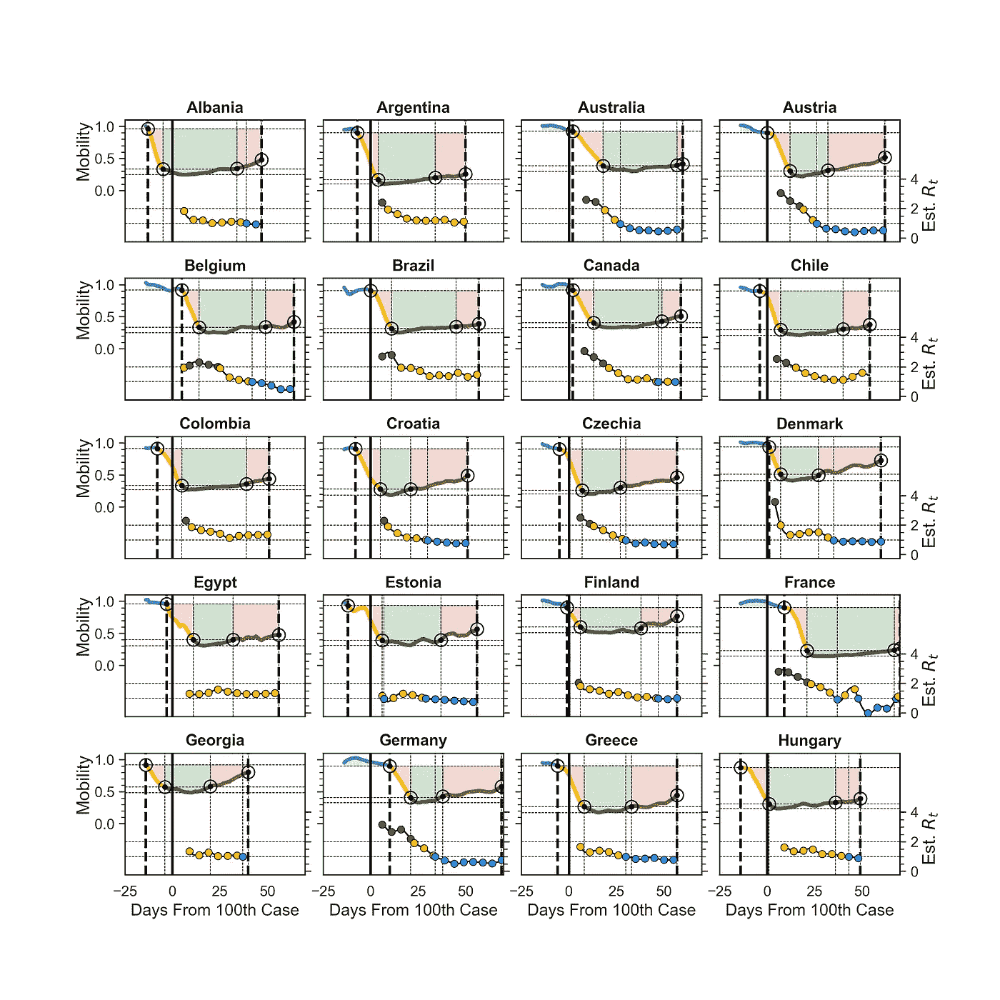
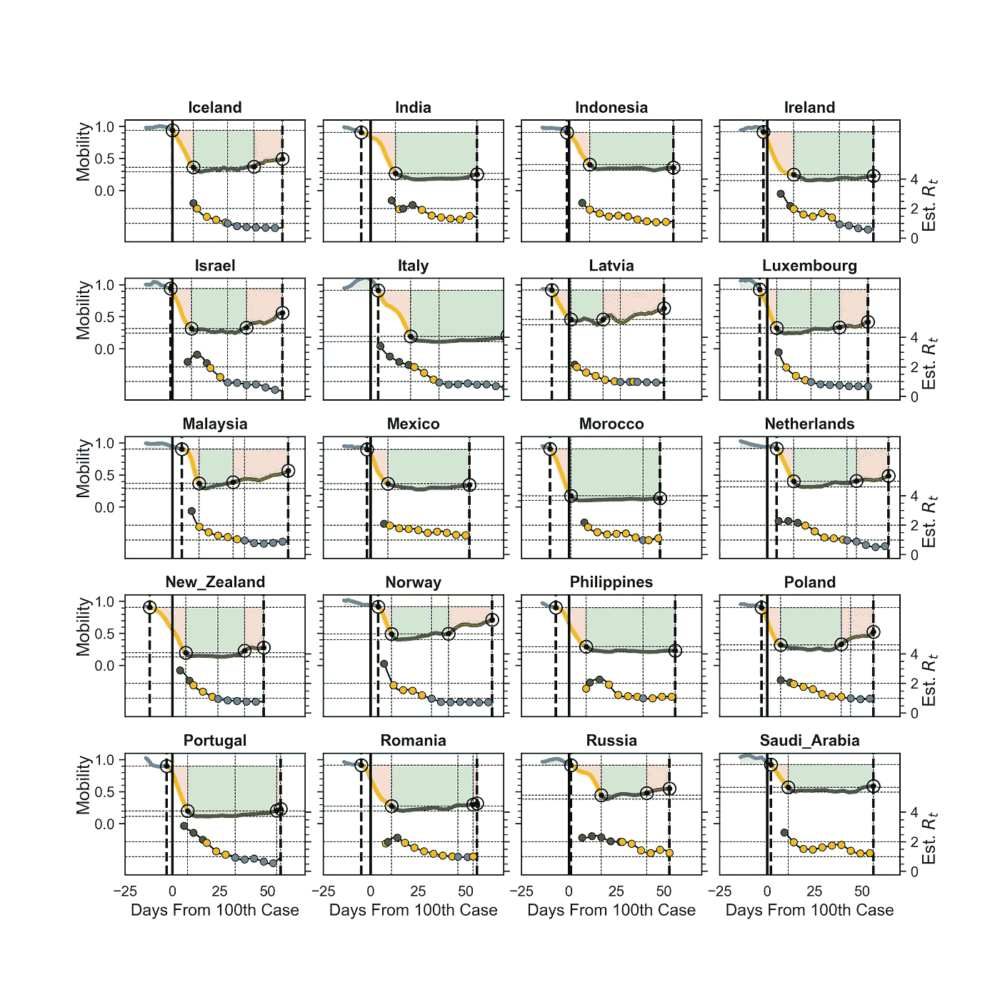
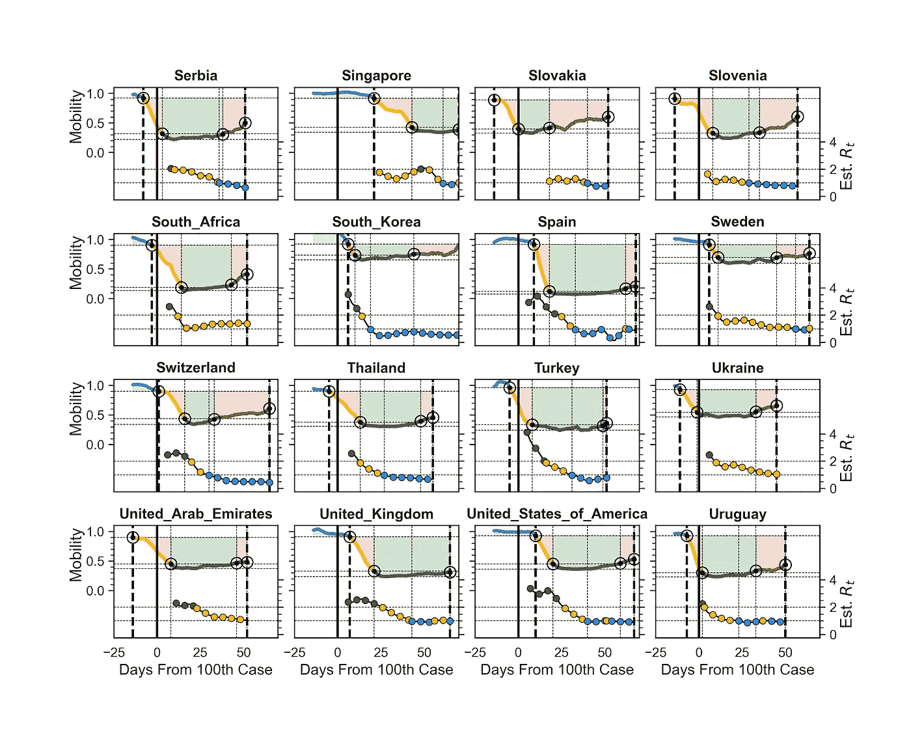

# 锁定和反弹

> 原文：<https://towardsdatascience.com/lockdowns-rebounds-e0db643f8961?source=collection_archive---------66----------------------->

## 对接下来会发生什么的数据驱动分析

莫里茨·金德勒在 [Unsplash](https://unsplash.com/s/photos/water-splash-droplets?utm_source=unsplash&utm_medium=referral&utm_content=creditCopyText) 上拍摄的照片

# 摘要

*   我们根据每日移动水平和估计的病毒传播率，对 56 个国家的新冠肺炎病毒封锁进行了分析。
*   即使在流动性水平提高的情况下，大多数国家(87%)仍在继续降低病毒的传播率或有效繁殖数(T5、T6、Rt、T7)。安全壳要求*Rt*1。
*   所有在 *Rt* < 1 之后流动性水平上升*的国家都设法将 *Rt* 维持在 1 以下。然而，当流动性水平在 Rt 下降到 1 以下之前开始上升时，只有 55%的国家设法随后将 Rt 降低到 1 以下。*
*   本文中的数据使用截至 2020 年 5 月 9 日的流动性和确诊病例数据。

# 介绍

随着世界努力应对冠状病毒疫情的速度和严重性(*1–5*)，大多数国家都实施了各种限制流动和商业的政策，以努力控制病毒传播(*6–9*)。虽然这些方法通常始于社交距离建议，以及对在家工作的偏好，但大多数政府都采取了更严格的封锁措施，通常会关闭不必要的服务，有时会指示公民就地避难，同时避免不必要的旅行。一些最极端的封锁措施已经在西班牙和意大利实施，数千万人被命令呆在家里近两个月。相比之下，瑞典选择了另一种方法，避免完全封锁，支持严格的社会距离措施，同时保持有效的经济。到目前为止，瑞典的医疗保健系统似乎正在应对——它正在弯曲，但尚未崩溃——但瑞典的病毒死亡率是欧洲最高的之一，只有时间才能证明这种方法是明智的还是愚蠢的。

# 新冠肺炎封锁模型

为了比较不同的封锁，我们提出了一个基于它们如何影响病毒的平均移动性( *11* )和有效繁殖数( *3，12，13* )的模型。对于移动数据，我们使用了[苹果的移动趋势报告](https://www.apple.com/covid19/mobility)，该报告根据不同国家和地区对苹果地图的请求，提供了对驾驶、步行和公共交通使用的每日估计。将每天的估计值转换为相对移动性变化，参考基线移动性周期(2020 年 2 月 17 日至 3 月 1 日),并将由此产生的相对驾驶、步行和公共交通数据进行平均，以产生单一的每日相对移动性水平；谷歌也有类似的数据集，但它比苹果的数据晚了几天。

为了估计病毒在时间 *t* ( *Rt* )的有效繁殖数，我们使用了由 *13* 描述的方法的修改版本，可作为[开源代码](https://github.com/k-sys/covid-19)获得。这种方法的工作原理是使用贝叶斯统计从一系列每日病例数中估计最有可能的 Rt，使用来自约翰霍普金斯新冠肺炎数据库的确诊病例数据。基本想法是，昨天的病例数和今天的病例数之间的关系告诉我们一些关于病毒当前传播率的信息，每一天的新信息都告诉算法更多关于 *Rt* 可能是什么的信息。由于 *Rt* 估计值是从观察到的病例数据中得出的，它们受给定国家测试细节的影响，但是因为算法使用基于日常病例之间相对*差异*的贝叶斯统计，所以预计它对当地测试政策的变化不太敏感。

锁定模型假设随着锁定的进行，移动级别将经历三个不同的阶段。第一阶段，即*下降* (D)，在流动性水平下降到基线水平的 90%以下时开始。它对应于封锁的早期阶段，此时开始施加限制。如果迅速实施严格的限制，下降可能是短暂而急剧的，或者如果逐渐增加限制，让人们有时间适应，下降可能会更加平缓。最终，下降的流动性水平将达到最小值，并在水平达到该最小值的 10%以内的那一天结束(T2 保持阈值 T3)，这标志着锁定的第二阶段，也是最重要的阶段【T4 保持阶段】的开始。

控制的目的是在一段较长的时间内保持最低的流动性水平，通过切断病毒的传播机会来减少病毒的有效繁殖数量。当迁移率水平再次上升并保持在保持阈值以上时，保持结束，这标志着最终*反弹* (R)阶段的开始。反弹有时与协调放松限制同时发生，但通常发生在正式取消限制之前，因为当公民变得焦躁不安并开始更多地流动时，流动性水平往往会上升。如果国家需要在一段较长的时间内实施一系列锁定，那么每个国家都将有自己的下降、保持和反弹阶段，这取决于所采取的方法。

图 1:适用于德国的锁定模型，突出显示了基于流动性数据(M)和 Rt 估计值的下降(D)、保持(H)和反弹(R)阶段。

图 1 显示了德国的模型及其下降、保持和反弹阶段，并用颜色进行了标记。该型号的 *Rt* 值也显示出来，颜色编码为红色(Rt > 2)、黄色(2 ≥ Rt ≤ 1)、蓝色(Rt<1)；这些是个人每日 *Rt* 估计值的 7 天滚动平均值。根据自该国确诊其第 100 例病例以来的天数，相对于 x 轴绘制流动性和 *Rt* 图；这使得相对于爆发成熟度来比较锁定的开始更容易，即使它们开始于不同的时间。本文末尾的附录包括了所分析的全部 57 个国家的相应模型(见图 A1-A3)；所有模型都使用截至 2020 年 5 月 9 日的流动性和确诊病例数据。

# 篮板球分析

使用该模型，我们可以确定几个重要的移动性和 *Rt* 特征，以便比较锁定。我们将我们的国家分为两组——(1)那些已经进入反弹阶段(*反弹者*)，流动性水平上升超过 7 天的国家，以及(2)那些仍处于保持阶段(*持有者*)的国家——如表 1 所示。平均而言，处于反弹阶段的国家比仍处于保持阶段的国家提前大约 4 天开始锁定-分别为第 100 例前 3.45 天*和第 100 例*后 0.33 天*-但基于单边 *t* 测试，这种差异在统计上并不显著(P = 0.095，t = 1.33)。*

表 1:处于持有阶段的国家(持有人)和限制开始放松的国家(流动性水平上升超过 7 天)的锁定比较。

篮板手的下降和保持阶段的*持续时间*(天)*深度*(移动性的平均下降)和*程度*(持续时间×深度)比持球手的短。例如，根据单边 *t* 测试(P = 0.0033，t = 2.6337)，篮板手的跌落程度明显低于持球手，持球手的跌落程度也是如此(P = 0.000，t = 5.2888)。换句话说，已经放松限制的国家与仍处于封锁阶段的国家相比，封锁程度较轻。然而，尽管他们的持有不太严重，但篮板手退出持有阶段时的 *Rt* 与目前持有人的 *Rt* 相似:分别为 1.04 比 1.09(见表 1)，这是一个基于单边 *t* 测试的无统计学意义的边际差异(P = 0.3134，t = 0.4897)。

在流动性水平上升，对持有者的限制放松后，Rt 会发生什么？传播率是否会反弹，导致第二次感染激增，或者我们是否可以期待 Rt 保持在 1 的临界阈值以下，即使流动性水平增加？我们可以通过观察篮板手的机动性水平开始上升时发生了什么来深入了解这一点。图 3 显示了持有结束时的 *Rt* 估计值与目前处于反弹阶段的 38 个国家之间的差异；这些国家按照反弹期开始后天数的降序排列。

图 3:反弹者在保持阶段和反弹阶段结束时 Rt 估计值的比较(条形图)。各国按反弹阶段持续时间的降序排列，这也显示为线形图。

数据显示，87%的篮板手能够继续减少 Rt T1，即使机动性水平一直在上升。篮板手的平均 *Rt* 目前为 0.89，相比之下，当他们退出暂停阶段时为 1.04(表 1)，根据单边 *t* 测试(P = 0.0047，t = 2.6678)，这一差异具有统计学意义。

如果我们区分*冒险的*和*谨慎的*篮板手，基于他们是否以 *Rt* > 1(冒险)或 *Rt* ≤ 1(谨慎)退出他们的持有阶段，那么我们可以观察到所有 18 个谨慎的篮板手目前都有 *Rt* ≤ 1，相比之下，只有 11 个(55%)的冒险篮板手；目前，谨慎篮板手的平均 Rt 为 0.70，而冒险篮板手的平均 Rt 为 1.06，基于单尾 t 检验，这一差异具有统计学意义(P = 0.00，t = 5.5733)。

# 结论

这些结果对正在计划和实施封锁退出战略的国家来说是个好兆头。到目前为止，38 个反弹国家的数据没有显示传播率(7 天平均值)有实质性增加，即使流动性水平有所增加。相反，数据表明，通过谨慎退出保持阶段，各国可以继续降低 Rt，即使流动性水平有所提高。通过避免在 *Rt* ≤ 1 之前反弹的诱惑，各国可以显著提高在反弹期间保持 *Rt* ≤ 1 地位的可能性，至少在数据涵盖的时期内是如此。

这并不意味着各国可以对降低限制持怀疑态度。事实上，大多数国家在经济反弹时都设法控制住了 Rt，这证明了放松限制的谨慎态度以及公众的反应。这种情况能持续多久还有待观察；在撰写本文时，有一些关于德国传播率上升的报告，例如，这可能会在适当的时候转化为 7 天平均传播率的增加。

一个有用的观点是，封锁期间施加的限制有两个重要目的。一方面，它们消除了许多通常的病毒传播机会。另一方面，封锁也创造了时间和空间，以及浮躁，让人们吸收一套新的行为和规范(*15*)——更好的社交距离( *8* )，改善的手部卫生( *16* )，口罩的正确使用( *17* )等等。—这符合与冠状病毒在我们社区共存的需要( *18，19* )。也许封锁的本质，以及它在我们所有人心中产生的回归某种程度正常的愿望，本身就是一种有效的社会治疗，可以在限制放松时保护我们，至少目前是这样。然而，我们必须记住，即使流动性水平在上升，它们仍然远远低于封锁前的水平，而且这种保护似乎不可能无限期地保持下去，特别是如果流动性水平继续上升，或者如果我们变得过于自满。

# 参考

1.  长度贝当古和里贝罗。新发传染病流行潜力的实时贝叶斯估计。《公共科学图书馆综合》(PLoS One)，3(5)，2008。
2.  B.J. Cowling，S. T. Ali，T. W. Ng，T. K. Tsang，J. C. Li，M. W. Fong，Q. Liao，M. Y. Kwan，S. L. Lee，S. S. Chiu，等.香港冠状病毒疾病 2019 和流感非药物干预的影响评估:一项观察性研究。*《柳叶刀》公共卫生*，2020 年。
3.  米（meter 的缩写））达尔伯格、P.-A .艾丁、e .格罗·̈·恩奎斯特、j .利哈根、j . o .̈·瑟什、a .西雷特斯基和 m .托格尔。温和政策下新冠肺炎疫情对人口流动性的影响:来自瑞典的因果证据。arXiv 预印本 arXiv:2004.09087 ，2020。
4.  R.迪克、拉斯姆森、凯恩、威廉姆斯和麦凯。社会规范对学生洗手行为的影响。*心理学，健康&医学*，23(2):154–159，2018。
5.  O.迪克曼，J. A. P. Heesterbeek 和 J. A. Metz。异质种群传染病模型中基本再生比 r0 的定义和计算。数学生物学杂志，28(4):365–382，1990 年。
6.  E.董，杜海红，l .加德纳。实时跟踪新冠肺炎的交互式网络仪表板。*柳叶刀传染病*。
7.  名词（noun 的缩写）梁德刚、朱德刚、邵怡燕、陈建辉、麦德威、郝柏杰、颜汉林、李玉英、叶德刚、裴敏欣，等。呼气中呼吸道病毒的释放与口罩的功效。*自然医学*，第 1–5 页，2020 年。
8.  Y.刘，A.A .盖尔，A .怀尔德-史密斯和 j .新冠肺炎的繁殖数比 SARS 冠状病毒高。*旅行医学杂志*，2020 年。
9.  页（page 的缩写）D. Lunn、C. A. Belton、C. Lavin、F. P. McGowan、S. Timmons 和 D. A. Robertson。利用行为科学帮助对抗冠状病毒。*行为公共管理杂志*，3(1)，2020。
10.  C.恩贡哈拉、伊博伊、塞肯伯里、苏格兰、麦金太尔、邦兹和古梅尔。非药物干预对遏制 2019 年新型冠状病毒影响的数学评估。*数学生物科学*，108364 页，2020 年。
11.  K.Prem，Y. Liu，T. W. Russell，A. J .，R. M. Eggo，N. Davies，S. Flasche，S. Clif- ford，C. A. Pearson，J. D. Munday，等,《减少社会混合的控制策略对中国武汉新冠肺炎疫情结果的影响:一项模拟研究》。*《柳叶刀》公共卫生*，2020 年。
12.  A.托比亚斯。随访一个月后对意大利和西班牙 sars-cov-2 疫情封锁的评估。*总环境科学*，第 138539 页，2020 年。
13.  J.J. Van Bavel、K. Baicker、P. S. Boggio、V. Capraro、A. Cichocka、M. Cikara、M. J. Crock- ett、A. J. Crum、K. M. Douglas、J. N. Druckman 等人利用社会和行为科学支持新冠肺炎·疫情对策。*自然人类行为*，第 1–12 页，2020 年。
14.  R.Verity，L. C. Okell，I. Dorigatti，P. Winskill，C. Whittaker，N. Imai，G. Cuomo- Dannenburg，H. Thompson，P. G. Walker，H. Fu，等.冠状病毒病严重程度的估计 2019:基于模型的分析.*《柳叶刀传染病》2020 年*。
15.  R.韦斯特、米基、鲁宾和阿姆洛特。应用行为改变原理减少 sars-cov-2 传播。*自然人类行为*，2020 年。
16.  J.袁，李，吕国光，陆志光。监测新冠肺炎在欧洲的传播性和死亡率。*国际传染病杂志*，20:1878:3511，2020。
17.  J.张，M.Litvinova，Y.Liang，Y.Wang，S.Zhao，Q.Wu，S.Merler，C.Viboud，A. Vespignani，等。接触模式的变化塑造了新冠肺炎在中国爆发的动力学。*理科*，2020。
18.  南张，刁明宇，段立荣，林志勇，陈大伟。中国新型冠状病毒(sars-cov-2)感染:预防、控制和挑战。*重症监护医学*，第 1–3 页，2020 年。
19.  南赵，庄，曹，冉，高，楼，杨，蔡，王，何，等.量化国内旅游与 2020 年中国武汉新冠状病毒(2019-ncov)病例输出之间的关系:相关性分析.*旅行医学杂志*，27 卷 2 期，2020 年。

# 附录

下图(图 A1-A3)提供了本次分析中考虑的国家/地区的所有 56 种锁定模式。选择这些国家是因为它们包含在苹果的移动报告中。

图 A1。从阿尔巴尼亚到匈牙利的封锁模式。

图 A2。从冰岛到沙特阿拉伯的封锁模式。

图 A3。从塞尔维亚到乌拉圭的封锁模式。