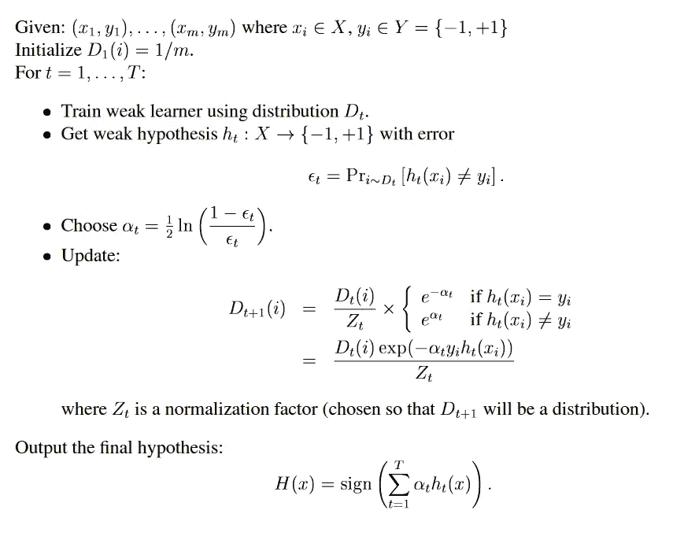
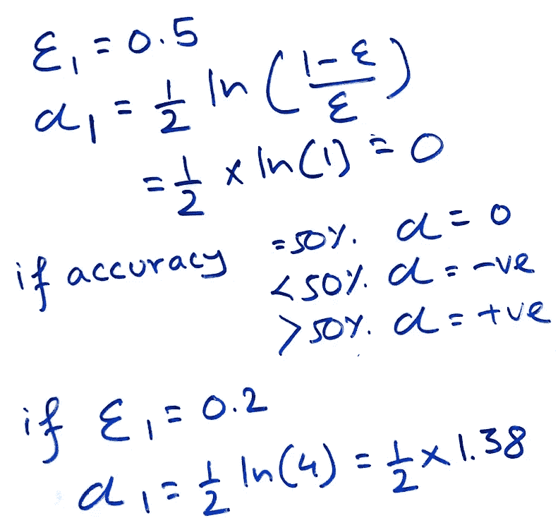

# 日志— AdaBoost，算法背后的数学

> 原文：<https://towardsdatascience.com/log-book-adaboost-the-math-behind-the-algorithm-a014c8afbbcc?source=collection_archive---------31----------------------->

## 这篇文章以一种简单的方式讲述了 AdaBoost 算法背后的数学原理

[来源](https://unsplash.com/)

> 一个赛马赌徒，希望最大化他的赢款，决定创建一个计算机程序，该程序将根据通常的信息(每匹马最近赢的比赛的次数，每匹马的投注赔率等)准确地预测赛马的获胜者。).为了创建这样一个程序，他请一位非常成功的专业赌徒来解释他的赌博策略。毫不奇怪，专家无法清晰地说出一套选择马匹的宏大规则。另一方面，当呈现特定的一组比赛的数据时，专家可以毫不费力地得出该组比赛的“经验法则”(例如，“对最近赢得最多比赛的马下注”或“对最有希望获胜的马下注”)。虽然这样的经验法则本身显然是非常粗糙和不准确的，但期望它提供至少比随机猜测好一点点的预测并不是不合理的。此外，通过反复询问专家对不同比赛集合的意见，游戏者能够获得许多经验法则。
> 
> 为了最大限度地利用这些经验法则，游戏者面临两个问题:
> 
> **首先，他应该如何选择呈现给专家的种族集合，以便从专家那里提取最有用的经验法则？**
> 
> **第二，一旦他收集了许多经验法则，如何将它们组合成一个单一的、高度准确的预测法则？**
> 
> *Boosting* 指的是一种通用的、可证明有效的方法，通过以类似于上面建议的方式组合粗糙的和适度不精确的经验规则，产生非常精确的预测规则。

上面的摘录摘自那篇著名的论文:[Boosting 简介，](https://cseweb.ucsd.edu/~yfreund/papers/IntroToBoosting.pdf)在向门外汉介绍 Boosting 方面，我做得再好不过了。

然而，本文假设读者熟悉 boosting，并试图解释 AdaBoost 背后的数学原理，希望步骤简单。这些概念往往简单而美丽，却迷失在数学术语中。我在理解数学的过程中也面临着同样的挑战，这是一次巩固我的理解的尝试，同时也帮助其他人走上类似的旅程。

回到同一篇论文，AdaBoost 算法的步骤陈述如下:

[AdaBoost 算法](https://mbernste.github.io/files/notes/AdaBoost.pdf)

让我们一步一步来看:

第一行很容易理解，但是为了完整起见，我将描述它。它告诉假设有 *m* 个观察值，如 *x* ₁， *x* ₂， *x* ₃.. *xₘ* 这些观察值集合被称为 *X，*而目标变量由 *y₁、y₂、y₃给出..* *yₘ* 属于 *Y，*其中目标被称为 *{-1，+1}* 取决于目标的类别*{赢/输}、{正/负}* 等。

简而言之，它**描述了我们提供给模型的数据集**的结构。

接下来，我们将为每个观察值分配一个权重，**想法是，对于分类器算法来说，很少有容易分类的观察值，而有其他难以分类的观察值。我们将在每次迭代后调整权重，从而迫使算法更仔细地观察这些难以分类的观察值。**

但是在进入所有这些之前，**在第一次迭代中，我们不知道哪些观察值难以分类，哪些容易分类，所以我们将为每个算法分配相同的权重。**

这实际上是算法的迭代部分，它规定您将运行算法 T 次，您可以在运行 AdaBoost 时指定该值。

我们知道我们将运行循环 T 次，那么在每个循环中我们将做什么呢？

让我们来看第一个循环:我们有了 *X* ，我们有了 *D₁* ，经过培训，我们有了第一个弱学习者 *h* ₁

*h* ₁用来预测 x 的值，这显然会犯一些错误。我们将根据预测计算误差项，如下所示:

很好，我们现在有了₁的误差项，这将用于两件事:

1.  求 *αₜ* 的值
2.  更新并设置 *D₂* 的重量

**什么是αₜ？**它只不过是**单个模特/学员的重量**，在这个例子中，是 h₁.在每一次 t 迭代中，我们将有一个学习者 h*₁****，h****₂****，h*** *₃..***【ₜ】***其中的每一个都将被组合起来以构成最终的模型，这些个体学习者中的每一个在最终输出中的权重由αₜ.给出***

*很好，现在我们理解了αₜ，我们将计算α₁.*

**

*请注意，错误率低的模型将具有更高的 **αₜ值，因此在最终输出中具有更高的权重。***

*接下来，我们将更新单个观察值的权重，如前所述，与未正确分类的点相比，正确分类的点将具有较低的权重:*

**

*如果你想知道什么是 Zₜ，它只不过是一种确保 Dₜ仍然等于 1 的方法*

**

*这个整个过程重复 T 次，产生由下式给出的最终模型:*

**

*如您所见，最终模型是 T 个模型的组合，每个模型都有自己的权重，组合在一起得到最终输出。每个单独模型的权重将由其对应的αₜ给出，从而导致精度较高的模型获得较高的权重。*

*总结一下模型的作用:*

1.  **一旦你准备好了数据，就从所有观察值的权重相等开始**
2.  **得到第一个弱学习者**
3.  **计算模型的误差**
4.  **计算模特αₜ的体重**
5.  **更新下一轮每个观测 Dₜ的权重**
6.  **运行此循环 T 次**
7.  **获得最终合奏**

*希望这有助于澄清事情。会在其他文章中补上。*

# *参考资料:*

*[https://mbernste.github.io/files/notes/AdaBoost.pdf](https://mbernste.github.io/files/notes/AdaBoost.pdf)
[https://cseweb.ucsd.edu/~yfreund/papers/IntroToBoosting.pdf](https://cseweb.ucsd.edu/~yfreund/papers/IntroToBoosting.pdf)
[https://towardsdatascience . com/AdaBoost-for-dummies-breaking-down-the-math-and-its-equations-into-simple-terms-87f 439757 DCF](/adaboost-for-dummies-breaking-down-the-math-and-its-equations-into-simple-terms-87f439757dcf)*