# 日志— XGBoost，算法背后的数学

> 原文：<https://towardsdatascience.com/log-book-xgboost-the-math-behind-the-algorithm-54ddc5008850?source=collection_archive---------30----------------------->

## 这篇文章以一种简单的方式讲述了 XGBoost 算法背后的数学原理

[来源](https://unsplash.com/)

> **如果你想*很好地理解*某事，试着简单地解释它。— *费曼***

XGBoost 是一个很好的算法，它的经历非常有启发性。这些概念往往简单而美丽，却迷失在数学术语中。我在理解数学的过程中也面临着同样的挑战，这是一次巩固我的理解的尝试，同时也帮助其他人走上类似的旅程。

为了理解 XGBoost 做什么，我们需要理解什么是梯度增强，所以让我们首先理解它背后的概念。请注意，这篇文章假设读者对升压过程非常熟悉，并且将试图触及梯度升压和 XGBoost 背后的直觉和数学。让我们直接开始吧。

## 了解梯度增强

## 步骤 1 —初始功能

像往常一样，让我们从一个原始的初始函数 F₀开始，类似于回归情况下所有值的平均值。它会给我们一些输出，不管多糟糕。

## 步骤 2——损失函数

接下来我们将计算由***【l(yᵢ,fₜ(xᵢ】)***给出的损失函数。

什么是损失函数？这只是一种测量实际值和预测值之间差异的方法。以下是几个例子:

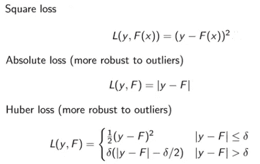

[来源](http://www.ccs.neu.edu/home/vip/teach/MLcourse/4_boosting/slides/gradient_boosting.pdf)

从下表中可以理解为什么这种对异常值的鲁棒性很重要:

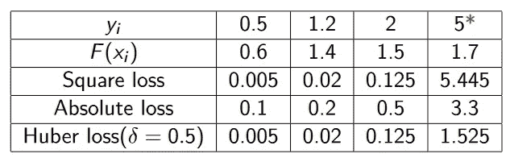

[异常值及其对损失函数的影响，这里 5 是异常值。检查不同损失函数的值](http://www.ccs.neu.edu/home/vip/teach/MLcourse/4_boosting/slides/gradient_boosting.pdf)

这个想法是，损失函数的值越低，我们的预测就越准确，所以现在获得更好的预测已经成为损失函数的最小化问题。

## 步骤 2 —新目标

到目前为止，我们已经建立了我们的初始模型，进行了预测。**接下来，我们应该对损失函数给出的残差拟合一个新的模型，但是有一个微妙的变化:我们将改为拟合损失函数的负梯度**，我们为什么这样做以及它们为什么相似的直觉如下:

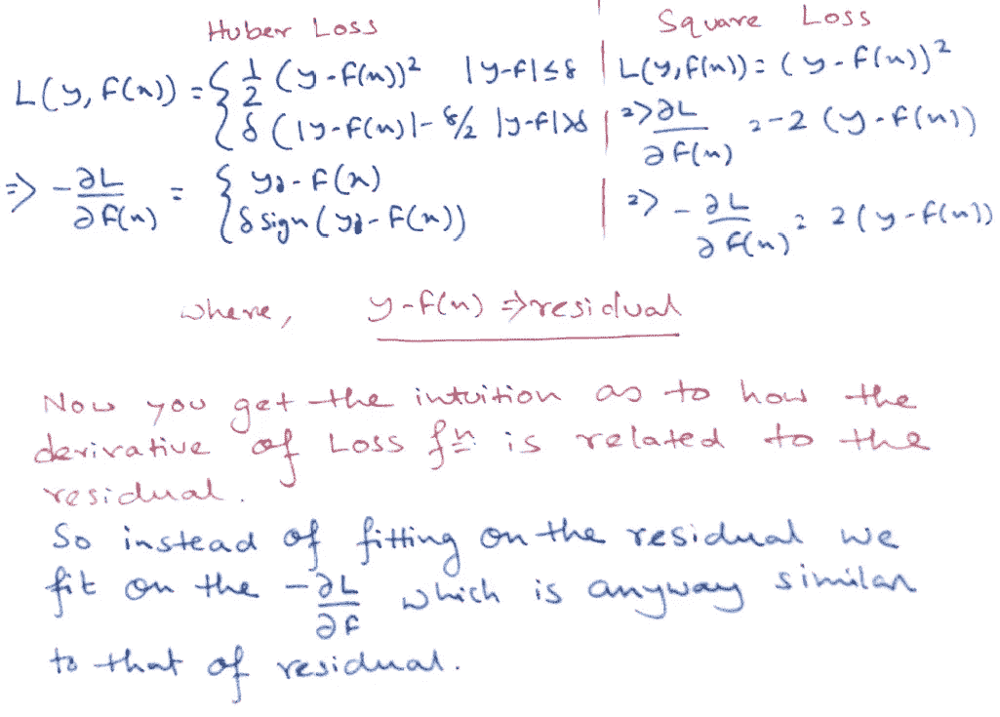

**梯度可以解释为函数的“最快增长的方向和速率”，所以负梯度告诉我们函数最小值的方向，在这种情况下就是损失函数的最小值。**

我们将遵循同样的梯度下降法。向损失函数的最小值前进，算法的学习速率将给出步长的大小。并且在损失函数的最小值处，我们将具有最低的错误率。

所以我们将在损失函数的-ve 梯度上建立一个新的 hₜ₊₁模型。

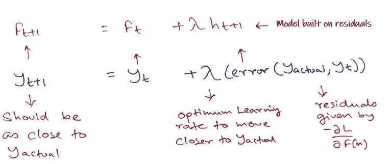

## 步骤 3——加法方法

这个在-ve 梯度上迭代拟合模型的过程将继续，直到我们**达到由 T** 给出的弱学习者数量的最小值或极限，这被称为加法方法

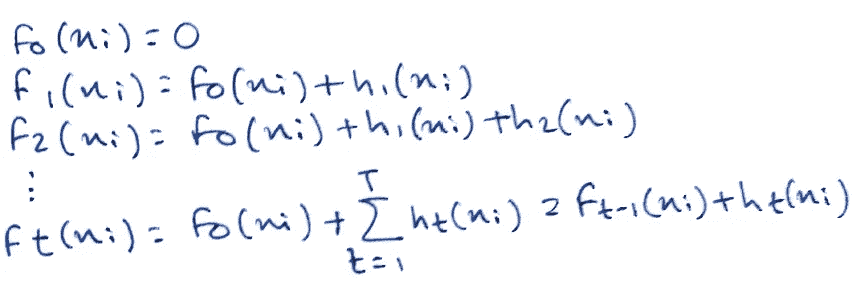

加法方法

[**回想一下，在 Adaboost 中，“缺点”是通过高权重数据点来识别的。**](/log-book-adaboost-the-math-behind-the-algorithm-a014c8afbbcc) **在梯度提升中，通过梯度来识别“缺点”。**

这缺乏关于梯度增强如何工作的直觉。**在回归和分类的情况下，唯一不同的是使用的损失函数。**

接下来，我们将了解 XGBoost 与梯度增强有何不同。

## XGBoost

XGBoost 和 GBM 都遵循梯度增强树的原理，但 **XGBoost 使用更正则化的模型公式来控制过拟合，这使其具有更好的性能**，这也是它也被称为“正则化增强”技术的原因。

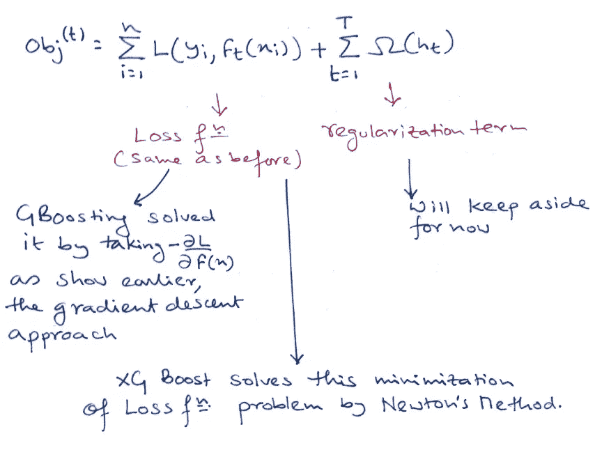

## 牛顿方法

那么这个牛顿法是什么呢？**在随机梯度下降中，我们用更少的点，用更少的时间来计算我们应该去的方向，以便使它们更多，希望我们更快地到达那里。在牛顿的方法中，我们花更多的时间来计算我们想要进入的方向，希望我们可以走更少的步来到达那里。**

> 需要注意的重要一点是，即使在梯度提升的情况下，当使用梯度下降来解决回归问题时，分类问题仍然使用牛顿方法来解决最小化问题。XGBoost 在分类和回归两种情况下都使用这种方法。

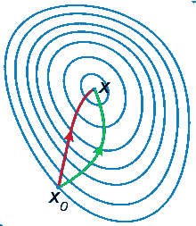

梯度下降法(绿色)和牛顿法(红色)在最小化函数(小步长)方面的比较。牛顿的方法使用曲率信息(即二阶导数)来采取更直接的路线。([来源](https://en.wikipedia.org/wiki/Newton%27s_method))

牛顿的方法试图通过从初始猜测(起点) *x₀∈ R* 构造序列 *{xₖ}* 来解决最小化问题，该序列通过使用迭代周围的 *f* 的二阶泰勒近似序列收敛到 *f* 的极小值 x*。围绕 *{xₖ}* 的 *f* 的二阶[泰勒展开](https://en.wikipedia.org/wiki/Taylor_expansion)为

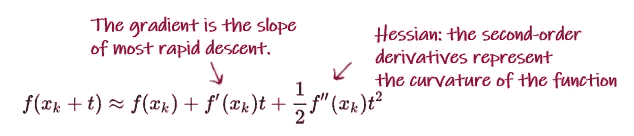

([来源](https://en.wikipedia.org/wiki/Newton%27s_method))

二阶导数在加速梯度下降中很重要，因为如果你的算法引导你之字形穿过一个山谷，那么你在山谷的实际坡度上取得的进展很小，相反，只是逐步重复穿过这个山谷，通过二阶导数调整方向将使你的下降方向朝这个山谷的方向倾斜，从而将缓慢下降转换为更快的下降。

## 损失函数

我们已经了解了平方损失在梯度增强框架中的表现，让我们快速了解一下 XGBoost 方法中平方损失函数的变化情况:

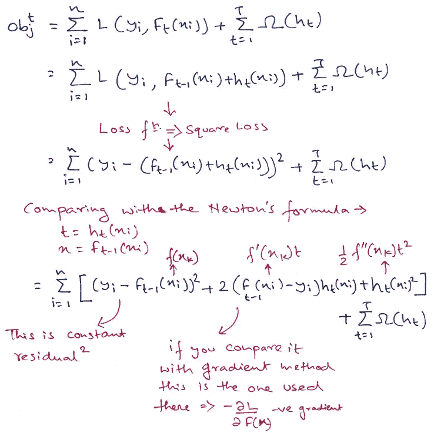

> MSE 的形式很友好，有一阶项(通常称为残差)和二次项。对于其他的利益损失(比如物流损失)，就不那么容易拿到这么好看的表格了。因此，在一般情况下，我们将损失函数的泰勒展开式提升至二阶— [XGBoost Docs](https://xgboost.readthedocs.io/en/latest/tutorials/model.html)

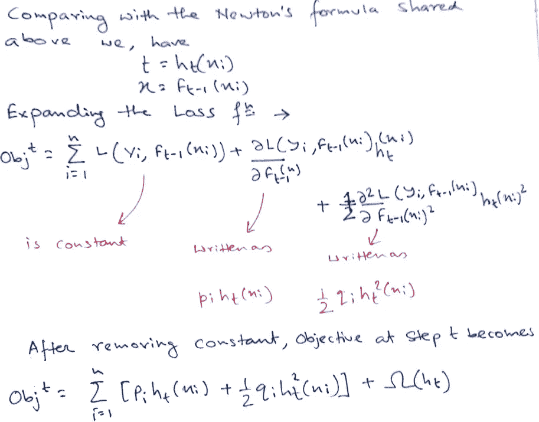

> 这成为我们对新树的优化目标。这个定义的一个重要优点是目标函数的值只取决于 pᵢ和 qᵢ.这就是 XGBoost 支持定制损失函数的方式。我们可以优化每个损失函数，包括逻辑回归和成对排名，使用完全相同的求解器，将 pᵢ和 qᵢ作为输入！— [XGBoost 文档](https://xgboost.readthedocs.io/en/latest/tutorials/model.html)

## 正规化

接下来我们将处理正则化项，但在此之前，我们需要理解决策树是如何被数学定义的。直觉上，如果你认为一个决策树是或者主要是它的输出是树叶和一个将数据点分配给那些树叶的函数的组合。数学上它被写成:

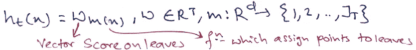

其中 JT 是叶子的数量。该定义将树上的预测过程描述为:

1.  *将 x 的数据点分配给 m 的一片叶子*
2.  *将第 m(x)叶上相应的分数 wₘ₍ₓ₎赋给数据点。*

在 XGBoost 中，复杂性被定义为:

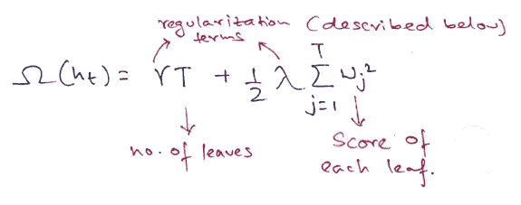

XGBoost 中的这些超参数描述如下:

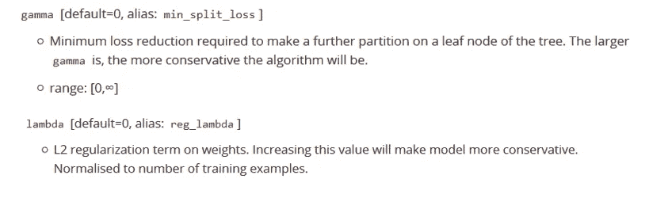

[XGBoost 正则化参数](https://xgboost.readthedocs.io/en/latest/parameter.html)

> 当然，定义复杂性的方法不止一种，但是这种方法在实践中效果很好。正则化是大多数树包处理得不够仔细，或者干脆忽略的一部分。这是因为传统的树学习方法只强调改进杂质，而复杂性控制则留给了启发式算法。通过正式定义它，我们可以更好地了解我们正在学习什么，并获得在野外表现良好的模型。— [XGBoost 文档](https://xgboost.readthedocs.io/en/latest/tutorials/model.html)

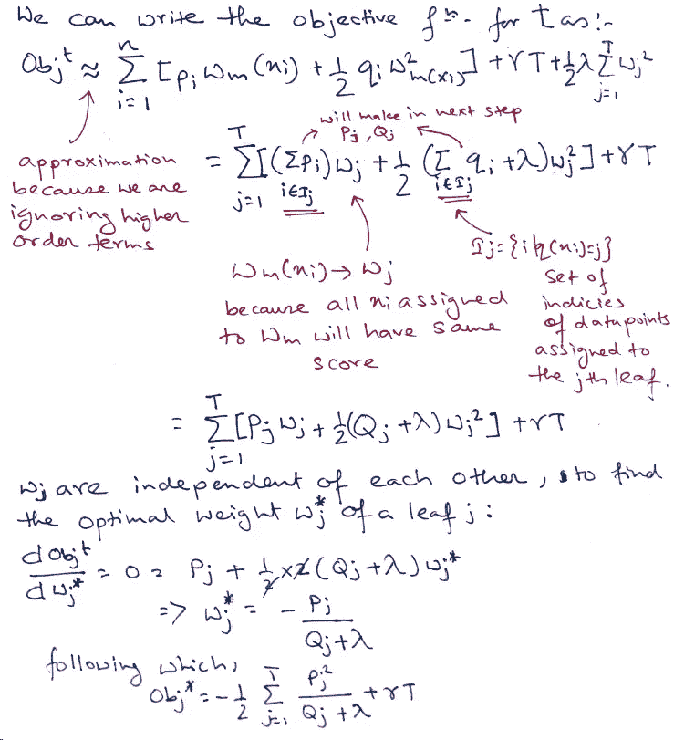

最后一个等式衡量*一个树形结构有多好。*

如果这一切听起来有点复杂，我们来看看图片，看看分数是怎么算出来的。

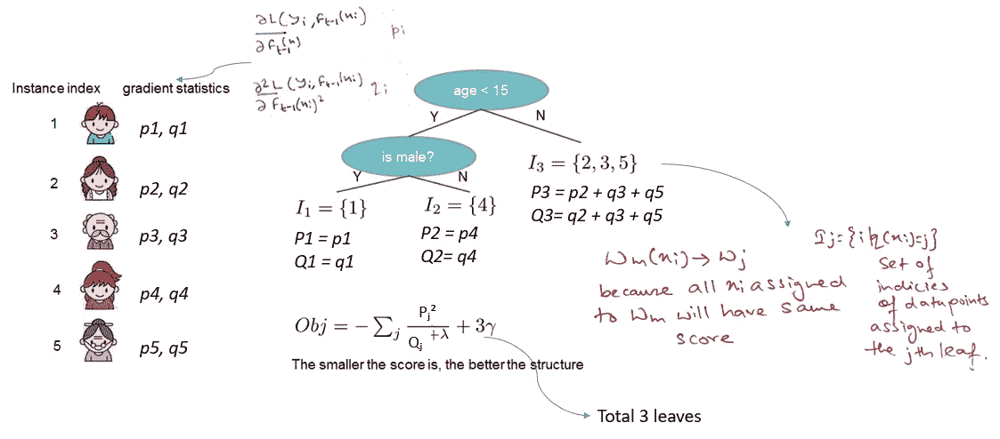

[来源](https://xgboost.readthedocs.io/en/latest/tutorials/model.html)

> 基本上，对于一个给定的树结构，我们把统计量 *gi* 和 *hi* 推到它们所属的叶子上，把统计量加在一起，用公式计算出树有多好。**该分数类似于决策树中的杂质度量，只是它还考虑了模型的复杂性。** — [XGBoost 文档](https://xgboost.readthedocs.io/en/latest/tutorials/model.html)

## 学习树形结构

现在我们有了一种方法来衡量一棵树有多好，理想情况下，我们应该列举所有可能的树，然后选出最好的一棵。实际上这是很难做到的，所以我们将尝试一次优化一级树。具体来说，我们尝试将一片叶子分成两片，得到的分数是

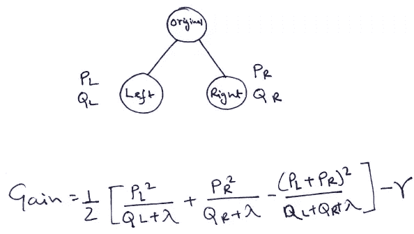

> 这个公式可以分解为 1)新左叶上的分数 2)新右叶上的分数 3)原始叶上的分数 4)附加叶上的正则化。**我们在这里可以看到一个重要的事实:如果增益小于 *γ* ，我们最好不要增加那个分支。**这正是基于树的模型中的**修剪**技术！通过使用监督学习的原则，我们可以自然地得出这些技术工作的原因。— [XGBoost 文档](https://xgboost.readthedocs.io/en/latest/tutorials/model.html)

很好，现在希望我们对 XGBoost 有一个初步的了解，以及为什么它会这样工作。下期帖子再见！

# 参考

[https://xgboost . readthedocs . io/en/latest/tutorials/model . html](https://xgboost.readthedocs.io/en/latest/tutorials/model.html)
[https://drive . Google . com/file/D/1 cmnhi-7 pzfnceoj 9g 7 lqxwuiwomo 0 Zn _ D/view](https://drive.google.com/file/d/1CmNhi-7pZFnCEOJ9g7LQXwuIwom0ZN_D/view)
[https://arxiv.org/pdf/1603.02754.pdf](https://arxiv.org/pdf/1603.02754.pdf)
[http://www . CCS . neu . edu/home/VIP/teach/ml course/4 _ boosting/slides/gradient _ boosting . PDT](http://www.ccs.neu.edu/home/vip/teach/MLcourse/4_boosting/slides/gradient_boosting.pdf)