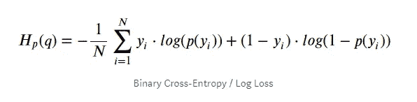
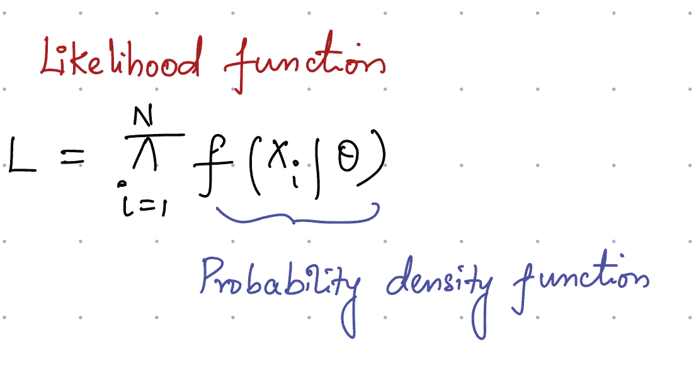
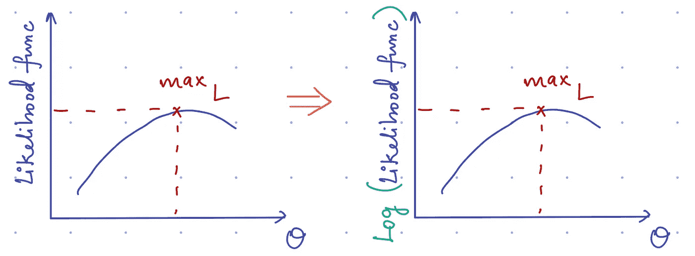
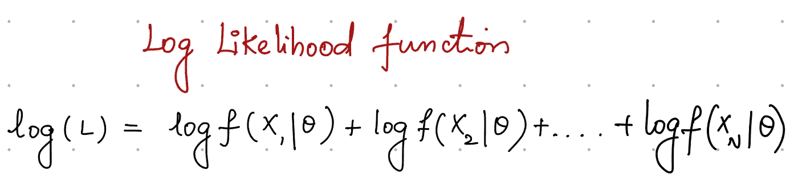
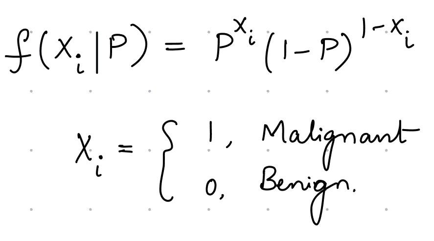
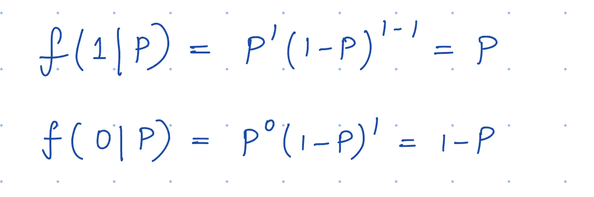
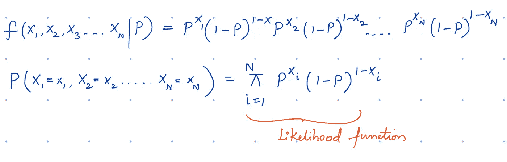
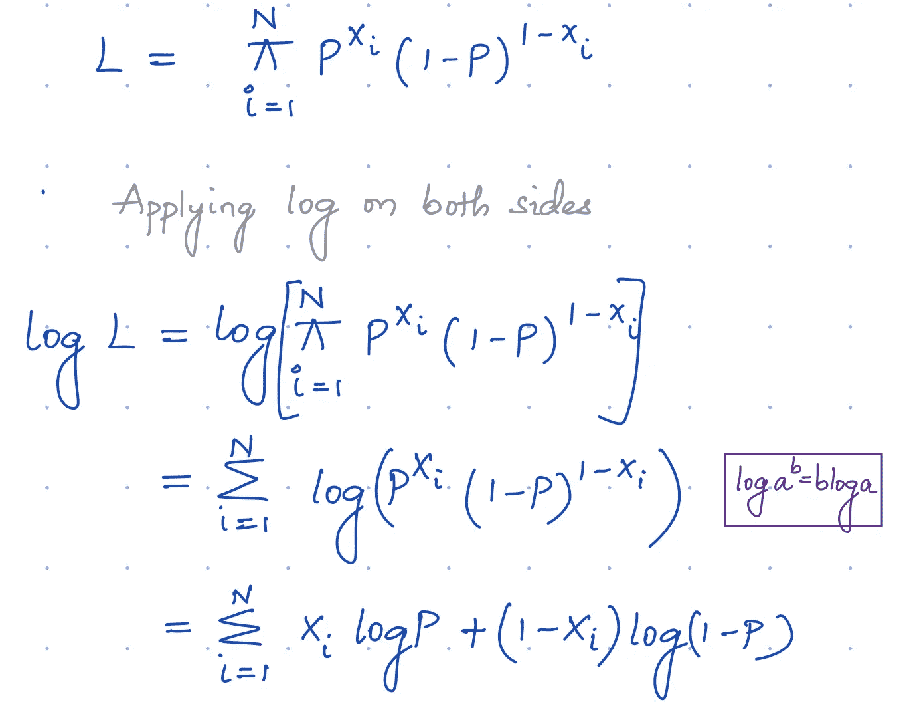
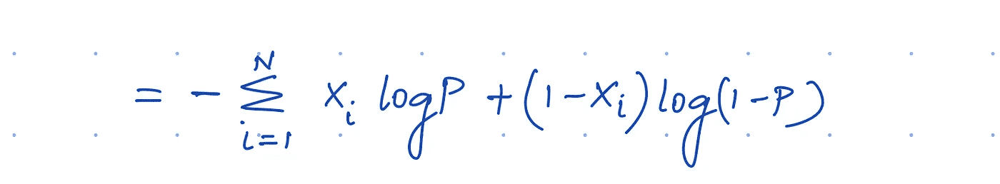
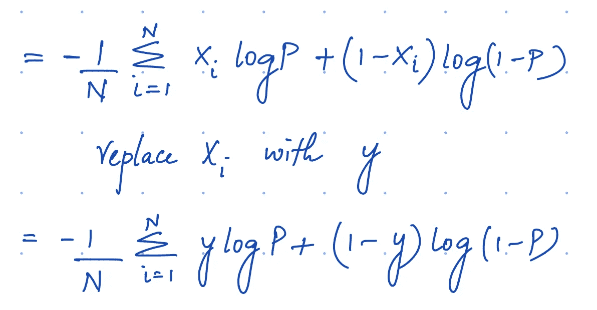

# 对数损失函数数学解释

> 原文：<https://towardsdatascience.com/log-loss-function-math-explained-5b83cd8d9c83?source=collection_archive---------5----------------------->

## 逻辑回归中对数损失函数的推导和数学

你做过机器学习中的分类问题吗？如果是，那么你可能在[逻辑回归](https://en.wikipedia.org/wiki/Logistic_regression)中遇到过[交叉熵](https://ml-cheatsheet.readthedocs.io/en/latest/loss_functions.html)或对数损失函数。

那个功能是做什么用的？分类问题中函数的意义是什么？

让我们通过查看函数背后的数学来详细了解一下。

在我们开始钻研函数背后的数学知识并了解它是如何推导出来的之前，我们应该知道什么是损失函数。

> 简单来说，损失函数(Loss function):用于评估用于解决任务的算法的性能的函数。[详细定义](https://en.wikipedia.org/wiki/Loss_function)

在诸如逻辑回归的二元分类算法中，目标是最小化交叉熵函数。

> 交叉熵是对给定随机变量或一组事件的两个概率分布之间的差异的度量

假设我们有病人的数据，任务是找出哪些病人患有癌症。在我们的例子中，由于我们没有整个人口的数据，我们试图从数据样本中预测一个人患癌症的可能性。我们只需要预测恶性类*即***p(y = 1 | x)=p̂**因为负类的概率可以从中导出*即**p(y = 0 | x)= 1-p(y = 1 | x)=1-p̂*。**

**好的二进制分类算法应该产生*的 ***高*** 值(预测样本 s 的恶性类别的概率)，这是最接近于 *P* (预测总群体的恶性类别的概率)。***

> **在概率论中，[概率密度函数](https://www.khanacademy.org/math/statistics-probability/random-variables-stats-library/random-variables-continuous/v/probability-density-functions)或连续随机变量的密度是一个函数，其在样本空间中任何给定样本的值都可以被解释为提供随机变量的值等于该样本的相对可能性——维基百科**

****

*****这个想法是为* θ** 的特定值找到似然函数的最大值**

**求函数的最大值意味着对函数求导(dL/dθ= 0)**

**由于似然函数 L 是每个 Xi 的概率分布函数的乘积，我们必须使用微分中的乘积法则来微分这样的函数，这将成为一项复杂的任务。**

> **这就是对数派上用场的地方。Log(xy) = Logx + Logy**
> 
> **微分:d(Logx)/dx = 1/x**

**对似然函数应用对数将表达式简化为概率对数之和，并且不会改变关于θ的图形。此外，对似然函数的对数求微分将给出相同的估计θ，因为对数函数的[单调](http://mathworld.wolfram.com/MonotonicFunction.html)属性。**

****

**似然函数的这种变换有助于找到θ的值，这使得似然函数最大化。**

****

# **最大似然估计**

********

**这个表达式也被称为伯努利分布。**

**在我们的例子中，癌症是恶性的概率是 p。癌症是良性的概率是 1-P。**

**在 N 个观测值的情况下，概率密度函数 f 作为各个概率密度函数的乘积给出。联合概率定义如下**

****

**对于最大似然估计，我们必须计算什么样的 P 值是 dL/dP = 0，因此如前所述；似然函数被转换成对数似然函数。**

****

**如你所见，我们已经推导出一个几乎类似于对数损耗/交叉熵函数的方程，只是没有负号。在逻辑回归中， ***梯度下降*** 用于寻找最优值，而不是梯度上升，因为它被认为是损失最小化的*问题，所以这是我们将负号添加到等式的地方，这导致****二元交叉熵损失函数。*******

**

*另外，请注意，最大化对数似然函数与最小化负对数似然函数是相同的。*

> *损失函数计算单个训练示例的误差；成本函数是整个训练集的损失函数的平均值—吴恩达*

**

*如果你喜欢这篇文章，请支持我，我会感谢任何形式的反馈。此外，我希望与数据科学社区的人们建立联系。在 [LinkedIn](https://www.linkedin.com/in/saiharshithreddygaddam/) 上与我联系*

*参考资料:*

1.  *[https://en.wikipedia.org/wiki/Loss_function](https://en.wikipedia.org/wiki/Loss_function)*
2.  *[https://www . khanacademy . org/math/statistics-probability/random-variables-stats-library/random-variables-continuous/v/probability-density-functions](https://www.khanacademy.org/math/statistics-probability/random-variables-stats-library/random-variables-continuous/v/probability-density-functions)*
3.  *https://en.wikipedia.org/wiki/Maximum_likelihood_estimation*
4.  *【http://mathworld.wolfram.com/MonotonicFunction.html *