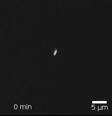
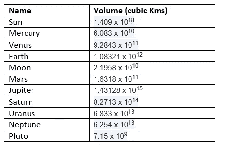
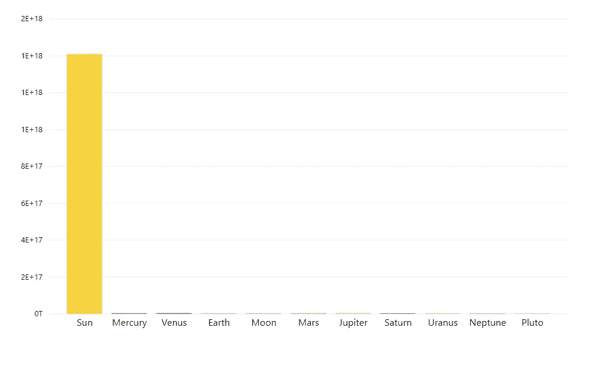
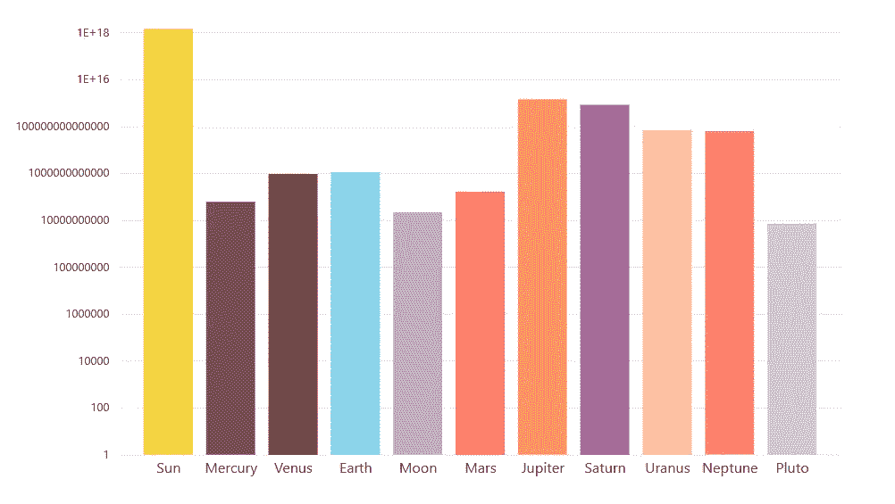
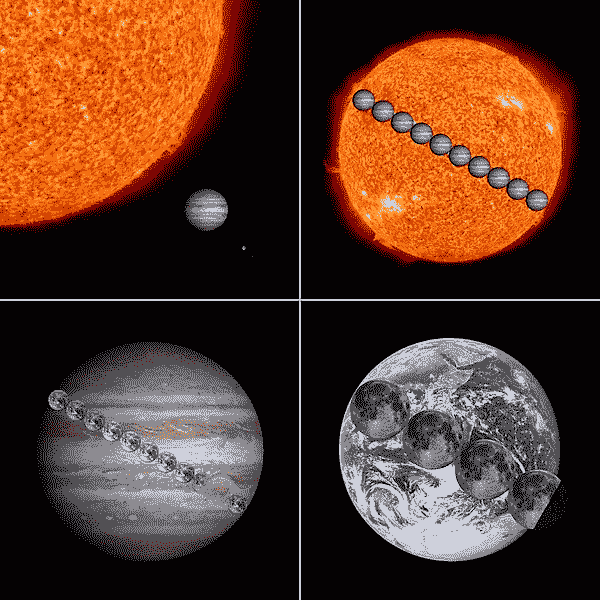
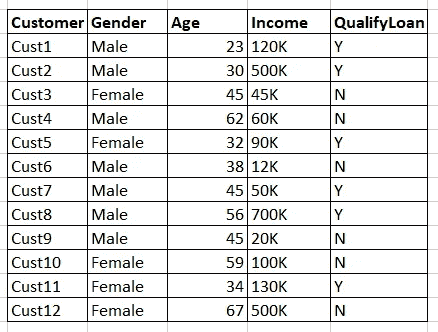
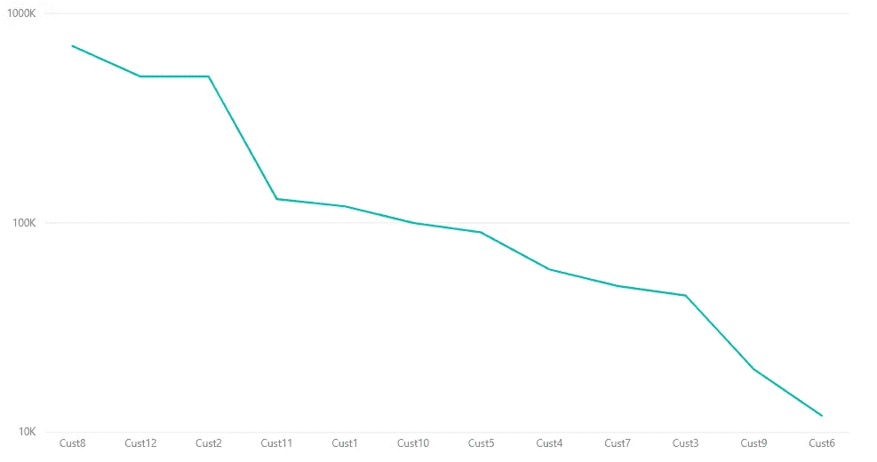

# 对数——什么、为什么和如何

> 原文：<https://towardsdatascience.com/logarithms-what-why-and-how-ff9d050d3fd7?source=collection_archive---------14----------------------->

## 理解对数变换背后的直觉及其在机器学习中的应用

一个对数螺线(来源:[https://commons . wikimedia . org/wiki/File:nautiluscutaway logarithmicspiral . jpg](https://commons.wikimedia.org/wiki/File:NautilusCutawayLogarithmicSpiral.jpg))

S 科学是对自然的研究，许多科学努力都是关于研究和测量自然中发生的变化。我们用数字来表示这些测量值。如果你想到“变化”，它们可能只有两种类型——要么是数量 ***增加(增长)*** 或 ***减少(衰减)*** 。捕捉这些变化的基本方法是 ***加、减、乘、除*** 的基本算术运算。

# 线性增长或衰退

比方说，一个人用 10 牛顿的力推一个石块。另一个人加入他的行列，开始以 5 牛顿的力沿 ***相同的*** 方向推动该块。在这种情况下，作用在木块上的总力将 ***与*** 相加，结果将是 15 牛顿。

在另一种情况下，假设第二个人以 5 牛顿的力开始推动该块，但是是在与第一个人的 方向相反的 ***方向。在这种情况下，合力将通过 ***减去*** 这两个力来计算。***

一些数量与其他数量成比例增加。这就是“倍增”效应发挥作用的地方。例如，如果一个人正在驾驶一辆汽车，他踩下油门，他行驶的距离按比例增加。

*距离=速度*时间*

同理，一个量可以和其他量成比例减少。这就是“分工”效应发挥的地方。在上面的例子中，跑完一段特定距离所用的时间与速度成反比。你得用 ***除以*** 距离与速度才能得到时间。

*时间=距离/速度*

速度越快，花费的时间就越少。

有没有其他方法，一个量可以增加或减少？

# 指数增长或衰退

想想培养皿中的细菌生长。一个细菌可以分裂成两个，然后每个可以分裂成四个，以此类推。

来源:[https://commons . wikimedia . org/wiki/File:e . coli-colony-growth . gif](https://commons.wikimedia.org/wiki/File:E.coli-colony-growth.gif)

这种增长类型背后的中心思想是，如果一个数不断自我相乘，它可以增长得非常快。让我们从 2 开始

2, 4, 8, 16, 32……..

或者，如果我们从 10 开始，然后是 10，100，1000，10000，10000…

我们可以概括如下:

这被称为一种“*”的指数增长或增长。数“a”被称为“ ***基*** ”，因为它是基础或起点。数字“y”被称为“ ***指数”*** ，因为它“扩展”了基数。*

*另一种看待这个“增加”的方式是问自己— **一个“数”要乘以多少次才能达到某个“目标”？**。*

*所以，假设你的目标数字是 10000。你从 10 开始。现在的问题是——10 要乘以多少次才能达到 10000？答案是 **4** 。*

> *事实上，您刚刚计算了以 10 为底的 10000 的“对数”。这就是对数。这是一个算术运算。就像加法和减法是相对应的，乘法和除法也是相对应的，同样，幂和对数也是相对应的。*

**

*这样读吧…10 必须乘以 4 才能达到 10000*

*10 * 10 * 10 * 10 = 10000*

*从一个基数开始，用达到某个目标数字所需的“努力”或“时间”来思考是有帮助的。[请注意，用努力或时间来思考只是一种类比，有助于建立直觉。]*

*如果我们从 10 开始，那么达到 10000 肯定比达到 1000 需要更多的努力。**对数*是“努力”或“花费时间”*** 的度量。以 10 为底的 10000 的对数是 4，大于 1000 的对数(3)。与 1000 相比，达到 10000 需要更多的努力或时间。*

> *在求幂运算中，我们从一个基数开始，然后将它乘以一定的次数来达到一个目标。*
> 
> *在对数中，我们从一个基数和一个目标开始，找出基数要乘以多少次才能达到目标。*

*请注意，对数总是以基数为基础计算的。上面提供的例子是针对以 10 为底的常用对数。其他常用的“底数”是 2(二进制对数)和一个非常特殊的数“e”2.71828(自然对数)*

# *但是为什么是对数呢？*

*它更容易与加法、减法、乘法和除法联系起来。事实上在某种程度上，甚至是指数运算(想想人口增长或新冠肺炎病毒的传播)。但是为什么有人会关心计算一个数的对数呢？简单的答案是:一个数的对数给出了这个数与另一个数相比有多大的度量。*

*人类的大脑能够处理和比较相同比例或相似比例的数字。比方说，给你一组不同人(成年人)的体重。大概每个人都在 40 公斤到 200 公斤的范围内。我们可以很容易地想象和比较这些数字。*

*现在考虑一下，你已经知道了我们太阳系中所有天体的体积。这些数字大致如下:*

**

*让我们试着用条形图来比较一下大小:*

**

*上图暴露了这个问题。太阳的体积如此之大，以至于我们无法理解其他的价值。与 Sun 相比，其他一切看起来都一样。我们能推断出的唯一事实是太阳非常大，但这是每个人都知道的事情！*

*如果我们对 Y 轴上的值(即体积)取“对数”并检查图表，结果会怎样:*

**

*这提供了一个更清晰的图像，即使尺寸值彼此相差很大，我们也可以比较尺寸。注意 Y 轴。每个条代表实际尺寸的对数。(注意，我们使用的基数是 10)。你现在可以得到一些有趣的事实，比如:*

1.  *太阳显然是我们太阳系中最大的天体。然而，木星是行星中体积最大的。与地球相比，它的 3 个“尺度”更大。这意味着大约 1000 次。*
2.  *地球比太阳小 6 倍左右。意思是大约小 1000000 倍！！与太阳相比，我们非常渺小。*

**

*来源:[https://commons . wikimedia . org/wiki/File:solar system _ OrdersOfMagnitude _ Sun-Jupiter-Earth-moon . jpg](https://commons.wikimedia.org/wiki/File:SolarSystem_OrdersOfMagnitude_Sun-Jupiter-Earth-Moon.jpg)*

**(这张图片有四个象限，显示了四个关键太阳系天体的相对大小:太阳、木星、地球和月球。在左上角，所有四个都按比例显示了尺寸。在右上方，木星的直径比太阳的直径小十倍(0.10045×)。左下角显示的木星直径是地球直径的 11 倍(10.9733 倍)。最后，在右下方，地球的直径是月球的三又三分之二(3.6676 倍)。这正好是 11/3 直径比(0.09%误差)。这个信息的来源是* [*【维基百科】*](https://en.wikipedia.org/wiki/Jupiter) *。)**

*所以对数提供了“**标度**”。它们使得理解和比较非常大的数字变得容易得多。*

*对数变换的一个常见应用是测量地震强度。这被称为里氏震级，给出了以 10 为底的对数的地震强度。6.0 级的地震比 5.0 级的地震强 10 倍*

# *机器学习中的对数变换*

**

*在 [Unsplash](https://unsplash.com?utm_source=medium&utm_medium=referral) 上由 [Franck V.](https://unsplash.com/@franckinjapan?utm_source=medium&utm_medium=referral) 拍摄的照片*

*在机器学习中，基本目标是找出输入数据点和输出之间的模式。让我们以下面的数据集为例:*

**

*上面的数据集是一个模拟数据，给出了客户的一些数据属性，如性别、年龄和收入。最后一个变量“QualifyLoan”是输出变量，它决定了特定客户是否有资格获得贷款。这是一个监督学习分类问题，其中“合格贷款”与年龄、收入和性别之间的关系必须建立起来，以便我们可以预测未来客户是否有资格获得贷款。*

**(注:我在这里不涉及机器学习算法的细节。这个想法是为了解释“对数”如何在这样的设置中发挥作用)**

*在这种类型的数据中，机器学习实践者通常建议对收入等连续变量进行记录，以提高模型的准确性。*

*这样做的原因是“收入”变量跨越了从 12K 到 700K 的很大范围的值。如果有更多的数据，这个范围甚至可以更大。在很多情况下，收入值会偏低，而在少数情况下，收入会非常高。*

> *如果我们使用收入的绝对值，具有较大值的数据实例将由于其较大的“量”而对模型产生更大的影响*

*对数将解决这个问题。如果取收入的对数，得到的值将减少变量的范围，同时“保留”差异。*

**

*如果你看最后一列，现在的值是在同一刻度上。在寻找模式来预测哪些客户有资格获得贷款，哪些客户没有资格获得贷款时，这一变量导致偏差的机会较小。*

*另一种看法是——“收入”栏中的值本质上是“非线性”的。如果你根据收入对顾客进行分类，你会看到价值的突然下降和上升。取对数会将数值带到一个可比较的尺度上，并为数值带来“线性”。*

****

*作者图片*

*比较右边的对数坐标图和左边的 Y 轴原始收入值图。右图更倾向于“线性”。*

*对数帮助我们处理“非线性”数据。*

*对数初看起来似乎很神秘，但如果我们试图直观地理解背后的逻辑，它可以打开一个全新的数学魔法世界。我希望这篇文章能帮助你看到这种神奇的一瞥！*