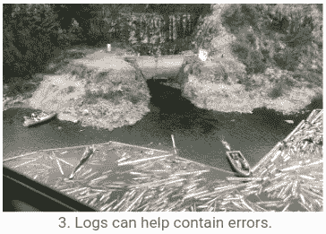

# Python 中的日志算法实验

> 原文：<https://towardsdatascience.com/logging-algorithmic-experiments-in-python-9ab1f0e55b89?source=collection_archive---------34----------------------->


不要成为那样的人。阅读这篇文章并正确记录你的实验。

## 当你的大脑忙于思考聪明的解决方案时，你会忘记你正在尝试哪种聪明的解决方案。

研究难题的解决方案是一项充满挑战的任务。这篇文章的目标是消除其中的一个挑战——跟踪我们在所有这些研究中所处的位置。

在这篇文章中，我假设你正在编写一段代码，这段代码是你从头到尾运行的一段独立代码(我们称之为“实验”)，你的目标是跟踪你的研究进展。

为此，我们将使用一些有用的日志来丰富我们的代码。
这些日志遵循三个指导原则，这些原则衍生出三个行动项目:

1.  算法的输入对输出有很大的影响。
    👉🏾日志输入参数。
2.  如果感觉花的时间太长，那可能就是花的时间太长了。
    👉🏾日志运行时间。
3.  日志不能避免错误，但是可以帮助控制它们。
    👉🏾日志 Git 修订版。



# 0.为每个实验打开一个记录文件夹

为了跟踪我们的实验，我们将把每次实验的所有日志保存在一个专用文件夹中，该文件夹将使用实验的开始时间来命名:

我将假设您对代码使用了某种日志记录方案。例如，您可以使用[这种可复制粘贴的日志记录模式](https://codeburst.io/copy-pastable-logging-scheme-for-python-c17efcf9e6dc)。如果是这样，我们可以初始化我们的日志记录器，将日志文件保存到这个文件夹中。

# 1.日志输入参数

如果您还没有这样做，我强烈建议您将所有的参数放在一个类中，并为每个参数取一个有意义的名称。


请记住:你的日志不只是为你而写的；它们是给每个人的(大部分是未来的你！).

现在我们可以创建一个专用文件来记录每个实验的输入参数:

# 2.日志运行时间

当我在处理一个复杂的算法时，我会将管道分成有意义的模块。这种结构有助于我理解我的解决方案，它使代码更具可读性和可维护性，并使跟踪运行时和揭示瓶颈变得更容易。

记录运行时有无数种方法。
例如，偶尔运行一个像`cProfile`这样的分析器，并用 [SnakeViz](https://stackoverflow.com/a/49173782/2934048) 来说明结果是很棒的。这种配置文件的缺点是，它们会带来计算开销，导致不准确，并且每次运行时需要花费太多精力。
因此，我更喜欢维护我自己的精简和简单的运行时记录器:

然后，在我的算法的`main`中，我使用这个运行时记录器来跟踪全局和模块分离的运行时:

# 3.日志 Git 版本

为了确保我们知道我们运行的是哪种算法，我们应该尽可能地记录代码的当前状态。当然，我们可以将整个代码库保存到我们的日志文件夹中，但是…
正如所料，我们将使用 Git 特性来实现这个目标。

> 注意:我知道许多算法专家避免使用版本控制。如果你是他们中的一员，我想指出的是，你偶然发现这篇文章的事实表明，你可能需要一些帮助来跟踪你的研究。Git 就是为此而发明的！我个人可以证明，与一个有组织的系统跟踪我的代码的好处相比，维护修订历史的开销是微不足道的。你相信了吗？从[这个](https://medium.com/@munniomer/an-intro-to-git-and-github-for-beginners-part-i-tutorial-9be4be9cac8d)可理解的教程开始学习基础知识，从[这个](https://medium.com/@daphnaregev/git-level-up-bfbd85444622)开始学习一些高级特性，如果你发现自己在想“该死的饭桶！？!"，就去[hoshitgit.com](https://ohshitgit.com/)。

我发现记录以下详细信息很有用:

1.  Git 分支。
2.  最新提交的短哈希。
3.  工作目录和最近一次提交之间的差异。

在我们用 python 代码做这件事之前，让我们确保我们知道如何从终端获取我们需要的东西:

添加`-C <path/to/project>`确保我们可以从任何地方获得想要的细节:

现在我们准备看看如何在我们的 python 代码中做到这一点，使用[子流程](https://docs.python.org/3/library/subprocess.html)内置包，以及 [pathlib](https://docs.python.org/3/library/pathlib.html) 提取我们的存储库的路径:

现在你手头已经有了所有的信息，我建议将`git_branch`和`git_commit_short_hash`添加到第一节的输入参数中，并将`git_diff`保存到[补丁](https://medium.com/transmute-techtalk/improve-your-commit-hygiene-with-git-add-patch-3b7dd9c117c4)文件中:

# 收场白

如果到目前为止你遵循了说明，那么在每个实验的开始，你会生成一个新的文件夹，`log_<start_time>`，在那里你会找到以下有用的文件:

```
_ log_<start_time>
  |_ git_diff.patch
  |_ log.txt
  |_ params.json
  |_ runtime.json
```

这就是所有的人，我希望你发现这是有用的，并且所有这些日志记录的开销将很快值得。我保证，很快你就会发现你不再浪费时间和精力去绞尽脑汁考虑哪段代码是好的，相反，你将会把所有的精力放在开发令人敬畏的算法上！

