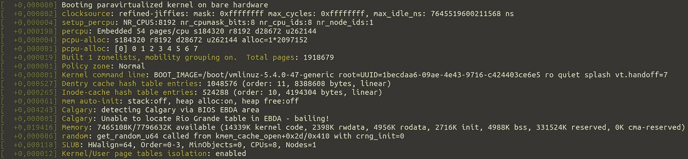
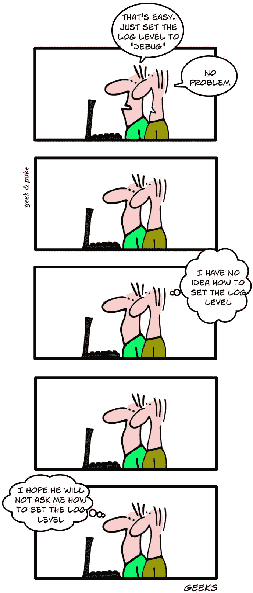

# Python 中的日志记录基础

> 原文：<https://towardsdatascience.com/logging-basics-in-python-d0db13e538f9?source=collection_archive---------20----------------------->

## 学习纯 Python 的基础知识



[dmesg](https://en.wikipedia.org/wiki/Dmesg) 输出。马丁·托马斯截图。

日志记录是记录关于当前执行状态的信息的行为。这样做通常有两个目的:

1.  **调试**:让开发者缩小系统故障的原因
2.  **监控**:让正在操作的人知道当前正在发生什么

# 你好，甜蜜的伐木世界！

最简单的日志记录方式如下:

```
**import** logging
**import** syslogging.basicConfig(
    format="{asctime} {levelname:<8} {message}",
    style="{",
    level=logging.DEBUG,
    stream=sys.stdout,
)logging.info("Hello World!")
```

它给出如下输出:

```
2020-09-07 22:40:32,101 INFO     Hello World!
```

**基本配置可能不应该使用**。请继续阅读“4 个日志类”来了解原因😁


图片来自 geek-and-poke.com

# 4 个日志记录类

Python 在树结构中有一个记录器层次结构。这意味着您可以为单个记录器应用日志配置，并使所有子记录器的行为方式相同。如果您想要配置软件包，这很有用。`logging.basicConfig`作用于根记录器。因此，它应该只在应用程序代码中使用，而不应该在库或框架代码中使用。

Python 区分了 4 个主要组件，您可以根据需要进行调整:记录器、处理程序、过滤器和格式化程序。它们作用于当您将日志消息传递给记录器时创建的日志记录。

## 记录器

记录器是用于发出日志记录的对象:

```
import logginglogger = logging.getLogger(__name__)
```

您可以发出 5 个级别的日志消息:

*   **Debug** :非常详细，如果你不知道代码的某个部分发生了什么，你可以使用这个。记得再拆一次。
*   **信息**:没什么可担心的，但有助于理解系统
*   **警告**:可能成为问题的事情发生了。可能是一个事件，如果它发生得太频繁，可能会指示一个错误。可能剩余存储变少了。也许网络连接被中断了。可能文件不可写。
*   **错误**:无法执行重要事件，例如，因为缺少权限或应该读取的文件不存在。
*   **严重**:发生了需要重启 app 的问题。例如，接收到一个终止信号。

你像这样使用它:

```
logger.info("My first log message")
logger.warning("The specified file could not be opened.")
```

## 日志处理程序

文件处理程序将内容存储到文件中，流处理程序将日志写入流中:

```
sh = logging.StreamHandler()
fh = logging.FileHandler("spam.log")
logger.addHandler(sh)
```

如果你使用文件处理器，考虑使用[旋转文件处理器](https://docs.python.org/3/howto/logging-cookbook.html#using-file-rotation)。一旦日志文件变得太大，它将创建一个新文件。您可以指定可能有多少个文件。当达到最大值时，最旧的文件将被删除。

[HTTPHandler](https://docs.python.org/3/library/logging.handlers.html#httphandler) 也值得注意，因为它允许你集成到其他系统中，比如 Slack。

通常，您还希望将日志级别设置为记录器或日志处理程序:

```
sh.setLevel(logging.INFO)
```



图片来自 g[eek-and-poke.com](https://geekandpoke.typepad.com/geekandpoke/2010/01/geeks.html)

## 日志格式化程序

日志格式化程序更改日志消息字符串。格式化程序附加到日志处理程序:

```
formatter = logging.Formatter(
    "{asctime} {levelname:<8} {message}",
    style="{"
)
sh.setFormatter(formatter)
```

样式属性很有意思。缺省值是`%`，这意味着格式字符串需要是`(asctime)s (levelname)-8s (message)s`。我从来没有真正了解百分比格式是如何工作的。我喜欢用花括号。

您可以使用更多的[日志记录属性](https://docs.python.org/3/library/logging.html#logrecord-attributes)。

## 日志过滤器

[日志过滤器](https://docs.python.org/3/library/logging.html#filter-objects)提供定义显示哪些日志记录的可能性:

```
**import** datetime
**import** logging
**import** syslogger = logging.getLogger(__name__)**class** OnWeekendOnlyErrorsFilter(logging.Filter):
    **def** filter(self, record):
        is_weekday = datetime.datetime.today().weekday() < 5
        return is_weekday or record.levelno >= logging.ERRORstdout_handler = logging.StreamHandler(sys.stdout)
stdout_handler.setLevel(logging.WARNING)
stdout_handler.addFilter(OnWeekendOnlyErrorsFilter())
logger.addHandler(stdout_handler)
```


Nigel Tadyanehondo 在 [Unsplash](https://unsplash.com?utm_source=medium&utm_medium=referral) 上拍摄的照片

# 记录 vs 打印 vs 异常

我一直很困惑什么时候应该简单地打印出信息，什么时候应该注销，或者什么时候应该抛出一个异常。

> 您在库函数中抛出一个异常，以便该函数的用户可以捕捉到该异常，并向最终用户显示一条有意义的错误消息。最终用户永远不会看到追溯。

**日志记录是为试图了解系统发生了什么的其他系统或开发人员准备的**，而**打印是为用户准备的**。令人困惑的是，默认情况下，打印消息会出现标准错误。你可以很容易地对印刷品做同样的事情。我过去曾用它向用户反馈当前正在发生的事情，只是因为日志记录有一种简单的方法来包含时间戳。


由 [Esteban Lopez](https://unsplash.com/@exxteban?utm_source=medium&utm_medium=referral) 在 [Unsplash](https://unsplash.com?utm_source=medium&utm_medium=referral) 拍摄的照片

# Warnings.warn vs logging.warning

根据[官方文档](https://docs.python.org/3/howto/logging.html#when-to-use-logging)，当您想要发布关于特定运行时事件的警告时，您有两种选择:

*   `[warnings.warn()](https://docs.python.org/3/library/warnings.html#warnings.warn)`在库代码中，如果问题是可避免的，则应修改客户端应用程序以消除警告
*   `[logging.warning()](https://docs.python.org/3/library/logging.html#logging.warning)`如果客户端应用程序对此情况无能为力，但仍应记录该事件

警告的一个典型用例是 [DeprecationWarning](https://docs.python.org/3/library/exceptions.html#DeprecationWarning) ，通过它，库可以告诉它的用户删除某种类型的用法。或者 Scipy 警告您没有找到 BLAS 库。


日志消息太少不好，但是太多也会有问题。由 [Christa Dodoo](https://unsplash.com/@krystagrusseck?utm_source=medium&utm_medium=referral) 在 [Unsplash](https://unsplash.com?utm_source=medium&utm_medium=referral) 上拍摄的照片

# 我应该记录什么？

我通常会记录执行时间长的代码，而对于那些调用频率高且速度快的函数，我不会添加太多日志记录。大部分时间都有加载配置的初始化函数。我总是记录完整的配置，但去掉凭证。

我也记录错误和罕见的异常。

很难找到合适的平衡点。日志消息太多，很难找到相关信息。消息很少可能意味着你根本没有记录重要的信息。

# 最佳实践

对于应用程序来说，创建一个`log.py`或`logger.py`文件是一种常见的做法，在这个文件中，日志记录器被初始化，日志处理程序和格式化程序被添加。 [OpenShot](https://github.com/OpenShot/openshot-qt) 正在做。


克里斯汀娜面粉在 [Unsplash](https://unsplash.com?utm_source=medium&utm_medium=referral) 上拍摄的照片

# 静音记录器

令人沮丧的一个常见原因是来自第三方软件的垃圾日志消息。如果他们表现良好，很容易让他们安静下来:拿起记录器，把音量设置得高一些:

```
logging.getLogger("urllib3").setLevel(logging.CRITICAL)
```

如果您甚至不想要关键日志记录，您可以设置

```
logging.getLogger("urllib3").setLevel(logging.CRITICAL + 1)
```

要禁用子记录器:

```
# Disable all child loggers of urllib3, e.g. urllib3.connectionpool
logging.getLogger("urllib3").propagate = False
```

你也可以删除所有的处理程序/添加 [NullHandler](https://docs.python.org/3/library/logging.handlers.html#nullhandler) 。

# 我应该一直使用 Pythons 的日志库吗？

肯定不是！有些脚本太短了，以至于无法进行日志记录。其他的[，比如 ArchiveBox](https://github.com/pirate/ArchiveBox/issues/468#issuecomment-688489159) ，实现了他们自己的专用日志。还有其他日志库，如 [structlog](https://pypi.org/project/structlog) 。

# 更多信息

柯蒂斯·马洛尼在一次精彩的 PyCon 演讲中也提供了类似的信息:

您可以直接阅读[文档](https://docs.python.org/3/library/logging.html)或官方[测井指南](https://docs.python.org/3/howto/logging.html)。对我来说，阅读 StackOverflow 通常也很有帮助。

有了这些资源，我希望没有人会再为 Python 日志而挣扎。如果你还有问题，告诉我(info@martin-thoma.de)。