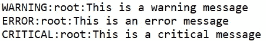
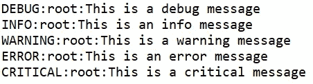
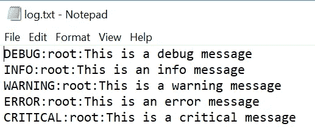
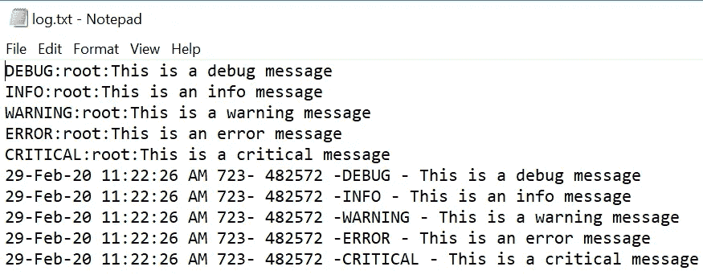
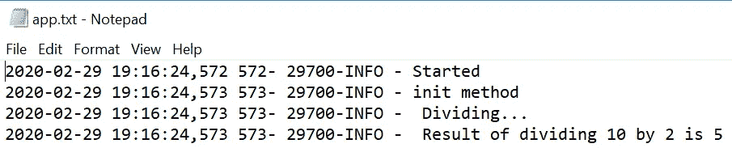
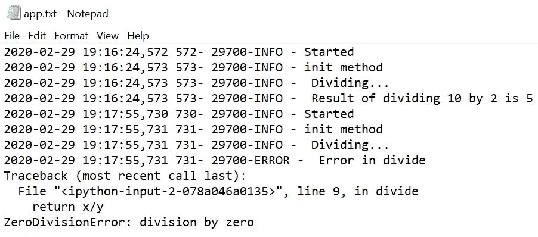

# 在 Python 中登录

> 原文：<https://towardsdatascience.com/logging-in-python-12e0c0528dd6?source=collection_archive---------16----------------------->

## 学习用 Python 记录用于代码故障排除的消息

在这篇文章中，我们将探索

*   什么是日志记录？
*   为什么需要？
*   如何记录格式化的消息？
*   我们如何记录 python 类和函数的消息？
*   如何将日志消息写入文件？
*   如何记录堆栈跟踪？


Max 陈在 [Unsplash](https://unsplash.com/s/photos/code?utm_source=unsplash&utm_medium=referral&utm_content=creditCopyText) 上的照片

您已经在 Python 中创建了类和函数，并且得到了不希望的结果，或者代码已经部署到生产环境中，并且已经开始给出不希望的结果。

***你如何调试代码来找出并解决根本原因？***

**日志记录是在代码执行时记录代码流的过程，同时捕获执行期间发生的任何其他事件，如内存不足(OOM)问题或硬盘问题**。日志记录通常在文件中完成，以后可以检索这些文件进行分析或故障排除。

使用日志，我们可以捕获代码的类和函数中的关键信息。

**日志有助于**

*   **调试代码以确定开发期间和部署后的源代码流程**
*   **针对由内存不足等代码导致的异常事件发出警报。**
*   **查找访问代码的用户或系统**

***您应该捕获哪些内容作为日志的一部分，以帮助进行故障排除？***

日志应该非常详细，包含描述性消息，包括

*   **访问细节**:访问模型的用户或设备
*   **代码版本**:正在使用的型号的当前版本
*   **时间戳**:捕获所有关键事件的时间戳，如何时读取输入数据、何时进行预测等。
*   **结果**:代码中计算变量的结果
*   **伴随堆栈跟踪出现的异常**
*   **代码流**:执行过程中调用的不同类和函数

***如何用 Python 实现日志记录？***

**Python 提供了一个“日志”库，将消息**写入文件或任何其他输出流，如标准输出。

**按严重程度排序的不同日志记录级别**

1.  **调试**:仅在诊断问题时使用
2.  **INFO** :仅供参考，用于诊断问题时理解代码流程
3.  **警告**:当意外情况发生，但代码仍在运行
4.  **错误**:代码无法执行某些功能
5.  **CRITICAL** :程序无法继续运行时的严重错误

使用日志记录和不同严重性选项的简单代码

```
**import logging
logging.debug('This is a debug message')
logging.info('This is an info message')
logging.warning('This is a warning message')
logging.error('This is an error message')
logging.critical('This is a critical message')**
```



控制台中的输出

我们的日志消息结构是严重性级别像 ***警告、*** 后跟默认日志模块 ***根、*** 后跟 ***消息。***

**我们看到没有显示调试和信息消息。默认情况下，日志模块仅显示严重级别为警告及以上**的消息

如果您正在调试代码，并且想要显示严重级别为 Debug 和 Info 的消息，该怎么办？

我们使用***basic config()***来设置测井系统的基本配置。

```
**import logging****logging.basicConfig(level=logging.debug)****logging.debug('This is a debug message')
logging.info('This is an info message')
logging.warning('This is a warning message')
logging.error('This is an error message')
logging.critical('This is a critical message')**
```



控制台中的输出

*如果已经配置了根记录器，则不会考虑新的设置。我不得不重新启动我的内核，让上面的代码正常工作，因为第一次调用任何日志记录函数时，它会在内部配置根日志记录器。*

***公共基础配置()参数***

***文件名**:指定我们要写入日志消息的文件名*

***filemode** :指定文件需要打开的模式，如‘w’表示写入，‘a’表示追加。默认文件模式是“a”*

***格式**:指定[日志记录](https://docs.python.org/3.8/library/logging.html?highlight=logrecord#logrecord-attributes)中属性可用的格式字符串*

***datefmt** :指定我们想要的日志消息的日期格式。格式应该被***time . strftime()***接受*

***级别**:您想要为 root logger 设置的严重性级别*

## *以附加模式将日志消息写入 log.txt 文件，严重级别为 DEBUG*

```
***import logging
logging.basicConfig(filename='log.txt', filemode='a', level=logging.DEBUG)****logging.debug('This is a debug message')
logging.info('This is an info message')
logging.warning('This is a warning message')
logging.error('This is an error message')
logging.critical('This is a critical message')***
```

**

*包含日志消息的 log.txt 日志文件*

## *以附加模式将格式化的日志消息写入 log.txt 文件，严重级别为 DEBUG*

```
***import logging
logging.basicConfig(filename='log.txt', filemode='a', 
                    format='%(asctime)s %(msecs)d- %(process)d 
                    -%(levelname)s - %(message)s', 
                    datefmt='%d-%b-%y %H:%M:%S %p' ,
                    level=logging.DEBUG)****logging.debug('This is a debug message')
logging.info('This is an info message')
logging.warning('This is a warning message')
logging.error('This is an error message')
logging.critical('This is a critical message')***
```

**

*带有格式化日志消息的 log.txt 日志文件*

## *在类和函数中记录消息*

*下面的代码片段将演示类和函数的登录。*

*我们用 divide()创建一个 TestLog 类；它接受两个参数并返回除法。如果在划分中有错误，我们希望在日志文件中有堆栈跟踪*

```
***import logging
class TestLog:
    def __init__(self):
       logging.info('init method')
    def divide(self, x, y):
        try:** l**ogging.info(" Dividing...")
            return x/y
        except Exception as e:
            logging.error(" Error in divide", exc_info=True)***
```

*创建 TestLog 类的实例并调用 divide()*

```
***import logging****logging.basicConfig(filename='app.txt', filemode='a',level=logging.DEBUG, format='%(asctime)s %(msecs)d- %(process)d-%(levelname)s - %(message)s')****logging.info('Started')
x=10
y=2
t= TestLog()
num_1= t.divide(x,y)****logging.info(" Result of dividing %d by %d is %d", x, y,num_1)***
```

**

*在 app.txt 中记录消息*

## *记录堆栈跟踪*

*为了显示堆栈跟踪，我们需要像在 TestLog 类中一样，在异常处理的 **except** 块中将 **exc_info 设置为 True***

```
***logging.info('Started')
x=10
y=0
t= TestLog()
num_1= t.divide(x,y)
logging.info(" Result of dividing %d by %d is %d", x, y,num_1)***
```

**

*堆栈跟踪*

## *结论:*

*日志记录有助于在开发期间或生产部署之后对应用程序进行故障排除。可以使用多种格式将日志记录写入文件或标准输出，我们还可以捕获堆栈跟踪。*

## *参考资料:*

 *[## 日志记录方法— Python 3.8.2 文档

### 日志记录是跟踪某些软件运行时发生的事件的一种方式。该软件的开发人员添加了日志调用…

docs.python.org](https://docs.python.org/3.8/howto/logging.html#logging-basic-tutorial)* 

*【https://docs.python.org/3/howto/logging-cookbook.html *