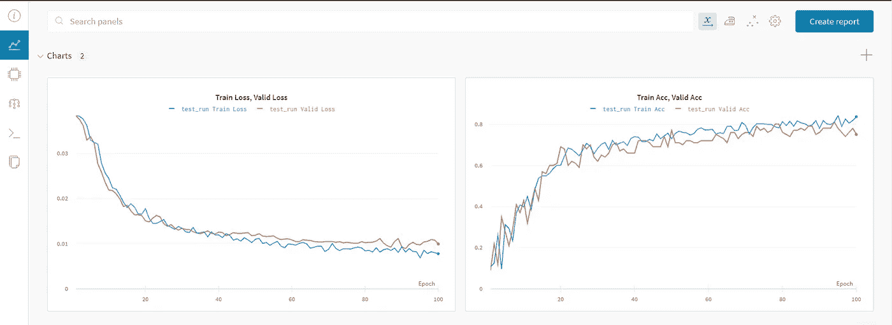
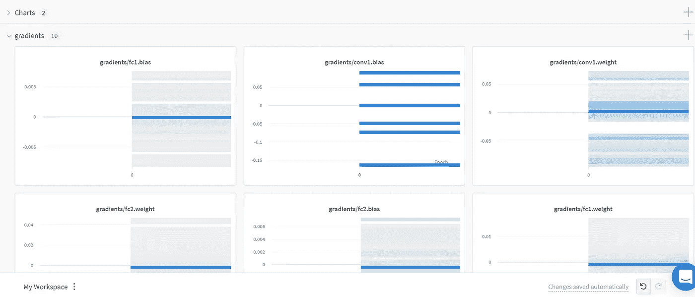
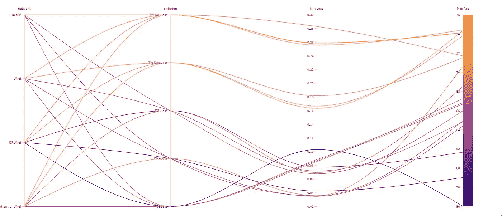
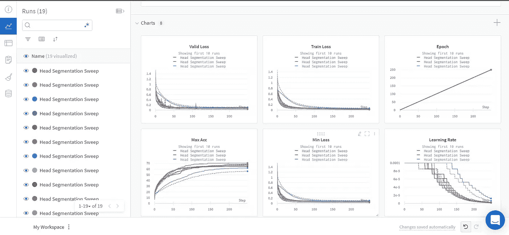

# 使用权重和偏差记录

> 原文：<https://towardsdatascience.com/logging-with-weights-biases-da048e3cbc8b?source=collection_archive---------14----------------------->

## 监控你的神经网络的训练变得容易


照片由[艾萨克·史密斯](https://unsplash.com/@isaacmsmith?utm_source=unsplash&utm_medium=referral&utm_content=creditCopyText)在 [Unsplash](https://unsplash.com/s/photos/graphs?utm_source=unsplash&utm_medium=referral&utm_content=creditCopyText) 拍摄

记录损耗和精度曲线从来都不是一件容易的工作。我们通常将这些值保存在数组或列表中，然后在训练结束时绘制它们。如果发送这些图表的截图似乎是唯一的选择，那么分享这些图表就更难了。在本教程中，我们将通过权重和偏差来解决这个问题。

weights & bias(WandB)是一个 python 包，允许我们实时监控我们的训练。它可以很容易地与 Pytorch、Tensorflow 或 Keras 等流行的深度学习框架集成。此外，它允许我们将我们的运行组织到项目中，在那里我们可以很容易地比较它们，并确定最佳执行模型。在本指南中，我们将学习如何使用 WandB 进行日志记录。

# 我们开始吧

首先，让我们在这里创建一个免费的 WandB 账户[。WandB 在免费账户上提供了 200GB 的有限存储空间，我们可以在这里记录图表、图像、视频等等。](https://wandb.auth0.com/login?state=g6Fo2SBWYmVrejBYbGQ3SDlfZWFJLV9TakdTdjltcEJHODFYSaN0aWTZIHlmdUZmTm9iWmxPUXFHOVhITW92dTczWm4yRUdkdGtlo2NpZNkgVlNNNTdVQ3dUOXdiR1N4S3RFREdRSElLQUJIcHB6SXc&client=VSM57UCwT9wbGSxKtEDGQHIKABHppzIw&protocol=oauth2&redirect_uri=https%3A%2F%2Fapp.wandb.ai%2Flogin&audience=https%3A%2F%2Fwandb.auth0.com%2Fuserinfo&scope=openid%20profile%20email&response_type=code&response_mode=query&nonce=bVJhM3dxQUdvLmZneGtIc3RsWXc0NHY0LXI4a0pYMG9GbEJ1dkdoR3FOMw%3D%3D&code_challenge=89lhVADKBMvrdZTZry4gBB25YCLzGH0hQnW153qUqC4&code_challenge_method=S256&auth0Client=eyJuYW1lIjoiYXV0aDAtc3BhLWpzIiwidmVyc2lvbiI6IjEuOS4wIn0%3D)

# 安装 WandB

运行下面的代码片段会将 WandB 安装到我们的 Colab 笔记本实例中。安装并导入 WandB 后，它会提示我们进行身份验证，就像我们在将 Google Drive 挂载到 notebook 实例时所做的一样。

# 资料组

在本教程中，我们将在 PyTorch 的`torchvision.datasets`中提供的时尚 MNIST 数据集上训练一个卷积神经网络。我们将把数据集分成几批，并在将它们输入到我们的神经网络之前进行洗牌。为了简单起见，除了将图像和标签转换成 torch 张量之外，我们不会使用任何数据增强。

# 神经网络

我们将使用具有 2 个 Conv 层和 3 个线性层的简单卷积神经网络。在输入 Conv 层，我们将保持输入通道计数为 1，以便神经网络接受灰度图像。类似地，在最终的隐藏层中，模型的输出通道数应该为 10，以输出 10 个类别中每个类别的分数。

# 训练神经网络

## 正在初始化 WandB

训练前一定要跑`wandb.init()`。这将在 WandB 数据库中初始化新的运行。`wandb.init()`有以下参数:

*   运行的名称(字符串)
*   应在其中创建此运行的项目的名称(字符串)
*   关于此运行的注释(字符串)[可选]
*   与此运行相关联的标签(字符串列表)[可选]
*   **实体**是我们 WandB 账户的用户名(字符串)。

## 记录超参数(可选)

我们想要记录的任何超参数都可以定义为`wandb.config`的一个属性。注意`wandb.config`应仅用于记录那些在训练期间不变的值。这里，我们用这种方法记录了学习率。

## 记录网络权重直方图(可选)

记录权重直方图非常简单，只需调用`wandb.watch()`并将`network`对象作为参数传递即可。

## 测井损失和准确性

在每个时期结束时，我们可以使用`wandb.log()`记录损失和精度值。该方法采用一个字典作为参数，该字典将名称(字符串)与相应的值进行映射。注意，这个方法在每个时期结束时被调用。

```
wandb.log({"Epoch": epoch,        
           "Train Loss": loss_train,        
           "Train Acc": acc_train,        
           "Valid Loss": loss_valid,        
           "Valid Acc": acc_valid})
```

完整的训练代码如下。请注意`train`和`validate`是在 [*Colab 笔记本*](https://colab.research.google.com/drive/1X99lDIZt6fM1DCNWA65xnr7dW6qNvxbh?usp=sharing) *中定义的两个辅助函数。*

# 监控培训

既然我们的模型正在训练，我们可以实时查看训练图。训练开始前，单元输出中将打印出**运行链接**和**项目链接**。单击运行链接可重定向至运行页面。在那里，你可以看到**的实时图**(这些图会随着模型的训练而不断更新)。请注意，图形是交互式的，我们可以合并多个图形，平滑它们，改变颜色或图例，等等。



回想一下，我们还记录了网络权重直方图。这些可以在直方图部分查看。



# 比较多次运行

我们可以使用**平行坐标图**轻松比较同一个项目中的多次运行。它用神经网络的超参数来表示模型在最小损失或最大精度方面的性能。事实证明，这个工具在处理大量运行时非常强大。它提供了对每个超参数如何影响模型性能的更深入的了解。



我们还可以转到项目页面，比较该项目中选定的或所有运行的精度和损耗曲线。下面的截图显示了我的一个项目。



# 分享你的跑步记录

与 WandB 共享您的模型的训练图就像共享跑步链接或项目链接一样简单，只要确保项目是公开的，其他人可以查看。拥有项目链接或运行链接的人也可以查看实时图表。是不是很酷！

# 那都是乡亲们！

这个指南教我们如何使用重量和偏差来监控我们模特的训练，以及如何与他人分享你的跑步。

# 想要更多！

要进一步探索 WandB，请查看下面的链接。

[](https://www.wandb.com/) [## 重量与偏见网站

### 有关权重和偏差的更多信息

www.wandb.com](https://www.wandb.com/) [](https://docs.wandb.com/) [## 重量和偏差文档

docs.wandb.com](https://docs.wandb.com/)