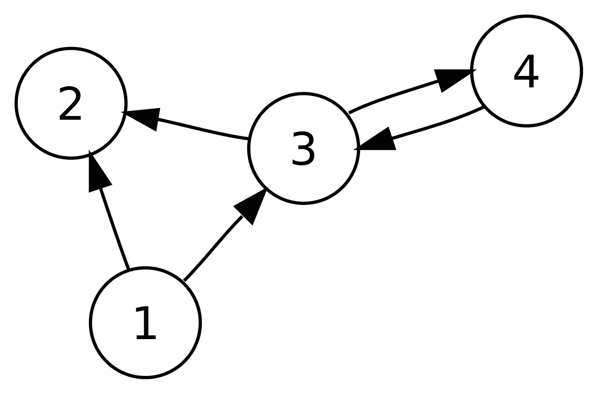
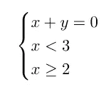

# 逻辑编程——重新思考我们编程的方式

> 原文：<https://towardsdatascience.com/logic-programming-rethinking-the-way-we-program-8706b2adc3f1?source=collection_archive---------13----------------------->

## 用 Prolog 介绍逻辑编程(和约束逻辑编程)中的一些最基本的概念。


图片来源: [Janeb13](https://pixabay.com/photos/art-school-of-athens-raphaël-1143741/)

# 介绍

如果你以前编写过代码，你很可能熟悉命令式语言，比如 Python、Java 或 C++。在这种范例中，程序是一系列指令，当执行时，这些指令修改它的状态。尽管这是最常见的编程方式，但不是本文的重点。

相反，我们将介绍一种不同的编程范式，**逻辑编程**，其中程序是关系的数据库。当我们试图用最流行的逻辑语言之一 **prolog** 解决一些简单的问题时，我们将展示主要的概念。

# 与关系打交道——苏格拉底会死吗？

逻辑编程中最基本的概念之一是**关系**。但是关系到底是什么呢？

为了更清楚地理解这一点，让我们看一段非常简单的 prolog 代码(你可以在这里下载 prolog

```
mortal(X) :- man(X).
```

一般情况下，**“A:-B”**给出的关系读作**“若 B 则 A”**。上面的例子可以解读为，“如果你是人，那么你就是凡人”，又名**“人是凡人】**。请注意，句号只是用来结束关系的。现在，假设我们添加以下内容:

```
man(socrates).
```

这才陈述，**“苏格拉底是人”**。现在，你可能会想，“这很好，但是有什么意义呢？”我们定义关系的原因是我们能够执行**查询**。在 prolog 中，我们可以执行简单的查询:

```
?- mortal(socrates).
true.
```

上面查询的结果是**【苏格拉底是凡人】**。它使用我们构建的关系数据库来判断苏格拉底是一个人，既然人都会死，那么苏格拉底也一定会死。相反，如果我们想遍历所有人，我们可以这样做:

```
?- mortal(X).
X = socrates.
```

在 prolog 中，大写字母用来表示变量。

## 有向图的简单示例

为了用一个更全面的例子来说明这一点，让我们假设我们得到了下面的有向图，并且对建模和从中做出推论感兴趣。



图片来源:[维基百科](https://commons.wikimedia.org/wiki/File:Directed_graph.svg)

我们想做的第一件自然的事情是，以某种方式找到图形的表示。最明显的方法是用它的联系来表示它。

```
arrow(1,2).
arrow(1,3).
arrow(3,2).
arrow(3,4).
arrow(4,3).
```

这个应该挺直观的。例如，**箭头(1，2)** 只是表示从顶点 **1** 到顶点 **2** 有一个箭头。

现在，假设我们希望确定是否存在从给定节点 **A** 到节点 **B** 的路径。我们如何使用逻辑编程对此建模？让我们直观地思考一下这个问题。有两种可能的情况:要么 **A** 和 **B** 是邻居，这种情况下我们需要检查是否存在从 **A** 到 **B** 的箭头。否则，如果存在从 **A** 到某个其他顶点 **C** 的箭头以及从 **C** 到 **B** 的路径，则存在从 **A** 到 **B** 的路径。

第一个关系可以很容易地写成:

```
is_path(A,B) :- arrow(A, B). 
```

第二个也相当简单:

```
is_path(A,B) :-
     arrow(A, C),
     is_path(C, B). 
```

在第二种情况下，逗号用来表示逻辑“与”。例如，从 **1** 到 **4** 有一条路径，因为从 **1** 到 **3** 有一个箭头，从 **3** 到 **4** 有一条路径。

我们可以更进一步，找出路径本身。我们可以这样定义 **is_path/3** (这里的 **/3** 只是表示有 3 个自变量):

```
is_path(A, B, P). 
```

我们现在要给出条件来确定 **P** 何时是从 **A** 到 **B** 的路径。为了清楚起见，我们希望以这样一种方式定义 **is_path/3** ,从而获得以下查询结果:

```
?- is_path(1,4,[1,3,4]).
true
```

我们来写 **is_path/3** ，一步一步来。基本情况很简单:我们只需检查 **P** 是否为**【A，B】**以及是否存在从 **A** 到 **B** 的箭头。

```
is_path(A, B, P) :-
     P  = [A, B],
     arrow(A,B). 
```

另一种情况可以如下进行:

```
is_path(A, B, P) :-
     P = [A|Tail],
     arrow(A, C), 
     is_path(C, B, Tail).
```

现在让我们仔细看看上面的代码。我们做的第一件事是检查 **P** 的形式: **A** 加上一个包含 **A** 之后的元素的列表。然后，我们所做的就是检查是否存在从 **A** 到其他顶点 **C** 的箭头，并递归地尝试查看 **P** 的尾部是否是从 **C** 到 **B** 的路径。

如果我们把这个应用到前面的例子中，**是 _path(1，4，[1，3，4])** ，我们需要检查**【1，3，4】**是否是从 **1** 到 **4** 的路径。我们看到 **P** 可以写成**【1 | Tail】**带**尾**为**【3，4】**。因此， **[1，3，4]** 是从 **1** 到 **4** 的路径。

# 约束逻辑编程

到目前为止，我们一直在 Herbrand 域上工作，但 prolog(以及一般的逻辑编程)真正出彩的地方是在有限域上工作时， **CLP(FD)** 或 reals， **CLP(ℝ)** 。

## 中电(R)

ℝ上的约束逻辑编程允许你简化和求解实数上的方程组。在 prolog 中，我们首先需要按如下方式导入它:

```
:- use_module(library(clpr)).
```

为了给出一个简单明了的例子，让我们看看下面的方程组:



在 prolog 中表示这一点非常简单:

```
?- {X + Y = 0, X < 3, X >= 2}.
```

该查询的结果将是上述系统的最简化版本，在这种情况下:

```
{X>=2.0, X<3.0, Y= -X}.
```

这可用于简化(和求解)具有许多不同约束的方程。

## CLP(FD)

有限域上的约束编程更适用于日常问题，如任务调度、优化或解谜(如 n 皇后问题)。

下面通过一个简单的例子来介绍一下 **CLP(FD)** 。我们将考虑以下难题:我们需要给每个字母分配整数，使得


在 prolog 中，我们可以编写这个简单的程序来解决上述难题:

```
:- use_module(library(clpfd)).
puzzle([V,E,R,Y] + [N,I,C,E] = [M,E,M,E,S]) :-
     Variables = [V,E,R,Y,N,I,C,M,S],
     Variables ins 0..9,
     all_different(Variables),
     (1000*V + 100*E + 10*R + Y) + 
     (1000*N + 100*I + 10*C + E) #=
     (10000*M  + 1000*E + 100*M + 10*E + S),
     V #\= 0, N #\=0, M#\=0,
     label(Variables).
```

我们首先将所有需要赋值的**变量**分组。接下来我们要做的是指定它们的域(在 **0** 和 **9** 之间)。然后，我们强迫他们都不一样。主要部分包括放置由难题给出的主要约束(在 **CLP(FD** )中，约束 **"** = "的语法是 **"#** = ")。此外，我们确保V、N 和M 不同于0。我们做的最后一件事是 **labe** l，它迫使 prolog 吐出单个解决方案，而不是打印出最终传播的约束。

现在，我们可以进行以下查询来获得解决方案:

```
?- puzzle(X).
X = ([7, 6, 2, 3]+[8, 5, 4, 6]=[1, 6, 1, 6, 9])
```

# 结论

在本教程中，我们仅仅触及了逻辑编程的表面。在群论和人工智能(尤其是自然语言处理)中有更高级的应用，仅举几例。希望您现在对逻辑编程的一般概念以及如何将其应用于各种问题有了更好的了解。