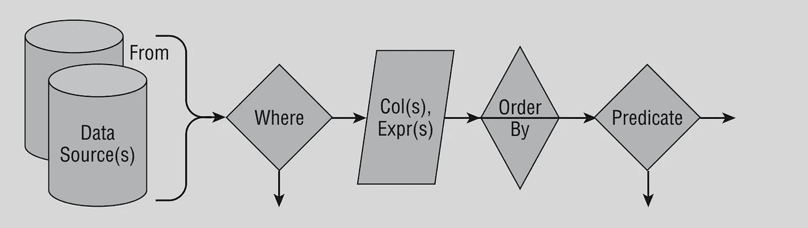

# 从数据库的角度看 SQL 查询| SQL 的逻辑流程

> 原文：<https://towardsdatascience.com/logical-flow-of-sql-query-sql-through-the-eye-of-database-e7d111c87516?source=collection_archive---------17----------------------->

## 对于所有的数据分析师来说，改变你从逻辑上看待 SQL 语句的方式。

结构化查询语言(SQL)以数据的浪漫语言而闻名。甚至想从万亿字节的关系数据中提取一个正确的答案似乎也有点让人不知所措。所以理解查询的逻辑流程非常重要。

由[格伦·卡斯滕斯-彼得斯](https://unsplash.com/@glenncarstenspeters?utm_source=medium&utm_medium=referral)在 [Unsplash](https://unsplash.com?utm_source=medium&utm_medium=referral) 上拍摄的照片

## 查询执行计划

SQL 是一种声明性语言，这意味着 SQL query 以逻辑方式向 SQL 查询优化器描述问题，后者随后会决定以物理方式执行查询的最佳方式。这种执行方法称为查询执行计划。可以有多个执行计划，所以当我们说优化一个查询时，反过来指的是使查询执行计划更有效。

让我们来看看 SQL 查询可以通过的两个流程:

# 查询的语法流程

SELECT 语句基本上告诉数据库要检索什么数据，从哪些列、行和表中获取数据，以及如何对数据进行排序。

SELECT 命令[1]的缩写语法

*   **SELECT** 语句以一列列或表达式开始。
*   SELECT 语句的 **FROM** 部分将所有数据源组合成一个结果集，供 SELECT 语句的其余部分使用。
*   **WHERE** 子句作用于由 FROM 子句组装的记录集，根据条件过滤某些行。
*   **GROUP BY** 子句可以根据指定的列将较大的数据集分组为较小的数据集。
*   **HAVING** 子句可用于限制 GROUP BY 的聚合结果。
*   **ORDER BY** 子句确定结果集的排序顺序。

> 最简单的有效 SQL 语句是:
> 
> 选择 1；(Oracle a 要求从 DUAL 追加来完成此操作)

> 嗯...「句法流」的流动出了什么问题？你能在不知道数据来源的情况下选择数据吗？？...嗯..某处有逻辑缺失的权利！！！苏..

[Smart](https://unsplash.com/@smartphotocourses?utm_source=medium&utm_medium=referral) 在 [Unsplash](https://unsplash.com?utm_source=medium&utm_medium=referral) 上拍照

# **查询的逻辑流程**

思考 SQL 语句的最佳方式是通过查询的逻辑流。逻辑流程可能不同于物理流程，也不同于查询语法。请按以下顺序考虑查询:

逻辑流程的简化视图[1]

1.  **FROM** :逻辑上查询从 **FROM** 子句开始，组装初始数据集。
2.  **WHERE** :然后应用 WHERE 子句只选择符合条件的行。
3.  **聚合**:对数据进行后期聚合，比如求总和、对列中的数据值进行分组以及对组进行过滤。
4.  **列表达式**:在上述操作之后，选择列表连同其中涉及的任何表达式的计算一起被处理。*(在 SQL 查询中，除了列表达式，其他都是可选的。)*
5.  **ORDER BY** :获取最终结果行后，按照 ORDER BY 子句进行升序或降序排序。
6.  **OVER:** 稍后可以应用窗口和排序函数，以获得结果的单独排序视图，并使用附加函数进行聚合。
7.  **DISTINCT** :用于删除结果数据中出现的任何重复行。
8.  **TOP:** 在选择数据、过滤数据、执行所有计算并对其排序的所有过程之后，SQL 可以将结果限制为前几行。
9.  **插入、更新、删除:**这是使用结果输出执行数据修改的查询的最后一个逻辑步骤。
10.  **UNION** :可以使用 UNION 命令将多个查询的输出堆叠起来。

> 适用于所有从事数据库或数据仓库项目的数据分析师。理解逻辑流程及其背后的基本逻辑非常重要。在任何数据分析项目中，数据收集都是第一步(从),删除不携带的数据(从),然后对数据进行排序(排序依据)。

# 参考

[1] Adam Jorgensen，Patrick LeBlanc，Jose Chinchilla，Jorge Segarra，Aaron Nelson，Microsoft SQL Server 2012 Bible，