# 逻辑回归

> 原文：<https://towardsdatascience.com/logistic-regression-2e11487cc44d?source=collection_archive---------47----------------------->

## 逻辑回归的简明介绍


paweczerwi ski 在 [Unsplash](https://unsplash.com?utm_source=medium&utm_medium=referral) 上的照片

逻辑回归是机器学习中使用的基本模型之一。这是一种分类技术，最适合预测分类反应变量。

## 为什么是逻辑回归？

虽然[线性回归](/multiple-linear-regression-8cf3bee21d8b?source=your_stories_page---------------------------)适用于连续或定量输出变量，但逻辑回归用于预测分类或定性输出变量。

例如，价格、销售额、温度等目标值本质上是定量的，因此可以使用任何线性模型进行分析和预测，如[线性回归](/multiple-linear-regression-8cf3bee21d8b?source=your_stories_page---------------------------)。

但是，如果我们必须预测一封邮件是否是垃圾邮件，信用卡客户是否会违约，给定的癌症是 1 期、2 期还是 3 期呢？对于这种情况，我们不能使用简单的回归模型，我们需要一些可以适应定性反应的东西。

考虑下图。该图显示了信用卡默认状态(0 或 1)与客户账户余额的关系。默认状态 0 表示*客户没有显示默认*，默认值 1 表示客户*默认*。

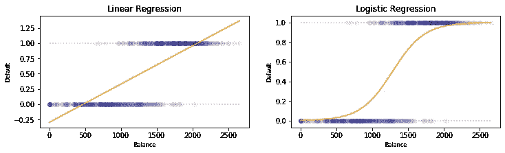

图片由 [Sangeet Aggarwal](https://medium.com/u/db3258338f2f?source=post_page-----2e11487cc44d--------------------------------) 提供

如上图所示，线性回归拟合(左)超出了 0 和 1 的可能限制。这是因为线性回归没有考虑到响应变量的值是分类的和离散的这一事实。它可能会为帐户余额高的客户绘制更高的值，反之亦然，这没有任何意义。这就是为什么我们不能对这类问题使用线性回归。

这样的问题可以通过逻辑回归(右)来解决，因为它只取 0 到 1 之间的值。

逻辑回归是最常用的，最适合有两个响应类别的问题，例如，→ 0 或 1，真或假，垃圾邮件或非垃圾邮件，A 型或 B 型等。

虽然它可以扩展到预测超过 2 个类别的响应，但还有几种比逻辑回归更好的方法来处理这些问题。因此，在这篇文章中，我们将只关注有两个响应类的问题。

## 概率方法

为了理解逻辑回归，我们必须理解它如何产生分类结果。它只是简单地预测响应类吗？不，不是的。

给定样本中的特征，逻辑回归计算样本属于某个类的概率。这个概率是为每个响应类计算的。具有最高概率的类通常被认为是预测类。

对于一个有两个响应类的问题，两个类的*概率加起来是 1* ，可以表示如下(取类值为 0 和 1)。

> Pr(Class = 1 |要素))= 1-Pr(Class = 0 |要素)

这里，Pr(Class = 1 | feature(s))读作→具有给定特征的样本属于类别 1 的概率。因为它是一个概率，所以它的值总是在 0 和 1 之间，包括 0 和 1。

## 算术地

回忆一下[简单线性回归](/simple-linear-regression-35b3d940950e?source=your_stories_page---------------------------)的方程。

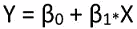

线性函数

对于逻辑回归，该方程采用这样的形式，即它只返回 0 和 1 之间的值。

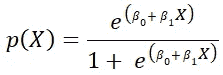

逻辑函数

这是逻辑函数，对于 x 的任何值，其值的范围是从 0 到 1。因此，逻辑函数的曲线呈 S 形，其尾部朝向 0 和 1，值介于两者之间。

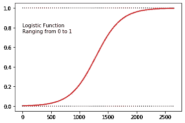

图片由 [Sangeet Aggarwal](https://medium.com/u/db3258338f2f?source=post_page-----2e11487cc44d--------------------------------)

通过少量操作，上述等式可以改写为:

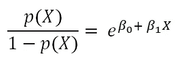

赔率函数

左侧的比率表达式称为*赔率*，可以取 0 到无穷大的值。接近 0 的赔率值表示类别 1 的概率非常低(类别 0 的概率很高)。较大的赔率值表示类别 1 的概率较高。

两面取原木:

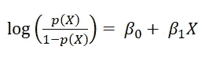

对数概率或对数

左边的表达式称为 *Logit* 函数或 log-odds 函数。这个 logit 函数在 X 中是线性的，可以用来解释 X 项的系数，我们后面会看到。

## 单预测因子逻辑回归

我们将首先看到当只有一个输入变量时，逻辑回归是如何工作的。然后我们将学习如何扩展模型以适应更多的输入变量。

让我们看一下我们将要使用的数据。这些数据代表信用卡发行商的客户，很少有细节，如他们是否是学生，他们的收入，余额，以及他们是否是违约者。

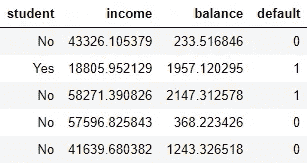

该公司希望建立一个能够预测客户是否会违约的逻辑模型。所以默认列是我们的目标变量。为了建立我们的第一个逻辑模型，让我们只考虑一个客户的平衡作为我们唯一的预测。

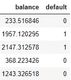

所以我们的模型方程看起来像这样:

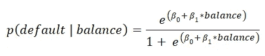

给定余额下的违约概率


对数-给定余额的违约概率

让我们使用 Python 中的 SciKit Learn 来构建我们的模型。

```
from sklearn.linear_model import LogisticRegressionX = data.balance.values.reshape(-1,1)
y = data.defaultlogistic = LogisticRegression()
logistic.fit(X,y)
```

绘制上述模型的结果，我们会得到这样的结果。

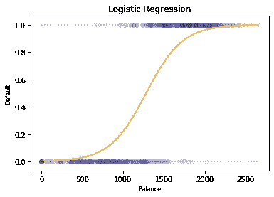

图片由 [Sangeet Aggarwal](https://medium.com/u/db3258338f2f?source=post_page-----2e11487cc44d--------------------------------) 提供

让我们检查截距和系数项。

```
print("Intercept: ",logi.intercept_)
print("Coefficient: ",logi.coef_)
```

输出:

```
Intercept: [-5.75236929]
Coefficient: [[0.00448445]]
```

这些可以解释为→

*   余额每变化一个单位，违约的对数几率就会乘以 e⁰-⁰⁰⁴⁴⁵.
*   当账户余额为零时，截距项-5.75 可以被读取为对数赔率的值。

现在让我们转到考虑多个输入变量的影响来预测默认状态的情况。

## 多重预测的逻辑回归

多元逻辑回归方程可以写成:

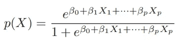

相应的对数优势函数将变为:

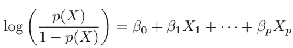

为了让我们的模型工作，我们需要将所有分类输入转换成数字标签。在这种情况下，学生变量的值为“Yes”和“No”。因此，我将这些值分别转换为 1 和 0。在继续之前，让我们再看一下数据。

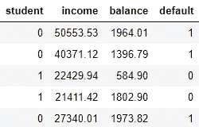

让我们来拟合模型。

```
X_all = data.drop('default',axis=1)
y = data.defaultmlr = LogisticRegression()
mlr.fit(X_all, y)
```

检查系数。

```
print("Coefficients for stuedent, income and balance are:")
for i in range(3):
    print(round(mlr.coef_[0][i],5))
print("Intercept: ", mlr.intercept_[0])
```

输出:

```
Coefficients for stuedent, income and balance are:
-1.63465
-5e-05
0.0047Intercept: -3.8386588181706274
```

在这里，收入的系数值相当低，这表明客户的收入并没有真正增加违约的几率。我们可以通过检查相关性和其他见解来做进一步的分析，以提高对数据和模型的理解。但为了保持主题的范围，我不在这里添加这部分分析。

我希望这篇文章能帮助你理解逻辑回归的工作原理。你也可以查看下面的链接来了解线性回归。更多此类帖子，敬请关注。

[](/simple-linear-regression-35b3d940950e) [## 简单线性回归

### 关于简单线性回归你需要知道的一切

towardsdatascience.com](/simple-linear-regression-35b3d940950e) [](/multiple-linear-regression-8cf3bee21d8b) [## 多元线性回归

### 一个完整的研究—模型解释→假设检验→特征选择

towardsdatascience.com](/multiple-linear-regression-8cf3bee21d8b) 

如果你是数据科学和机器学习的新手，不知道从哪里开始你的旅程，请查看下面的链接，在那里我提到了学习数据科学的一步一步的方法，有很多资源可供你选择。

[](/data-science-from-scratch-4343d63c1c66) [## 从零开始的数据科学

### 作为一个完全的初学者如何步入数据科学

towardsdatascience.com](/data-science-from-scratch-4343d63c1c66) 

等不及了？如果你想一头扎进一门课程，请点击下面的[链接](https://www.datacamp.com/?tap_a=5644-dce66f&tap_s=910084-843f05&utm_medium=affiliate&utm_source=sangeetaggarwal)，查看适合你的数据科学职业轨迹。

[](https://www.datacamp.com/?tap_a=5644-dce66f&tap_s=910084-843f05&utm_medium=affiliate&utm_source=sangeetaggarwal) [## 在线学习 R、Python 和数据科学

### 使用 DataCamp 的视频教程&编码，按照您自己的步调，在您的浏览器中舒适地学习数据科学

www.datacamp.com](https://www.datacamp.com/?tap_a=5644-dce66f&tap_s=910084-843f05&utm_medium=affiliate&utm_source=sangeetaggarwal)