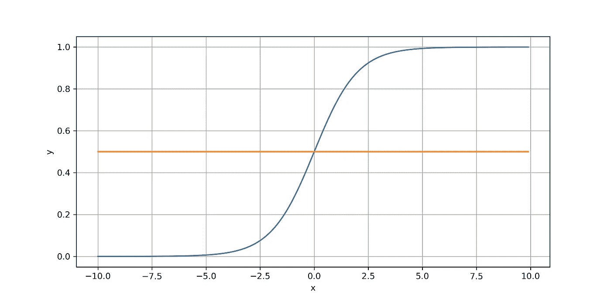
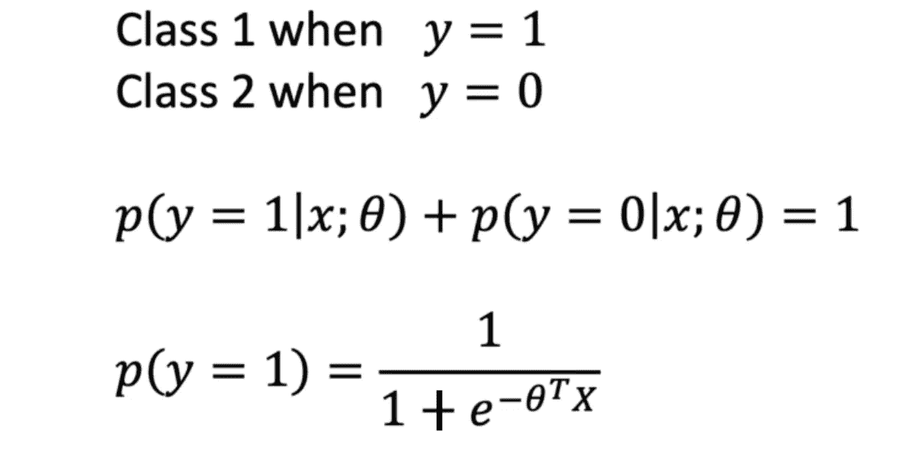
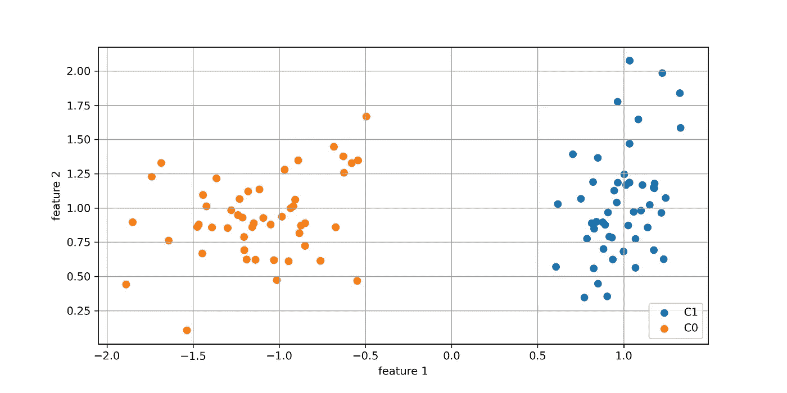
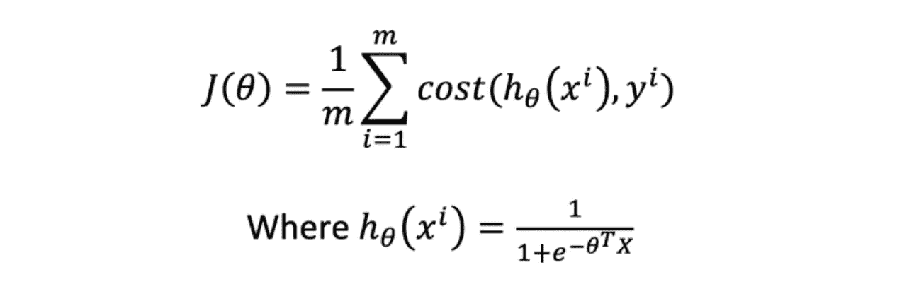
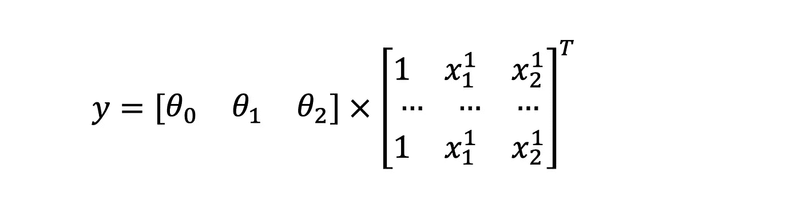
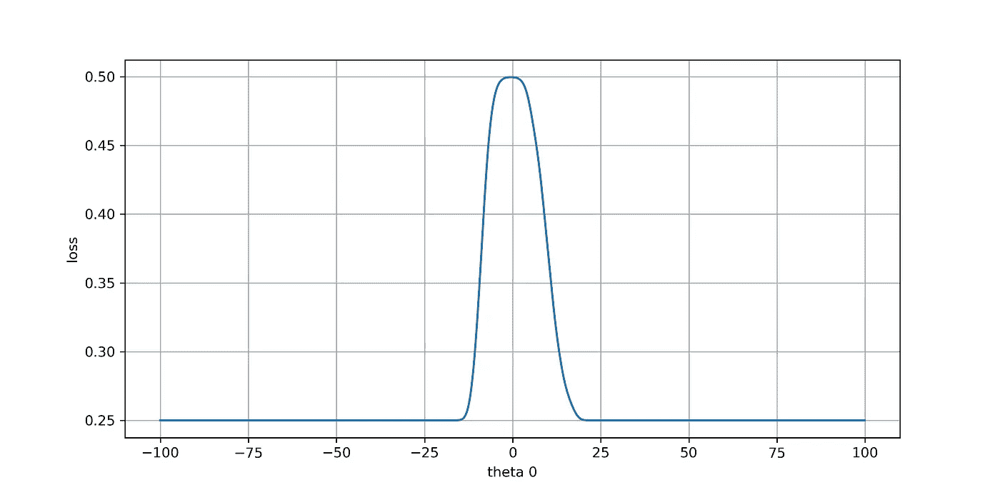
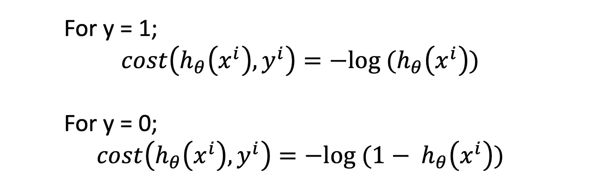
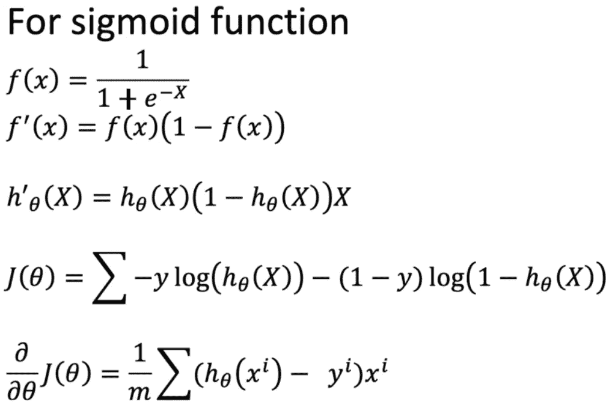
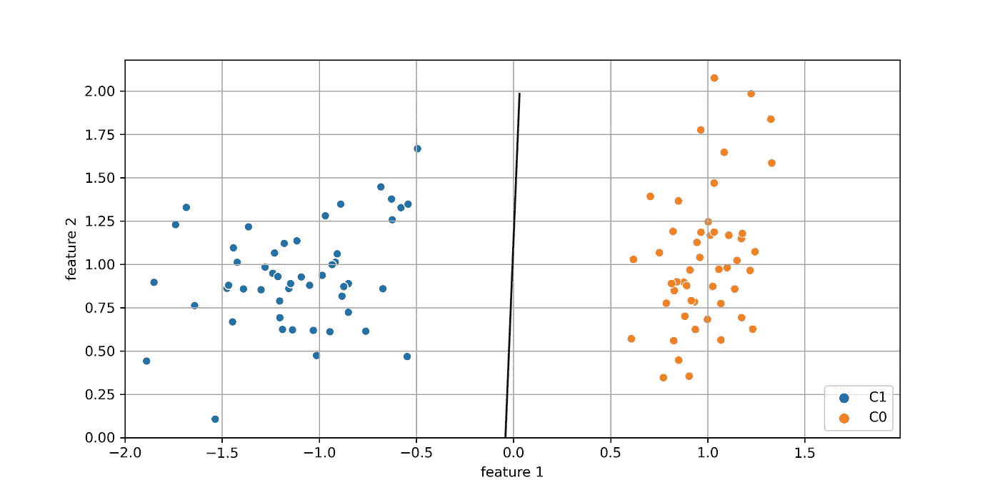

# 逻辑回归和决策边界

> 原文：<https://towardsdatascience.com/logistic-regression-and-decision-boundary-eab6e00c1e8?source=collection_archive---------4----------------------->

## 理解逻辑回归及其在分类中的效用

逻辑回归的基本应用是确定二元分类问题的决策边界。尽管基线是识别二元决策边界，但是该方法可以很好地应用于具有多个分类类别或多类别分类的场景。

# 决策边界是什么？


决策界限

在上图中，虚线可以被识别为决策边界，因为我们将在边界的每一侧观察不同类的实例。我们在逻辑回归中的意图是决定一个合适的决策边界，以便我们能够预测一个新的特征集可能对应于哪个类。关于逻辑回归的有趣事实是利用 sigmoid 函数作为目标类估计量。让我们看看这个决定背后的直觉。

# Sigmoid 函数

参数 **z** 的 sigmoid 函数可以表示如下。请注意，函数总是位于 0 到 1 的范围内，边界是渐近的。这也给了我们一个完美的概率输出表示。


Sigmoid 函数



sigmoid 函数的绘图。请注意，x=0 时，y=0.5

## 将二元分类建模为概率函数

现在我们知道我们的 sigmoid 函数位于 0 和 1 之间，我们可以如下表示类概率。



逻辑回归的数学模型

这里 **θ** 代表估计的参数向量， **X** 是考虑的变量向量。

```
X = X0, X1 ... Xn    <- n Features and X0=1
θ = θ0, θ1 ... θn    <- Parameters to be estimated
```

# 参数估计和成本函数

现在我们知道了概率的函数估计，我们将想出一种方法来估计由 **θ** 向量表示的参数。在这个练习中，让我们考虑下面的例子。



具有两个要素的数据集

我们有一个包含两个要素和两个类的数据集。我们的目标是为这两个特征找到合适的值 **θ** 。这可以建模如下。



成本函数表示

**h(θ)** 是概率估计或假设函数。

## 损失/成本函数

暂时让我们假设我们可以使用**均方根误差(RMS)** ，类似于线性回归。你可以参考下面的文章获得更多的见解。

[](/calculus-behind-linear-regression-1396cfd0b4a9) [## 线性回归背后的微积分

### 理解线性回归的数学方面

towardsdatascience.com](/calculus-behind-linear-regression-1396cfd0b4a9) 

为简单起见，我将绘制成本函数相对于 **θ[0]** 的变化，这是我们估计量的偏差。这是基于我们的目标变量 **y** 的表示如下:



使用 **θ** 向量的最终估计



均方根误差的损耗 **θ[1]** 和 **θ[2]** 为**【0，0】**

我们可以看到有两个局部最优解。这是出乎意料的，是由我们的 sigmoid 函数的行为引起的。因此，成本函数表示如下，这与我们的预期完全匹配。



更好的损失/成本函数

这是一个分段函数，在不同的 **y** 值下有不同的定义。这个想法是指数地惩罚错误的分类。例如，对于标签 **y=1** 如果模型预测 **h(x)=0** ，我们将使第一个方程达到无穷大，反之亦然。


新的损失/成本函数的行为

现在我们手头有了一个更好的损失函数，让我们看看如何估计这个数据集的参数向量 **θ** 。

# 逻辑回归的梯度下降

因为我们知道损失函数，我们需要计算损失函数的导数来更新梯度。可以这样做。给定 sigmoid 函数的导数的性质，整个操作变得极其简单。它会给我们留下下面的损失函数。



逻辑回归的损失函数

请注意，这正是我在上面引用的文章中讨论的线性回归损失/成本函数。因为我已经实现了算法，所以在本文中让我们使用 python sklearn 包的逻辑回归器。

# 使用 sklearn 逻辑回归模块

用法非常简单。然而，理解估计的参数是很重要的。模型拟合可以如下进行。这里 **X** 是一个二维向量，而 **y** 是一个二元向量。

```
from sklearn.linear_model import LogisticRegressionclf = LogisticRegression(random_state=0).fit(X, y)
```

估计的参数可以确定如下。

```
print(clf.coef_)
print(clf.intercept_)>>> [[-3.36656909  0.12308678]]
>>> [-0.13931403]
```

系数是特征的乘数。我们用索引 1 和 2 中的 **θ** 向量来表示它们。截距是模型的偏差值。

拟合后逻辑回归的使用可以如下进行。

```
clf.predict_proba([[ 0.8780991 ,  0.89551051]])
>>> array([[0.95190421, 0.04809579]])
```

这是对每个类的预测。注意总概率等于 1。使用下面的实现也可以达到同样的效果。**h(θ，xi)** 是利用学习到的**θ**参数的**假设**函数。

```
def h(theta, xi):
    return 1/(1 + np.exp(-1*np.dot(xi, theta)))
```

注意，我使用了`np.dot()`来获得矩阵或向量乘法，这比使用`for`循环要有效得多。这也叫*矢量化*。我们可以使用下面的函数调用来获得 p(y=1)的估计值。

```
h([-0.13931403, -3.36656909,  0.12308678], [1, 0.8780991 ,  0.89551051])
```

请注意，我已经使用我们的截距值作为第一个元素的**θ**参数和其余的顺序。我已经为对应于学习偏差的特征向量附加了 1。

最后，我们可以如下绘制我们的边界。



判别边界

# 逻辑回归的扩展

逻辑回归可以很容易地扩展到预测 2 类以上。然而，您将不得不构建 **k** 分类器来预测 **k** 多个类中的每一个，并针对每个类使用 **i** vs 其他 **k-1** 类来训练它们。

## 重要事实

1.  逻辑回归是一种快速的机器学习技术
2.  除了我们讨论过的简单梯度下降之外，大多数实现都使用了更快的优化器
3.  检查决策边界的存在总是明智的。你可能需要像主成分分析或 SNE 霸王龙这样的技术。

我希望你喜欢阅读这篇关于逻辑回归的文章。你可以在这里找到 Jupyer 笔记本。

为好奇者提供一些有趣的读物；

[](/what-can-you-do-with-gnns-5dbec638b525) [## 你能用 GNNs 做什么

### 图形神经网络的操作、效用和优势

towardsdatascience.com](/what-can-you-do-with-gnns-5dbec638b525) 

干杯！