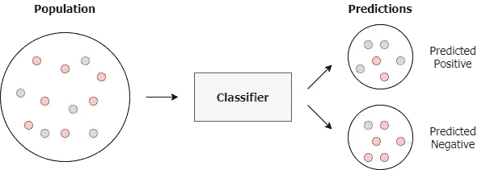
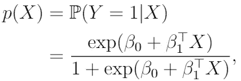
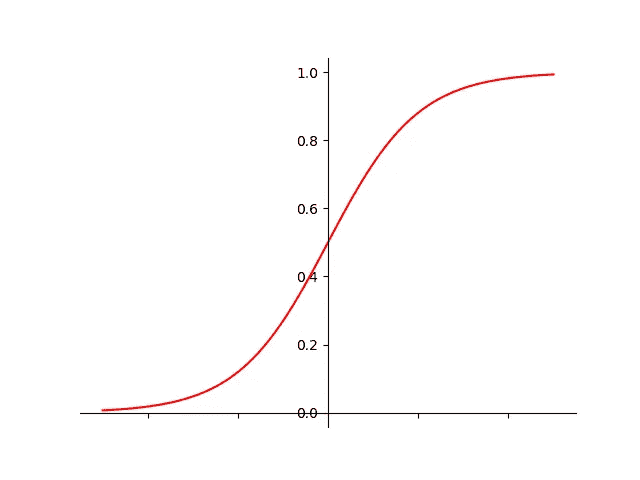
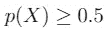
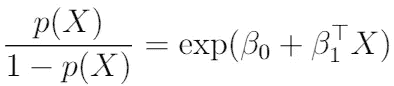
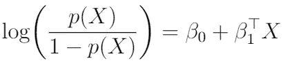

# 逻辑回归:发现强大的分类技术

> 原文：<https://towardsdatascience.com/logistic-regression-discover-the-powerful-classification-technique-d60c0ae4d3b1?source=collection_archive---------75----------------------->

## 了解最广泛使用的分类技术之一

使用预测技术区分分类数据的过程称为**分类**。在由已知类别成员的观察组成的训练数据的基础上，**分类器**(实现分类的算法)应该在**解释变量**(特征)的基础上学习新观察属于哪个类别。

二元分类程序

在本文中，我们考虑**逻辑回归**，它是最基本和最广泛使用的分类方法之一。

# **逻辑回归——我们在建模什么？**

逻辑回归模拟一个二元分类因变量**Y，它可以取两个可能的值；“0”或“1”。这两个值代表观察结果所属的两个类别(真/假、赢/输、健康/生病)。逻辑回归通过使用**逻辑(sigmoid)函数**估计概率，测量分类因变量和一个或多个解释变量(特征)X 之间的关系。**

**例如**，当我们想要预测一家银行未来的贷款违约时，我们可以使用逻辑回归，使用违约者与未违约者的某些特征进行比较。这里，分类因变量的默认值为 1，无默认值为 0。X 中的解释变量是人民的特征。

# 逻辑回归—预测概率

现在，让我们利用前面提到的逻辑(sigmoid)函数，给定 X 中的解释变量的值，对因变量 Y 达到值 1 的**预测概率**进行建模:

其中“exp”是指数(因此，将 exp(z)读作 e 的 z 次方)，β0 是截距，β1 是包含每个解释变量系数的向量。通过使用逻辑函数，我们保证预测的概率在 0 和 1 之间。这正是我们在这里不能使用线性回归模型的原因，因为那时预测的概率被建模为在-无穷大和+无穷大之间，这违反了概率规则(概率应该总是在 0 和 1 之间)。

Sigmoid 函数

分类是通过使用判定边界来执行的，判定边界有助于区分这两个类别。在最简单的情况下，使用 0.5 的判定边界，以便在下列情况下，新的观察值被放置在“正”类(Y=1)中

否则属于“负”类(Y=0)。

# 最大似然估计-估计系数

利用**最大似然估计(MLE)** 来估计逻辑回归模型的系数。当使用 MLE 时，通过最大化一个**似然函数**来估计模型的参数，从而在假设的逻辑回归模型下，训练数据是最可能的。

为了防止这篇文章“太数学化”，我们不会深入 MLE 过程。尽管如此，如果你感兴趣，我鼓励你查找似然函数的推导，对数似然函数和最优化过程。

# **逻辑回归—(对数)比值比**

**比值比**计算如下:

通过取对数，我们得到**对数比值比**:

比值比是一个事件发生在一组中的几率与发生在另一组中的几率之比。假设我们正在对贷款违约进行建模，其中 Y=1 表示违约。那么，举例来说，如果 10 个人中有 1 个人违约，赔率就是 1/9。

标有“1”的值的对数概率是解释变量的线性组合。

请注意，与线性回归相反，解释变量的系数并不对应于 X 增加一个单位时 p(X)的变化。但是，p(X)的变化量仍然取决于 X。

# 逻辑回归——超过两个类别？

回想一下，逻辑回归分类器是一个二元分类器。然而，我们可能希望对两个以上的类别使用逻辑回归(**多类分类**)。幸运的是，有逻辑回归的巧妙扩展可以做到这一点。其中一个扩展是 **one-vs-rest 逻辑回归**，为每个类别训练一个单独的模型，以预测一个看不见的观察值是否在该特定类别中(从而使其成为一个二元分类问题)。它假设每个单独的分类问题都是独立的。通过运行所有这些独立的逻辑回归模型，对于每一类，我们都可以获得该观测值属于该特定类的预测概率。然后，将观察值分配给获得最高预测概率的类别。

# 感谢阅读！

在本文中，我们发现了用于机器学习和预测建模的逻辑回归算法。祝你在未来的项目中应用逻辑回归好运！