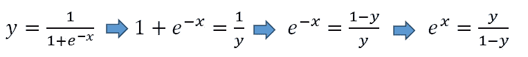

# 逻辑回归—已解释

> 原文：<https://towardsdatascience.com/logistic-regression-explained-593e9ddb7c6c?source=collection_archive---------5----------------------->

## 详细的理论解释和 scikit-learn 示例

逻辑回归是一种监督学习算法，主要用于**二元**分类问题。虽然“回归”与“分类”相矛盾，但这里的重点是“逻辑”一词，指的是在该算法中执行分类任务的**逻辑函数**。逻辑回归是一种简单但非常有效的分类算法，因此它通常用于许多二元分类任务。客户流失、垃圾邮件、网站或广告点击预测是逻辑回归提供强大解决方案的一些领域的例子。

逻辑回归的基础是逻辑函数，也称为 sigmoid 函数，它接受任何实数值并将其映射到 0 到 1 之间的值。

逻辑回归模型将线性方程作为输入，并使用逻辑函数和对数比值来执行二元分类任务。在详细讨论逻辑回归之前，最好先回顾一下范围概率中的一些概念。

# **概率**

概率衡量事件发生的可能性。例如，如果我们说“此电子邮件有 90%的可能性是垃圾邮件”:

**Odds** 是正类和负类的概率之比。

**对数赔率**是赔率的对数。

概率 vs 赔率 vs 对数赔率

所有这些概念本质上代表相同的度量，但方式不同。在逻辑回归的情况下，使用对数优势。我们将看到为什么对数概率在逻辑回归算法中是首选的原因。

概率为 0.5 意味着该电子邮件是垃圾邮件还是非垃圾邮件的几率相等。请注意，概率为 0，5 的**对数赔率为 0** 。我们将利用这一点。

让我们回到 sigmoid 函数，用不同的方式展示它:

取两侧的自然对数:

在等式(1)中，我们可以使用线性等式 **z** 来代替 x:

那么等式(1)变成:

假设 y 是正类的概率。如果 z 是 0，那么 y 是 0，5。对于 z 的正值，y 大于 0.5，对于 z 的负值，y 小于 0.5。如果正类的概率大于 0，5(即大于 50%的几率)，我们可以预测结果为正类(1)。否则，结果是一个负类(0)。

注意:在二进制分类中，有许多方法来表示两个类别，如正/负、1/0、真/假。

下表显示了一些 z 值和相应的 y(概率)值。所有实数都映射在 0 和 1 之间。

如果我们画出这个函数，我们将得到著名的逻辑回归 s 形图:

分类问题归结为求解一个线性方程:

函数的参数在训练阶段用最大似然估计算法确定。然后，对于任意给定的自变量(x1，… xn)的值，可以计算出正类的概率。

我们可以“原样”使用计算出的概率。例如，输出可以是电子邮件是垃圾邮件的概率是 95%,或者客户将点击该广告的概率是 70%。然而，在大多数情况下，概率被用来分类数据点。如果概率大于 50%，则预测为正类(1)。否则，预测为负类(0)。

到目前为止，除了一个问题，一切似乎都很好。并不总是希望为所有高于 50%的概率值选择正类。关于垃圾邮件的情况，为了将一封邮件归类为垃圾邮件，我们必须几乎确定。由于被检测为垃圾邮件的电子邮件会直接进入垃圾邮件文件夹，我们不希望用户错过重要的电子邮件。除非我们几乎确定，否则电子邮件不会被归类为垃圾邮件。另一方面，当健康相关问题的分类需要我们更加敏感时。即使我们有点怀疑一个细胞是恶性的，我们也不想错过它。因此，作为正类和负类之间的阈值的值取决于问题。好的一面是，逻辑回归允许我们调整这个阈值。

如果我们设置一个高阈值(即 95%)，几乎所有我们做出的预测都是正确的。然而，我们会错过一些积极的类，并将其标记为消极的。

如果我们设置一个低阈值(即 30%)，我们将正确地预测几乎所有的正类。但是，我们会将一些负面类归类为正面类。

这两种情况都会影响我们模型的准确性。测量精度的最简单方法是:

然而，这通常不足以评估分类模型。在一些二元分类任务中，正类和负类之间存在不平衡。想想把肿瘤分为恶性和良性。数据集中的大多数目标值(肿瘤)将为 0(良性)，因为与良性肿瘤相比，恶性肿瘤非常罕见。典型集合将包括 90%以上的良性(0)类。所以如果模型不做任何计算就把所有的例子都预测为 0，准确率在 90%以上。这听起来不错，但在这种情况下没有用。因此，我们需要其他方法来评估分类模型。这些措施是**精确**和**召回**。

# **精度和召回**

首先，我们需要定义一些术语:

**真阳性**:正确预测阳性(1)类

**假阳性**:将阴性(0)类预测为阳性

**真阴性**:正确预测阴性(0)类

**假阴性**:将阳性类(0)预测为阴性

真实值与预测值

需要进行 TP 或 TN 预测，因此模型旨在最大化 TP 和 TN 值。

**Precision** 衡量当预测为正时，我们的模型有多好。

**回忆**测量我们的模型在正确预测正类方面有多好。

我们不能试图同时最大化精确度和召回率，因为它们之间有一个平衡。下图清楚地解释了这种权衡:

精确度和召回率之间的权衡

在这两个表中，有 8 个负(0)类和 11 个正(1)类。模型的预测以及精度和召回率根据阈值而变化。精度和召回值的计算如下:

提高精度会降低召回率，反之亦然。根据任务的不同，你的目标可以是最大限度地提高精确度或召回率。对于垃圾邮件检测模型，我们试图最大限度地提高精确度，因为我们希望在电子邮件被检测为垃圾邮件时是正确的。我们不想将一封普通的电子邮件标记为垃圾邮件(即误报)。如果假阳性低，则精度高。

还有另一种将精确度和召回率结合成一个数字的方法: **F1_score。**精度和召回率的加权平均值，计算公式如下:

对于类分布不均匀的问题，F1_score 是比准确性更有用的度量，因为它同时考虑了假阳性和假阴性。

***注:*** *L2 正则化默认用于 logistic 回归模型(如岭回归)。正则化由 C 参数控制。由于这种正则化，对逻辑回归模型中的特征(独立变量)进行正则化非常重要。*

# **Scikit-learn 实现**

我将使用 scikit-learn 的 datasets 模块下的一个数据集。我将导入数据集和依赖项:

然后加载数据集，并分成训练集和测试集:

创建一个逻辑回归对象，并为其拟合训练数据。

然后预测测试数据集中的目标变量:

Scikit-learn 提供了 **classification_report** 函数，可以同时计算精度、召回率和 f1-score。它还在支持列中显示了积极类和消极类的数量。

值得注意的是，与这个非常简单的例子相比，现实生活项目中的数据准备、模型创建和评估是极其复杂和耗时的。我只是想给你展示一下模型创建的步骤。在现实生活中，你的大部分时间将花在数据清理和准备上(假设数据收集是由别人完成的)。您还需要花费大量时间对超参数模型的准确性进行多次调整和重新评估。

感谢您的阅读。如果您有任何反馈，请告诉我。

# **我关于机器学习算法的其他帖子**

*   [朴素贝叶斯分类器——解释](/naive-bayes-classifier-explained-50f9723571ed)
*   [支持向量机—解释](/support-vector-machine-explained-8d75fe8738fd)
*   [决策树和随机森林——解释](/decision-tree-and-random-forest-explained-8d20ddabc9dd)
*   [梯度增强决策树—解释](/gradient-boosted-decision-trees-explained-9259bd8205af)

# **参考文献**

*   [https://developers . Google . com/machine-learning/crash-course/logistic-regression/calculating-a-probability](https://developers.google.com/machine-learning/crash-course/logistic-regression/calculating-a-probability)