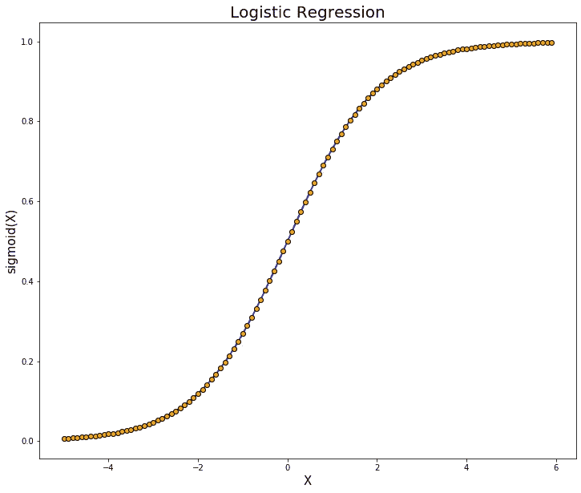
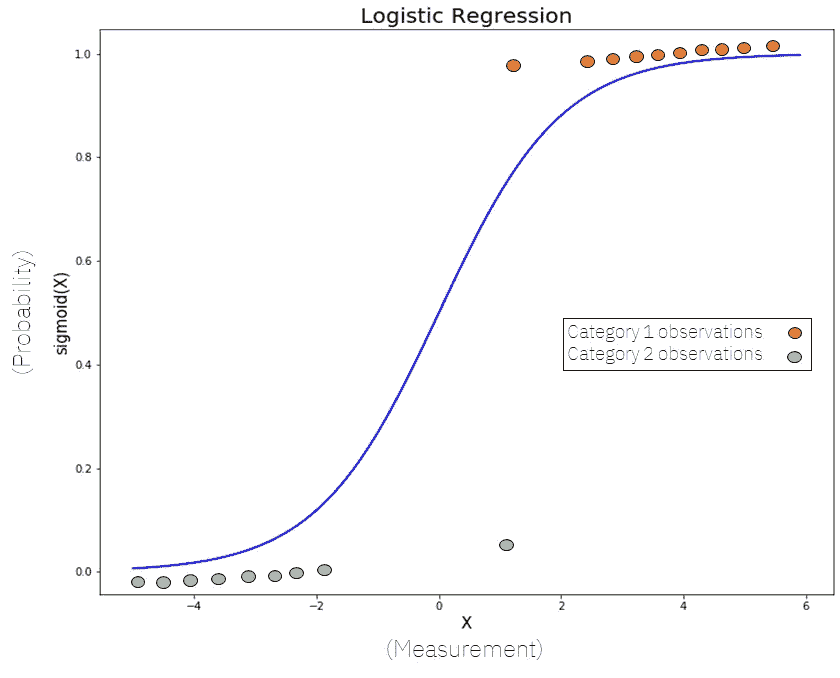
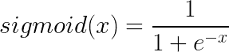
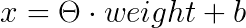
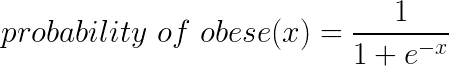
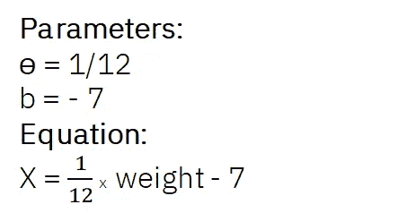
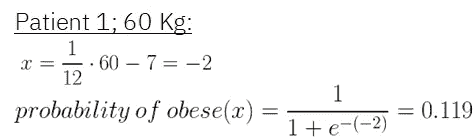
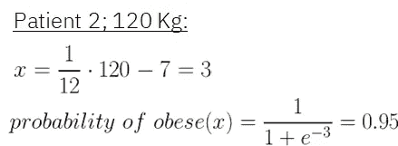

# 逻辑回归解释

> 原文：<https://towardsdatascience.com/logistic-regression-explained-9ee73cede081?source=collection_archive---------0----------------------->

## [ —逻辑回归简单解释— ]



在这篇文章中，我将简单地解释逻辑回归。这可以被认为是一种逻辑回归，然而，我从来没有真正喜欢这个表达。

*在我们开始之前，这里有一些额外的资源可以让你的机器学习事业突飞猛进:*

```
*Awesome Machine Learning Resources:**- For* ***learning resources*** *go to* [***How to Learn Machine Learning***](https://howtolearnmachinelearning.com/books/machine-learning-books/)*! 
- For* ***professional******resources*** *(jobs, events, skill tests) go to* [***AIgents.co — A career community for Data Scientists & Machine Learning Engineers***](https://aigents.co/)***.*** 
```

[](https://z-ai.medium.com/subscribe) [## 订阅我的专属列表！

### 订阅我的专属列表！并获取您喜爱的所有新鲜文章<3! By signing up, you will create a Medium…

z-ai.medium.com](https://z-ai.medium.com/subscribe) 

Lets get to it and learn it all about Logistic Regression.

# Logistic Regression Explained for Beginners

In the Machine Learning world, **逻辑回归**是一种**参数分类模型，**尽管其名称中有单词'*回归* ' 。

这意味着逻辑回归模型是具有某个固定数量的参数的模型，这些参数取决于输入特征的数量，并且它们输出分类预测，例如植物是否属于某个物种。

在现实中，逻辑回归背后的理论与线性回归非常相似，所以如果你不知道什么是线性回归，花 5 分钟阅读这个超级简单的指南:

[](/linear-regression-explained-d0a1068accb9) [## 线性回归解释

### [ —线性回归简单解释— ]

towardsdatascience.com](/linear-regression-explained-d0a1068accb9) 

在逻辑回归中，我们不像线性回归那样直接用直线拟合数据。相反，我们拟合一条 S 形曲线，称为***S 形*** ，来拟合我们的观察结果。



符合某些数据的 Sigmoid 函数

让我们仔细检查一下这个数字。

**首先**，就像我们之前说的，Logistic 回归模型是分类模型；特别是二元分类模型(它们只能用于区分两种不同的类别——比如一个人是否肥胖或体重不足，或者一所房子根据其大小是大是小)。**这意味着我们的数据有两种观察值**(类别 1 和类别 2 观察值)，就像我们在图中可以观察到的一样。

***注:*** *这是逻辑回归的一个非常简单的例子，在实践中更困难的问题可以使用这些模型来解决，使用广泛的特性而不仅仅是单一的一个。*

**其次**，我们可以看到，Y 轴从 0 到 1。这是因为 *sigmoid* 函数总是将这两个值作为最大值和最小值，这非常符合我们将样本分为两个不同类别的目标。通过计算 X 的 *sigmoid* 函数(这是输入特征的加权和，就像线性回归中一样)，**我们得到属于两个类别之一的观察值的概率** ( *在 0 和 1 之间，显然是*)。

*s 形函数*的公式如下:



如果我们想预测一个人是否肥胖或没有给出他们的体重，我们将首先计算他们体重的加权和(抱歉，词汇冗余)，然后将其输入到 *sigmoid* 函数中:

## 1)计算输入的加权和



输入要素的加权总和(本例中为要素)

## 2)计算肥胖的概率



使用 sigmoid 方程进行计算

好吧，这看起来很酷，但这难道不是一个机器学习模型吗？***我们如何训练它？*** 这个问题问得好。有多种方法来训练逻辑回归模型(将 S 形线拟合到我们的数据)。我们可以使用类似 ***梯度下降*** 的迭代优化算法来计算模型的参数(权重)，或者我们可以使用类似 ***最大似然*** 的概率方法。

如果你不知道这些是什么，梯度下降在[线性回归文章](/linear-regression-explained-d0a1068accb9)中有解释，关于机器学习的最大可能性的解释可以在这里找到:

[](/probability-learning-iii-maximum-likelihood-e78d5ebea80c) [## 概率学习 III:最大似然

### 我们成为概率大师的又一步…

towardsdatascience.com](/probability-learning-iii-maximum-likelihood-e78d5ebea80c) 

一旦我们使用了这些方法中的一种来训练我们的模型，我们就可以做一些预测了。让我们来看一个示例，演示如何训练逻辑回归模型并使用它来进行预测:

1.  **首先，**我们将**收集一个数据集**，该数据集包含已被诊断为肥胖和未被诊断为肥胖的患者，以及他们相应的体重。
2.  **在此**之后，我们将**训练我们的模型**，将我们的 S 形线与数据拟合，并获得模型的参数。使用最大似然法进行训练后，我们得到了以下参数:



X 的参数和方程

3.**现在**，我们准备**做一些预测**:假设我们有两个病人；一个 120 斤，一个 60 斤。让我们看看将这些数字代入模型后会发生什么:



在给定患者体重的情况下，使用拟合模型预测肥胖的结果

我们可以看到，第一个病人(60 公斤)肥胖的概率非常低，然而，第二个病人(120 公斤)肥胖的概率非常高。


前面例子的逻辑回归结果。

在上图中，我们可以看到逻辑回归模型给出的结果。现在，给定任何患者的体重，我们可以计算他们肥胖的概率，并给我们的医生一个快速的第一轮信息！

[](https://z-ai.medium.com/subscribe) [## 订阅我的专属列表！

### 订阅我的专属列表！并获取所有你喜爱的新鲜文章<3! By signing up, you will create a Medium…

z-ai.medium.com](https://z-ai.medium.com/subscribe) 

# Conclusion and Other resources

*逻辑回归是最简单的机器学习模型之一。它们容易理解，可解释，并且能给出相当好的结果。这篇文章的目标是为不是机器学习从业者的人提供一种以非数学方式理解逻辑回归的简单方法，所以如果你想更深入，或者正在寻找更深刻的数学解释，看看下面的视频，它很好地解释了我们在这篇文章中提到的一切。*

*关于机器学习和数据科学的更多资源，请查看以下资源库:* [*如何学习机器学习*](https://howtolearnmachinelearning.com/books/machine-learning-books/) *！有关职业资源(工作、事件、技能测试)，请访问*[*AIgents.co——数据科学家的职业社区&机器学习工程师*](https://aigents.co/) *。*

牛逼的逻辑回归！

*此外，为了更深入地研究逻辑回归和机器学习，可以看看下面文章中描述的书:*

[](/the-book-to-really-start-you-on-machine-learning-47632059fd0e) [## 让你真正开始机器学习的书

### 让你的机器学习知识更上一层楼

towardsdatascience.com](/the-book-to-really-start-you-on-machine-learning-47632059fd0e)