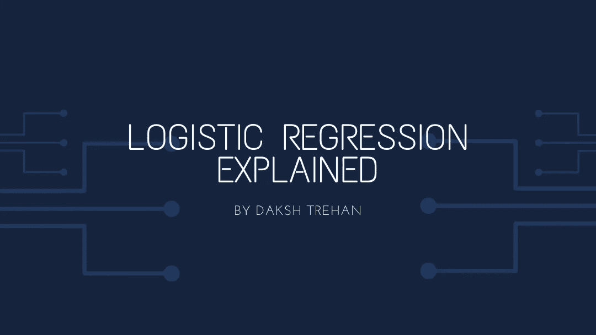
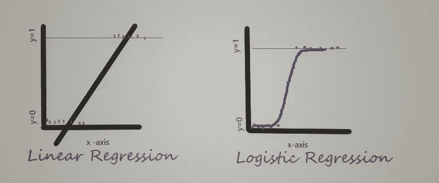
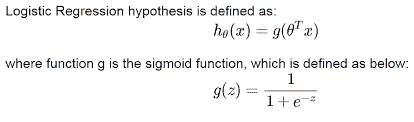
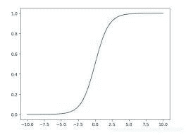
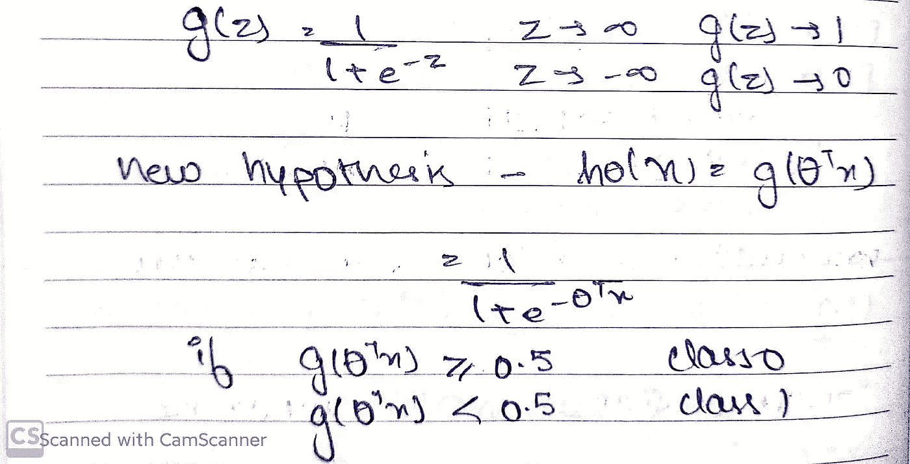
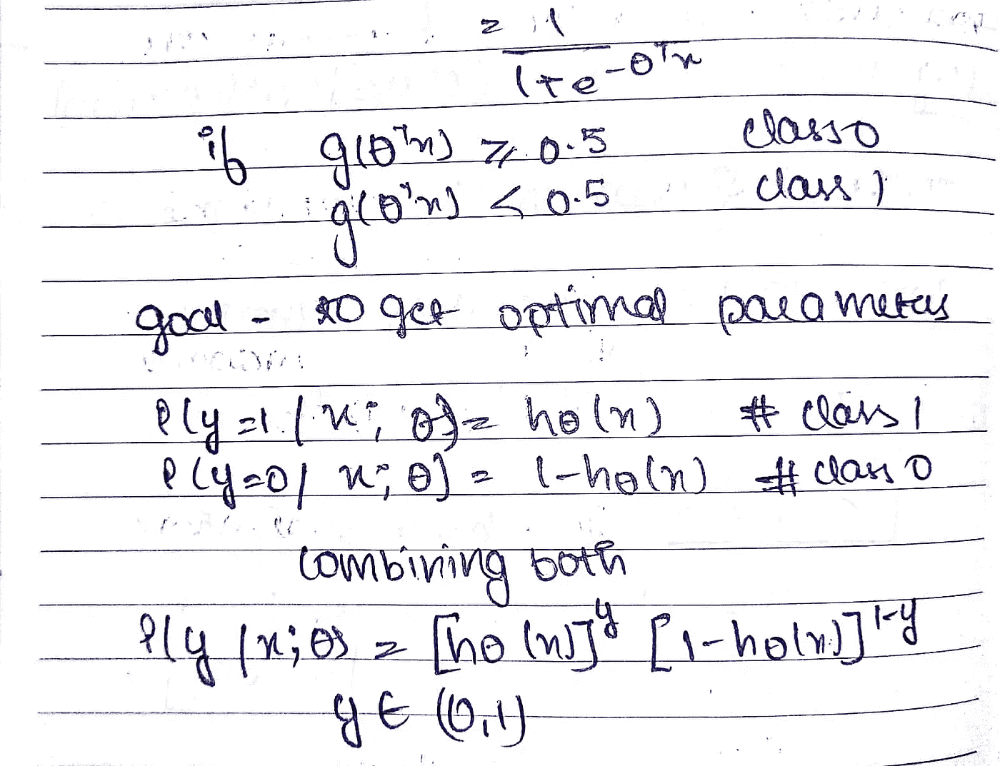
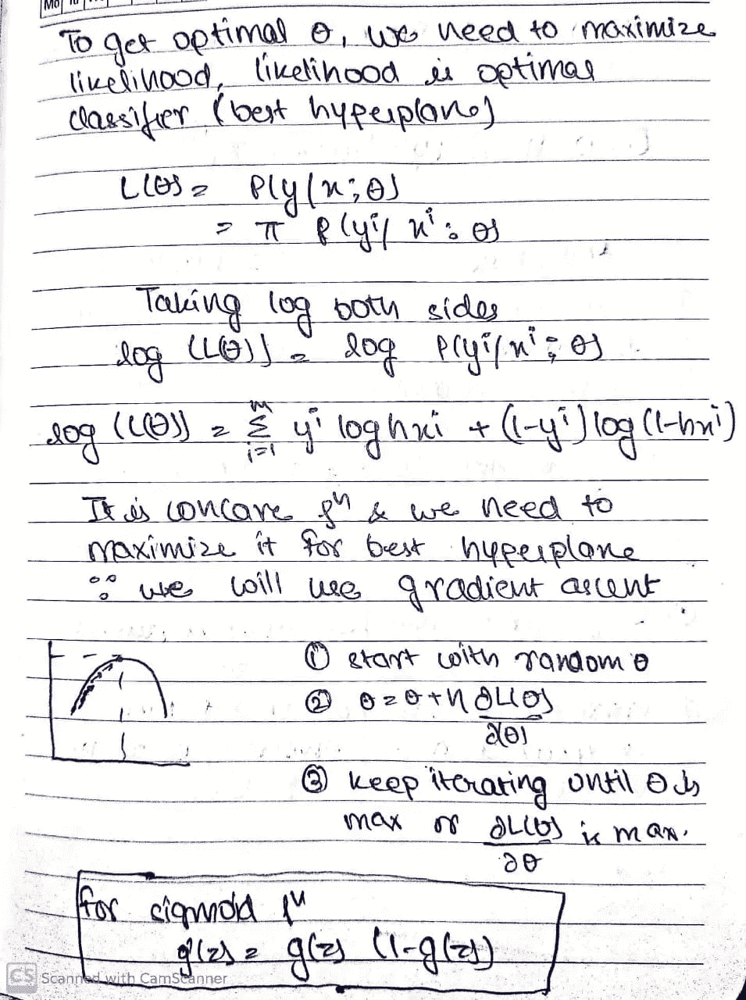
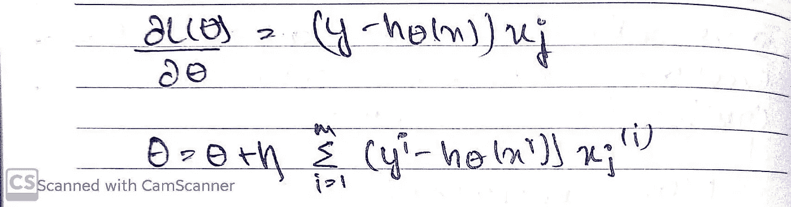

# 逻辑回归解释

> 原文：<https://towardsdatascience.com/logistic-regression-explained-ef1d816ea85a?source=collection_archive---------41----------------------->

## 尽可能简单地解释逻辑回归。

在线性回归中，Y 变量总是连续的。如果 Y 变量是分类变量，则不能使用[线性回归](https://medium.com/towards-artificial-intelligence/linear-regression-explained-f5cc85ae2c5c)模型。

那么，当 Y 是一个有两类的分类变量时，你会怎么做呢？
Logistic 回归可以用来解决这类问题，也称为二元分类问题。

逻辑回归是另一种类型的监督学习算法，但它的目标与其名称正好相反，而不是回归，它的目标是将数据点分类为两个不同的类。它是一个线性模型，产生二进制输出。

区分这两类的线称为超平面，数据点离超平面越远，它属于该类的置信度就越高。

它的目标是找到一个合法的分离超平面，以最好的方式对两个类进行分类。

由 Daksh Trehan 使用 Paint 3D 设计

这里要注意的一个关键点是 Y 只能有两个类，不能超过两个。如果输出类的数量不是二进制的，它将变成多类分类，并且您不能再实施普通的逻辑回归。

下面是一些二元分类问题的例子:

*   **垃圾邮件检测**:预测一封邮件是否是垃圾邮件
*   **信用卡欺诈**:预测给定的信用卡交易是否是欺诈
*   **健康**:预测给定的组织块是良性还是恶性

# Sigmoid 函数

我们使用 sigmoid 函数，因为它是非线性的，并且存在于(0 到 1)之间。因此，它特别适用于我们必须**预测概率**作为输出的模型。我们使用 sigmoid 将预测映射到概率。

乙状结肠的图示

这个函数是可微的，因此我们可以在任意两点找到 sigmoid 曲线的斜率。

> g'(z)=g(z)(1-g(z))

**计算置信度**

如果 sigmoid 函数计算的输出≥0.5，则我们假设该点属于 0 类

如果 sigmoid 函数的输出小于 0.5，则该点被视为在 1 类中。

## 选择最佳超参数

我们的最终目标是选择最佳的超参数。

第 1 页，共 3 页

如果 P 是属于类 1 的对象的概率，那么(P-1)将是属于类 0 的对象的概率，如

> 概率总是介于 0 和 1 之间。

第 2 页，共 3 页

我们结合了两个类别的概率，并推导出我们希望最大化的可能性。

第 3 页，共 3 页

我们已经成功导出了更新的超参数。

# 多类逻辑回归

但是，如果我们希望使用逻辑回归获得许多输出，我们可以使用一个 v/s rest 模型。

为了说明，让我们假设我们的输出可以是属于 dog、cat 和 10 个这样的其他类的任何东西，但是逻辑回归是二元模型，所以我们的方法将为 dog v/s 其他类实现普通的逻辑回归；如果预测的输出是 dog，这很好，但是如果测试图像属于其他类，我们可以迭代我们以前的模型，即 cat v/s 其他类，等等。

# **使用 Sci-Kit Learn 的逻辑回归**

## 逻辑回归的优势

1.  高效率
2.  低方差
3.  可以使用随机梯度下降很容易地用新数据更新。

## 逻辑回归的缺点

1.  不能很好地处理大量的分类变量。
2.  需要非线性特征的转换。

## 逻辑回归的特征

1.  目标是离散变量
2.  预测值是目标值的概率。

**如果你喜欢这篇文章，请考虑订阅我的简讯:** [**达克什·特雷汉每周简讯**](https://mailchi.mp/b535943b5fff/daksh-trehan-weekly-newsletter) **。**

# 结论

希望这篇文章不仅增加了你对 ***逻辑回归*** 的理解，也让你意识到，这并不难，而且已经在我们的日常生活中发生了。

一如既往，非常感谢您的阅读，如果您觉得这篇文章有用，请分享！:)

> 在 www.dakshtrehan.com[加入我](http://www.dakshtrehan.com)
> 
> *LinkedIN ~*[*https://www.linkedin.com/in/dakshtrehan/*](https://www.linkedin.com/in/dakshtrehan/)
> 
> *insta gram ~*[*https://www.instagram.com/_daksh_trehan_/*](https://www.instagram.com/_daksh_trehan_/)
> 
> *Github ~*T30*https://github.com/dakshtrehan*

*看我的其他文章:-*

> [利用深度学习检测新冠肺炎](/detecting-covid-19-using-deep-learning-262956b6f981)
> 
> [线性回归解释](https://medium.com/towards-artificial-intelligence/linear-regression-explained-f5cc85ae2c5c)
> 
> [*确定最适合你的 ML 模型*](https://medium.com/datadriveninvestor/determining-perfect-fit-for-your-ml-model-339459eef670)
> 
> [*将机器学习技术与现实生活联系起来*](https://levelup.gitconnected.com/relating-machine-learning-techniques-to-real-life-4dafd626fdff)
> 
> [*服务数据科学新秀*](https://medium.com/towards-artificial-intelligence/serving-data-science-to-a-rookie-b03af9ea99a2)

关注更多机器学习/深度学习博客。

> *中等~*[*https://medium.com/@dakshtrehan*](http://medium.com/@dakshtrehan)
> 
> *干杯。*

*封面模板是我在*[*www.canva.com 做的。*](http://www.canva.com./) *其余图片均来自我的笔记本。*