# 二元分类的逻辑回归

> 原文：<https://towardsdatascience.com/logistic-regression-for-binary-classification-56a2402e62e6?source=collection_archive---------12----------------------->

## 机器学习中的监督学习方法

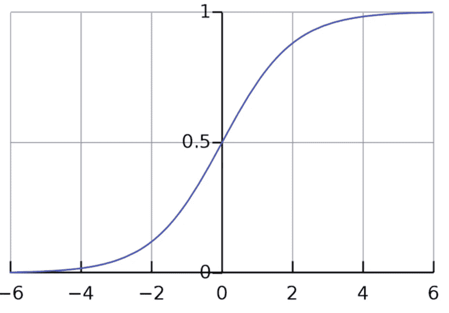

图片来自 [wikicommons](https://commons.wikimedia.org/wiki/File:Sigmoid.jpg)

# 二元分类

在之前的文章中，我谈到了深度学习和用于预测结果的函数。在本文中，我们将使用逻辑回归来执行二元分类。二进制分类之所以这样命名，是因为它将数据分为两种结果。简单来说，结果将是“是”(1)或“否”(0)。为了确定结果是“是”还是“否”，我们将使用一个概率函数:

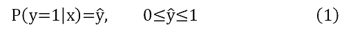

这个概率函数将给出一个从 0 到 1 的数字，表示这个观察结果属于我们目前确定为“是”的分类的可能性有多大。有了这个，我们知道我们打算如何处理我们的预测。现在，我们将了解如何使用逻辑回归来计算(1)中的方程。

# 逻辑回归

为了进行逻辑回归，使用了 sigmoid 函数，如下图所示:

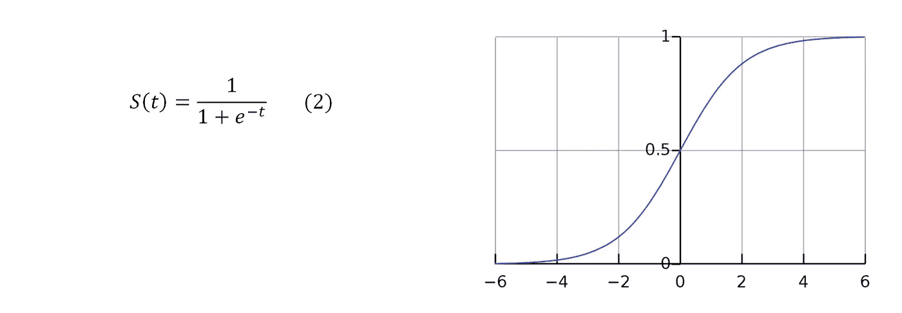

图片来自[维基公共](https://commons.wikimedia.org/wiki/File:Sigmoid.jpg)

我们可以看到，这个函数满足概率函数和等式(1)的特征。同样，我们可以看到，当 S(t)是非常大的正值时，函数趋近于 1，当 S(t)是非常大的负值时，函数趋近于 0。

# 例子

为了能够理解逻辑回归是如何操作的，我们将举一个例子，在这个例子中，我们的函数将人们分为高或不高。我们将用于校准我们的函数的数据对应于下表(表 1):

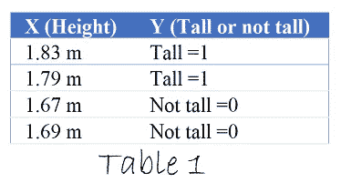

假设 *t=wx+b* ，我们的目标将是找到 *w* 和 *b* ，通过将其放入 S(t)中，它将给出正确的预测。我们可以从一个随机数开始，比如说 *w=1* 和 *b=0* ，如果 *S(t)* 大于 0.5，那么我们就认为它是一个高个子。

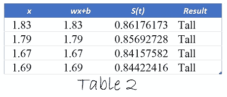

我们注意到参数 *w=1* 和 *b=0* 不起作用，因为在所有情况下 S(x) > 0.5。现在让我们用 *w=6* 和 *b=-10.5* 试试，结果将是:

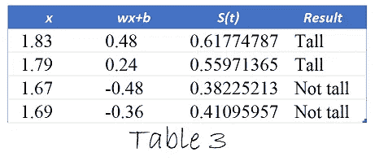

太好了，我们已经找到了 *w* 和 *b* 参数，这样我们的函数就能正确地做出预测！

这些参数用于进行预测；然而，出现了许多问题，例如:

*   我如何计算这些参数？
*   这些参数是最值得推荐的吗？

为了回答这些问题，我们将不得不引入两个新的主题来帮助我们优化函数和理解损失函数。

# 损失误差函数和成本函数

最好的 *w* 和 *b* 参数是什么？这个问题的答案非常简单，因为我们希望参数给我们的误差尽可能小。为此，我们使用损失误差函数:

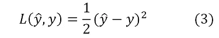

这个函数基本上告诉我们，我们对实际值的估计有多远( *ŷ* 估计， *y* 实际值)。如果我们对所有估计进行总结，我们会得到:

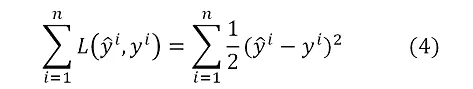

这个总和是我们所有估计的总误差，试图将这个函数减小到 0 意味着试图将我们的误差减小到 0。然而，当在逻辑回归中使用该函数时，我们会得到一个非凸的函数(我们稍后将回到这个主题),由于它不是凸的，所以可能会有几个局部最优点，并且在计算最佳的 *w* 和 *b* 时会有很大的困难。为了解决这个问题，我们将使用另一个函数:

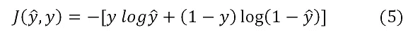

在(5)中构造的函数具有与函数(3)相同的目的，以减少误差。我们将对一个观察值做一个实验，看看函数 *J(ŷ,y)* 的行为。让我们想象一下 *J(ŷ,y)* 的 4 种可能场景

场景 1- *y=1，ŷ=.99*

我们观察到，在这种情况下，我们的估计实际上是正确的，当替换时，我们得到:

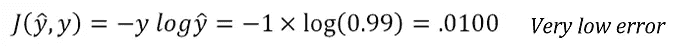

场景 2- *y=1，ŷ=.01*

我们观察到，在这种情况下，我们的估计是不正确的，当替换时，我们得到:

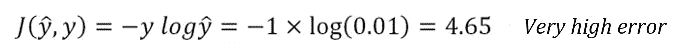

场景 3- *y=0，ŷ=.99*

我们观察到，在这种情况下，我们的估计是不正确的，当替换时，我们得到:

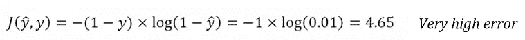

场景 4- *y=0，ŷ=.01*

我们观察到，在这种情况下，我们的估计是不正确的，当替换时，我们得到:

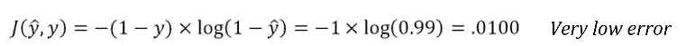

直观上，我们可以观察这个函数做什么。正确的观测值误差很低，不正确的观测值误差很高。如果我们对所有的观察值求和，我们会得到。

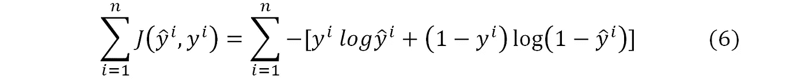

函数(6)相对于函数(4)的优势在于它是凸的。使用函数 6，可以使用梯度下降法以更简单的方式找到最佳点。

# 梯度下降

梯度下降法试图告诉我们需要向哪个方向移动我们的 *b* 和 *w* 参数，以优化函数并获得最小误差。(6)中描述的函数是凸的，所以你可以看到它如下图所示。

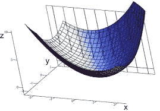

图片来自 [wikicommons](https://commons.wikimedia.org/wiki/File:Grafico_3d_x2%2Bxy%2By2.png)

现在，假设我们的损失函数是 *J(w，b)* ，要调整的参数是 *(w，b)* 。我们想找到一个点，使 *J(w，b)* 尽可能小。梯度下降法告诉我们移动 *(w，b)* 的方向来减少 *J(w，b)* 。这些是 *(w，b)* 的偏导数，也就是 *∂J/∂w* 和 *∂J/∂b* 。

知道移动 *w* 和 *b* 的方向。我们只需要知道它们移动的幅度，这叫做学习率，通常定义为α。最终得到:

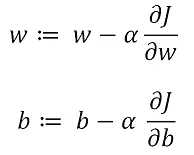

最后，我们将总结执行逻辑回归必须遵循的步骤:

1.  分析问题，容纳数据。
2.  随机提出 *w* 和 *b* 来预测你的数据。
3.  计算误差
4.  执行梯度下降以获得新的 *w* 和 *b.*

这 4 个步骤应该重复，直到你得到一个可接受的误差。

# 分析数据(Python 示例)

我们终于有了应用逻辑回归的所有理论要素。了解如何在 python 等编程语言中应用它们也很重要。这种语言被广泛使用，因此这种算法的实现非常容易。对于这个例子，我们将使用逻辑回归来预测篮球运动员的轨迹。本练习中获得的数据是从 data.world 中提取的。在文章的最后，显示了完整的代码，这样您就可以在 google colab 上跟随并运行代码。

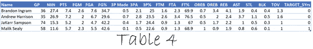

理解此表中每一列的含义很重要:

*   姓名-玩家的姓名
*   GP-玩过的游戏
*   播放的分钟数
*   每场比赛的平均得分
*   FGM-射门得分
*   FGA-尝试射门
*   % FG-现场目标的百分比
*   3P 投进了，三分球投进了
*   尝试 3PA 三分球
*   罚球命中
*   尝试罚球
*   罚球百分比
*   进攻篮板
*   DREB-防守篮板
*   篮板球
*   AST-助攻
*   STL-抢断
*   BLK 街区
*   TOV-失误
*   TARGET _ 5 yers-如果玩家持续了 5 年或更长时间，这个值将是 1，否则将是 0。

# 数据清理

在进行逻辑回归之前，应该对数据进行观察和分析。Pandas 库是 python 上一个非常常用的处理数据的库，我们将使用它来读取和描述数据。

```
##Import library and read data
import pandas as pd
nbalog=pd.read_csv("path_of_file")
###See data description
decri=nbalog.describe()
```

以“#”开头的代码只是一些注释，所以对于这段代码，我们只做了 3 件事:

1.  导入必要的库。
2.  读取基础文件。
3.  描述现有数据。

描述表明我们拥有的数据量、最大值、最小值、标准偏差等。通过观察数据，可以看出一些字段是空的。在训练模型之前，必须解决这些问题。空白字段将被替换为 0，皮尔逊相关系数将用于观察具有最高相关性的数据。

```
###Using the data described we notice that 3P% has some blank ###fields.These fields will be filled with 0\. nbalog=nbalog.fillna(0) 
###We check the correlation that exists between the data. pearson=nbalog.corr(method='pearson')
```

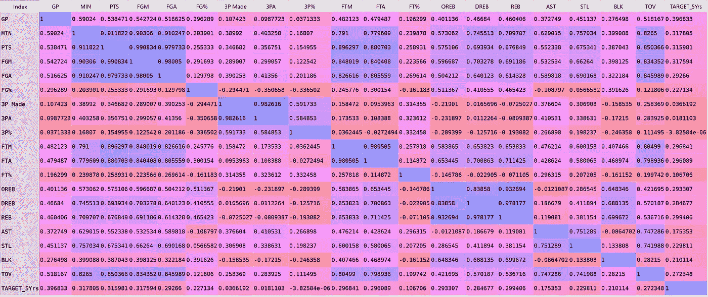

使用皮尔逊相关系数，我们注意到具有最高相关性的列。这样，更有用的列应该保留，其他的应该删除。

```
###Some variables are higly correlated so they will be dropped 
###(pearson>.8). 
nbalog=nbalog.drop(['MIN', 'PTS','FGM','3P Made','FTM','FTA','TOV','OREB','DREB'], axis=1)
```

# 逻辑回归

有了干净的数据，我们可以开始训练模型。为此，将使用库 sklearn。该库包含许多模型，并不断更新，使其非常有用。为了训练模型，我们将指出哪些是预测变量，哪些是被预测变量。

```
### X are the variables that predict and y the variable we are  ###trying to predict. X=nbalog[['GP','FGA','FG%','3PA','3P%','FT%','REB','AST','STL','BLK']] 
y=nbalog[['TARGET_5Yrs']]
```

现在，使用库 sklearn，数据将被分成训练集和测试集。通过训练集，模型将被调整，通过测试集，我们将看到模型有多好。

```
### The data has to be divided in training and test set. from sklearn.model_selection import train_test_split X_train,X_test,y_train,y_test=train_test_split(X,y,test_size=0.25)
```

前面的代码将数据分为训练集和测试集。变量 X 代表自变量，y 代表因变量。这一次，该集合的 75%用于训练，25%用于测试。在分离数据之后，它可以用于拟合模型，在这种情况下，该模型是“逻辑回归”模型。

```
###We import the model that will be used. from sklearn.linear_model import LogisticRegression. 
# Create an instance of the model. 
logreg = LogisticRegression() 
# Training the model. 
logreg.fit(X_train,y_train) 
# Do prediction. 
y_pred=logreg.predict(X_test)
```

因此，已经使用函数**校准了模型。拟合**并准备好使用测试数据进行预测。这是使用功能**完成的。预测**并使用自变量测试 **(X_test)。**得到的结果可以与真实值 **(y_test)** 进行比较，看是否是一个好的模型。

```
# Analyzing the results. 
from sklearn import metrics 
cnf_matrix = metrics.confusion_matrix(y_test, y_pred)
```

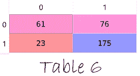

由此产生的矩阵被称为混淆矩阵。在第一象限中，显示了被正确分类为 0 的条目的数量(61)。第二和第三象限合计不正确的分类(99)。最后，第四象限显示了数字为 1 (175)的正确分类。精度可以通过下式计算:

```
print("Accuracy:",metrics.accuracy_score(y_test, y_pred))*Output:.7045*
```

以此，我们结束本文。像往常一样，我将代码留给您，以便您可以测试、运行和尝试不同的模型。祝你愉快，祝贺你学会了如何做逻辑回归。

文献学

新泽西州里普纳(2017 年 1 月 24 日)。*二元分类练习数据集*。检索于 2020 年 9 月 24 日，来自[https://data.world/.](https://data.world/.)

indeed 123/CC BY-SA(https://creativecommons.org/licenses/by-sa/3.0)

loli kar/CC BY-SA(https://creativecommons.org/licenses/by-sa/4.0)

*原载于 2020 年 9 月 25 日 https://datasciencestreet.com*[](https://datasciencestreet.com/logistic-regression-for-binary-classification/)**。**