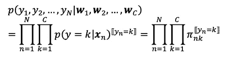

# 分类任务的逻辑回归

> 原文：<https://towardsdatascience.com/logistic-regression-for-classification-task-f143a5a67785?source=collection_archive---------56----------------------->

## 手写数字识别任务

对于模式识别方法，有许多方法来实现手写数字识别任务。在我之前的[故事](/handwritten-khmer-digit-recognition-860edf06cd57)中，我已经介绍了基于高斯模型最大似然估计的线性判别分析。在这篇文章中，我将逻辑回归模型应用于英文数字手写数字识别任务。

# 逻辑模型

在逻辑回归模型中，事件的发生概率由逻辑函数表示。例如，在两类问题中，通常使用逻辑 sigmoid 函数。在多类问题中，已知 softmax 函数提供良好的性能。

在这篇文章中，我们介绍了如何后验概率可以表示在逻辑函数。接下来，我们暗示每一个类别到输入模式的线性变换，并估计它们的后验概率。

## 用逻辑函数模拟后验概率

考虑类别数量为 c 的分类任务。使用最大后验概率规则，输入模式 x 的输出类别是类别 y，其中 p(y|x)最大。后验概率 p(y=i|x)为


这里，让我们


因此，


softmax()被称为 softmax 函数。当 C=2 时，称为逻辑 sigmoid 函数。从(3)中，我们可以确认后验概率可以用逻辑函数来表示。

## 后验概率估计

在多类任务中，我们使用一个 softmax 函数，p(y=i|x)=softmax(a_i)。为了估计这个概率，我们通过将输入模式线性变换成第 I 类来估计 a_i。这意味着，


其中参数 w_i 由最大似然法估计。

现在，后验概率 p(y=i|x)是


设 C 为类别数，{(x_i，y_i)} (i=1，…，N)为样本数据集。似然函数是



在哪里


对数似然可以写成


为了定义最佳参数 w_j，我们计算对数似然函数的梯度。


然而，解析解这个方程是不可能的。作为解决方案，我们应用梯度上升学习算法来最大化对数似然函数。学习算法是


# 用 Python 实现

```
from scipy.special import softmax**class** **LogisticRegression**(object):
    *"""logistic regression classifier with gradient ascent learning method*
 *"""*
    **def** __init__(self, lr=0.01, iteration=100, C=10):
        self.lr = lr
        self.iteration=iteration
        self.C = C

    **def** fit(self, x, y):
        self.w = np.zeros((self.C,1+x.shape[1]))
        **for** i **in** range(self.C):
            self.w[i,:] = np.random.normal(loc=0.0, scale=0.01, size=1+x.shape[1])
        *#self.energy = []*

        **for** i **in** range(self.iteration):
            inp = self.getInput(x)
            out = self.getOutput(inp)
            error = y-out
            self.w[:,1:] += self.lr*np.dot(error.T,x)
            self.w[:,0] += self.lr*np.sum(error)
        **return** self

    **def** softmax(self, a):
        out = softmax(a,axis=1)
        **return** out

    **def** getInput(self, x):
        out = np.dot(x, self.w[:,1:].T)+self.w[:,0]
        **return** out

    **def** getOutput(self, a):
        **return** self.softmax(a)

    **def** predict(self,x):
        **return** self.getInput(x)lrgd = LogisticRegression(lr=0.0001, iteration=3000, C=10)
lrgd.fit(X_train,y_train)result = np.argmax(lrgd.predict(X_test),axis=1)
print(result)
confusion = np.zeros((C,C))
for i in range(C):
    for j in range(C):
        confusion[i,j] = np.sum(np.array([1 for k in result[i*200:(i+1)*200] if k==j]))
errors = []
TFs = np.zeros((C,3))
for i in range(C):
    fn = 0
    fp = 0
    for j in range(C):
        if j!=i:
            fn = fn + confusion[i][j]
            fp = fp + confusion[j][i]
    #print(s)
    TFs[i,0] = confusion[i,i]
    TFs[i,1] = fn
    TFs[i,2] = fp
    fn = fn/np.sum(confusion,axis=1)[i]
    errors.append(fn)
print("Class Errors:\n",errors)
print("Confusion Matrix:\n",confusion)
print("Error Rate: ",np.mean(errors))
print("Accuracy  : ",np.sum([[confusion[i][i] for i in range(C)]])/(NT*C))
```

# 实验结果

## 资料组

**输入模式** : 16x16 的英文手写数字图像(256 维向量)
输出类别 : 1，2，3，4，5，6，7，8，9，0

**训练数据** : 5000 张图像
**测试数据** : 2000 张图像

## 学问

**学习率** : 0.0001
**迭代** : 3000

```
Class Errors:
 [0.005, 0.07, 0.045, 0.07, 0.115, 0.04, 0.075, 0.11, 0.05, 0.035]
Confusion Matrix:
 [[199\.   0\.   0\.   0\.   1\.   0\.   0\.   0\.   0\.   0.]
 [  0\. 186\.   0\.   8\.   0\.   0\.   1\.   4\.   1\.   0.]
 [  0\.   1\. 191\.   0\.   4\.   0\.   2\.   2\.   0\.   0.]
 [  1\.   1\.   0\. 186\.   1\.   2\.   0\.   2\.   7\.   0.]
 [  0\.   0\.  11\.   3\. 177\.   1\.   1\.   0\.   3\.   4.]
 [  0\.   1\.   0\.   2\.   1\. 192\.   0\.   2\.   0\.   2.]
 [  0\.   1\.   3\.   2\.   0\.   0\. 185\.   1\.   8\.   0.]
 [  0\.   2\.   6\.   1\.   7\.   0\.   0\. 178\.   2\.   4.]
 [  2\.   0\.   0\.   2\.   0\.   0\.   3\.   3\. 190\.   0.]
 [  0\.   1\.   0\.   0\.   4\.   1\.   0\.   1\.   0\. 193.]]
Error Rate:  0.062
Accuracy  :  0.939
```

# 与 Fisher 线性判别分析的比较

现在让我们来看看与 [Fisher 的线性判别分析](/handwritten-khmer-digit-recognition-860edf06cd57)相比，识别准确率是如何提高的。

## 费希尔线性判别分析[ [转到上一个故事](/handwritten-khmer-digit-recognition-860edf06cd57)

```
mean = np.zeros((D,C))
cov = np.zeros((D, D))for i in range(C):
    mean[:,i] = np.mean(X[:,:,i],1)
    cov = cov + np.cov(X[:,:,i])/CinvS = np.linalg.pinv(cov)p = np.zeros((C,NT,C))
for i in range(C):
    t = T[:,:,i]
    for j in range(C):
        m = mean[:,j]
        p[i,:,j] = np.dot(t.T,np.dot(invS,m)) - np.dot(m.T,np.dot(invS,m))/2.P = np.argmax(p,axis=2)
confusion = np.zeros((C,C))
for i in range(C):
    for j in range(C):
        confusion[i,j] = np.sum(np.array([1 for k in P[i,:] if k==j]))errors = []
TFs = np.zeros((C,3))
for i in range(C):
    fn = 0
    fp = 0
    for j in range(C):
        if j!=i:
            fn = fn + confusion[i][j]
            fp = fp + confusion[j][i]
    #print(s)
    TFs[i,0] = confusion[i,i]
    TFs[i,1] = fn
    TFs[i,2] = fp
    fn = fn/np.sum(confusion,axis=1)[i]
    errors.append(fn)print("Confusion Matrix:\n",confusion)
print("Error Rate: ",np.mean(errors))
print("Accuracy  : ",np.sum([[confusion[i][i] for i in range(C)]])/(NT*C))
```

## Fisher 线性判别分析的结果

```
Confusion Matrix:
 [[199\.   0\.   0\.   0\.   1\.   0\.   0\.   0\.   0\.   0.]
 [  0\. 169\.   8\.   8\.   1\.   2\.   4\.   8\.   0\.   0.]
 [  0\.   0\. 182\.   1\.   5\.   0\.   2\.   8\.   1\.   1.]
 [  2\.   2\.   0\. 182\.   0\.   1\.   0\.   3\.  10\.   0.]
 [  0\.   0\.  21\.   4\. 162\.   1\.   0\.   4\.   4\.   4.]
 [  1\.   2\.   0\.   1\.   5\. 185\.   0\.   3\.   0\.   3.]
 [  2\.   0\.   1\.   5\.   1\.   0\. 181\.   0\.   9\.   1.]
 [  0\.   1\.  16\.   6\.   6\.   0\.   1\. 164\.   3\.   3.]
 [  1\.   0\.   0\.   8\.   0\.   0\.   7\.   2\. 182\.   0.]
 [  0\.   0\.   3\.   0\.   0\.   4\.   0\.   1\.   0\. 192.]]
Error Rate:  0.101
Accuracy  :  0.899
```

## 比较

```
# Fisher’s Linear Discriminant Analysis
**Error Rate:  0.101
Accuracy  :  0.899**# Logistic Regression Model
**Error Rate:  0.062
Accuracy  :  0.939**
```

# 讨论和结论

从实验结果来看，logistic 回归模型提高了识别的准确率。

在 Fisher 的 LDA 中，假设所有类别的方差-协方差相等。因此，缺乏来自每个类别特征的信息。然而，Fisher 的 LDA 是一个极其简单的模型，消耗较少的计算时间。

在逻辑回归模型中，输入到每个类别中的线性变换的概念是线性判别规则的一种形式，这在线性中也发现类似于 Fisher 的 LDA。逻辑回归模型的特点是应用逻辑函数来估计后验概率。这有利于增加数据特征表示的自由度。然而，由于我们不能用解析计算直接获得逻辑回归的线性变换的最佳参数，所以梯度上升学习中的时间计算是一个缺点。此外，该学习规则是数值计算，其中仅获得近似参数，结果往往会根据初始化而改变。