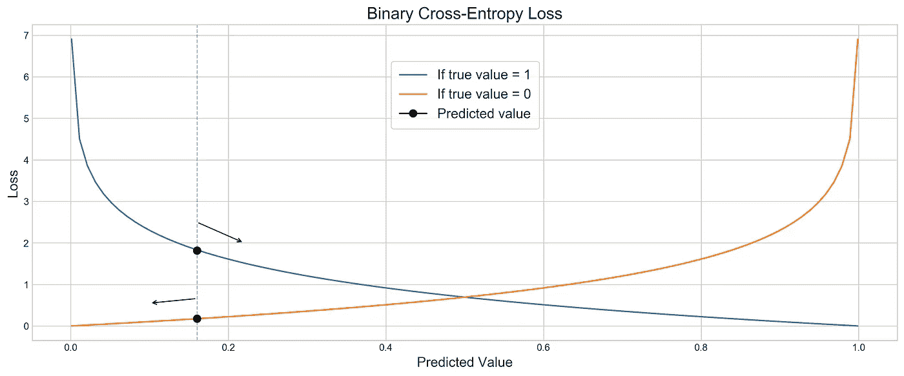
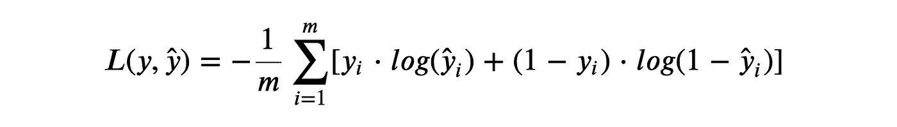
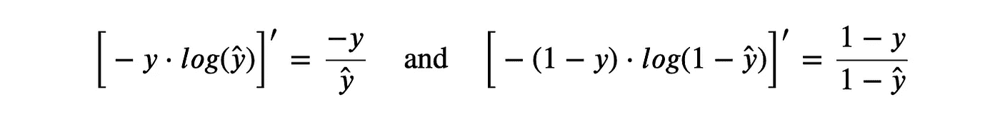
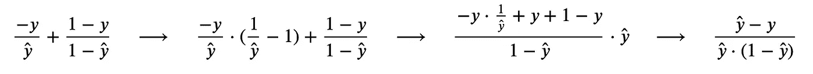
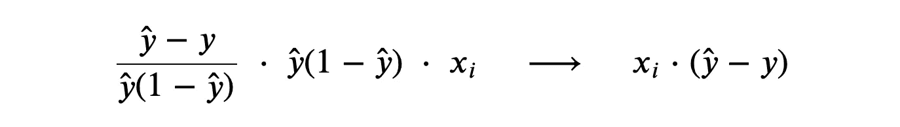
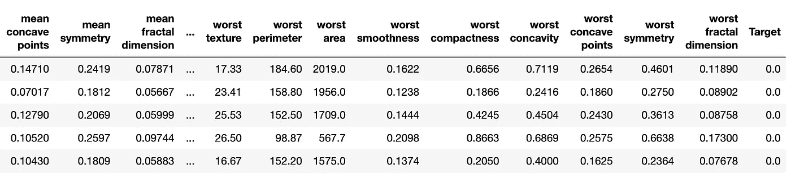
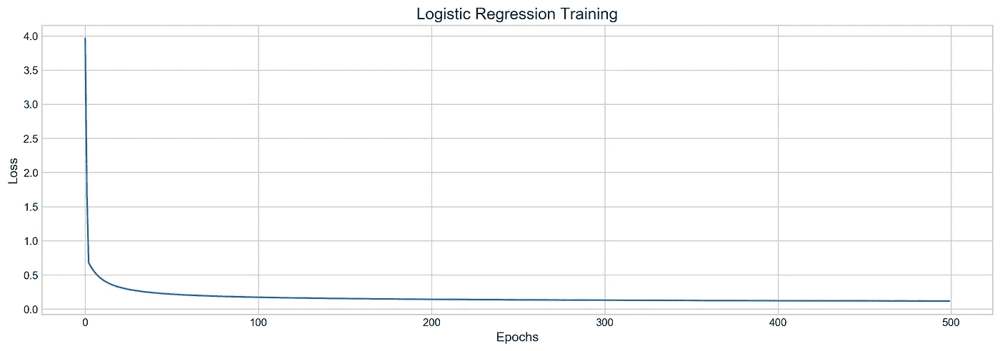

# 从零开始的逻辑回归

> 原文：<https://towardsdatascience.com/logistic-regression-from-scratch-69db4f587e17?source=collection_archive---------4----------------------->


鸣谢:法比奥·罗斯

# 介绍

在这篇文章中，我们将使用梯度下降从头开始构建我们自己的逻辑回归模型。为了测试我们的模型，我们将使用来自 **sklearn** 包的“乳腺癌威斯康星州数据集”,并以超过 95%的准确度预测肿块是良性还是恶性。GitHub 回购在这里是。所以让我们开始吧。

# 模型核心

实质上，逻辑回归模型由两个部分组成:sigmoid 函数和具有权重的特征:


Sigmoid 函数

sigmoid 函数 ***g(z)*** 将特征和权重 ***z*** 作为输入，并返回介于 0 和 1 之间的结果。sigmoid 函数的输出是实际预测 ***ŷ*** *。*


特征和重量

在模型做出预测之后，我们可以用交叉熵损失函数来评估结果:


二元交叉熵损失函数

自然对数在这里对我们有利，因为如果预测值与真实值相差很远，它会受到很大的惩罚。例如，如果模型预测值*和真实值 ***y=1*** ，则误差高，反之亦然:*

**

*损失函数由两部分组成，但我们可以将它们合并成一个等式:*

**

*二元交叉熵损失函数*

*这里我们添加了 ***y*** 和 ***(1 - y)*** 来根据输出抵消一部分。我们将在我们的模型中使用该函数来计算损失，并在模型训练的梯度下降部分使用该函数。*

# *模特培训*

*模型训练本质上是损失函数的最小化。我们通过梯度下降技术实现了这一点，该技术可以分为几个步骤:*

1.  *首先，我们找到损失函数相对于每个权重的导数。导数可以告诉我们应该向哪个方向改变权重，以及改变多少，以使模型损失更小一些。*
2.  *根据导数更新每个权重，直到找到局部最小值，即模型不再改进，因此我们可以停止。*

## *派生物*

*这是最关键也是最难的部分。没有导数，模型就不能训练，所以我们将在这一部分详细讨论。*

*此时，我们可以放下求和函数，专注于内部内容:*

**

*1 个样本的损失函数*

*符号: ***y*** —真值，*—预测值(sigmoid)**

**为了找到导数，我们将使用**链式法则**:**

****

**当我们需要找到一个包含另一个函数的函数的导数时，我们使用链式法则，等等。在我们的例子中，我们有一个包含 sigmoid 函数的损失函数，该函数包含特征和权重。所以有三个**函数，我们将一个接一个地推导它们。****

## **1.链条中的一阶导数**

**自然对数的导数很容易计算:**

****

**自然对数的导数**

**由于等式中有两个部分，我们可以分别导出它们:**

****

**对数函数的导数**

**现在，我们可以将两部分重新组合在一起，并进行简化:**

****

**对数导数的简化**

**这看起来很好，现在我们把注意力放在 sigmoid 函数上。**

## **2.链中的二阶导数**

**根据链式法则，我们要找到***【ŷ】****的导数。你可以在网上找到它的导数的详细解释，因为它在机器学习模型中经常使用，所以我只写下最终结果:***

****

**Sigmoid 导数**

## **3.链条中的三阶导数**

**链中的最后一个函数是包含在 ***z*** 中的内容——我们的特征和权重。对于每个权重的导数( ***w*** )将是其特征值( ***x*** )，例如: *(x1 * w1)' = x1* ，因为 ***w*** 的导数是 1。**

****

**x*w 的导数**

**根据链式法则，我们将每个衍生函数相乘，因此得到以下结果:**

****

**最终方程**

**我们完了。最后，我们得到了一个非常紧凑的函数，我们将在梯度下降中使用它。**

## **梯度下降**

**与寻找导数相比，这部分是轻而易举的。在程序员的语言中，这只是循环的**,在这里我们不断地更新权重。****

**在此过程中，我们将每个导出值乘以学习率参数，然后从权重中减去该值:**

```
**# example of updating one weightepochs = 50
lr = 0.1for _ in range(epochs):

    w1 -= lr * x1 * (y_hat - y) # y_hat is predicted value**
```

**学习率通常是一个很小的数字，用来控制我们向最小化移动的快慢。让我们来看看完整的代码:**

# **估价**

**乳腺癌威斯康星数据集 569 个样本和 30 个特征:**

****

**乳腺癌数据集**

**经过训练测试后，分裂模型以 97%和 95%的准确度预测了恶性和良性肿块，这是一个不错的结果。**

****

# **结论**

**我们创建的模型可以用于现实生活中的应用，而且它非常适合教育目的。虽然物流回收会更快更准确，但我们可以不断优化现有资源，最终达到类似的效果。如果你有任何问题或建议，请在评论中告诉我。**

**感谢您的阅读，**

**阿瑟尼。**