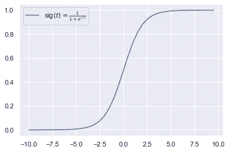

# 逻辑回归——长颈鹿和汽车

> 原文：<https://towardsdatascience.com/logistic-regression-giraffes-and-cars-1cb67ab8a571?source=collection_archive---------36----------------------->

[Marcin Jozwiak](https://unsplash.com/@marcinjozwiak?utm_source=medium&utm_medium=referral) 在 [Unsplash](https://unsplash.com?utm_source=medium&utm_medium=referral) 上拍摄的照片

不久前，我在 Coursera 上开设了一门应用机器学习的课程。为了帮助上这门课的其他人，也为了帮助我自己更好地理解主题，我决定根据课程安排制作一些简短的教程。我的前两篇文章讨论了 KNN 分类和线性(多项式)回归。有兴趣的话，可以随便看看。

 [## 走向机器学习——K 近邻(KNN)

### 根据油耗和发动机大小对汽车进行简单的 K 近邻(KNN)分类。

towardsdatascience.com](/towards-machine-learning-k-nearest-neighbour-knn-7d5eaf53d36c)  [## 走向机器学习——线性回归和多项式回归

### 什么方法能更好地预测你汽车的二氧化碳排放量？线性回归还是多项式回归？

towardsdatascience.com](/towards-machine-learning-linear-regression-and-polynomial-regression-df0c83c15b6e) 

今天，我将介绍一种叫做逻辑回归的技术。尽管它被称为“回归”，但它是一种分类方法。与线性回归相比，主要区别在于输出，线性回归给出连续值，而逻辑回归返回二元变量。简单来说，它解释了两类价值之间的关系，即动物是不是长颈鹿。

在 [Unsplash](https://unsplash.com?utm_source=medium&utm_medium=referral) 上由[詹姆斯·温斯科特](https://unsplash.com/@tumbao1949?utm_source=medium&utm_medium=referral)拍摄的照片

但稍后会有更多的内容。

**文章的结构**:

*   介绍
*   数据集加载和描述
*   数据格式和模型定义
*   结果可视化
*   结论

享受阅读吧！🙂

# 介绍

最近，我在汽车数据上尝试了 KNN 和线性回归。KNN 帮助我们将汽车分类为“小型车”或“大型车”，结果相当令人满意。假设有人想知道一辆车前轮驱动的概率。逻辑回归开始发挥作用，因为它计算作为目标类的对象的分数(“机会”)。也就是说，它可以根据汽车的燃料消耗、发动机大小、气缸数量或汽车的任何其他相关特征来预测汽车前轮驱动的概率。

## 逻辑回归是如何工作的？

就像线性回归一样，我们有一些输入变量，X1，X2，X3。线性回归将计算每个变量的权重，添加偏差并返回一个标签(类别)。类似地，在逻辑回归中，计算每个输入变量(X1，X2，X3)的权重，添加偏差项，然后对结果应用*逻辑* *函数*。然后，该函数返回一个介于零(负类)和一(正类)之间的值，该值描述输入对象属于正类的概率值。

乙状结肠函数(来源:作者)

让我们看一个简单的例子，根据[维基百科](https://en.wikipedia.org/wiki/Giraffe)的说法，一只成年长颈鹿的身高在 4.3 到 5.7 米之间。假设我们想知道一只动物是不是长颈鹿，那么我们测量动物的高度，并在 X 轴上显示数值，然后逻辑函数返回一只动物是长颈鹿的概率(Y 轴)。然后，如果该值高于 0.5，该动物被预测为长颈鹿，如果低于 0.5，该模型预测该动物不是长颈鹿。除了分类之外，我们还可以获得概率信息。所以，一只身高 4.8 米的动物比一只身高 2.7 米的动物更有可能是长颈鹿。

让我们更实际一点，好吗？

# 数据集加载和描述

首先，我们将导入依赖关系，加载汽车燃油经济性数据，并查看数据框架。要使用逻辑回归，我们需要从 Scikit-Learn 模型模块导入 *LogisticRegression* 类。

同样，我们将使用来自 [Udacity](https://github.com/udacity/AIPND/tree/master/Matplotlib/data) 的汽车数据集。它包含 3920 辆汽车的技术规格，包括气缸数、发动机尺寸(排量)、油耗、二氧化碳排放量等数据，以及*驱动。*

我们今天的目标是根据驱动轮将汽车分为两类。基本上，在我们的数据库中有前轮驱动汽车、后轮驱动汽车和全轮驱动汽车。每种类型都有自己的优点和 CONS，但这不是这里的主题。🙂

我们想根据排量[升]和综合油耗[mpg]来预测汽车前轮驱动的概率。为此，我们需要管理标签，前轮驱动的汽车将收到标签 1(正)，后轮和全轮驱动的汽车标签 0(负)。

前轮驱动的汽车被标记为正类(1)，而后轮和全轮驱动的汽车被标记为负类(0)(来源:作者)

如果我们将排量和综合油耗绘制成一对图表，我们可以注意到前轮驱动的汽车(1 级-橙色点)倾向于燃烧更少的燃料(更高的 mpg 值)，并且排量更低。

数据集的 Pairplot(来源:作者)

此外，在对任何数据应用逻辑回归之前，最好执行数据标准化([源 1](https://medium.com/towards-artificial-intelligence/how-when-and-why-should-you-normalize-standardize-rescale-your-data-3f083def38ff) 、[源 2](/data-scaling-for-machine-learning-the-essential-guide-d6cfda3e3d6b) )。基本上，它将变量集中在零附近，通过从每次测量中减去平均值并将结果除以标准偏差，将方差设置为 1。我们将在标准化和不标准化的情况下运行我们的模型，只是为了看看它在这个特定的数据集上是否有任何不同。

# 数据格式和模型定义

首先，我们从数据集中选择所需的列。

此外，当对任何数据应用逻辑回归时，执行数据标准化([源 1](https://medium.com/towards-artificial-intelligence/how-when-and-why-should-you-normalize-standardize-rescale-your-data-3f083def38ff) 、[源 2](/data-scaling-for-machine-learning-the-essential-guide-d6cfda3e3d6b) )是一个很好的实践。基本上，它将变量集中在零附近，通过从每次测量中减去平均值并将结果除以标准偏差，将方差设置为 1。我们将在标准化和不标准化的情况下运行我们的模型，只是为了看看它在这个特定的数据集上是否有任何不同。

## 如何进行标准化？

Scikit-learn 也有一个关于这个的类，它叫做 *StandardScaler* 。让我们看一个例子:

现在，我们来对比一下标准化前后的数据。

(来源:作者)

正如所料，我们可以观察到，现在数据的标准偏差明显更低，数据的范围也更小，因此值更接近。

(来源:作者)

在下一步中，我们想要检查这个度量是否为我们的模型产生一些好处或缺点。

## 模型定义

我们就可以应用这个模型。和 Scikit-learn 一样，这是一个非常简单的过程。

很好，模型准备好了，现在让我们看看结果！

## 标准化数据会影响模型的准确性吗？

嗯，可能是由于一个大的数据集，根本不是。让我们看看结果。

未缩放模型的训练和测试集结果(来源:作者)

缩放模型的训练和测试集结果(来源:作者)

与我们的预期相反，训练结果没有变化，而测试集的准确性略有下降。

这些数字看起来不错，但是用一个真实的例子来测试这个模型肯定会更好，不是吗？

测试编号 1(来源:作者)

测试编号 2(来源:作者)

我在两辆车上测试了这款车型，一辆是 2016 年款的[福特嘉年华运动版](https://www.automobile-catalog.com/car/2016/1817390/ford_fiesta_sport_1_0_ecoboost_125.html)，一辆是 2018 年款的[宝马 M5 版](https://www.automobile-catalog.com/car/2018/2574275/bmw_m5.html)。而且对于两款车，模型预测都是正确的。

# 结果可视化

所以我们问自己，数据集群之间的边界在哪里？好吧，让我们来看看。

有两种方式创造情节。一种包括，计算*决策边界线*的*斜率*和*截距*，绘制成简单的线图。另一种方法是创建网格，并将边界绘制为将数据分成两半的等高线。

有两种方式创造情节。一种包括，计算*决策边界线*的*斜率*和*截距*，绘制成简单的线图。另一种方法是创建网格，并将边界绘制为将数据分成两半的等高线。

首先，我们从更简单的方法开始。

我们检索参数，然后计算边界的斜率和截距。基本上我们是在计算一条线性回归线，它描述了我们的 X 轴值(排量)和 Y 轴值(综合燃油经济性)之间的关系。

使用 plt.plot 的决策边界图(来源:作者)

同样，标签 1 代表正类(前轮驱动的汽车)，而标签 0 代表所有其他汽车(负类)，在这种情况下是后轮和全轮驱动的汽车。

绘制边界的第二种方法是使用等高线法。首先，定义网格，其中为两个特征(排量和综合燃油经济性)定义最小值和最大值。 ***Numpy.c_*** 沿第二个轴串联数组。计算每个网格点的概率。这里需要了解的是，我们在这里使用我们的模型 ***logreg*** ，其目的是为了可视化 ***斜率*** 和 ***截距*** 。

接下来，我们需要定义情节。

用等高线法判定边界图(来源:作者)

为了显示边界线，我们只显示截取汽车前轮驱动的 50%概率的轮廓线。线上的所有汽车都被预测为前轮驱动(*正 1 级*)，而线下的所有汽车都被预测为非前轮驱动，因此它们要么是后轮驱动，要么是全轮驱动。

我们也可以将概率作为一种颜色添加到我们的绘图中。这有助于直观识别概率，因此无需运行模型或计算准确的概率就可以评估概率。

代码如下:

概率绘制成等高线图(来源:作者)

我需要指出的是，这里我们有两个特征，也有一个二维图。更多的特征会增加绘图的维数。

# 结论

在这里，我们给出了一个如何使用逻辑回归根据汽车的排量和综合燃油经济性来预测汽车行驶的例子。此外，还评估了数据标准化技术。对于这个特定的数据集，标准化对模型精度没有影响。

已经使用两种技术计算并绘制了两个标签数据集群(前轮和非前轮驱动汽车)之间的判定边界。此外，还添加了概率等值线图。

我希望你喜欢我的文章。如果一些介绍的主题需要进一步解释，请随时通过 [LinkedIn](https://www.linkedin.com/in/karlo-leskovar-a8612b105/) 联系我。🙂

也直到下次，检查出[我的其他文章](https://medium.com/@Karlo_Leskovar)。干杯！