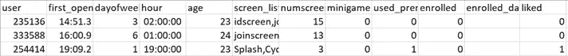
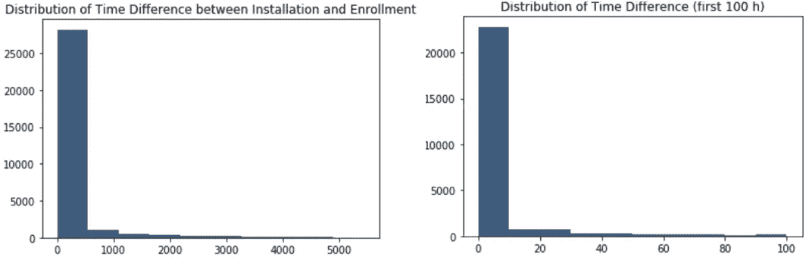
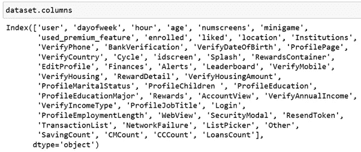
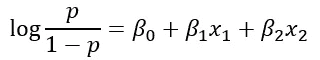
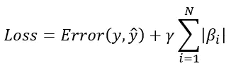
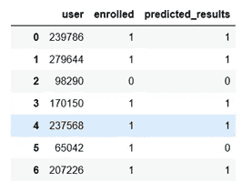
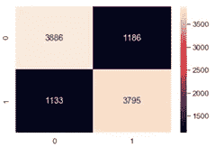

# 使用逻辑回归预测应用订阅

> 原文：<https://towardsdatascience.com/logistic-regression-how-to-on-app-behavior-data-8a95802a988f?source=collection_archive---------37----------------------->

## 使用 Sklearn 对应用程序行为数据进行功能工程、数据处理和逻辑回归建模演练


通过[链接](https://unsplash.com/photos/F1I4IN86NiE)改编自 Unsplash 的 Img

之前的[文章](/eda-how-to-on-app-behavior-data-77fde7384a70)是关于原始数据上的 EDA。在这里，我将解释如何执行**特征工程、数据处理**，并最终**使用移动 app 行为数据创建逻辑回归模型**。它分为 7 个部分。

1.  问题陈述
2.  特征工程
3.  数据处理
4.  模型结构
5.  模型试验
6.  模型验证
7.  摘要

现在让我们开始吧🏃‍♀️🏃‍♂️.

1.**问题陈述**

一家金融科技公司委托我们分析移动应用行为数据，以帮助引导客户获得付费订阅服务。具体来说，任务是确定哪些用户最有可能不注册。图 1 是具有 ***12 列和 50，000 行*** 的原始数据片段。



图 1 原始数据片段

2.**特征工程**

***特征工程是将原始数据转化为最能代表问题的特征的艺术。*** 只有用正确的特征工程，模型才能做出最好的预测。我们将从两个方面进行特征工程。

2.1 因变量工程

因变量是列'*已注册'*。与' *enrolled'* 密切相关的一列是' *enrolled_date'* 。基本上，用户可以在任何日期报名，以'*报名'*为 1。由于大多数应用程序功能在第一个 24 小时后不可试用，我们需要设置注册的时间限制。

为了设置有效的登记时间限制，我们计算' *first_open '和' enrolled_date'* 之间的时间差，并调查登记分布。

第一步是计算' *first_open '和' enrolled_date'* 之间的时差。具体来说，将' *first_open '和' enrolled_date'* 解析为 *datetime* 类型，并以小时为单位计算时差。

```
dataset[“first_open”] = [parser.parse(row_date) for row_date in dataset[“first_open”]]dataset[“enrolled_date”] = [parser.parse(row_date) if isinstance(row_date, str) else row_date for row_date in dataset[“enrolled_date”]]dataset[“difference”] = (dataset.enrolled_date-dataset.first_open).astype(‘timedelta64[h]’)
```

第二步是通过绘制“*差异”*列的直方图来查看注册分布。

```
response_hist = plt.hist(dataset[“difference”].dropna(), color=’#3F5D7D’)
plt.title(‘Distribution of Time-Since-Screen-Reached’)
plt.show()
```

图 2 显示用户注册高度集中在前 50 个小时。因此，我们将响应限制设置为 48 小时。



图 2 注册分布

现在，有了 48 小时的登记限制，我们将'T38 已登记'T39 列重置为 0，即未登记。

```
dataset.loc[dataset.difference > 48, ‘enrolled’] = 0
dataset = dataset.drop(columns=[‘enrolled_date’, ‘difference’, ‘first_open’])
```

上面我们删除了*【注册日期】**【差异】【首次公开】*栏，因为培训不需要它们。

2.2 自变量工程

数据集中唯一的非数字列是*‘screen _ list’*。这是一个包含用户查看的所有屏幕功能的列表。所以我们需要把它转换成数值变量。一种方法是将*‘screen _ list’*中的每个唯一屏幕转换为分类变量。*但是，独特的屏幕太多了。因此，我们将只关注那些最受欢迎的屏幕。*具体来说，

```
top_screens = pd.read_csv(‘top_screens.csv’).top_screens.values
dataset[“screen_list”] = dataset.screen_list.astype(str) + ‘,’ 
for sc in top_screens:
    dataset[sc] = dataset.screen_list.str.contains(sc).astype(int)
    dataset['screen_list'] = dataset.screen_list.str.replace(sc+",", "")
```

上面，我们为代表最受欢迎屏幕的*‘top _ screens’*中的每个屏幕创建了一个列。

接下来，我们创建一个*‘Other’*列，作为所有非流行屏幕的总和。

```
dataset[‘Other’] = dataset.screen_list.str.count(“,”)
dataset = dataset.drop(columns=[‘screen_list’])
```

**最后，如果我们仔细检查列的名称，我们会发现许多列代表相同的特性。**例如，*保存 1* 、*保存 5* 是关于保存的屏幕，而*信用 1* 、*信用 3* 是关于信用的屏幕。我们需要通过合计相同功能屏幕的数量来聚合相同的功能。具体来说，

```
cm_screens = [“Credit1”, “Credit2”, “Credit3”, “Credit3Container”, “Credit3Dashboard”]
dataset[“CMCount”] = dataset[cm_screens].sum(axis=1)
dataset = dataset.drop(columns=cm_screens)
```

对其他特征重复相同的方法(例如，*保存*、*贷款*等)，我们得到了包含所有数字变量的最终数据集。图 3 显示了所有的列。



图 3 所有数据列名称

总之，我们使用数据挖掘技术来提炼和提取最能代表移动应用用户行为的属性。

3.**数据处理**

数据处理包括数据分割和特征缩放。

3.1 数据分割

第一步是分离自变量和因变量。具体来说，

```
response = dataset[“enrolled”]
dataset = dataset.drop(columns=”enrolled”)
```

第二步是将数据分成训练集和测试集。具体来说，

```
X_train, X_test, y_train, y_test = train_test_split(dataset, response, test_size = 0.2, random_state = 0)
```

3.2 特征缩放

特征缩放是为了避免任何变量支配其他变量，即采用更高的权重和对模型学习的强烈影响。这里，我们通过去除平均值并缩放到单位方差来标准化特征。具体来说，

```
from sklearn.preprocessing import StandardScaler
sc_X = StandardScaler()
X_train2 = pd.DataFrame(sc_X.fit_transform(X_train))
X_test2 = pd.DataFrame(sc_X.transform(X_test)) 
X_train2.columns = X_train.columns.values
X_test2.columns = X_test.columns.values
X_train2.index = X_train.index.values
X_test2.index = X_test.index.values
X_train = X_train2
X_test = X_test2
```

注意， *StandardScaler()* 返回一个 *numpy* 数组，该数组会丢失列名和索引。因此，我们再次将缩放后的数据转换为*数据帧*，以保留行和列标识符。

太好了。模型的数据终于准备好了。图 4 是具有 ***50 列和 50，000 行*** 的最终数据的简要视图。

图 4 最终数据的简要视图

4.**模型建筑**

这里我们将创建一个**逻辑回归**模型来预测一个二元因变量，即是否入学。根据[维基百科](https://en.wikipedia.org/wiki/Logistic_regression)，标签为 1 的概率的对数是一个或多个独立变量的线性组合。本质上，我们试图估计一个逻辑模型的系数，如图 5 所示。



图 5 逻辑回归模型(作者创建的 Img)

具体来说，

```
from sklearn.linear_model import LogisticRegression
classifier = LogisticRegression(random_state = 0, penalty = ‘l1’)
classifier.fit(X_train, y_train)
```

注意我们使用拉索(*【L1】*)正则化模型，而不是正态回归模型。 *L1* 正则化给损失函数增加一个等于 ***系数*** 大小的绝对值之和的惩罚，如图 6 所示。



图 L1 正则化的损失函数(作者创建的 Img)

注意 *L1* 和 *L2* 正则化的区别在于 *L2* 相加的惩罚是 ***系数****大小的平方值之和，如图 7 所示。*

**

*图 7 L2 正则化损失函数(作者创建的 Img)*

*5.**模型测试***

*训练好模型后，让我们在 *X_test* 上测试模型。*

```
*y_pred = classifier.predict(X_test)
cm = confusion_matrix(y_test, y_pred)*
```

*为了更好地回顾预测结果，让我们将其与实际结果进行比较。所以，具体来说，*

```
*final_results = pd.concat([y_test, test_identity],axis =1).dropna()
final_results[‘predicted_results’] = y_pred
final_results[[‘user’, ‘enrolled’,‘predicted_results’]].reset_index(drop=True)*
```

*图 8 显示了实际登记的结果和预测的结果。*

**

*图 8 预测和实际结果对比*

*图 9 展示了混淆矩阵。这告诉我们测试精度为 0.768。不错的结果😃。如果你想知道如何计算精度，请阅读这篇[文章](https://medium.com/@vistaxjtu/intuitively-explain-accuracy-precision-recall-and-f1-777563342aca)。*

**

*图 9 混淆矩阵*

*6.**模型验证***

*有了上面的测试准确性，作为一个数据科学家，你应该问一个问题:这是模型性能的真实反映吗🤔？为了回答这个问题，我们将使用 K 倍交叉验证。*

*具体来说，将训练数据分成 10 个子集，使用 9 个子集来训练模型，剩余的用于验证。重复这个训练和验证 10 次。最后平均准确率和损耗。*

```
*accuracies = cross_val_score(estimator= classifier, X= X_train, y = y_train, cv = 10)*
```

*我们得到的平均精度为 **0.767** ，标准偏差为 **0.10** 。很好，模型显示出很小的差异，即模型始终是准确的。*

*7.**总结***

*概括地说，我们经历了特征工程、数据处理、模型构建、测试和验证。特征工程和数据处理是耗时的，但是为模型准备数据是最重要的。如果你想了解模型优化，请阅读这篇[文章](/ann-classification-model-evaluation-and-parameter-tuning-9174fd5ad0c2)。*

***太好了！这就是所有的旅程！如果您需要源代码，请随时访问我的** [**Github**](https://github.com/luke4u/Customer_Behaviour_Prediction/tree/main/enrollment_prediction) **页面🤞🤞。***